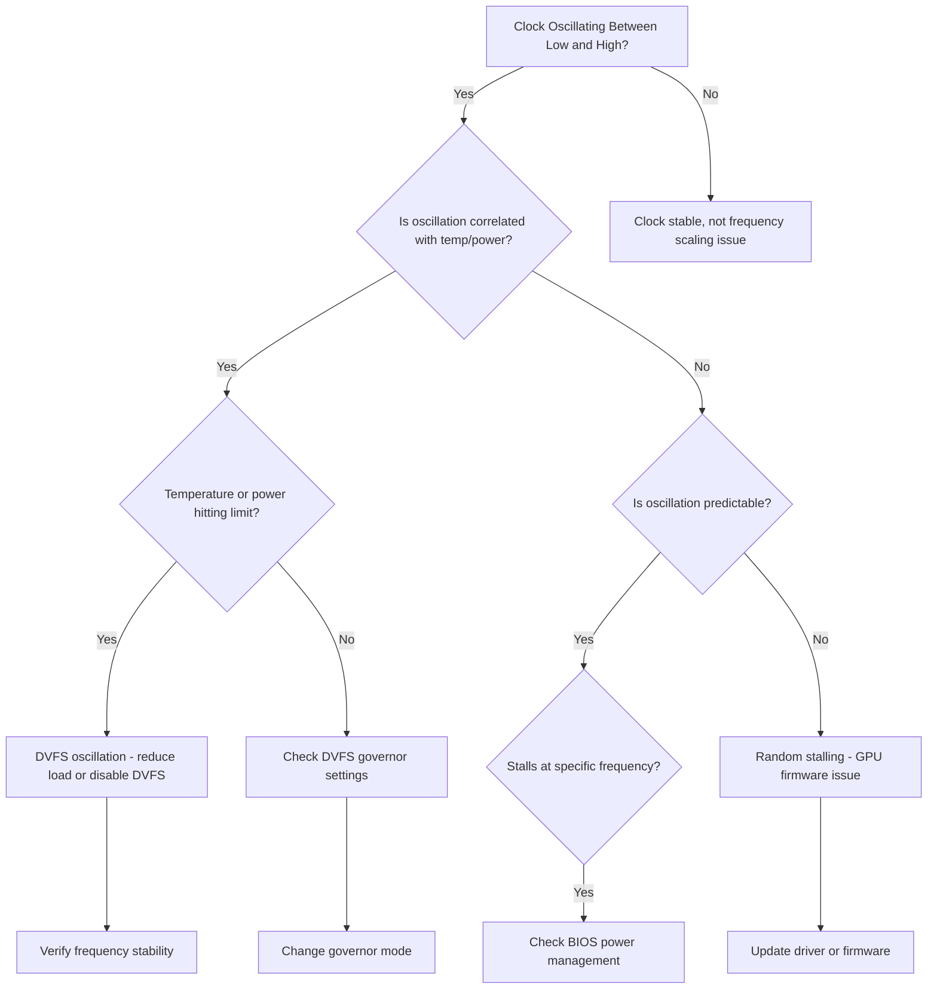

## Symptoms

- GPU clock speed fluctuates wildly (2.0 GHz → 0.5 GHz → 2.0 GHz) during steady workload
- Performance oscillates 30-40% without code changes
- Frequency stalls at low clock speeds despite low temperature and power headroom
- Specific GPU in cluster exhibits unstable clocks while others are stable

## Evidence

### Key Metrics to Collect

- GPU clock speed over time (Nsight Systems, DCGM)
- Power state from nvidia-smi (P0 vs P8)
- Temperature and power consumption (should be stable if workload is)
- Frequency scaling driver logs
- BIOS power management settings

## Diagnosis

### Diagnosis Flowchart



### First Diagnostic Step: Monitor Clock Frequency Over Time

```bash
$ nvidia-smi -i 0 -q | grep "Current Clocks"

        Current Clocks
            Graphics                       : 1200 MHz
            SM                             : 1200 MHz
            Memory                         : 405 MHz
```

This snapshot shows current clock, but oscillation happens over seconds. Use continuous monitoring:

```bash
$ watch -n 0.5 'nvidia-smi -i 0 --query-gpu=timestamp,clocks.current.graphics --format=csv,noheader'

# Example output showing oscillation:
# 2024-01-15 10:30:00.123, 2500
# 2024-01-15 10:30:00.623, 2500
# 2024-01-15 10:30:01.123, 1200
# 2024-01-15 10:30:01.623, 0800
# 2024-01-15 10:30:02.123, 2500
# 2024-01-15 10:30:02.623, 2500
```

**Pattern:** Frequency drops 2.5 → 1.2 → 0.8 GHz then recovers. This is DVFS at work.

### Check Power State (P-States)

```bash
$ nvidia-smi -i 0 -q | grep "Performance State"

Performance State                   : P2
```

Query available power states:

```bash
$ nvidia-query-gpu -i 0 | grep -A 20 "Performance States"

# P0: 2500 MHz (max performance)
# P1: 2100 MHz
# P2: 1800 MHz
# P3: 1400 MHz
# P4: 1000 MHz
# ...
# P8: 300 MHz (min power)
```

If P-state changes rapidly (P0 → P3 → P0), DVFS is aggressively rescaling.

### Collect Frequency History with DCGM

```bash
$ dcgmi dmon -s dcgm

# GPU   Sm Mem  Enc Dec XSM Mxm Fbg Xid Pid Name
     0 1200 405  0   0   0   0   0   0   - -

# Run continuous monitoring
$ for i in {1..60}; do
  freq=$(nvidia-smi -i 0 --query-gpu=clocks.current.graphics --format=csv,noheader)
  temp=$(nvidia-smi -i 0 --query-gpu=temperature.gpu --format=csv,noheader)
  power=$(nvidia-smi -i 0 --query-gpu=power.draw --format=csv,noheader)
  echo "Freq=$freq, Temp=$temp, Power=$power"
  sleep 0.5
done
```

**Output example:**
```
Freq=2500 MHz, Temp=65°C, Power=310W
Freq=2500 MHz, Temp=65°C, Power=310W
Freq=1200 MHz, Temp=65°C, Power=150W
Freq=1200 MHz, Temp=65°C, Power=150W
Freq=2500 MHz, Temp=65°C, Power=310W
```

**Observation:** Frequency drops but temperature and power both drop proportionally → DVFS responding to something, but temperature is NOT the trigger (temp stays 65°C throughout).

### Check DVFS Governor

```bash
$ cat /sys/devices/virtual/dmi/id/board_name
# Returns: GPU DVFS Governor setting

# Query BIOS power management
# (method varies by system; typically via BIOS menu or ipmitool)
ipmitool fru baseboard 2>/dev/null | grep -i "power\|dvfs"
```

Check driver DVFS settings:

```bash
$ nvidia-smi -pm 1  # Check persistence mode

# If persistence mode OFF, driver may be more aggressive about clock scaling
```

### Verify Workload Stability

```bash
$ # Run benchmark with fixed load
$ python3 << 'EOF'
import torch
import subprocess
import time

x = torch.ones(4096, 4096, device='cuda')

for i in range(60):
    # Fixed workload - kernel should keep clocks stable
    for _ in range(100):
        y = torch.matmul(x, x)
    
    freq = subprocess.check_output(['nvidia-smi', '-i', '0', '--query-gpu=clocks.current.graphics', '--format=csv,noheader']).decode().strip()
    print(f'Iter {i}: Clock = {freq}')
    time.sleep(0.5)
EOF
```

**Expected:** Clock should stabilize at 2400-2500 MHz within first few iterations, then remain stable for all 60 iterations.

**If unstable:** Clock oscillates throughout 60 iterations despite fixed workload.

## Resolution

### Step 1: Determine If Oscillation Is Necessary

1. **Check temperature and power during oscillation:**
   ```bash
   # If temperature > 80°C during high-clock phase, oscillation is thermal protection
   # If power draw near limit during high-clock phase, oscillation is power protection
   # If both cool/power-plenty, oscillation is unnecessary DVFS
   ```

2. **If thermal throttling:**
   - Address cooling issues (see Chapter 06)
   - Once temperature controlled, frequency should stabilize

3. **If power throttling:**
   - Reduce power limit or upgrade PSU (see Chapter 09)

### Step 2: Disable DVFS (if safe)

If temperature and power are NOT triggering oscillation, disable DVFS:

1. **Enter BIOS setup:**
   ```bash
   # Reboot and enter BIOS (usually Del, F2, or F10 during boot)
   ```

2. **Find power management settings:**
   - Look for: "CPU Power Management", "DVFS", "Power State Control"
   - Set to: "Disabled" or "Maximum Performance"

3. **Reboot and verify:**
   ```bash
   $ nvidia-smi -i 0 --query-gpu=clocks.current.graphics --format=csv,noheader
   
   # Expected: Constant 2500 MHz (or max for your GPU)
   ```

### Step 3: If Oscillation Persists After DVFS Disable

Check for firmware issue:

1. **Update driver:**
   ```bash
   sudo apt update && sudo apt install --only-upgrade nvidia-driver-550
   sudo reboot
   ```

2. **Update GPU firmware:**
   ```bash
   # Check current firmware
   nvidia-smi -i 0 -q | grep "GPU UUID"
   
   # Firmware update tool (if available)
   nvidia-fw-tool update --gpu-index 0
   ```

3. **If still oscillating, GPU likely has a hardware issue:**
   - Clock generator circuit failing
   - Power delivery oscillating at hardware level
   - Escalate to vendor

### Step 4: Enforce Fixed Clock Speed (temporary workaround)

If oscillation cannot be stopped:

```bash
# Set fixed clock (if supported)
$ sudo nvidia-smi -i 0 -lgc 1800  # Lock to 1800 MHz

# Verify
$ nvidia-smi -i 0 --query-gpu=clocks.current.graphics --format=csv,noheader
# Expected: 1800 (fixed, no variation)
```

**Trade-off:** Performance lower than max (1800 MHz vs 2500 MHz) but stable.

## Verification

### Verification Checklist

1. **Clock frequency stable for extended run:**
   ```bash
   # Monitor for 5 minutes
   freq_values=()
   for i in {1..600}; do
     freq=$(nvidia-smi -i 0 --query-gpu=clocks.current.graphics --format=csv,noheader)
     freq_values+=($freq)
     sleep 0.5
   done
   
   # Count unique frequencies
   printf '%s\n' "${freq_values[@]}" | sort -u | wc -l
   
   # Expected: 1 (all identical) or 2-3 (minor variation ±50 MHz acceptable)
   # If > 5: oscillation still present
   ```

2. **Performance consistent across iterations:**
   ```bash
   # Run benchmark 10 times, measure throughput
   for i in {1..10}; do
     python benchmark.py
   done | grep "throughput:"
   
   # Expected: Variation < 5%
   ```

3. **Thermal and power within range:**
   ```bash
   nvidia-smi -i 0 --query-gpu=temperature.gpu,power.draw --format=csv,noheader
   
   # Expected: Temp 70-80°C, Power 280-320W (stable values)
   ```

4. **DVFS disabled (if confirmed via BIOS):**
   ```bash
   # Verify driver sees it
   cat /sys/devices/virtual/dmi/id/board_name | grep -i "performance\|disable"
   
   # Expected: Output indicates DVFS disabled or Performance mode
   ```

### Production Troubleshooting Table

| Symptom | Evidence | Root Cause | Fix | Verification |
|---------|----------|-----------|-----|--------------|
| Frequency oscillates 2.5 → 1.2 GHz every 2 sec, load fixed | Temperature constant 65°C, power oscillates 310W → 150W → 310W | DVFS over-aggressively scaling, no actual thermal/power need | Disable DVFS in BIOS (set to "Maximum Performance" or "Disabled") | Clock stable at 2500 MHz for 5+ minutes |
| Clock stalls at 1.2 GHz despite cool temp (65°C) and low power (150W) | DVFS enabled, GPU stuck in P4/P5 state, not returning to P0 | DVFS governor stuck or firmware bug | Try `nvidia-smi -pgc <max_freq>` to unlock, or reboot; if persists, update driver firmware | Clock returns to 2500 MHz after fix |
| Specific GPU oscillates while identical GPUs stable | One GPU shows erratic clock, others steady | Hardware clock generator failing or power delivery oscillating on one GPU | Check power cable to that GPU; if cable OK, GPU hardware is failing | If cable reseating fixes it, done; otherwise plan GPU replacement |
| Clock oscillation synchronized across all GPUs in node | All GPUs drop clock in unison at same frequency/timing | System-level DVFS governor (BIOS power management) is aggressive | Disable DVFS in BIOS globally | All GPUs maintain high clock stably |
| Clock stays low (1.0 GHz) even though no thermal/power limit | Frequency locked via nvidia-smi command or driver default | User or automation locked GPU to low frequency | Check if `nvidia-smi -lgc` was called; unlock with `nvidia-smi -rgc` | Clock returns to 2500 MHz after unlock |

## Prevention

### Health Checks

1. **Monitor frequency stability:**
   ```bash
   #!/bin/bash
   # Weekly frequency stability test
   for gpu in {0..3}; do
     freqs=()
     for i in {1..120}; do
       freq=$(nvidia-smi -i $gpu --query-gpu=clocks.current.graphics --format=csv,noheader)
       freqs+=($freq)
       sleep 0.25
     done
     
     unique_freqs=$(printf '%s\n' "${freqs[@]}" | sort -u | wc -l)
     if [[ $unique_freqs -gt 5 ]]; then
       echo "WARNING: GPU $gpu frequency unstable ($unique_freqs unique values in 30 seconds)"
     fi
   done
   ```

2. **BIOS settings validation:**
   ```bash
   # Periodic check that DVFS is disabled
   # This would be platform-specific; store expected BIOS settings and compare
   # Example: Compare against golden image
   ```

3. **Frequency stall alerts:**
   ```bash
   # Prometheus alert: detect if clock locked below max
   alert: LowClockFrequency
   expr: nvidia_smi_clocks_current_graphics < 2000
   for: 5m
   annotations:
     summary: "GPU {{ $labels.gpu }} stuck at low clock frequency"
   ```

## Escalation

### When to Escalate

**Escalate to GPU vendor or platform team if:**
- Clock oscillation persists after disabling DVFS in BIOS
- Frequency stalls at low clock despite no thermal or power constraints
- Multiple GPUs show synchronized clock drops (system-wide issue)
- Clock frequency doesn't respond to power limit or thermal changes
- Driver update and firmware update don't resolve oscillation

**Escalation data to collect:**

```bash
# Clock instability diagnostics
echo "=== Clock Instability Escalation Data ===" > clock_escalation.log

# 2-minute continuous clock monitoring
for i in {1..240}; do
  nvidia-smi -i 0 --query-gpu=timestamp,clocks.current.graphics,clocks.max.graphics,temperature.gpu,power.draw --format=csv >> clock_escalation.log
  sleep 0.5
done

# BIOS settings
dmidecode --type 4 >> clock_escalation.log 2>&1

# Driver info
nvidia-smi | head -10 >> clock_escalation.log

# Nsight Systems trace (if available)
# nsys profile -o clock_trace -d 60 -t cuda,nvtx python -c "while True: pass"
```

### Interview Preparation

**Q: "GPU clock keeps dropping from 2.5 GHz to 1 GHz and back during training, even though temperature is 65°C and power draw is stable. What's happening?"**

A: "That's textbook DVFS oscillation — the GPU is rescaling itself even though there's no need. Since temperature and power are both healthy, the driver is just being overly aggressive about power saving. I'd check if DVFS is enabled in BIOS. If it is, I'd disable it in the BIOS settings and set power management to 'Maximum Performance' or 'Disabled'. After reboot, the clock should lock at 2500 MHz and stop oscillating. The reason DVFS exists is for power efficiency, but in high-performance computing, we usually want max performance and we don't care about power consumption for training jobs."

**Q: "One GPU's clock is stuck at 1.2 GHz and won't go higher, but temperature is 60°C and power is well under limit."**

A: "That sounds like the GPU is stuck in a lower P-state and can't transition back up. Could be: (1) someone explicitly locked the clock via nvidia-smi; (2) driver bug; (3) GPU hardware issue. First, I'd check if a clock lock was set: `nvidia-smi -lgc` shows the current lock, and `nvidia-smi -rgc` resets it. If that doesn't work, I'd try rebooting. If the clock still won't go higher after reboot, I'd update the driver — could be a firmware bug fixed in newer version. If it still stalls at 1.2 GHz, the GPU's power management circuit might be failing and I'd escalate to hardware."

**Q: "How would you prevent clock instability in a production cluster?"**

A: "First, I'd make sure DVFS is disabled in BIOS on all nodes with production GPUs — set power management to 'Performance' mode consistently. Then I'd monitor: every 30 seconds, sample GPU clock from each GPU and alert if I see > 3 unique clock values in a 5-minute window. If a GPU starts oscillating, I'd drain it from the cluster and investigate. I'd also do monthly BIOS settings audits to make sure some system config change didn't accidentally re-enable DVFS. Finally, I'd stay current on driver updates because clock-related firmware bugs get fixed regularly. The key insight is that oscillation is always a sign of something wrong — either something's protecting the GPU (thermal, power), or something's misconfigured."

