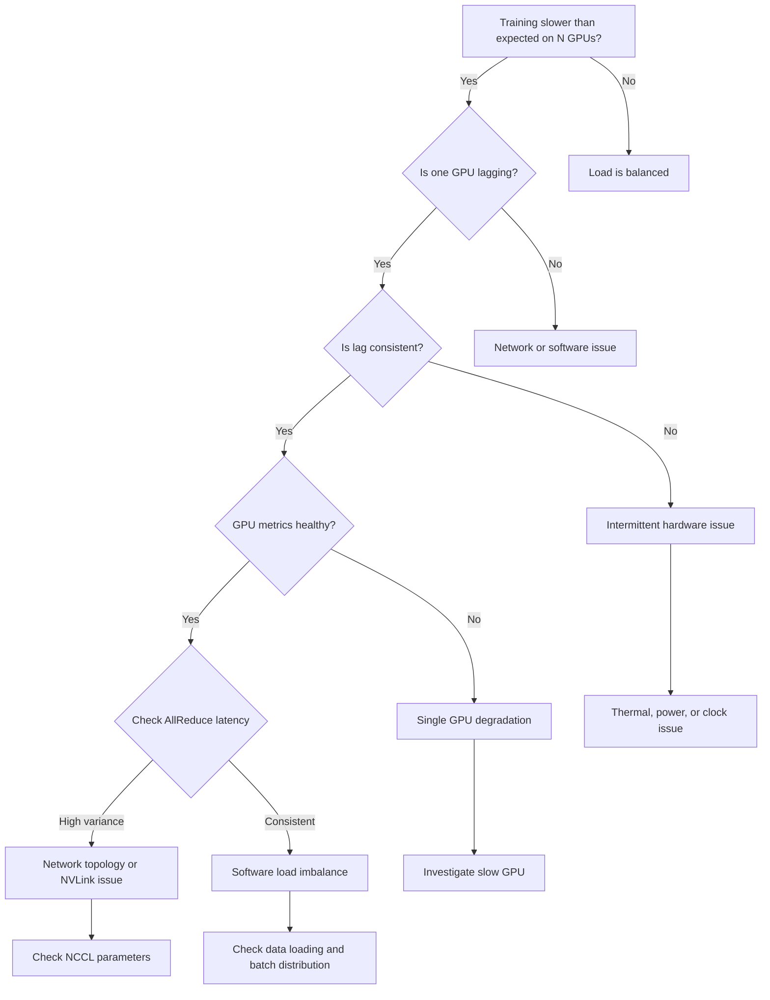

## Symptoms

- Distributed training throughput 40-60% lower than expected on N GPUs
- One or two GPUs complete iterations 5-10x slower than others
- AllReduce latency varies 10x depending on which GPU initiates
- Iteration time histograms show bimodal distribution
- Specific GPU always waits for others in synchronization

## Evidence

### Key Metrics to Collect

- Per-GPU iteration timing from profiler
- Per-GPU throughput (samples/sec)
- AllReduce latency matrix (GPU_i → GPU_j)
- GPU utilization and memory usage across the cluster
- Thermal and power state differences between GPUs

## Diagnosis

### Diagnosis Flowchart



### First Diagnostic Step: Per-GPU Iteration Timing

Add timing instrumentation to training code:

```python
import torch
import torch.distributed as dist
import time

# In training loop
gpu_id = torch.cuda.current_device()

# Record start
iter_start = time.time()

# Forward pass
output = model(batch)
loss = criterion(output, labels)

# Backward
loss.backward()
optimizer.step()

# Synchronization (AllReduce)
dist.all_reduce(loss)

iter_end = time.time()
iter_time_ms = (iter_end - iter_start) * 1000

print(f"GPU {gpu_id}: Iter time = {iter_time_ms:.1f} ms")

# Collect across all GPUs
iter_times = [None] * dist.get_world_size()
dist.all_gather_object(iter_times, iter_time_ms)

if dist.get_rank() == 0:
    print(f"Iteration times: {iter_times}")
    print(f"Min={min(iter_times):.1f}ms, Max={max(iter_times):.1f}ms, Ratio={max(iter_times)/min(iter_times):.2f}x")
```

**Expected output:**
```
GPU 0: Iter time = 125.3 ms
GPU 1: Iter time = 126.1 ms
GPU 2: Iter time = 1250.5 ms  <- STRAGGLER: 10x slower!
GPU 3: Iter time = 124.8 ms
Iteration times: [125.3, 126.1, 1250.5, 124.8]
Min=124.8ms, Max=1250.5ms, Ratio=10.02x
```

### Check GPU Utilization and Power

```bash
# Monitor during training
nvidia-smi dmon -s puctem

# GPU   Pwr Temp SM Mem  Enc Dec XSM Mxm Fbg Xid Pid Name
     0  320  68  98  72   45   0   0   0   0   0  1234 python
     1  315  67  97  71   44   0   0   0   0   0  1234 python
     2   40  55   5  10    0   0   0   0   0   0  1234 python  <- IDLE!
     3  318  68  96  70   43   0   0   0   0   0  1234 python
```

**Observation:** GPU 2 is at 5% utilization while others at 95-98%. Not a GPU hardware problem — GPU is idle. Software issue.

### Measure AllReduce Latency

Use NCCL tests to measure communication overhead:

```bash
# Install NCCL tests
cd /opt
sudo git clone https://github.com/NVIDIA/nccl-tests.git
cd nccl-tests
sudo make

# Run AllReduce test (4 GPUs)
/opt/nccl-tests/build/allreduce_perf -b 1G -e 1G -f 2 -g 4

# Example output:
# rank 0 - allreduce 1073741824 elements in 125.0 us
# rank 1 - allreduce 1073741824 elements in 128.5 us
# rank 2 - allreduce 1073741824 elements in 2500.0 us  <- SLOW!
# rank 3 - allreduce 1073741824 elements in 126.8 us
```

GPU 2's AllReduce is 20x slower than expected. This indicates either:
1. NVLink to/from GPU 2 is broken
2. GPU-to-GPU communication path degraded
3. Network latency issue (if on multiple nodes)

### Check NVLink Status

```bash
$ nvidia-smi nvlink --status

GPU 0: NVLink Status (NVLink3, A100 — healthy per-link bandwidth ~25 GB/sec)
    Link 0: OK (25GB/sec)
    Link 1: OK (25GB/sec)
    Link 2: OK (25GB/sec)
    Link 3: DEGRADED (5GB/sec)  <- GPU to GPU 2 link slow

GPU 1: NVLink Status
    Link 0: OK (25GB/sec)
    ...

GPU 2: NVLink Status
    Link 0: FAILED (0 Mbps)  <- GPU 2 cannot communicate back
    ...
```

### Profile with Nsight Systems

```bash
# Capture GPU timeline
nsys profile -o multi_gpu_trace -d 60 -t cuda,nvtx python train.py

# In Nsight GUI, inspect:
# - GPU timeline: which GPU is busy, which is idle
# - Kernel execution: which GPU's kernels are lagging
# - Synchronization points: where does training stall waiting for slow GPU
```

Expected: All GPUs should have dense kernel timeline. If one GPU has gaps, it's the straggler.

## Resolution

### Step 1: Identify Root Cause Category

**A. Hardware degradation on one GPU:**
- Symptom: AllReduce to/from GPU is slow, GPU underutilized, metrics look healthy
- Fix: Reset GPU, check NVLink cables, or replace GPU

**B. Thermal/power throttling on one GPU:**
- Symptom: GPU metrics show low power/clock, high temperature
- Fix: See Chapter 06 (thermal) or Chapter 09 (power)

**C. Software load imbalance:**
- Symptom: GPU metrics all healthy, but data loading time varies
- Fix: Rebalance data distribution or pipeline parallelism

### Step 2: If Hardware Issue

1. **Reset GPU:**
   ```bash
   sudo nvidia-smi -i 2 --reset
   sleep 30
   
   # Re-run training and check if straggler is fixed
   ```

2. **Check NVLink:**
   ```bash
   nvidia-smi nvlink --status
   
   # Healthy A100 NVLink3 links run ~25 GB/sec each (12 links,
   # ~600 GB/sec aggregate). If any link shows < 20 GB/sec, reseat GPU or cable
   ```

3. **If still slow, disable GPU from training:**
   ```bash
   export CUDA_VISIBLE_DEVICES=0,1,3  # Skip GPU 2
   python train.py  # Now run on 3 GPUs instead of 4
   ```

4. **Escalate for GPU replacement**

### Step 3: If Software Issue

1. **Check data loading time:**
   ```python
   # Profile data loader
   batch_times = []
   for batch_idx, (data, labels) in enumerate(train_loader):
       load_time = time.time() - batch_start
       batch_times.append(load_time)
   
   print(f"Data loading: min={min(batch_times)*1000:.1f}ms, max={max(batch_times)*1000:.1f}ms")
   ```

2. **Balance data loading across GPUs:**
   ```python
   # Use distributed sampler
   from torch.utils.data.distributed import DistributedSampler
   
   sampler = DistributedSampler(
       dataset,
       num_replicas=torch.cuda.device_count(),
       rank=torch.cuda.current_device(),
       shuffle=True
   )
   loader = DataLoader(dataset, sampler=sampler, batch_size=256)
   ```

3. **Ensure equal batch sizes:**
   ```python
   # Verify all GPUs receive equal-sized batches
   for gpu_id in range(4):
       batch_size_per_gpu[gpu_id] = len(data_per_gpu[gpu_id])
   
   assert all(b == batch_size_per_gpu[0] for b in batch_size_per_gpu), \
       "Batch sizes unequal!"
   ```

## Verification

### Verification Checklist

1. **Iteration times balanced across GPUs:**
   ```python
   # After fix, check iteration times again
   iter_times_after = [...]  # Collect timing from all GPUs
   ratio = max(iter_times_after) / min(iter_times_after)
   
   # Expected: ratio < 1.1 (within 10%)
   assert ratio < 1.1, f"Imbalance still present: {ratio:.2f}x"
   ```

2. **AllReduce latency uniform:**
   ```bash
   /opt/nccl-tests/build/allreduce_perf -b 1G -e 1G -f 2 -g 4
   
   # Expected: All ranks show similar latency (± 10%)
   ```

3. **All GPUs fully utilized:**
   ```bash
   nvidia-smi dmon -s puctem
   
   # Expected: SM column all ≥ 90% for all GPUs
   ```

4. **Training throughput restored:**
   ```bash
   # Measure samples/sec
   start = time.time()
   for epoch in range(1):
       for batch in train_loader:
           forward_backward_step()
   elapsed = time.time() - start
   samples_per_sec = total_samples / elapsed
   
   # Expected: throughput = N * single_gpu_throughput
   # (e.g., 4 GPUs should be ~4x single GPU throughput)
   ```

### Production Troubleshooting Table

| Symptom | Evidence | Root Cause | Fix | Verification |
|---------|----------|-----------|-----|--------------|
| GPU 2 iteration 10x slower, 5% utilization, others 95%+ | AllReduce latency to GPU 2 is 20x higher, NVLink link speed degraded | NVLink cable loose or link training failed | Reseat NVLink cables, run nvidia-smi nvlink --status to verify, reset GPU | AllReduce latency returns to normal, GPU 2 utilization 90%+, iteration time balanced |
| All GPUs show similar iteration time but training 50% slower than expected | Utilization looks OK (80%+) but sustained throughput is low | GPU-to-GPU or node-to-node network congestion, inefficient data pipeline | Check NCCL parameters, enable NCCL DEBUG, profile data loading separately | Throughput increases to N x single_gpu_throughput |
| Iteration time varies: sometimes 100ms, sometimes 1000ms randomly | One GPU sometimes idle, sometimes busy; no hardware pattern | Software load balancing issue, data loading bottleneck causes GPU stalls | Implement DistributedSampler for data distribution, add prefetching | Iteration time consistent ±5% across all samples |
| Specific GPU always completes last (always visible in timeline) | Per-GPU timing shows GPU 1 always slower, others vary | GPU 1 thermal throttling or power capped due to degradation | Check GPU 1 temperature and power, compare to baseline, replace thermal paste if needed | GPU 1 iteration time similar to others |
| AllReduce varies 100 → 500 microseconds random | NCCL test shows sporadic latency spikes, P2P bandwidth to straggler inconsistent | NVLink link training oscillating or switch fabric congestion | Disable DVFS on GPUs, check switch configuration, escalate to network team | AllReduce latency stable ± 10% |

## Prevention

### Health Checks

1. **Daily imbalance detection:**
   ```bash
   #!/bin/bash
   # Run training benchmark with all GPUs
   python train_benchmark.py --gpus 0,1,2,3 --duration 300s
   
   # Extract per-GPU iteration times
   # Alert if max/min ratio > 1.2
   ```

2. **Weekly NCCL performance test:**
   ```bash
   /opt/nccl-tests/build/allreduce_perf -b 1G -e 1G -f 2 -g 4 -c 0
   
   # Log latency
   # Alert if latency from any rank > baseline + 50%
   ```

3. **Monthly NVLink health check:**
   ```bash
   nvidia-smi nvlink --status
   
   # Verify all links at ~25 GB/sec (NVLink3/A100 per-link)
   # Alert if any link < 20 GB/sec
   ```

4. **Prometheus alerts:**
   ```yaml
   alert: GPUStragglerDetected
   expr: max(nvidia_training_iteration_time) / min(nvidia_training_iteration_time) > 1.2
   for: 5m
   annotations:
     summary: "GPU iteration time imbalanced by {{ $value:.2f }}x"
   ```

## Escalation

### When to Escalate

**Escalate to hardware or network team if:**
- GPU reset doesn't fix straggler, and AllReduce latency remains high
- Multiple NVLink links from same GPU show degraded speed simultaneously
- Straggler symptom moves between GPUs (indicates intermittent hardware fault)
- Multi-node training shows latency imbalance across nodes (network issue)

**Escalation data to collect:**

```bash
# Multi-GPU imbalance diagnostics
echo "=== Multi-GPU Imbalance Escalation Data ===" > imbalance_escalation.log

# Per-GPU metrics
nvidia-smi dmon -s puctem -c 60 >> imbalance_escalation.log

# NCCL performance
/opt/nccl-tests/build/allreduce_perf -b 1G -e 1G -f 2 -g 4 -c 0 >> imbalance_escalation.log 2>&1

# NVLink status
nvidia-smi nvlink --status >> imbalance_escalation.log

# GPU detailed info
nvidia-smi -i 0 -q >> imbalance_escalation.log
nvidia-smi -i 2 -q >> imbalance_escalation.log

# Nsight Systems trace
# nsys profile -o trace -d 60 python train.py
```

### Interview Preparation

**Q: "During distributed training on 4 A100s, we see 40% lower throughput than expected. One GPU consistently takes 10x longer per iteration. How do you diagnose?"**

A: "First, I'd determine if it's a hardware problem or software. I'd add per-GPU iteration timing instrumentation and run a benchmark. If one GPU is 10x slower, I'd check: (1) Is that GPU actually under load? I'd look at nvidia-smi utilization — if it's idle while others are at 95%, it's not getting any work assigned (software issue). (2) If it's busy, I'd check if its metrics are degraded — temperature, power, clock. (3) If metrics look good, I'd run NCCL AllReduce tests to see if communication to/from that GPU is slow — if AllReduce latency to that GPU is 20x higher, the NVLink or network path is broken. Once I identify the root cause, the fix is clear: if it's software, rebalance data; if it's hardware, reset or replace the GPU."

**Q: "AllReduce latency varies 10x depending on which GPU initiates the collective. What's happening?"**

A: "That asymmetry is a sign that the topology is broken. With properly connected GPUs, AllReduce should have similar latency regardless of which GPU initiates. If it varies based on which GPU is the root, some GPUs are on slow paths and others on fast paths. This could be: (1) NVLink topology broken — some GPU pairs not connected or in wrong mode; (2) PCIe fallback — some GPUs fell back to PCIe instead of NVLink; (3) Switch fabric issue if multi-node. I'd check nvidia-smi nvlink --status to see the physical topology and link speeds. If any link is slow or failed, I'd reseat the GPU or cable. If it's all connected at full speed but latency still varies, it might be a NCCL algorithm choice issue — I'd check if my AllReduce algorithm is optimal for the topology."

**Q: "How would you build a production monitoring system to detect stragglers automatically?"**

A: "I'd instrument every training job to emit per-GPU iteration times, then collect those in a monitoring system. At each iteration, I'd calculate the ratio of max time to min time across all GPUs. If that ratio > 1.2 (20% imbalance), I'd alert. I'd also run weekly synthetic benchmarks: NCCL AllReduce tests and GPU bandwidth tests, tracking latency over time. If latency trends up by 50%, that's a leading indicator that a link is degrading. Finally, I'd collect a Nsight Systems trace monthly — just a 1-minute snapshot of a real training job — and visually inspect the GPU timeline to see if any GPU has gaps or lower utilization than others. Combining real-time iteration timing with periodic synthetic benchmarks and visual traces gives early warning before stragglers cause production impact."

