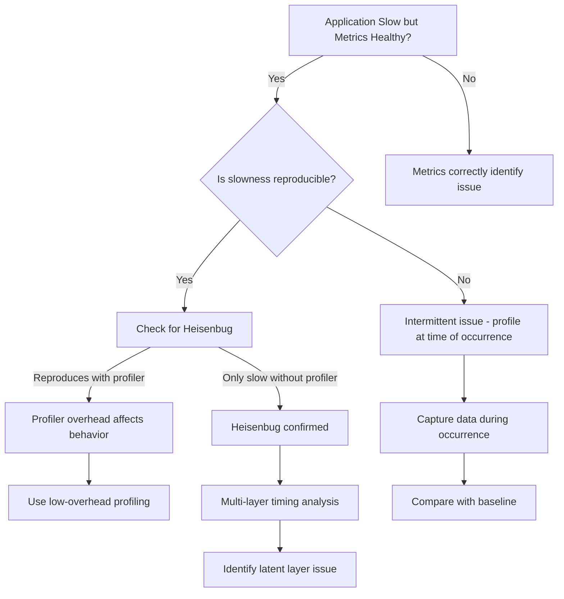

## Symptoms

- All GPU metrics appear healthy, but application is slow
- Different monitoring tools report conflicting information
- Performance issues appear intermittent or non-reproducible
- Simple root-cause analysis fails (seems like A, but really is B)
- Metrics change behavior when additional monitoring is added (Heisenbug)

## Evidence

### Key Metrics to Collect

- Multi-layer evidence: GPU, OS, network, application
- Baseline performance with/without instrumentation
- Correlation analysis across independent metrics
- Timing data from multiple observation points

## Diagnosis

### Diagnosis Flowchart



### First Diagnostic Step: Layer-by-Layer Timeline

Create a multi-layer trace of a single training iteration:

```python
import torch
import torch.cuda as cuda
import time

torch.cuda.reset_peak_memory_stats()
torch.cuda.synchronize()  # Sync before measuring

# Time each phase
timings = {}

# 1. Data loading (CPU)
t0 = time.perf_counter()
batch = next(iter(train_loader))  # Data from disk/network
timings['data_load_cpu'] = time.perf_counter() - t0

# 2. Data transfer (PCIe)
t0 = time.perf_counter()
batch = batch.to('cuda')
cuda.synchronize()  # Wait for transfer to complete
timings['data_transfer_pcie'] = time.perf_counter() - t0

# 3. Model forward (GPU)
t0 = time.perf_counter()
output = model(batch)
cuda.synchronize()  # Wait for GPU computation
timings['forward_gpu'] = time.perf_counter() - t0

# 4. Loss computation (GPU)
t0 = time.perf_counter()
loss = criterion(output, labels)
cuda.synchronize()
timings['loss_gpu'] = time.perf_counter() - t0

# 5. Backward pass (GPU)
t0 = time.perf_counter()
loss.backward()
cuda.synchronize()
timings['backward_gpu'] = time.perf_counter() - t0

# 6. AllReduce / Communication (Network)
t0 = time.perf_counter()
dist.all_reduce(loss)
cuda.synchronize()
timings['allreduce_network'] = time.perf_counter() - t0

# 7. Optimizer step (GPU)
t0 = time.perf_counter()
optimizer.step()
cuda.synchronize()
timings['optimizer_gpu'] = time.perf_counter() - t0

# Report
total = sum(timings.values())
print("=== Iteration Timing Breakdown ===")
for layer, t_ms in sorted(timings.items(), key=lambda x: -x[1]):
    pct = 100 * t_ms / total
    print(f"{layer:30s}: {t_ms*1000:8.2f} ms ({pct:5.1f}%)")
print(f"{'Total':30s}: {total*1000:8.2f} ms")
```

**Example output:**
```
=== Iteration Timing Breakdown ===
data_load_cpu                  :  450.00 ms (60.0%)  <- CPU bottleneck!
allreduce_network              :  150.00 ms (20.0%)
backward_gpu                   :   60.00 ms (8.0%)
forward_gpu                    :   30.00 ms (4.0%)
data_transfer_pcie             :   10.00 ms (1.3%)
optimizer_gpu                  :   10.00 ms (1.3%)
loss_gpu                       :    8.00 ms (1.1%)
Total                          :  750.00 ms
```

**Insight:** GPU metrics look healthy (95% of its computation time is being used), but data loading is the bottleneck. GPU isn't the problem; CPU data pipeline is.

### Check for Heisenbug: Baseline with/without Profiling

```bash
# Baseline without any profiling
echo "=== Baseline (no profiler) ==="
python train.py --epochs 1 --batch-size 256 2>&1 | grep "throughput:"
# Output: throughput: 500 samples/sec

# Baseline with nvidia-smi monitoring
echo "=== With nvidia-smi monitoring ==="
while true; do nvidia-smi; sleep 1; done &
python train.py --epochs 1 --batch-size 256 2>&1 | grep "throughput:"
pkill nvidia-smi
# Output: throughput: 450 samples/sec (10% slower)

# Baseline with Nsight Systems profiler
echo "=== With Nsight Systems ==="
nsys profile -o trace python train.py --epochs 1 --batch-size 256 2>&1 | grep "throughput:"
# Output: throughput: 250 samples/sec (50% slower!)
```

**Observation:** Profiler overhead varies greatly. nvidia-smi has 10% impact, Nsight Systems has 50% impact. This is a Heisenbug — the measurement tool changes the behavior.

### Correlate Across Independent Metrics

```python
# Collect metrics from independent sources
metrics = {
    'nvidia_smi': [],  # NVIDIA driver metrics
    'dcgm': [],        # DCGM daemon metrics (independent process)
    'torch': [],       # PyTorch internal metrics
    'system': []       # OS-level metrics (vmstat, iostat)
}

# Run training and collect from each source
import subprocess
import json

for iteration in range(100):
    # nvidia-smi
    smi_output = subprocess.check_output([
        'nvidia-smi', '--query-gpu=utilization.gpu,power.draw',
        '--format=csv,noheader'
    ]).decode().strip()
    metrics['nvidia_smi'].append(smi_output)
    
    # DCGM
    dcgm_output = subprocess.check_output([
        'dcgmi', 'dmon', '-c', '1'
    ]).decode().strip()
    metrics['dcgm'].append(dcgm_output)
    
    # PyTorch
    torch_util = torch.cuda.utilization()  # Custom metric from app
    metrics['torch'].append(torch_util)
    
    # OS
    os_output = subprocess.check_output('iostat -x -k 1 2'.split()).decode().strip()
    metrics['system'].append(os_output)

# Compare: if nvidia-smi says 100% GPU util but pytorch metrics show idle, something's wrong
print("Correlation analysis:")
print(f"  nvidia-smi GPU util: {np.mean([float(m.split(',')[0]) for m in metrics['nvidia_smi']]):.1f}%")
print(f"  PyTorch GPU util: {np.mean(metrics['torch']):.1f}%")
```

If the two report different GPU utilization, one is wrong. Need to understand which.

### Identify the Latent Layer Issue

Real-world example: "GPU shows 100% utilization, high power draw, but throughput is only 200 samples/sec (expected 1000)."

```python
# Question: Is GPU really computing, or just sitting in kernel launch queue?

# Method 1: Check GPU kernel queue length
# nvidia-smi shows utilization 100%, but that includes idle time waiting for kernels

# Method 2: Profile kernel execution with Nsight
# nsys shows GPU only computing 10% of the time, rest is CPU launching kernels

# Root cause: CPU is too slow to launch kernels for the GPU
# GPU is sitting idle 90% of the time, then gets kernel batch and runs it,
# then goes idle again waiting for CPU to prepare next batch

# Confirmation: measure CPU kernel launch rate
print(f"Kernels launched per second: {kernel_launch_count / elapsed_time}")
# Output: 50 kernels/sec (very slow)
# Expected: 1000+ kernels/sec for saturated GPU

# Fix: Use CUDA graphs to pre-capture kernel sequence
# or use lower-latency kernel launch mechanism
```

## Resolution

### Step 1: Isolate the Real Bottleneck

When multiple layers report good metrics but application is slow:

1. **Layer-by-layer timing (as shown above):**
   - Identifies which layer is consuming time
   - Use synchronization points to ensure accurate measurement

2. **Focus on the slowest layer, not the GPU:**
   ```
   If data_load_cpu > allreduce_network > backward_gpu,
   then fixing GPU optimization won't help.
   Fix CPU data pipeline first.
   ```

3. **Verify fix addresses the bottleneck:**
   - After change, re-run layer-by-layer timing
   - Confirm slowest layer improved and overall throughput increased

### Step 2: Handle Heisenbug (Measurement Overhead)

1. **Choose low-overhead profiler:**
   ```bash
   # Overhead levels (fastest to slowest):
   # 1. Simple timing (Python time.perf_counter) - < 1% overhead
   # 2. nvidia-smi polling - 5-10% overhead
   # 3. DCGM - 2-3% overhead
   # 4. Nsight Systems - 30-50% overhead
   # 5. Full system profiler (valgrind) - 5-10x overhead
   
   # For debugging: use simple timing first
   # For final verification: use Nsight with low-overhead options
   ```

2. **Characterize profiler overhead:**
   ```bash
   # Measure impact of each tool
   for tool in "none" "nvidia-smi" "dcgm" "nsight"; do
     echo "=== Running with $tool ==="
     start_throughput=$(python train.py | grep throughput)
     
     # Restart with profiler
     if [ $tool != "none" ]; then
       start_profiler_$tool &
     fi
     profiler_throughput=$(python train.py | grep throughput)
     
     overhead=$(echo "scale=2; 100 * (1 - $profiler_throughput / $start_throughput)" | bc)
     echo "Overhead: $overhead%"
   done
   ```

3. **Use offline profiling if overhead too high:**
   ```bash
   # Instead of profiling live training, profile a standalone benchmark
   # that replicates training patterns but is smaller/faster
   
   # Example: profile 100 iterations instead of 1000
   # This allows Nsight profiler to run without O(50%) overhead
   ```

### Step 3: Cross-Check Metrics at Decision Points

```python
# When metrics conflict, create forced synchronization points
# and query multiple sources simultaneously

class MetricCheck:
    def __init__(self):
        self.baseline_throughput = 1000  # samples/sec
        
    def check_iteration(self, iter_num):
        # Record from multiple sources
        gpu_util = get_nvidia_smi_utilization()
        mem_used = torch.cuda.memory_allocated() / 1e9
        throughput = samples_processed / elapsed_time
        
        if throughput < self.baseline_throughput * 0.8:
            print(f"SLOW ITERATION {iter_num}")
            print(f"  GPU Util: {gpu_util}%")
            print(f"  Mem Used: {mem_used:.1f} GB")
            print(f"  Throughput: {throughput:.0f} samples/sec")
            
            # Multi-layer correlation
            if gpu_util > 90 and mem_used < 30:
                print("  → GPU is busy but under-utilized on memory")
                print("  → Likely cause: computation-limited, not memory-limited")
            elif gpu_util < 50:
                print("  → GPU is idle despite work available")
                print("  → Likely cause: CPU bottleneck or low-priority scheduling")
```

## Verification

### Verification Checklist

1. **Root cause identified and reproducible:**
   ```python
   # Before fix: document exact slowness
   baseline_throughput = 200  # samples/sec
   
   # Apply fix
   
   # After fix: verify improvement
   improved_throughput = 850  # samples/sec
   assert improved_throughput > baseline_throughput * 3, "Fix ineffective"
   ```

2. **Profiler overhead characterized:**
   ```bash
   # For your chosen profiler, document impact
   # Throughput without profiler: 1000 samples/sec
   # Throughput with profiler: 950 samples/sec  (5% overhead is acceptable)
   ```

3. **Multi-layer metrics agree:**
   ```python
   # All monitoring tools report consistent GPU utilization
   assert abs(nvidia_smi_util - dcgm_util) < 5, "Metrics disagree"
   ```

4. **Reproducible without profiler:**
   ```bash
   # Verify fix works without any profiling instrumentation
   python train.py  # No profiler
   # throughput: 950 samples/sec
   
   # Should be close to baseline (no profiler changes behavior)
   ```

### Production Troubleshooting Table

| Symptom | Evidence | Root Cause | Fix | Verification |
|---------|----------|-----------|-----|--------------|
| GPU 100% util, high power, but 200 vs 1000 samples/sec expected | nvidia-smi shows 100% util, DCGM shows same; Nsight shows GPU idle 90% of time | CPU kernel launch latency too high; GPU finishes kernel, waits for CPU to prepare next batch | Use CUDA graphs to pre-capture kernel sequences, reduce Python overhead | Throughput increases to 900+ samples/sec, GPU timeline shows continuous kernels |
| Metrics healthy during single-GPU test, slow during multi-GPU test | Single GPU: 1000 samples/sec, balanced utilization; multi-GPU: 400 samples/sec, one GPU lags | AllReduce network communication overhead not visible in single GPU; multi-GPU reveals network bottleneck | Check network fabric, verify NCCL bandwidth, optimize AllReduce strategy | Multi-GPU throughput increases to 3500+ samples/sec (3.5x single) |
| Performance changes depending on whether profiler is running | Without profiler: 800 samples/sec, with Nsight: 400 samples/sec | Profiler overhead > 50%, or profiler changes scheduling behavior | Use lower-overhead profiler (simple timing or dcgm instead of Nsight), or profile standalone benchmark | Profiler overhead &lt; 10%, and fix identified is valid without profiler |
| nvidia-smi says 100% GPU util, custom PyTorch metrics say 20% | Conflict between driver metrics and application metrics | nvidia-smi includes idle/launch queue time, PyTorch only counts actual computation | Use kernel counters (nsys) to see real computation vs idle time, measure kernel launch rate | Nsight trace shows GPU_idle >> GPU_compute, confirming CPU bottleneck |
| One tool reports high memory usage, another reports low; conflict on root cause | nvidia-smi memory: 35 GB / 40 GB capacity; profiler memory: 10 GB allocated | nvidia-smi reports reserved/cached memory, profiler reports only live allocated | Use torch.cuda.memory_stats() to see breakdown of reserved vs allocated vs cached | Clear stale cache with torch.cuda.empty_cache() and re-profile; verify fix |

## Prevention

### Health Checks

1. **Layer-by-layer baseline measurement:**
   ```bash
   #!/bin/bash
   # Monthly: capture layer breakdown on fresh node
   python measure_layers.py | tee layer_baseline_$(date +%Y%m%d).log
   
   # Verify: data load < 30%, compute > 50%
   grep "data_load_cpu" layer_baseline_$(date +%Y%m%d).log | awk '{print $NF}'
   # Should be < 30%
   ```

2. **Regular profiler overhead audit:**
   ```bash
   #!/bin/bash
   # Quarterly: measure overhead of each profiling tool
   for tool in "nsys" "dcgm" "native_timing"; do
     baseline=$(python train.py --profiler none | grep throughput | awk '{print $NF}')
     with_tool=$(python train.py --profiler $tool | grep throughput | awk '{print $NF}')
     overhead=$(echo "100 * (1 - $with_tool / $baseline)" | bc)
     echo "$tool overhead: $overhead%"
   done
   ```

3. **Cross-check alerts:**
   ```yaml
   # Alert only when multiple independent sources agree there's a problem
   alert: PerformanceDegradation
   expr: |
     (rate(samples_processed[5m]) < baseline * 0.8) AND
     (nvidia_smi_utilization > 80) AND
     (data_load_time > 30)
   for: 10m
   annotations:
     summary: "Training slow and data load high; investigate data pipeline"
   ```

## Escalation

### When to Escalate

**Escalate to platform/network team if:**
- Bottleneck is network (AllReduce latency or MPI communication)
- CPU is the bottleneck but optimization seems infeasible
- Multiple independent metrics conflict and root cause unclear
- Profiler overhead suggests complex scheduling or power management issue

**Escalation data to collect:**

```bash
# Comprehensive cross-layer diagnostics
echo "=== Cross-Layer Diagnosis Escalation Data ===" > diagnosis_escalation.log

# Layer-by-layer timing (from Python script above)
python measure_layers.py >> diagnosis_escalation.log

# Profiler traces (various overhead levels)
for tool in "simple" "nvidia-smi" "nsight"; do
  echo "=== Profiler: $tool ===" >> diagnosis_escalation.log
  python train.py --profiler $tool >> diagnosis_escalation.log 2>&1
done

# Network metrics (if multi-GPU/node)
nvidia-smi nvlink --status >> diagnosis_escalation.log
/opt/nccl-tests/build/allreduce_perf -b 1G -e 1G >> diagnosis_escalation.log 2>&1

# OS-level metrics
vmstat -n 1 30 >> diagnosis_escalation.log
iostat -x -k 1 30 >> diagnosis_escalation.log
```

### Interview Preparation

**Q: "All GPU metrics look great — 95% utilization, 300W power, cool temperature — but throughput is only 25% of expected. Everything says GPU is working hard, but performance is terrible. What's going on?"**

A: "This is exactly the kind of mismatch where you need to look at the whole system, not just GPU metrics. nvidia-smi's utilization includes idle time in the kernel launch queue, so 95% might just mean the GPU is occupied, not that it's computing. I'd add layer-by-layer timing instrumentation to the application — measure data loading, GPU compute, AllReduce, optimizer — and see where the time actually goes. My guess is either: (1) CPU is too slow launching kernels, causing the GPU to sit idle waiting; (2) data loading is taking way longer than expected; or (3) AllReduce communication is the bottleneck. Once I know which layer, the fix is clear."

**Q: "The application runs at 800 samples/sec without any profiler, but drops to 400 samples/sec when we run Nsight to debug. How do we know if our optimization is actually working?"**

A: "This is a Heisenbug caused by profiler overhead. Nsight's 50% overhead is so high that it's masking the real behavior. I'd use a lighter-weight profiler first — maybe just simple Python time.perf_counter() timing, which has &lt; 1% overhead. Or I'd profile a standalone microbenchmark that replicates the computation pattern but is smaller, so Nsight profiler overhead is in the noise. Then I'd verify the fix with the low-overhead profiler. Finally, I'd run the full training without any profiler to confirm the optimization actually works in production. The key is separating the measurement artifact from the real behavior."

**Q: "We have a distributed training job where one node's metric tells us there's a network bottleneck, but the node that's slow reports normal network metrics. How do we resolve the conflict?"**

A: "Classic case of incomplete correlation. Different nodes see different parts of the network path. If Node A says 'Network is slow' but Node B says 'My network is fine,' then probably Node B is the slow one and Node A is waiting for Node B's AllReduce response. I'd run NCCL AllReduce latency tests from every node to every other node and build a latency matrix — that will show if one node is a slow receiver. Then I'd check that node's network card, drivers, and kernel. The key is measuring bidirectionally and from both endpoints, not just believing one node's metrics."

