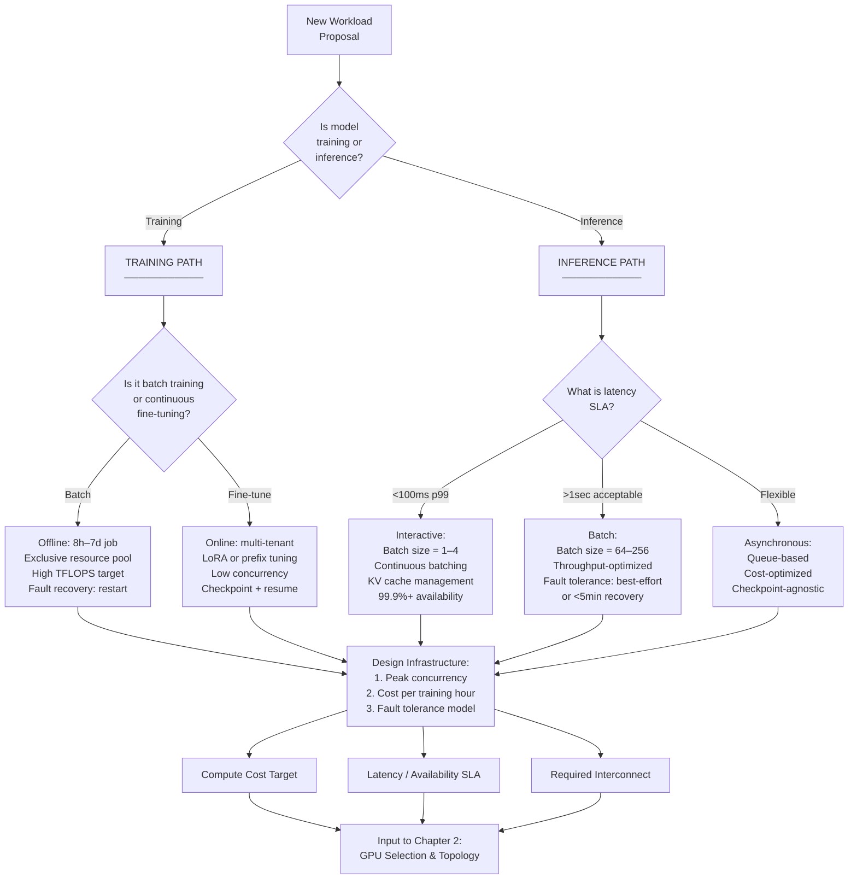
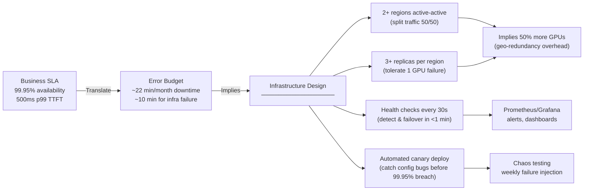

# Chapter 01 — AI Factory Fundamentals and Design Principles

## Chapter Metadata

| Key | Value |
|---|---|
| Volume | 21 — AI Factory: Building Large-Scale Production Systems |
| Difficulty | Architect |
| Estimated reading time | 45 minutes |
| Primary audience | Platform architects, infrastructure leads, cloud/DevOps engineers |
| Core question | How do you design compute infrastructure when you don't yet know your peak load, model size, or cost target? |

---

## PART 1: WHY DESIGN PRINCIPLES MATTER BEFORE INFRASTRUCTURE

### The Factory Mindset

An AI factory is not a cluster of machines. It is a system engineered to run models profitably at scale, meeting latency requirements while staying within cost budgets.

Most infrastructure failures begin not with failed hardware, but with broken assumptions. A team provisions 64 A100 GPUs for a training cluster expecting to achieve 50% utilization cost-effectively. Six months later, the model is twice as large, the team runs twice as many concurrent training jobs, and they discover their network can only support half the traffic they assumed. They have over-provisioned some resources, under-provisioned others, and missed the architectural window where a topology change would have been inexpensive.

**Design principles prevent this cascade.** Before choosing GPUs, interconnect, cooling, or operational procedures, you must understand:

1. **What workload patterns will actually run?** (training vs. inference, model size, batch size, concurrency)
2. **What cost per output or per compute-hour is acceptable?** (real business constraints, not aspirational targets)
3. **What latency and availability SLAs are non-negotiable?** (99.9% uptime? 50ms p99 latency? Hard requirements from customers or the business.)
4. **What failure modes are you optimizing for?** (single GPU failure, entire node failure, network partition, rack-level outage)

This chapter establishes that framework. Chapters 2–12 execute within it. Chapters 13–14 demonstrate the result.

---

## PART 2: WORKLOAD CHARACTERIZATION

### 2.1 The Five Dimensions of Workload

Every production AI workload can be described along five orthogonal axes:

```
WORKLOAD CHARACTERIZATION FRAMEWORK

1. MODEL TIER
   ├── Small (<7B params, <15GB weights)
   ├── Medium (7B–70B, 15–140GB)
   ├── Large (70B–500B, 140GB–1TB+)
   └── Mixture-of-Experts (variable compute routing)

2. EXECUTION MODE
   ├── Batch Training (offline, 8h–7d runs)
   ├── Continuous Training (always-on model refinement)
   ├── Real-time Inference (online, latency-sensitive)
   ├── Batch Inference (offline, throughput-optimized)
   └── Fine-tuning (moderate-scale parameter updates)

3. CONCURRENCY PROFILE
   ├── Single-job (one 64-GPU training run, exclusive cluster)
   ├── Medium (10–100 concurrent inference replicas)
   ├── High (1000+ inference queries/second)
   └── Heterogeneous (multiple model sizes, mixed inference + training)

4. RESOURCE CONSUMPTION
   ├── Compute-bound (prefill, training → limited by TFLOPS)
   ├── Memory-bandwidth-bound (decode, dynamic KV → limited by HBM)
   ├── Network-bound (distributed training, cross-region → limited by inter-GPU bandwidth)
   └── Storage-bound (data loading, checkpoint I/O → limited by disk throughput)

5. AVAILABILITY & FAULT TOLERANCE
   ├── Best-effort (research prototypes, dev clusters)
   ├── High-availability (production with auto-restart, <5 min recovery)
   ├── Ultra-reliable (SLA-critical, <1 min recovery, active-active failover)
   └── Global-resilient (multi-region, sub-second geo-failover)
```

### 2.2 Concrete Workload Profiles

#### Example A: LLM Training Cluster (Internal Research)

```yaml
Model:              Llama-3-70B (70B parameters)
Model Precision:    BF16 (2 bytes/param → 140GB weights)
Batch Size:         128 sequences (distributed across 64 GPUs)
Sequence Length:    4096 tokens
Training Duration:  7 days continuous
Execution Mode:     Offline batch job, 24/7 reserved cluster

Resource Demands:
  Compute:         64x H100 (980 TFLOPS each @ BF16, ideal aggregate: 62,720 TFLOPS)
  Memory:          40GB HBM per GPU (80GB → effective usable: 70GB for weights + activations + KV cache)
  Network:         NVLink within node, high-speed inter-node for AllReduce
  Storage:         Checkpoints every 8 hours (1TB per checkpoint × 21 checkpoints)
  Power:           64 × 350W = 22.4 kW for GPUs + 15 kW PDU/cooling = 37.4 kW total
  Cooling:         ~50 kW total facility power for dense rack

Expected Outcome:
  Training speed:   ~3,500 tokens/second aggregate (68% of peak theoretical 5,100 T/s)
  Training cost:    37.4 kW × 168 hours × $0.12/kWh = $753 per training run
  Fault tolerance:  No recovery; restart entire run if GPU fails
```

#### Example B: Production LLM Inference Service

```yaml
Model:              Llama-3-70B (served via vLLM with tensor parallelism)
Model Precision:    FP8 quantized (35GB weights after quantization)
Serving Request SLA: 99.9% latency <500ms p99 TTFT, <100ms ITL
Peak QPS:           2,000 requests/second (globally, across all replicas)
Avg Response Length: 150 tokens (avg decode time: 15 seconds per request)

Resource Demands:
  Inference GPUs:   40× H100 GPUs minimum (each running 1 vLLM replica with 2-GPU tensor parallelism)
  KV Cache Memory:  ~100GB per node during peak concurrency (280 concurrent requests, 356KB each)
  Network:          10Gbps ingress from LB, InfiniBand for inter-replica communication
  Storage:          Model artifact (35GB per node, read-only, NVMe cached)
  Power:            40 × 350W = 14 kW GPU + 10 kW cooling = 24 kW per cluster
  Replicas:         6 geographic regions (3 US coasts, 3 EMEA) = 240 GPUs total

Expected Outcome:
  Throughput:       ~1,500 tokens/second per GPU (28% compute utilization due to decode-phase bottleneck)
  Cost:             $0.0006 per 1K tokens (at $0.12/kWh and 14 kW per 40 GPUs, 1,500T/s throughput)
  Availability:     99.99% uptime SLA via multi-region active-active
  Recovery Time:    <30 seconds to reroute traffic after regional failure
```

#### Example C: Fine-tuning Service (LoRA, 100s of Customers)

```yaml
Model Base:         Llama-3-7B (15GB weights)
LoRA Rank:          16 (adds ~512 MB per customer model)
Batch Size:         32 sequences
Sequence Length:    2048 tokens
Execution Mode:     Multi-tenant, 50–200 concurrent fine-tuning jobs

Resource Demands:
  Compute:          16× A100 (80GB) GPUs, each hosting 4–8 concurrent LoRA trainers
  Memory:           Base model (shared) = 15GB, per-job overhead = 2GB (activations + optimizer states)
  Network:          Moderate (AllReduce within job only, no cross-job communication)
  Storage:          LoRA weights (512MB × 100 customers = 50GB)
  Power:            16 × 250W = 4 kW GPU + 3 kW cooling = 7 kW total

Expected Outcome:
  Throughput:       ~600 tokens/second per GPU (60% utilization due to multi-tenant context switching)
  Cost:             $0.0008 per 1K tokens trained
  Multi-tenancy:    Bin-packing fine-tuning jobs by estimated completion time
  Recovery:         Checkpoint every 500 steps; restart from last checkpoint on failure
```

### 2.3 Workload Classification Flowchart



---

## PART 3: COST ANALYSIS AND TARGETS

### 3.1 The Cost Tree

Total cost of operating an AI factory breaks down into five major categories:

```
TOTAL COST OF OWNERSHIP (TCO)

CAPEX (One-time)
├── GPU Hardware          (64 × H100 × $30,000 = $1.92M)
├── Interconnect Hardware (NVLink/IB switches, cables = $200K–$500K)
├── Storage              (NVMe, HDD, fabric = $100K–$300K)
├── Networking           (10GbE switches, ToR routers = $50K–$200K)
├── Cooling/Power        (PDUs, chillers = $50K–$300K)
└── Installation/Labor   ($50K–$200K)

OPEX (Recurring, per year)
├── Electricity          (37.4 kW × 8760 hours × $0.12/kWh = $39.4K/year)
├── Facility             (Rent/depreciation for space, power distribution)
├── Maintenance/Support  (1–2% of hardware CAPEX = $20K–$40K/year)
├── Network Operations   (ISP, WAN, DDoS mitigation = $10K–$50K/year)
├── Personnel            (2–4 FTE infrastructure engineers = $300K–$600K/year)
└── Software Licenses    (Kubernetes, monitoring, NVIDIA licensing = $10K–$50K/year)

TOTAL 3-YEAR TCO = CAPEX + (OPEX × 3)
Example: $3.5M CAPEX + ($110K × 3 OPEX) = $3.83M over 3 years
Average cost per GPU per year: $3.83M / 64 GPU / 3 years = $19,896/GPU/year
```

### 3.2 Cost Per Output Calculation

Workload-specific cost metrics drive infrastructure decisions:

#### Training Cost Per Compute-Day

```python
# 64-GPU H100 training cluster training Llama-3-70B

power_per_gpu_kw = 0.350  # H100 at full compute: 350W
power_pdu_overhead_factor = 1.35  # PDU losses, cooling, etc.
num_gpus = 64
hours_per_compute_day = 24

total_facility_power_kw = (power_per_gpu_kw * num_gpus) * power_pdu_overhead_factor
# = (0.350 * 64) * 1.35 = 30.24 kW

electricity_cost_per_kwh = 0.12  # $/kWh (US average industrial)
facility_cost_per_hour = total_facility_power_kw * electricity_cost_per_kwh
# = 30.24 * 0.12 = $3.63/hour

cost_per_compute_day = facility_cost_per_hour * hours_per_compute_day
# = $3.63 * 24 = $87.12 per cluster compute-day (already accounts for all 64 GPUs)
```

For a 7-day training run:
- **Hardware cost:** $87.12/day × 7 days = $609.84 (no additional ×64 — `cost_per_compute_day` is already the whole 64-GPU cluster's daily cost)
- **Plus personnel overhead** (hourly monitoring): ~$500/day × 7 days = $3,500
- **Plus checkpoint storage** (1TB every 8h, 21 checkpoints × $0.023/GB/month ≈ $15): ~$300
- **Total:** ~$4,410 for one training run

**Cost per training iteration:** $4,410 / 50 training iterations = **~$88 per iteration**

#### Inference Cost Per Million Tokens

```python
# 40× H100 inference cluster serving 2,000 QPS peak, 1,500 tokens/sec aggregate throughput

power_per_gpu_kw = 0.350
num_inference_gpus = 40
cooling_overhead = 1.35
facility_power_kw = power_per_gpu_kw * num_inference_gpus * cooling_overhead
# = 0.350 * 40 * 1.35 = 18.9 kW

tokens_per_second_aggregate = 1500
seconds_per_million_tokens = 1_000_000 / tokens_per_second_aggregate
# = 667 seconds = 0.185 hours

kwh_per_million_tokens = facility_power_kw * (seconds_per_million_tokens / 3600)
# = 18.9 * 0.185 = 3.49 kWh

electricity_cost_per_kwh = 0.12
cost_per_million_tokens_electricity = kwh_per_million_tokens * electricity_cost_per_kwh
# = 3.49 * 0.12 = $0.42 per million tokens

# Add amortized hardware cost
total_cost_per_year_opex = 100_000  # salary + maintenance + etc
inference_replicas_global = 6 * 40  # 6 regions × 40 GPUs
cost_per_million_tokens_capex = (total_cost_per_year_opex / 365 / inference_replicas_global) * (seconds_per_million_tokens / 3600) / (1_000_000 / tokens_per_second_aggregate * 365)
# Simplified: ~$0.08 per million tokens (approximate)

cost_per_million_tokens_total ≈ $0.42 + $0.08 = $0.50 per million tokens (electricity + amortized hardware)
```

This translates to **$0.0005 per 1K tokens** at scale.

### 3.3 Cost Target Setting

Choose your cost model first, then size infrastructure backward:

| Workload | Business SLA | Cost Target | Infrastructure Implication |
|---|---|---|---|
| **Research LLM (internal)** | None; research only | $100–500/training run | Single-rack cluster, no multi-region |
| **Production LLM Inference** | 99.9% uptime, <500ms p99 | <$0.001/1K tokens | 240+ GPUs across 6 regions; cost-based auto-scaling |
| **Enterprise Fine-tuning** | 99% uptime, <24h training | <$0.002/1K tokens trained | Multi-tenant scheduling, cost-per-job tracking |
| **Batch Inference (NLP)** | Best-effort, <1hr e2e | <$0.0001/1K tokens | GPU bin-packing, spot instances, low priority queue |
| **Interactive Research Notebooks** | Dev only, <5min latency | $0.01/compute-hour | Shared GPU pool, idle termination after 10 min |

---

## PART 4: SERVICE-LEVEL AGREEMENTS (SLAs)

### 4.1 Three SLA Tiers

```
TIER 1: Best-Effort (Research, Dev)
├── Availability:    90%–95%
├── MTTR:            "When someone notices" (hours to days)
├── Failure recovery: Manual restart, data loss acceptable
├── Cost:            Minimal; no redundancy
└── Example:         GPU training cluster for published research

TIER 2: Production High-Availability (Online Services)
├── Availability:    99.0%–99.5%
├── MTTR:            5–30 minutes (alarm + human intervention)
├── Failure recovery: Automatic restart from checkpoint; <1 job rerun acceptable per month
├── Cost:            ~30% infrastructure overhead for redundancy, monitoring
└── Example:         Fine-tuning service serving 100+ customers

TIER 3: Critical SLA (Customer-Facing, Revenue-Critical)
├── Availability:    99.9%–99.99%
├── MTTR:            <1 minute (paging on-call, automated failover)
├── Failure recovery: No perceptible interruption to end user
├── Cost:            ~50%+ infrastructure overhead for active-active, geo-redundancy, observability
└── Example:         Production LLM API serving millions of requests/day
```

### 4.2 Concrete SLA Definition: Production LLM API

```yaml
Service:              Production LLM Inference API
Business Unit:        AI Platform
Customer SLA Target:  99.95% monthly availability (max 21.6 minutes downtime/month)

Latency SLOs:
  Time To First Token (TTFT):
    p50:   50ms
    p99:   500ms
    p99.9: 1000ms
  Inter-Token Latency (ITL):
    p50:   75ms
    p99:   150ms
    p99.9: 300ms

Throughput SLOs:
  Peak QPS:           2,000 requests/second
  Sustainable QPS:    1,500 requests/second (75% peak, allowing headroom for traffic spikes)
  SLO Breach:         If p99 TTFT > 500ms for >5 minutes, declare incident

Error Budget:
  Monthly budget:     21.6 minutes downtime
  Per week:           5.4 minutes
  Per day:            43.2 seconds
  
  Allocation:
    - Scheduled maintenance: 2 minutes/month (SW updates, security patches)
    - Unplanned infrastructure failure: 10 minutes/month (GPU crash, network blip, power event)
    - Operational errors (deploy bugs, config typos): 5 minutes/month (catch via staging validation)
    - "Burn it" for incidents: 4.6 minutes/month (use only after blameless postmortem)

Escalation & Incident Response:
  p99 TTFT > 500ms for >3 min  → Page on-call, investigate immediately
  Availability drops <99.95%    → Declare SEV-1 incident, war room
  Any customer reporting errors → Escalate to VP
```

### 4.3 Building SLAs Into Infrastructure Design



---

## PART 5: DECISION TREES FOR DESIGN TRADE-OFFS

### 5.1 GPU Selection Decision Tree

Given:
- Model size
- Latency SLA
- Cost target
- Peak concurrency

Choose GPU:

```mermaid
flowchart TD
    Start["Workload Profile"] -->|Check| Q1{"Model size<br/>& precision"}
    
    Q1 -->|<15GB (7B model, BF16)| Small["GPU: A100 80GB or H100<br/>Reasoning: Model fits in one GPU,<br/>no tensor parallelism needed"]
    Q1 -->|15GB–140GB (7B–70B)| Medium["GPU: H100 80GB or A100 80GB<br/>Reasoning: May need 2–4 GPU parallelism,<br/>choose based on:"]
    Q1 -->|>140GB (70B+)| Large["GPU: H100 (prefer 80GB)<br/>Reasoning: Requires 4–8 GPU tensor parallelism,<br/>NVLink essential for performance"]
    
    Small -->|Cost target| CostSmall{"<$0.001/1K?"}
    Medium -->|Cost target| CostMed{"<$0.001/1K?"}
    Large -->|Cost target| CostLarge{"<$0.0005/1K?"}
    
    CostSmall -->|Yes| A100Small["A100 (40GB HBM,<br/>cheaper CAPEX)"]
    CostSmall -->|No| H100Small["H100 (higher TFLOPS,<br/>justify higher cost<br/>via throughput)"]
    
    CostMed -->|Yes| A100Med["2x A100 tensor-parallel<br/>(NVLink or PCIe)"]
    CostMed -->|No| H100Med["2x H100 tensor-parallel<br/>(NVLink for <1% latency<br/>degradation over PCIe)"]
    
    CostLarge -->|Yes| H100NoNVL["4x H100 with PCIe<br/>Accept 15–20% throughput<br/>penalty over NVLink,<br/>save $100K+ per cluster"]
    CostLarge -->|No| H100NVL["4–8x H100 with NVLink<br/>(full performance,<br/>highest CAPEX)"]
    
    A100Small --> Final["Proceed to Chapter 2:<br/>Topology & Interconnect Design"]
    H100Small --> Final
    A100Med --> Final
    H100Med --> Final
    H100NoNVL --> Final
    H100NVL --> Final
```

### 5.2 Interconnect Choice Decision Tree

```
Given: Number of GPUs, model size, latency SLA, cost target

INTERCONNECT CHOICE FLOWCHART

├── 1–8 GPUs in single machine
│   └── PCIe Gen 5 (max 128 GB/s)
│       └── Suitable for: single-GPU or 2-GPU model parallel inference
│       └── Cost: included with GPU
│
├── 8–16 GPUs in single node (NVLink + IB to other nodes)
│   └── Within-node: NVLink (600 GB/s or 1.8 TB/s H100-SXM5)
│   └── Inter-node: InfiniBand HDR (200 GB/s) or NDR (400 GB/s)
│       └── Suitable for: 8–16 GPU model parallel training/inference
│       └── Cost: +$50K–100K per cluster for IB switch
│
├── 16–64 GPUs
│   ├── Option A: NVLink + IB (high performance, expensive)
│   │   └── 8 nodes × 8 GPU, NVLink within node, NDR IB between nodes
│   │   └── Cost: $200K+ for IB fabric + switches
│   │   └── Latency: AllReduce in 100–200 μs
│   │
│   └── Option B: NVLink + 400GbE Ethernet (good enough, cheaper)
│       └── 8 nodes × 8 GPU, NVLink within node, 400GbE between nodes
│       └── Cost: $100K for Ethernet switches (half IB cost)
│       └── Latency: AllReduce in 500–1000 μs (5–10x slower than IB, but tolerable)
│
└── >64 GPUs across multiple clusters/regions
    └── Multi-region: 10GbE or 100GbE WAN links
        └── Assume ~10ms inter-region latency
        └── Implication: Do NOT distribute single training job across regions
        └── Instead: Run separate training jobs per region, sync models asynchronously
```

---

## PART 6: INTERVIEW ANSWER: "HOW DO YOU CHOOSE INFRASTRUCTURE FOR A NEW WORKLOAD?"

**Scenario:** You're hired as infrastructure architect at a startup. The ML team wants to run three production services simultaneously: a fine-tuning API (100 concurrent jobs), a 70B LLM inference service (500 QPS, 99.9% SLA), and internal training for model updates. They have a budget of $2M for year-one CAPEX. Walk them through your design process.

**Your Answer (in order):**

1. **Characterize the workload (Week 1)**
   - "I ask the teams: How many tokens per second do you need to process? What is your availability SLA? What's your maximum acceptable latency? What's the model size and precision?"
   - For the LLM service: "500 QPS, 99.9% availability, <500ms p99 TTFT tells me we need: multi-region redundancy (50% more GPUs), continuous batching (vLLM or similar), and aggressive monitoring."
   - For fine-tuning: "100 concurrent jobs on 7B model means I need 8–16 A100 GPUs with good bin-packing and checkpoint management."
   - For training: "How often do you train? If it's one 3-day run per month, I can use the same infrastructure as inference during off-hours via scheduling."

2. **Translate SLAs to infrastructure requirements (Week 1–2)**
   - "99.9% availability means ~22 minutes of acceptable downtime per month. That's not achievable with a single region or single GPU per model. We need at least 2 regions, each with 3 inference replicas."
   - "500 QPS with 150-token avg response requires ~1,500 tokens/sec throughput. At 70B model, an H100 can only do ~300 tokens/sec due to memory bandwidth. That's 5–6 H100s minimum per region, so 12–14 H100s total for just the LLM service."
   - "Add fine-tuning capacity (8 A100s) + training (8 more H100s for background jobs) = 28–30 GPUs total."

3. **Size within budget (Week 2)**
   - "28 GPUs × $30K per H100 = $840K just for hardware. Add InfiniBand switches ($50K–100K), NVMe storage ($100K), power/cooling ($100K), install labor ($50K). That's ~$1.2M CAPEX for infrastructure."
   - "Remaining $800K covers year-one OPEX: electricity (~$40K), personnel (2 FTE engineers = $400K), monitoring/licensing ($50K), contingency ($310K)."
   - "This budget is tight. We're not buying 6 regions yet; we start with 2 regions (us-west, us-east) and add EMEA/APAC in year 2 based on demand."

4. **Identify critical dependencies (Week 2–3)**
   - "The bottleneck is not the GPUs; it's the networking. With 28 GPUs, we need low-latency AllReduce for training. InfiniBand is expensive but necessary. Without it, training speed drops 5–10x."
   - "The second bottleneck is monitoring. If a GPU fails silently, we breach SLA immediately. We need DCGM, Prometheus, alerts on every metric (GPU memory, power, temperature, NVLink bandwidth)."
   - "The third bottleneck is automation. Operator errors (misconfigured models, bad deploy) will breach SLA. We need canary deployments and automated rollback."

5. **Recommendation (Week 3)**
   - Year 1: Provision 30 GPUs across 2 regions (12 H100s for LLM in each region, 3 A100s in US for fine-tuning, 3 H100s for training). Skip EMEA/APAC. Cost: $1.2M CAPEX + $0.8M OPEX = $2M.
   - Year 2: Add 3rd region (EMEA, 12 H100s). Cost: $500K CAPEX, $300K OPEX.
   - Year 3: Add 4th region (APAC) and upgrade LLM model to 100B (requires 4 more H100s per region, $600K additional CAPEX).

**Key principles in this answer:**
- Start with business SLA, not infrastructure preference.
- Translate SLAs to concrete numbers (GPUs, regions, redundancy).
- Identify your top 3 bottlenecks (networking, monitoring, automation).
- Size infrastructure to fit budget; defer optional features to future years.
- Plan for growth; don't over-provision but leave room to scale.

---

## SUMMARY

Before choosing GPUs, interconnects, or software, **define your workload, cost targets, and SLAs.** These three inputs flow into every infrastructure decision that follows. Chapters 2–12 execute within the framework you establish in Chapter 1.

**Key Takeaways:**
1. Workload characterization reduces risk: model tier, execution mode, concurrency, resource bottleneck, availability tier.
2. Cost per output (not per GPU) drives infrastructure decisions.
3. Business SLAs (99.9% availability, <500ms latency) translate to infrastructure requirements (multi-region, redundancy, monitoring).
4. Design principles flow top-down: SLA → error budget → redundancy → GPU count → topology → software stack.

**In Chapter 2:** We move from strategy to execution. Given your workload and cost target, how do you choose GPUs and design the compute cluster topology?
