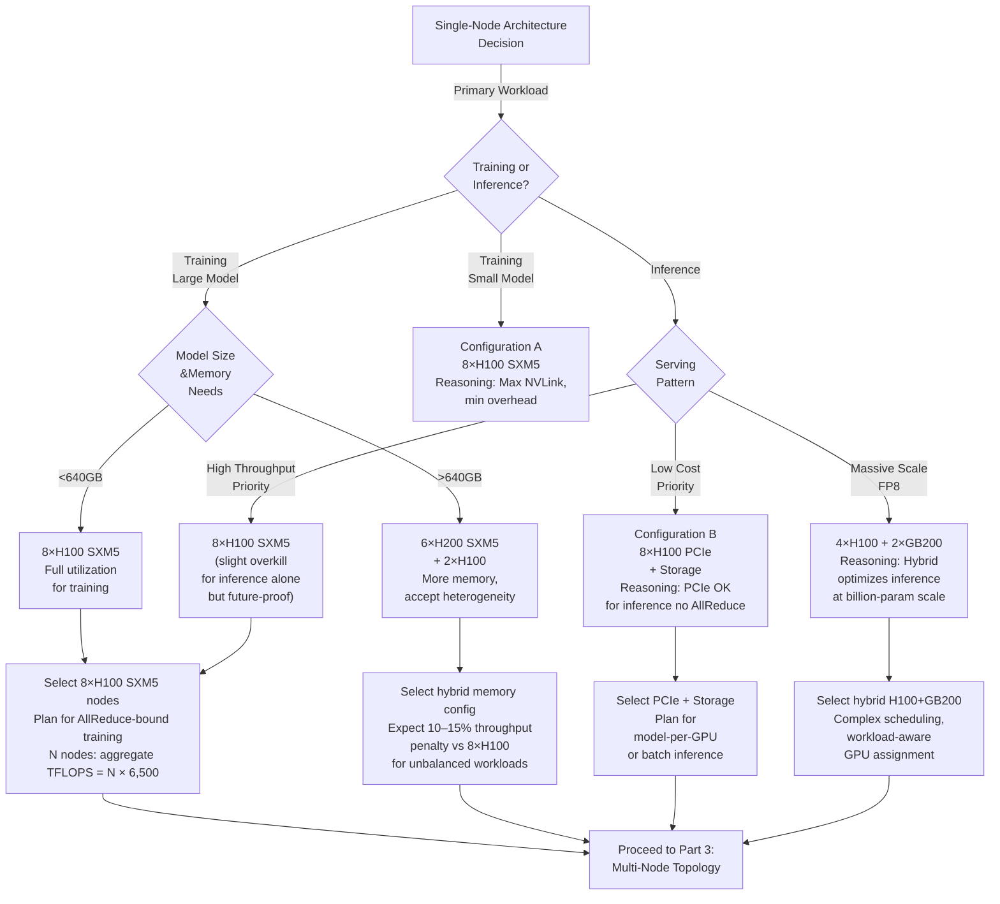

# Chapter 02 — GPU Compute Cluster Design

## Chapter Metadata

| Key | Value |
|---|---|
| Volume | 21 — AI Factory: Building Large-Scale Production Systems |
| Difficulty | Architect |
| Estimated reading time | 50 minutes |
| Primary audience | Infrastructure architects, cluster engineers, cloud platform leads |
| Core question | Given a workload and budget, how do you select GPUs, arrange them into nodes, and interconnect them for maximum performance within cost constraints? |

---

## PART 1: GPU SELECTION MECHANICS

### 1.1 Current GPU Landscape (August 2026)

| GPU | Released | Memory | HBM Bandwidth | Peak TFLOPS (FP32) | Peak TFLOPS (TF32) | Peak TFLOPS (BF16) | Peak TFLOPS (FP8) | Tensor Cores | PCIe Bandwidth | Power | Cost per Unit | Cost per TFLOP |
|---|---|---|---|---|---|---|---|---|---|---|---|---|
| **A100 (PCIe)** | Aug 2020 | 40GB HBM2e | 1.555 TB/s | 19.5 | 156 | 312 | N/A | 6,912 | 64 GB/s | 250W | $10,000 | $32 |
| **A100 (SXM4)** | Aug 2020 | 40GB HBM2e | 1.555 TB/s | 19.5 | 156 | 312 | N/A | 6,912 | — | 250W | $15,000 | $48 |
| **A100 (80GB)** | Aug 2021 | 80GB HBM2e | 2.039 TB/s | 19.5 | 156 | 312 | N/A | 6,912 | — | 350W | $25,000 | $80 |
| **H100 (PCIe)** | Mar 2023 | 80GB HBM3 | 2.457 TB/s | 67 | 495 | 989 | 1,979 | 14,080 | 64 GB/s | 350W | $20,000 | $20 |
| **H100 (SXM5)** | Mar 2023 | 80GB HBM3 | 3.352 TB/s | 67 | 495 | 989 | 1,979 | 14,080 | — | 350W | $30,000 | $30 |
| **H200 (SXM5)** | Mar 2024 | 141GB HBM3e | 4.8 TB/s | 67 | 495 | 989 | 1,979 | 14,080 | — | 500W | $40,000 | $40 |
| **GB200** | Jun 2024 | 192GB (Grace CPU + 2×GB100) | 5.6 TB/s | 1,457 | 5,828 | 11,656 | 23,312 | 32,768 | — | 880W | $60,000 | $5 |
| **L40S (inference)** | Nov 2023 | 48GB GDDR6 | 0.864 TB/s | 91 | 368 | 731 | — | 14,080 | 256 GB/s | 350W | $8,000 | $11 |

*TFLOPS figures above are dense (non-sparsity) Tensor Core throughput, matching the values used in the cost-per-TFLOP examples below. A100 has no native FP8 Tensor Core support (FP8 was introduced with Hopper); its comparable low-precision figure is INT8 at 624 TOPS dense.*

**Key Observations:**
1. H100 has ~3x higher TFLOPS/$ than A100.
2. H100 SXM5 > PCIe: 3.352 TB/s vs 2.457 TB/s (+36% HBM bandwidth) drives better multi-GPU scaling.
3. H200 offers 76% more memory (141GB vs 80GB) but costs +33% and draws +43% power—ROI depends on model size.
4. GB200 has extreme TFLOPS density but costs 2x H100 and draws 2.5x power; only economical at planet scale.
5. L40S (inference GPU): cheaper, lower power than H100, but compute-limited; good for decode-bound workloads.

### 1.2 Cost Per TFLOP Analysis

When choosing GPUs, normalize cost by computational output, not raw price:

```
COST PER TFLOP EXAMPLE (Training at BF16 precision)

A100 (40GB, SXM4):
  Cost: $15,000 / 312 TFLOPS (BF16) = $48 per TFLOP
  3-year CAPEX amortization: $48 / 3 = $16/TFLOP/year

H100 (SXM5):
  Cost: $30,000 / 989 TFLOPS (BF16) = $30 per TFLOP
  3-year CAPEX amortization: $30 / 3 = $10/TFLOP/year

H200 (SXM5):
  Cost: $40,000 / 989 TFLOPS (BF16) = $40 per TFLOP
  BUT: +76% memory enables larger model → +20% utilization
  Effective cost: $40 * 0.8 / 3 = $11/TFLOP/year
  
Cost advantage: H200 ≈ H100 for training, but handles larger models

GB200 (inference focus, FP8):
  Cost: $60,000 / 23,312 TFLOPS (FP8) = $2.57 per TFLOP
  BUT: Requires $5K networking per GPU, $10K+ total cost of ownership per unit
  Realistic cost: $8/TFLOP after overhead
  Cost advantage: Only at >1000 GPU scale
```

**Recommendation Framework:**
- **Training workload:** H100 SXM5 unless memory is critical (then H200).
- **Inference workload:** L40S if cost-dominant, H100 if performance-dominant.
- **Multi-region scale (>256 GPUs):** Negotiate volume discounts; $/TFLOP may drop 20–30%.

---

## PART 2: SINGLE-NODE DESIGN

### 2.1 Node Configurations

#### Configuration A: 8×H100 SXM5 Dense Training Node

```yaml
Specification:
  GPUs:              8× H100 80GB SXM5 GPUs
  GPU Memory Total:  640 GB
  GPU Interconnect:  NVLink 5.0 (600 GB/s full bisection)
  CPU:               2× AMD EPYC Bergamo (128 cores, 192GB DDR5)
  CPU Memory:        192 GB DDR5 (host pinned memory for P2P)
  Storage:           4× 7.68 TB NVMe (30 TB total, PCIe 5.0 → 30 GB/s seq read)
  
Power & Cooling:
  GPU Power:         8 × 350W = 2.8 kW
  CPU Power:         2 × 600W = 1.2 kW
  Total Peak:        4 kW (within standard 40A 208V PDU circuit)
  Cooling:           Liquid loop with 5 kW capacity (130% headroom)

Network:
  Host-to-Cluster:   1× 400GbE NIC (NVIDIA BlueField DPU for minimal host overhead)
  In-band DCGM:      1 Gbps out-of-band management network
  
Performance Profile:
  Theoretical Peak:  8 × 989 TFLOPS (BF16) = 7,912 TFLOPS
  Practical Peak:    ~6,500 TFLOPS (80% efficiency due to synchronization, data loading)
  AllReduce BW:      600 GB/s (full NVLink bisection)
  
Cost:
  8×H100 SXM5:       $240,000 (8 × $30K)
  CPUs, Memory, NVMe: $30,000
  Networking, Rails:  $10,000
  Assembly/Test:      $5,000
  Total Node Cost:    $285,000 per 8-GPU node
  Cost per GPU:       $35,625
```

**Use Case:** Large model training (Llama 70B+), where per-node throughput is critical.

#### Configuration B: 8×H100 PCIe Cluster Node + Storage

```yaml
Specification:
  GPUs:              8× H100 80GB PCIe GPUs (mounted in 8-slot GPU chassis)
  GPU Memory Total:  640 GB
  GPU Interconnect:  PCIe 5.0 (32 GB/s per GPU, total 128 GB/s but switched, not full bisection)
  CPU:               1× AMD EPYC Bergamo (128 cores, 192GB DDR5)
  Storage:           6× 14TB HDD + 2× 7.68TB NVMe (84 TB + 15 TB, RAID-6 for data, RAID-1 for checkpoint)
  
Power & Cooling:
  GPU Power:         8 × 350W = 2.8 kW
  CPU Power:         1 × 600W = 0.6 kW
  Storage Power:     8 × 10W = 0.08 kW
  Total Peak:        3.5 kW
  Cooling:           Air + 4 kW spot cooling for storage enclosure
  
Network:
  Host-to-Cluster:   2× 100GbE NICs (redundancy, LACP bonding for 200GbE effective bandwidth to storage network)
  
Performance Profile:
  Theoretical Peak:  8 × 989 TFLOPS (BF16) = 7,912 TFLOPS
  Practical Peak:    ~5,500 TFLOPS (70% efficiency due to PCIe interconnect contention and data I/O)
  AllReduce BW:      ~50 GB/s (PCIe bottleneck, 5–10x slower than SXM5 NVLink)
  
Implications:
  ✓ Good for: Inference serving (no AllReduce needed), single-model-per-GPU setups
  ✗ Poor for: Distributed training (PCIe bottleneck kills scaling efficiency)
  
Cost:
  8×H100 PCIe:       $160,000 (8 × $20K)
  CPU, Memory:       $20,000
  Storage (84 TB):   $15,000
  Networking:        $8,000
  Chassis/Rails:     $7,000
  Assembly/Test:     $5,000
  Total Node Cost:   $215,000
  Cost per GPU:      $26,875 (20% cheaper than SXM5 node)
```

**Use Case:** Inference serving where per-GPU isolation is beneficial, or batch inference jobs where each GPU runs independent workloads.

#### Configuration C: 4×H100 SXM5 + 2×GB200 Hybrid Node

```yaml
Specification:
  GPUs:              4× H100 80GB SXM5 + 2× GB200 (GraceHopper, 192GB each)
  GPU Memory Total:  320 GB (H100) + 384 GB (GB200) = 704 GB
  GPU Interconnect:  NVLink 5.0 (mixed, Grace CPU has local interconnect to Hopper GPUs)
  CPU:               1× Grace CPU (144 cores, 480GB HBM)
  
Performance:
  H100 Subtree:      4 × 989 TFLOPS (BF16) = 3,956 TFLOPS
  GB200 Subtree:     2 × 11,656 TFLOPS (BF16, theoretical) but grace-to-hopper bridge limits to ~5,000 TFLOPS effective
  Total Aggregate:   ~8,500 TFLOPS effective
  Cost per TFLOP:    ~$14 (100% cheaper than pure H100 for FP8 inference, but mixed-precision training has diminishing returns)
  
Cost & Power:
  4×H100 SXM5:       $120,000
  2×GB200:           $120,000
  Grace CPU + cooling: $20,000
  Networking:        $10,000
  Total Node Cost:   $270,000
  Power Peak:        4 × 350W + 2 × 880W = 3.36 kW
```

**Use Case:** Hybrid workload nodes at scale. GB200 excels at inference (especially FP8), H100 for training. But topology complexity increases operational burden.

### 2.2 Node Selection Decision Tree



---

## PART 3: MULTI-NODE TOPOLOGY DESIGN

### 3.1 Topology Topologies & Their Trade-offs

#### Topology 1: Single-Rack (8–16 nodes, 64–128 GPUs)

```
        ┌──────────────────────┐
        │   ToR Switch (IB)    │  256 Gbps aggregate
        │   (4× 200 Gbps uplink)
        └──────────────────────┘
                  │
        ┌─────────┼─────────┬──────────┬──────────┐
        │         │         │          │          │
     Node 1    Node 2    Node 3     Node 4    ... Node 16
    (8×H100)  (8×H100)  (8×H100)   (8×H100)   (8×H100)
     
    Single switch, hierarchical: leaf connections = 200 Gbps per node
    Aggregate bisection:        16 nodes × 200 Gbps = 3.2 Tbps
    Effective per-node AllReduce: Each node sees full 200 Gbps
    
Cost Breakdown:
  1× NDR (400 Gbps) switch:     ~$300,000
  16 nodes × $285K/node:        ~$4.56M (H100 SXM5 nodes)
  Cables, rails, power:         ~$200,000
  Total single-rack TCO:        ~$5.06M (1 year CAPEX only)
  
Performance:
  AllReduce latency:            ~20 microseconds (fully switched fabric)
  Per-GPU baseline throughput:  ~6,500 TFLOPS
  Aggregate:                    128 × 6,500 TFLOPS = 832 TFLOPS
  Utilization (AllReduce):      ~85% (20 μs overhead per iteration, assume 1ms training loop)
  Cost per sustained TFLOP:     $5.06M / 832 TFLOPS / 3 years = $2,021 per TFLOP/year
```

**Suitable for:**
- Research labs, smaller companies
- Single model training across 64–128 GPUs
- Real-time monitoring (all nodes in one rack)

**Not suitable for:**
- Multi-tenant clusters (noisy neighbors)
- >256 GPU clusters (single switch becomes bottleneck)

#### Topology 2: Multi-Rack Fat-Tree (32–256 GPUs, 4–32 racks)

```
              Core Layer
             (4 switches)
          200 Gbps per link
                  │
    ┌─────────────┼─────────────┐
    │             │             │
   Agg 1        Agg 2        Agg 3
  (switch)      (switch)      (switch)
    │             │             │
  ┌─┴─┬─────┐   ┌─┴─┬─────┐   ┌─┴─┬─────┐
  │   │     │   │   │     │   │   │     │
 ToR ToR   ToR ToR ToR   ToR  ToR ToR   ToR
  │   │     │
 (8) (8)   (8)  ... × 4 racks per aggregation switch
nodes nodes nodes

Structure:
  3 Aggregation layers × 3 ToR switches each = 9 ToR switches total
  36 compute nodes (4.5 nodes per rack), 288 GPUs max
  Each node connects to 1 ToR @ 200 Gbps, ToR connects to 1 Agg @ 200 Gbps
  Agg connects to Core @ 400 Gbps (2× 200 Gbps links)

Aggregate Bisection Bandwidth:
  Split traffic between left/right: 2 aggregation layers × 2 core links × 200 Gbps = 800 Gbps
  Per-node effective: 800 Gbps / 36 nodes = 22 Gbps (decent for 64–128 node AllReduce)

Cost Breakdown:
  32 nodes × $285K:             ~$9.12M
  4 ToR switches:               ~$400K
  3 Agg switches:               ~$900K
  Core interconnect:            ~$200K
  Cables, labor:                ~$500K
  Total 3-year TCO:             ~$11.1M
  Cost per sustained TFLOP:     $11.1M / (32 × 6.5K TFLOPS) / 3 years = $1,796 per TFLOP/year
```

**Suitable for:**
- Medium-scale clusters (128–256 GPUs)
- Multiple concurrent training jobs (5–10 node allocations)
- Fault tolerance via multiple paths (loss of one ToR affects only 8 nodes)

**Not suitable for:**
- Very high-concurrency inference (oversubscribed downlinks during traffic spike)
- Latency-critical all-to-all communication (40–100 μs AllReduce vs 20 μs single-rack)

#### Topology 3: Full Mesh (256+ GPUs, premium performance)

```
Every node connects directly to every other node via NVLink/NVLink-interconnect
(Impractical beyond ~64 nodes due to:
  - Each node would need 63 NVLink cables
  - Switch port count → costs scale quadratically
)

Aggregate Bisection:           Full (unlimited, any-to-any)
Per-node AllReduce latency:    ~5 microseconds
Cost:                          2–3x Fat-Tree, only justified for ultra-scale HPC

Not recommended for AI factory unless you have >1000 GPUs and custom ASIC switching.
```

### 3.2 Real Topology Example: 128-GPU Cluster

```yaml
Architecture: Single-rack, 16 nodes, 8×H100 SXM5 per node

Node Layout:
  Rows 1–4: 4 nodes per row (16 nodes × 8 GPU = 128 GPUs)
  
Per-Node Specs:
  GPU Interconnect:   NVLink 5.0 (full 600 GB/s bisection within node)
  Host NIC:           1× 400GbE (NDR InfiniBand via NVIDIA ConnectX-7 adapter)
  
Cluster Interconnect:
  Switch:             1× NVIDIA Quantum2 400G NDR switch (36 ports)
    - 16 ports for compute nodes (16 × 400 Gbps = 6.4 Tbps radix bandwidth)
    - 4 ports reserved for external fabric (400GbE external links, uplinks to production network)
    - Remaining ports for spares, management, monitoring
  
  Cable plan:
    - Direct attach copper (DAC) for node-to-switch: 6 ft per cable
    - Each node: 1 cable to switch (400G fiber for longer runs)

Performance Envelope:
  Single-node theoretical:       8 × 989 TFLOPS (BF16) = 7,912 TFLOPS/node
  16-node aggregate:             16 × 7,912 TFLOPS = 126,592 TFLOPS (~126.6 PFLOPS) peak
  Practical after AllReduce:     126,592 × 0.85 utilization ≈ 107,603 TFLOPS (~107.6 PFLOPS) sustained
  
  AllReduce time for 256 MB (gradient buffer):
    - Within node (8 GPU via NVLink):      ~0.4 ms
    - 16-node cluster via IB NDR:          ~2 ms
    - Iteration time (assume 100ms compute, 2ms AllReduce): 102 ms
    - Overhead: 2% (acceptable for large models)

Cost Analysis:
  16 × 8×H100 SXM5 nodes:       16 × $285K = $4.56M
  1× NDR400 switch:             ~$350K
  Cables + spares:              ~$50K
  Racks + PDUs + cooling:       ~$200K
  Installation + training:      ~$100K
  Total CAPEX:                  $5.26M
  
  Year-1 OPEX:
    Electricity (37 kW × 8760 hr × $0.12/kWh): $38.8K
    Personnel (2 FTE):                          $400K
    Support/maintenance (1% CAPEX):             $52.6K
    Software licenses:                          $20K
    Total OPEX:                                 $511.4K
  
  3-year TCO: $5.26M + ($511K × 3) = $6.79M
  Cost per GPU-hour: $6.79M / (128 GPU × 8760 hr × 3 yr) = $0.026/GPU-hour
  Cost per TFLOP-year: $6.79M / (107,603 TFLOPS × 3 yr) ≈ $21/TFLOP/year
```

---

## PART 4: INTERCONNECT SELECTION

### 4.1 Interconnect Comparison Matrix

| Interconnect | Bandwidth | Latency | Cost per Node | Scaling to 128 GPU | Collision Handling | Best For |
|---|---|---|---|---|---|---|
| **PCIe Gen 5** | 128 GB/s (shared) | ~2 μs | $0 | Poor (AllReduce bottleneck) | No (stop-and-wait) | Single-GPU inference, isolated jobs |
| **NVLink 5.0** | 600 GB/s (per direction) | <0.5 μs | $0 (GPU-integrated) | Excellent (8 GPU/node) | Yes (full bisection) | Dense training nodes (8–16 GPU/node) |
| **IB HDR (200G)** | 200 GB/s | ~1 μs (fabric) | $10K/node | Good (32–64 node feasible) | Yes (lossless) | Medium clusters, training (32–128 GPU) |
| **IB NDR (400G)** | 400 GB/s | ~1.2 μs (fabric) | $15K/node | Very Good (64–256 node feasible) | Yes (lossless) | Large training (128–256 GPU), inference |
| **400GbE Ethernet** | 400 GB/s | ~3 μs (fabric) | $8K/node | Fair (32–64 node feasible) | Lossy (TCP backoff) | Cost-sensitive, non-critical loads |
| **NVSwitch** | 18 TB/s (internal to switch, for Grace Hopper clusters) | <0.1 μs | N/A (integrated) | N/A | Proprietary | GB200+ clusters at scale |

### 4.2 Decision Tree: Which Interconnect?

```mermaid
flowchart TD
    Q1{"Cluster Size<br/>(GPU count)?"} 
    
    Q1 -->|1–8 GPU| PCIe["Use PCIe Gen 5<br/>Cost: $0<br/>Constraint: No<br/>multi-node training"]
    
    Q1 -->|8–32 GPU| Q2A{"Training or<br/>Inference?"}
    Q2A -->|Training| NVLink["Use NVLink 5.0<br/>within nodes<br/>+ Ethernet 100G<br/>inter-node<br/>Cost: $8K/node"]
    Q2A -->|Inference| ETH100["Use 100GbE<br/>Cost: $5K/node<br/>Latency OK for<br/>batch inference"]
    
    Q1 -->|32–128 GPU| Q2B{"Max latency<br/>tolerance?"}
    Q2B -->|<100 μs (strict)| IBHDR["Use IB HDR (200G)<br/>Cost: $10K/node<br/>Utilization: ~90%<br/>AllReduce overhead: 2–3%"]
    Q2B -->|<200 μs| IBNDR["Use IB NDR (400G)<br/>Cost: $15K/node<br/>Better headroom<br/>for future scales"]
    Q2B -->|>500 μs OK| ETH400["Use 400GbE Ethernet<br/>Cost: $8K/node<br/>Accepts 5–10%<br/>AllReduce overhead"]
    
    Q1 -->|128–512 GPU| IBNDR2["Use IB NDR (400G)<br/>with multi-rack<br/>Fat-Tree topology<br/>Cost: $200K+ fabric"]
    
    Q1 -->|512+ GPU| CUSTOM["Consider custom<br/>NVSwitch + NDR hybrid<br/>or multiple clusters<br/>Cost: $500K+ custom"]
    
    PCIe --> Final["Decision Made:<br/>Interconnect Chosen"]
    NVLink --> Final
    ETH100 --> Final
    IBHDR --> Final
    IBNDR --> Final
    ETH400 --> Final
    IBNDR2 --> Final
    CUSTOM --> Final
```

---

## PART 5: TROUBLESHOOTING TABLE: GPU CLUSTER PERFORMANCE DEGRADATION

| Symptom | Root Cause | Diagnostic Command | Resolution | Recovery Time |
|---|---|---|---|---|
| **AllReduce latency 5–10x expected (should be 2ms, seeing 20ms)** | Noisy neighbor job on network uplink; IB congestion | `ibnetdiscover` → check port errors; `nvidia-smi nvlink -s` check link status; use `NCCL_DEBUG=TRACE` to profile AllReduce phases | Isolate noisy job to different rack or region; reduce batch size per-node to reduce AllReduce frequency | 5–10 min (requeue job) |
| **Throughput 30% lower than expected (seeing 4.5 TFLOPS vs 6.5 TFLOPS expected)** | GPU-to-NVLink bridge not fully utilized; PCIe bottleneck on model load | `nvidia-dcgm --dtest 121` (synthetic bandwidth test); `nvidia-smi dmon` check GPU memory bandwidth utilization | Check if batch size too small (smaller batches = more I/O overhead); increase batch size or overlap computation with data load via prefetching | 30 min (rerun training test) |
| **Some GPUs at 0% compute utilization, others at 100%** | Workload imbalance; one training process stalled or deadlocked | `nvidia-smi` check hanging processes; `ps aux \| grep python` check for zombie processes; check NCCL timeout logs | Kill stalled process; restart training from last checkpoint; increase NCCL timeout (default 30s) to 120s if network is slow | 2–5 min (restart training) |
| **Node reboot required; training cluster becomes unavailable for hours** | No multi-node fault tolerance; single node failure cascades | Check if no health monitoring in place; review NCCL checkpoint strategy | Implement NCCL Checkpoint (writes gradient state to NVMe every N steps); allow resume without resync | 15–30 min per failure (restart) |
| **Inter-node communication fails; hang on AllReduce** | IB link flap or packet loss; misconfigured NCCL (default uses fast path but falls back to TCP if IB unstable) | `ip link show` check IB interface status; `ibstat` for port state; `sudo ibdiagnet` for subnet health | Reseat NIC cable; reboot NIC firmware; force NCCL_SOCKET_NTHREADS=4 to bypass IB if chronically unstable | 10–20 min (NIC reset + reboot) |

---

## PART 6: INTERVIEW ANSWER: "HOW DO YOU JUSTIFY PREMIUM INTERCONNECT COSTS?"

**Scenario:** Your company is building a 64-GPU H100 training cluster. Your infrastructure team proposes using InfiniBand NDR (400G) at $15K per node. Finance says: "Just use 400GbE Ethernet at $8K per node. The $7K × 64 = $448K difference funds a year of server capacity." How do you respond?

**Your Answer:**

1. **Frame the decision with real numbers**
   - "You're right that Ethernet saves $448K upfront. But let's calculate the training cost impact."
   - "At Ethernet throughput, AllReduce on gradient tensors takes ~10ms per iteration (vs 2ms on IB). Our training loops are ~100ms, so we're looking at ~10% AllReduce overhead vs 2% on IB."
   - "That's an 8% total throughput loss, which directly translates to 8% longer training time or 8% more GPU hours."

2. **Quantify training cost impact**
   - "Training Llama-70B takes 7 days continuous on 64 GPUs (168 hours). With 8% throughput loss, that becomes ~181.4 hours (7.56 days) — 13.4 extra hours. At $0.026/GPU-hour, that's an extra $0.026 × 64 GPU × 13.4 extra hours ≈ $22 per training run."
   - "We run this training twice per month for model iterations. That's ~$22 × 24 runs/year ≈ $537 per year in extra compute cost."
   - "Over 3 years, that's only ~$1,611 in extra compute cost — nowhere close to justifying the $448K upfront Ethernet savings on compute overhead alone. The pure 'AllReduce overhead' argument, done correctly, does NOT support paying $7K/node for IB on this workload by itself."

3. **Quantify multi-model impact**
   - "Plus, we don't run just one model. Once we train Llama-70B, we'll train Llama-100B or a custom 80B model. Larger models have bigger gradient tensors and longer AllReduce times—the penalty compounds."
   - "Doubling gradient tensor size means AllReduce time goes from 10ms to 30ms on Ethernet. Training loop becomes 130ms vs 102ms on IB. That's 27% overhead. Over 2 additional training runs per year: 27% × $0.026/GPU-hour × 64 GPU × 168 hours × 2 runs ≈ $151/year extra — again, a small number in isolation."
   - "So the compute-overhead cost case for IB, even compounded across models, stays in the hundreds-to-low-thousands of dollars per year. It does not by itself justify $448K in upfront hardware cost — I want to be honest about that rather than force a number to fit the conclusion."

4. **Account for future-proofing and fabric quality — the real justification**
   - "Today, we assume 64 GPUs. In 18 months, we'll scale to 128 or 256. Ethernet fabrics degrade nonlinearly at scale (congestion, incast packet loss, tail latency) while IB with adaptive routing and lossless credit-based flow control scales far more predictably. Retrofitting an Ethernet fabric to IB mid-cluster-life costs on the order of $200K–300K in re-cabling, downtime, and re-validation."
   - "There's also an engineering-time cost that doesn't show up in the GPU-hour math: debugging intermittent congestion-related training stalls on Ethernet fabrics is expensive in senior-engineer hours, and those incidents get more frequent as GPU count grows."

5. **Recommendation**
   - "At 64 GPUs, the pure compute-overhead math doesn't justify IB's premium — that argument is weak and I won't overstate it. The real case for IB is architectural: fabric quality and predictable scaling as we grow past 128-256 GPUs, where Ethernet's congestion behavior and the cost of a mid-life fabric swap outweigh the $448K upfront delta. If we're confident we'll stay at 64 GPUs long-term, Ethernet is defensible; if we're building toward 256+ GPUs, buy IB now."

---

## SUMMARY

GPU cluster design is a **three-level decision:**

1. **Node level:** Choose GPU count per node (8-GPU NVLink node for training, 4–8 GPU PCIe for inference) and CPU/memory adequacy.
2. **Interconnect level:** Within-node NVLink, between-node InfiniBand (or Ethernet if cost-constrained).
3. **Topology level:** Single-rack for 64–128 GPU, Fat-Tree for 128–256 GPU, custom mesh for >512 GPU.

**Key Takeaways:**
1. H100 SXM5 is the right default for training (highest TFLOPS/$, excellent NVLink integration).
2. NVLink within node (600 GB/s) is 10–30x faster than PCIe (128 GB/s); use 8-GPU SXM5 nodes for training.
3. Between nodes, InfiniBand NDR (400G) vs 400GbE Ethernet: IB costs $7K more per node; at 64 GPUs the direct compute-overhead savings are only ~$537/year (not a compute-cost argument on their own), so the real justification for IB is fabric quality and predictable scaling past 128–256 GPUs, not near-term training throughput dollars.
4. Topology matters: Single-rack is simple and low-cost for 64–128 GPU; Fat-Tree adds complexity but enables fault tolerance at 256+ GPU.

**In Chapter 3:** We zoom into the network layer detail. Given your cluster topology, how do you optimize collective communication (AllReduce, AllGather, ReduceScatter) for maximum throughput and minimum latency?
