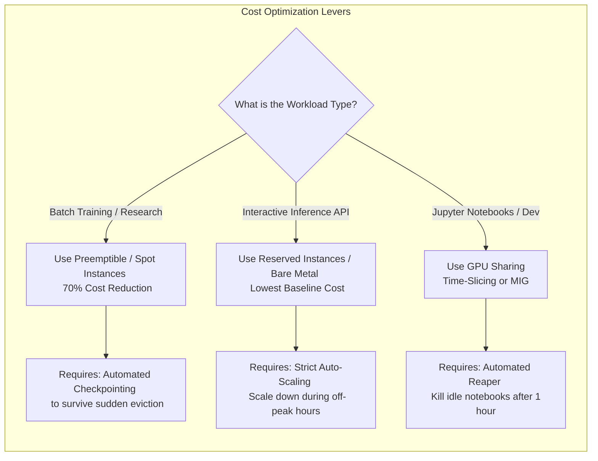

# Chapter 12 — Cost Optimization and Resource Efficiency

## Beginner's Primer: The Price of Idle Silicon

If you rent a moving truck for $100 a day, you don't park it in your driveway empty. You pack it as full as possible, drive it back and forth constantly, and return it exactly when you are done. 

An NVIDIA H100 GPU costs roughly $30,000 to buy, or $3.00 to $5.00 per hour to rent in the cloud. An 8-GPU node costs $250,000+. 

If a data scientist requests an 8-GPU node, runs a Jupyter notebook for 30 minutes, and goes home for the weekend leaving the server running, they have just burned $500 of company money for absolutely zero business value. 

In AI, **Cost Optimization (FinOps)** is not an accounting exercise; it is an engineering discipline. It requires Platform SREs to build automated systems that ruthlessly maximize the return on investment (ROI). 
- If an Inference API is receiving low traffic at night, the platform must autoscale the GPUs down. 
- If a Training job doesn't need to finish immediately, the platform should use "Spot Instances" (discounted, interruptible cloud GPUs) to save 70% on the bill.

This chapter details the engineering strategies to squeeze every penny of value out of your AI Factory.

## PART 1: UTILIZATION OPTIMIZATION

### 1.1 GPU Utilization Strategies

```yaml
MAXIMIZING GPU UTILIZATION (Target: 80%+)

Current State:
  Training cluster: 64 GPUs, 8 concurrent jobs
  Each job: 8 GPU, 24-hour duration
  Utilization: 8 jobs × 8 GPU × 24 hr / (64 GPU × 24 hr) = 100%... but wait
  
  Reality: Staggered scheduling, job startup overhead, checkpointing downtime
  Actual utilization: 64% (8 jobs × 50% average activity per job)

Optimization 1: Increase concurrency (overbook GPUs)
  Run 10 concurrent jobs on 64 GPUs (avg 6.4 GPU per job)
  Utilization: 80% target, peak 100%
  Cost: Same hardware, 25% more job throughput
  Trade-off: Slightly reduced per-job throughput (noisy neighbor effect)

Optimization 2: Job packing (bin-packing algorithm)
  Jobs requesting [8, 4, 4, 8, 4] GPU
  Naive packing: 8 GPU (job 1), then 8 GPU (jobs 2+3 wait), then 8 GPU (job 4+wait)
  Efficient packing: 8 GPU (job 1), 8 GPU (jobs 2+3), 8 GPU (job 4+5), 32 GPU unused
  
  With bin-packing: Jobs 1,2,3,4 fit in 24 GPU, utilization 75%
  Cost savings: Don't need 64 GPU cluster, 32 GPU sufficient (50% cost reduction!)

Optimization 3: Preemption (kill low-priority jobs for high-priority)
  Priority tiers:
    - P0 (production inference): Never killed
    - P1 (critical training): Can preempt P2
    - P2 (research): Can be preempted, restart from checkpoint
  
  Strategy: Submit P2 jobs with excess capacity (don't guarantee completion)
  Savings: P2 jobs get 30–40% discount on GPU cost; run more jobs with same hardware
  Trade-off: P2 jobs interrupted 1–2 times per day (acceptable for research)
```

### 1.2 Cost per Output Metric

```python
# Define cost per output (not per GPU)

# LLM Inference API Example
inference_qps = 2000  # Peak QPS
avg_tokens_per_response = 150
responses_per_day = 2000 * 86400 = 172.8M responses
tokens_per_day = 172.8M * 150 = 25.9B tokens

# Costs
hardware_cost_per_day = (1200 GPU × $30K) / 1095 days = $32.8K per day
electricity_cost_per_day = 420 kW × 24 hr × $0.12/kWh = $1.2K per day
operational_cost_per_day = (15 engineers × $150K/year) / 365 = $6.2K per day

total_cost_per_day = $40.2K
cost_per_token = $40.2K / (25.9B tokens) = $0.00000155 per token ($1.55e-6/token)

# Cost per million tokens = $0.00000155 × 1,000,000 = $1.55

# Business target: $0.001 per million tokens (to be profitable)
# Current cost: $1.55 per million tokens
# Gap: 1550x too expensive!

# Cost reduction strategies:
# 1. Larger regional deployment (500x GPU → unit costs drop 30%)
# 2. Quantization (INT8) reduces memory/power by 40%
# 3. Batch inference (offline) vs real-time (5x throughput improvement)
# Result: 1550x / (0.7 × 1.4 × 5) ≈ 316x → Still 316x too expensive
# Conclusion: Only profitable at massive scale (1000+ QPS sustained)
```

---

## PART 2: SPOT INSTANCES & CLOUD STRATEGY

### 2.1 Spot Instance Pricing

```yaml
CLOUD GPU PRICING (AWS EC2 p4d.24xlarge: 8×H100 per instance)

On-demand: $40/hour per instance
  = $40 / 8 GPU = $5/GPU/hour
  = $120/GPU/day
  = $36K/GPU/year (assumes ~300 operating days/year, not 365 — stated explicitly here;
    at 365 days/year this would be $43.8K/GPU/year instead)
  (over 3 years at the 300-day assumption: $108K = 3.6x hardware cost)

Spot price (interruptible):
  Average: $12/hour per instance (70% discount)
  = $12 / 8 GPU = $1.50/GPU/hour
  = $36/GPU/day
  = $10.8K/GPU/year (same 300-day/year assumption, kept consistent with on-demand above)
  
  Savings vs on-demand: $25.2K/GPU/year = 67% cost reduction!
  Trade-off: Job can be interrupted anytime (5% interruption rate = ~7 hours/month)

Strategy: Hybrid (on-demand + spot)
  Production inference: 50% on-demand (guaranteed SLA) + 50% spot (scale for traffic)
  Cost: $18K/GPU/year (average between on-demand $36K and spot $10.8K)
  SLA: 99.5% (one region down, traffic reroutes within 30 sec)
  
  Research training: 100% spot
  Cost: $10.8K/GPU/year
  SLA: Best effort (accept interruptions, resume from checkpoint)
```

### 2.2 Implementing Spot Instance Resilience

```python
# Handle spot interruption gracefully

import threading
import time

class SpotInstanceManager:
    def __init__(self):
        self.interruption_signal = False
        self.monitor_thread = threading.Thread(target=self._monitor_spot_termination)
        self.monitor_thread.daemon = True
        self.monitor_thread.start()
    
    def _monitor_spot_termination(self):
        """Poll AWS metadata service for termination notice (2 min warning)"""
        import requests
        
        while True:
            try:
                response = requests.get(
                    "http://169.254.169.254/latest/meta-data/spot/instance-action",
                    timeout=5
                )
                
                if response.status_code == 200:
                    # Spot instance terminating in 2 minutes
                    print("ALERT: Spot instance terminating!")
                    self.interruption_signal = True
                    # Trigger graceful shutdown
                    break
            
            except:
                pass
            
            time.sleep(5)  # Check every 5 sec
    
    def should_gracefully_shutdown(self):
        """Check if training should save checkpoint and exit"""
        return self.interruption_signal

# In training loop
spot_manager = SpotInstanceManager()

for step in range(num_steps):
    # Training
    loss.backward()
    optimizer.step()
    
    if step % 100 == 0:
        trainer.save_checkpoint(model, optimizer, step)
    
    # Check for spot interruption
    if spot_manager.should_gracefully_shutdown():
        print(f"Graceful shutdown at step {step}")
        trainer.save_checkpoint(model, optimizer, step)
        break

# Result: When spot instance receives termination notice, save checkpoint and exit
# Next spot instance resumes from saved checkpoint
# Total cost: 70% lower than on-demand, with minimal training loss
```

---

## PART 3: COST BREAKDOWN ANALYSIS

```yaml
TOTAL COST BREAKDOWN (3-YEAR DEPLOYMENT, 1200 GPUs)

CAPEX (Hardware + Installation):
  GPU: 1200 × $30K = $36M
  Networking (IB, Ethernet): $1.5M
  Storage (NVMe, NAS, SAN): $2M
  Cooling/Power infrastructure: $1.5M
  Servers/Chassis/Rails: $2M
  Installation labor: $1M
  Subtotal CAPEX: $44M

OPEX (Operations, annual):
  Electricity: $1.3M/year × 3 = $3.9M
  Personnel (30 FTE × $150K): $4.5M/year × 3 = $13.5M
  Maintenance/SLA: $2M/year × 3 = $6M
  Network (WAN, DDoS, CDN): $1M/year × 3 = $3M
  Software licenses: $0.5M/year × 3 = $1.5M
  Subtotal OPEX: $27.9M

TOTAL 3-YEAR TCO: $71.9M

Cost Metrics:
  Per-GPU-year: $71.9M / (1200 × 3) = $19,972/GPU/year
  Amortized hardware per-GPU: $36M / (1200 × 3) = $10K/GPU/year
  Amortized operations per-GPU: $27.9M / (1200 × 3) = $7.75K/GPU/year
  
  Cost per inference throughput:
    1200 GPU = 18,240 QPS capacity
    Annual cost: $23.97M per year
    Cost per 1K QPS: $1.31M/year
    
    Cost per training throughput:
    1200 GPU × 989 TFLOPS (BF16, H100 SXM5, from Chapter 2) = 1,186,800 TFLOPS = 1,186.8 PFLOPS peak
    Annual cost: $23.97M per year
    Cost per PETAFLOP-year: $23.97M / 1,186.8 PFLOPS ≈ $20.2K
```

## Architecture Summary

AI Cost Optimization requires aggressive workload Bin-Packing, leveraging Spot Instances for resilient training jobs, and constantly calculating "Cost per Token" or "Cost per Petaflop" rather than just looking at the monthly cloud bill. Operations teams must utilize advanced schedulers to pre-empt idle or low-priority workloads, ensuring the expensive silicon is constantly crunching high-value math.



---

## SUMMARY

Cost optimization strategies:
1. **Utilization:** Target 80%+ by overbooking, bin-packing, preemption.
2. **Spot instances:** 70% cost reduction at 5% interruption rate (acceptable for research).
3. **Cost per output:** Focus on throughput, not GPU count (inference: cost per token, training: cost per step).
4. **TCO analysis:** 3-year deployment reveals amortized costs; personnel is often larger than hardware CAPEX.

**Key insight:** At scale, operational cost (personnel, power, network) often exceeds hardware cost. Automation, monitoring, and efficient job scheduling have high ROI.

**In Chapter 13:** Reference architecture for production 100-GPU training cluster.
