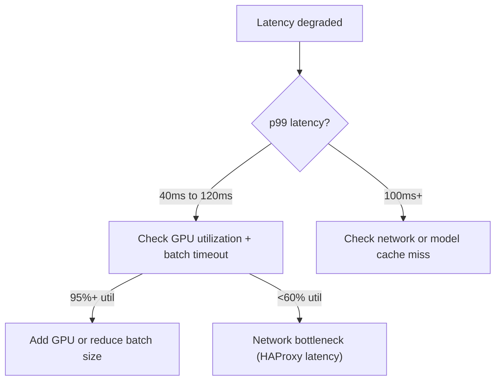
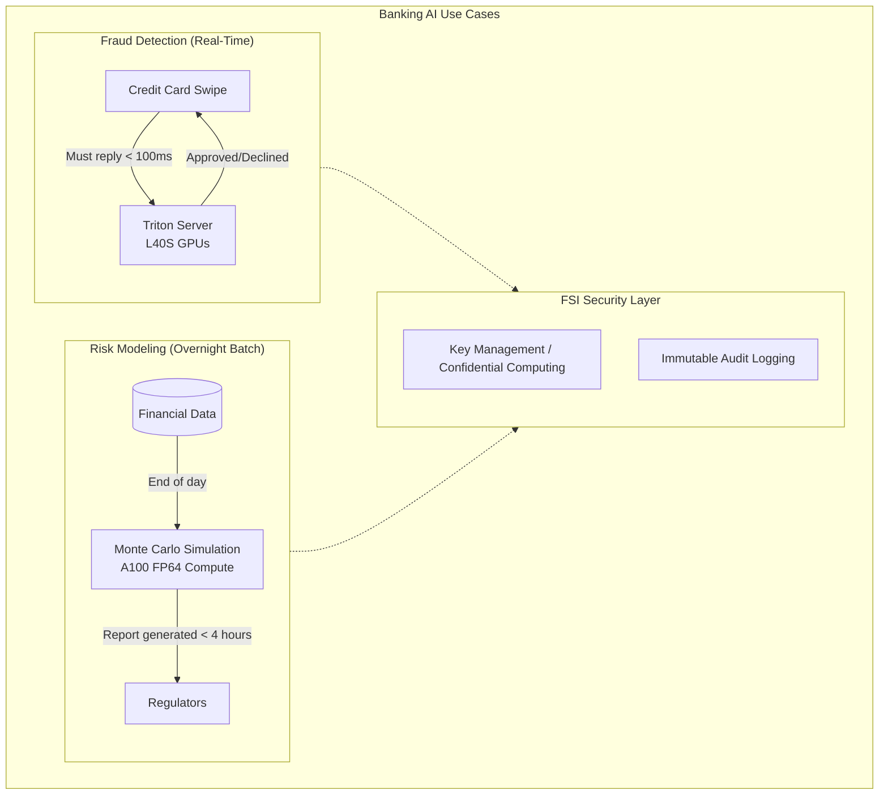

# Chapter 2: Banking and Financial Services

| Chapter metadata | Value |
|---|---|
| Volume | 22 — Customer Workshops |
| Difficulty | Intermediate |
| Estimated reading time | 45 minutes |
| Primary audience | Sales Engineers, Solutions Architects |
| Core question | What GPU infrastructure enables fraud detection, risk modeling, and trading at banking scale? |

## Overview

This chapter covers three critical use cases in financial services:

1. **Real-time fraud detection** at 5,000 TPS with &lt; 100ms latency
2. **Overnight risk modeling** (VaR calculations on $500B portfolios) using FP64 A100s
3. **Algorithmic trading signals** from LLMs with &lt; 50ms end-to-end latency

## Beginner's Primer: AI in Banking

When selling or designing AI for a bank, you must understand their two biggest fears: **Latency** and **Compliance**.

1. **Fraud Detection:** When you swipe your credit card at a grocery store, the transaction is sent to the bank. The bank has exactly 100 milliseconds to run an AI model to decide if the transaction is fraudulent before approving or declining it. If the AI takes 500ms, the card reader times out, the customer is embarrassed, and the bank loses the transaction fee. This requires extremely high-throughput, low-latency inference (Triton Inference Server).
2. **Risk Modeling:** At the end of every day, banks are legally required to calculate their "Value at Risk" (VaR)—essentially simulating millions of economic disasters to prove they won't go bankrupt tomorrow. This is pure math crunching. They do not care about latency; they care about finishing the job before the market opens the next morning. This requires massive FP64 (Double Precision) compute power.
3. **Compliance:** Banks cannot put customer financial data into the public cloud ChatGPT. They must run models on-premise, inside an air-gapped network, using strict encryption (Confidential Computing) and immutable audit logs. 

This chapter breaks down the exact hardware architectures needed to satisfy these paranoid, high-stakes requirements.

## Use Case 1: Fraud Detection (5,000 TPS)

### Requirements

- Throughput: 5,000 TPS sustained, 200M transactions/day
- Latency: p99 &lt; 100ms
- Model: XGBoost ensemble (5 models, 12GB total)
- Uptime: 99.9%
- Compliance: GDPR, audit trails, explainability

### Architecture: 2 Clusters of 4 L40S GPUs

**Why L40S (not H100):**
- Inference-only (training separate)
- 3-4× cheaper than H100
- Sufficient throughput (600-800 TPS per GPU)
- Lower power (250W vs 500W)

**Performance:**
- Per-GPU: ~750 TPS at 40ms p99 latency
- Total (8 GPUs): 6,000 TPS available (headroom for peaks)
- Cost-per-inference: $0.00000070 / transaction

### Troubleshooting Decision Tree

## Use Case 2: Risk Modeling (Daily VaR, 4 hours)

- Model: MOM6 + CAM (50,000 positions × 10,000 scenarios)
- Precision: FP64 (double precision for accuracy)
- Target: 4 hours (from 14 hours on CPU)
- Speedup: 3.5×

### Architecture: 8 A100s (FP64 optimized)

**Why A100 (not L40S):**
- A100 has ~19.5 TFLOPS FP64 (Tensor Core; ~9.7 TFLOPS on CUDA cores) vs L40S's ~1.4 TFLOPS FP64 (Ada Lovelace GPUs have crippled double-precision throughput, roughly 1/64 of FP32)
- ~14× faster for double-precision compute
- Single overnight run; cost-per-run matters

**Results:**
- Overnight VaR computed in 4 hours (before market open)
- Cost: $15/run vs $500K on supercomputer time
- 3-year TCO: $336K (vs $397K for CPU cluster)

## Use Case 3: Algorithmic Trading Signals

- Input: News articles (20/sec peak)
- Model: DistilBERT (66M params, FP16)
- Latency: &lt; 50ms from article publish to trade submit
- Model: Inference only, &lt; 50ms target critical

### Architecture: Single H100 + ONNX Runtime

**Performance:**
- GPU inference: 8-12ms per article
- Rules + risk checks: 5ms
- Network + exchange: 15ms
- End-to-end: ~31ms (within 50ms budget)

## Compliance Considerations

**SEC/FINRA Requirements:**
- Every trade must be explainable (not pure black-box LLMs)
- Full audit trail (model version, signal score, decision threshold)
- Reproducibility on same hardware/software

**Solution:** Hybrid approach
- GPU-accelerated model inference (fast)
- Rule-based thresholds on top (explainable)
- Comprehensive logging of all signals and decisions

## Interview Preparation

**Q: Why do banks need GPU for fraud detection but maybe not for risk modeling?**

A: Fraud detection is latency + throughput sensitive (5,000 TPS, &lt;100ms). Risk modeling is compute-intensive but latency-insensitive (14 hours fine, want 4 hours = speedup matters). GPU strength is exactly this: massive parallel throughput for fraud, and exceptional FP64 performance for risk.

**Q: Design a fraud detection system for 5,000 TPS with &lt;100ms latency.**

A: 8 L40S GPUs (2 clusters of 4) behind load balancers. Each L40S does 750 TPS independently. Total = 6,000 TPS available (headroom above the 5,000 TPS target). Batch size 256, inference time ~8ms, end-to-end with network ~40ms p99. Cost: $161K hardware + $80K/year ops.

## Architecture Summary

Financial Services AI architectures are defined by extreme latency constraints (Fraud Detection) and massive overnight math simulations (Risk Modeling). Because of strict data privacy and SEC compliance laws, these workloads heavily utilize On-Premise deployments, NVIDIA AI Enterprise (for SLA support), and Confidential Computing to ensure customer financial data is never exposed.

## Related Chapters

- **Prev:** [Chapter 1 — Consulting Methodology](./chapter-01-consulting-methodology-for-customer-engagement.md)
- **Next:** [Chapter 3 — Generative AI and LLMs](./chapter-03-generative-ai-and-large-language-models.md)
- **Lab:** [Lab 01 — Banking Use Case Workshop](./labs/lab-01-banking-use-case-workshop.md)
