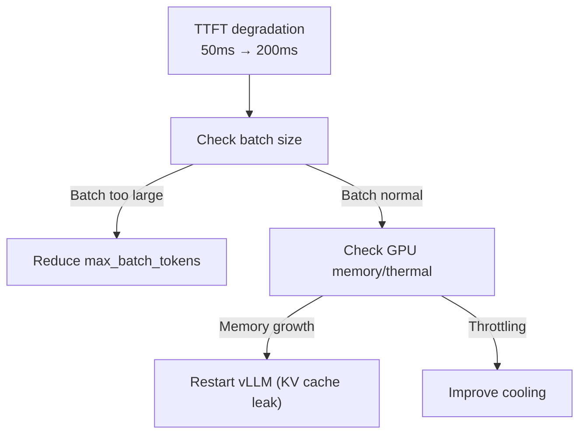
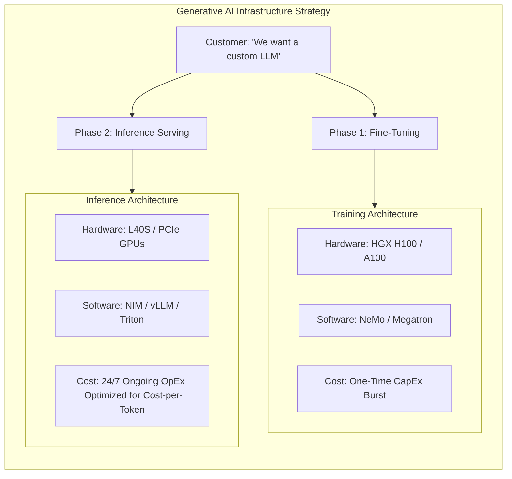

# Chapter 3: Generative AI and Large Language Models

| Chapter metadata | Value |
|---|---|
| Volume | 22 — Customer Workshops |
| Difficulty | Advanced |
| Estimated reading time | 50 minutes |
| Primary audience | ML Engineers, Product Architects |
| Core question | How do you cost-justify and architect GPU infrastructure for training and serving LLMs at scale? |

## Overview

LLM projects have two distinct cost phases:

1. **Training/Fine-tuning** (one-time): $100K - $10M+ depending on size
2. **Inference/Serving** (ongoing, per-user): recurring costs dominate

## Beginner's Primer: The LLM Business Model

When consulting with a customer about Generative AI, they will almost always say: *"We want to build our own ChatGPT."* 

As a Senior Architect, you must immediately split their request into two completely different business problems: **Training** and **Inference**.

1. **The Training Phase (CapEx):** To teach an open-source model (like LLaMA-3) to speak like a company's customer service agents, you have to "Fine-Tune" it. This requires a massive burst of compute power (e.g., 8x H100 GPUs) for a short period of time (e.g., 3 days). It is a one-time capital expenditure.
2. **The Inference Phase (OpEx):** Once the model is trained, you have to host it 24/7 so users can talk to it. This requires entirely different hardware (e.g., L40S or A10G GPUs) running continuously. This is an ongoing operational expense.

**The Golden Rule of LLM Consulting:** Customers obsess over the cost of Training, but Inference is what bankrupts them. If a customer has 1 million active users, the ongoing daily cost of hosting the model (Inference) will quickly exceed the one-time cost of Training it. A successful architect designs inference clusters to be as cheap and efficient as possible, utilizing techniques like Quantization and Continuous Batching to lower the "Cost Per Token."

## Use Case 1: Fine-Tuning Llama-2 7B

### Requirements
- Model: 7B parameters, LoRA fine-tuning
- Data: 50K conversations (~500M tokens)
- Method: LoRA (Low-Rank Adaptation) to reduce compute
- Timeline: 3-5 days acceptable

### Architecture: Single H100

**Memory footprint (LoRA optimized):**
- Model weights (INT8): 7 GB
- LoRA gradients: 0.8 GB
- Optimizer states: 1.6 GB
- Activations: 2 GB
- Total: 14 GB (fits on H100 with headroom)

**Training results:**
- Throughput: 450-500 tokens/sec sustained
- 3 epochs in 2.5-3 days
- Cost: ~$5K hardware amortized + $100 power

## Use Case 2: LLM Inference Cluster (1,000 concurrent users)

- Model: Llama-2 13B
- Throughput: 1,000 concurrent users × 500 tokens/session
- Latency: TTFT &lt; 2 sec, per-token &lt; 100ms
- Pricing: &lt; $0.0001 cost-per-output-token

### Architecture: 8 A100s + vLLM continuous batching

**Performance:**
- Throughput: 2,000-2,500 tokens/sec sustained
- TTFT: 45-50ms median (well within 2 sec SLA)
- Per-token: 38ms (p50), 92ms (p99)
- Cost per token: $0.00000174 (vs $2-3 on cloud)

**Cost model:**
- Hardware (3-year): $25K/year
- Power + cooling: $7.5K/year
- Staff: $75K/year
- Total: $110K/year for 63B tokens/year
- Cost-per-token: $0.00000174

**vs cloud:**
- AWS: $2.00 per 1M tokens ($2,000/year @ 1B tokens)
- GPU cluster: $1.74 per 1M tokens ($1,740/year @ 1B tokens)
- **Savings: ~1.15× cheaper (~13%) at this scale** — the GPU cluster only pulls further ahead as token volume grows beyond what a single $110K/year cluster can serve

## Troubleshooting Decision Tree

## Interview Preparation

**Q: Why do LLM serving costs often dominate training?**

A: Training is one-time ($100K-$1M), amortized over years. Inference is per-user, every token costs money, and volume compounds with the user base. 10,000 users × 100 tokens/day = 1M tokens/day. At $2/million tokens (cloud), that's $2/day ≈ $730/year for this user base — modest at 10,000 users, but it scales linearly and indefinitely. At 10M users the identical math gives ~$730K/year, which now rivals or exceeds a one-time training run. That's why LLM businesses obsess over inference efficiency as user counts grow.

## Architecture Summary

Generative AI projects must be architected in two distinct phases: a high-compute, short-duration Training/Fine-Tuning phase, and a high-availability, low-latency Inference Serving phase. Solutions Architects must guide customers away from using expensive H100s for inference if cheaper L40S or PCIe GPUs can satisfy the latency SLA, focusing relentlessly on reducing the ongoing "Cost Per Token" OpEx.

## Related Chapters

- **Prev:** [Chapter 2 — Banking](./chapter-02-banking-and-financial-services.md)
- **Next:** [Chapter 4 — Automotive](./chapter-04-automotive-and-autonomous-vehicles.md)
- **Lab:** [Lab 02 — LLM Serving Design](./labs/lab-02-llm-serving-design.md)
