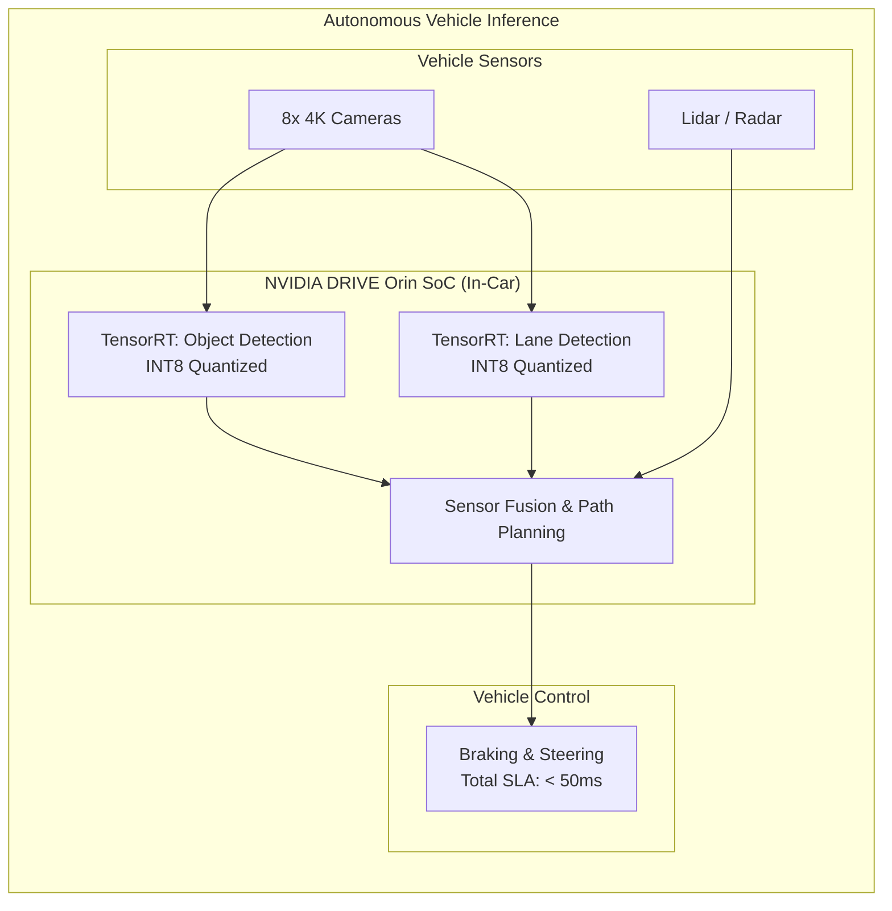

# Chapter 4: Automotive and Autonomous Vehicles

| Chapter metadata | Value |
|---|---|
| Volume | 22 — Customer Workshops |
| Difficulty | Advanced |
| Estimated reading time | 45 minutes |
| Primary audience | AV engineers, robotics teams |
| Core question | How do you deploy GPU-accelerated perception on edge for autonomous driving? |

## Overview

Real-time autonomous driving requires parallel inference:
- Object Detection (YOLO): 10ms
- Lane Detection (CNN): 5ms  
- Depth Estimation: 3ms
- **Total: 25ms (leaves 25ms buffer for safety)**

50ms latency budget from sensor to brake decision is the regulatory requirement.

## Beginner's Primer: AI on the Edge

So far in this masterclass, we have talked exclusively about massive Datacenter GPUs (like the H100) running in temperature-controlled server racks.

Automotive AI is the exact opposite. It is **Edge Computing**.
You have to put a supercomputer in the trunk of a car. 
- It cannot pull 6,000 Watts of power, or it will drain the car's battery in minutes.
- It cannot rely on a water-cooling loop; it has to survive freezing winters and scorching summers.
- It cannot rely on the Cloud. If the car drives into a tunnel and loses 5G internet, the AI still has to know how to hit the brakes. 

For this, NVIDIA builds specialized hardware like the **DRIVE Orin** system-on-a-chip (SoC). It is a tiny, highly efficient chip that processes video from 8 cameras simultaneously. 

Because the hardware is small and power-constrained, you cannot run massive, unoptimized AI models. Software Engineers must aggressively use **TensorRT** (Volume 12) to fuse layers and shrink the math down to INT8 precision. Every millisecond matters: if the AI takes 100 milliseconds to recognize a pedestrian instead of 20 milliseconds, the car travels an extra 10 feet before hitting the brakes.

## Use Case: Edge Deployment on Drive Orin

### Requirements
- Fleet: 50,000 vehicles, Level 3+ automation
- Sensor suite: 8 cameras + 5 radar + 1 lidar per vehicle, fused at 30 FPS
- Operating domain: highway + urban, day/night, all-weather
- Inference SLA: &lt;50ms (actually &lt;25ms preferred)
- Fail-safe: &lt;2 seconds to safe state

### Architecture: 2× Drive Orin per vehicle (primary + safety)

**Why two GPUs:**
- Safety-critical (SAE Level 3+ requires functional safety)
- Single GPU failure rate: ~0.1%/year
- Dual redundancy (independent failures): ~(0.1%)² ≈ 0.0001%/year
- Cost: $4,800 per vehicle (acceptable for $50K+ vehicle)

**Performance:**
- Primary GPU: YOLOv8 + LaneNet + FastDepth = 10-15ms
- Safety co-processor: Re-verify + consistency check = 15-20ms
- Total: 35ms end-to-end (within 50ms SLA) ✓

### Cost Analysis
- H/W: $4,800 per vehicle
- For 50,000 vehicles: $240M capex
- vs Cloud teleoperation: $27.5M capex but unreliable cellular
- **Full-edge is safer and faster, worth the cost for Level 3+ automation**

## Troubleshooting Scenarios

| Symptom | Cause | Resolution |
|---|---|---|
| Latency 20ms → 55ms during daytime | Camera exposure changes input size | Normalize input to 640×640 before GPU |
| GPU 100% on highway, crashes in city | Object density increased | Cap max detections in post-processing |
| Safety GPU disagrees 5% of frames | Model version mismatch (FP16 vs INT8) | Sync both to same quantized model |

## Architecture Summary

Automotive AI Architecture shifts the focus from Datacenter scale to severe Edge constraints. Solutions Architects must design systems that can process multi-camera computer vision models within a strict 50ms physical safety SLA, utilizing ultra-low-power NVIDIA DRIVE hardware and aggressive TensorRT INT8 quantization to achieve real-time inference without internet connectivity.

## Related Chapters

- **Prev:** [Chapter 3 — LLMs](./chapter-03-generative-ai-and-large-language-models.md)
- **Next:** [Chapter 5 — Pharmaceuticals](./chapter-05-pharmaceuticals-and-drug-discovery.md)
- **Lab:** [Lab 03 — Edge Deployment](./labs/lab-03-edge-deployment.md)
