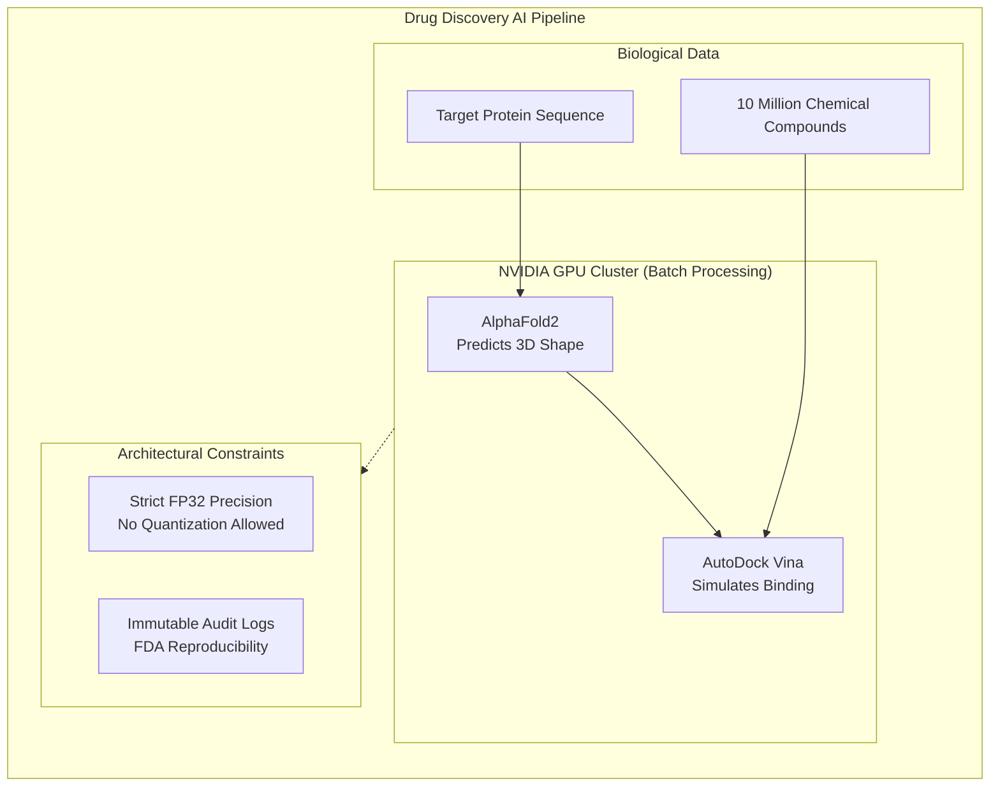

# Chapter 5: Pharmaceuticals and Drug Discovery

| Chapter metadata | Value |
|---|---|
| Volume | 22 — Customer Workshops |
| Difficulty | Intermediate |
| Estimated reading time | 40 minutes |

## Overview

GPU-accelerated drug discovery compresses 10-15 year development cycles by 5-10 years through:
- High-throughput molecular docking (10M molecules in 3.5 hours)
- Protein folding prediction (50K proteins in 2 weeks)
- Molecular dynamics simulations

## Beginner's Primer: AI for Biology

Most people think of AI as Chatbots (LLMs) or Self-Driving cars (Computer Vision). 
But one of the most profitable uses of NVIDIA GPUs is in Healthcare and Pharmaceuticals.

Developing a new drug usually takes 10 years and $1 Billion. Scientists have to physically mix chemicals in a lab to see if they bind to a disease protein (like a key fitting into a lock).
Instead of doing this physically, Pharmaceutical companies use AI to do it virtually. 
- **Virtual Screening:** A GPU can simulate 10 million different chemical shapes (keys) trying to fit into a disease protein (lock) in a few hours.
- **Protein Folding:** AI models like AlphaFold can predict the 3D shape of a protein just by reading its DNA sequence.

**The Architectural Difference:**
LLMs (Chatbots) are usually fine with lowering math precision (FP8 or INT4) to save VRAM and go faster, because if a chatbot uses a slightly wrong word, no one cares.
In Drug Discovery, the AI is calculating the physical collision of atoms. If you lower the precision, the atoms overlap incorrectly, and the simulation becomes useless garbage. Therefore, Healthcare clusters must use highly accurate FP32 math, changing how we calculate the Roofline Model (Volume 17) and how we choose GPUs.

## Use Case 1: Virtual Screening (10M molecules)

### Requirements
- Molecules: 10 million
- Algorithm: AutoDock Vina
- Current time: 232 days (CPU)
- Target: 2 weeks via GPU acceleration
- Model: FP32 (accuracy critical for collision detection)

### Architecture: 8 A100s

**Performance:**
- CPU baseline: ~0.5 molecules/sec effective throughput (unaccelerated single-node reference, consistent with the 232-day current time)
- GPU (8 A100s): 800 molecules/sec (~1,600× faster)
- Total: 10M molecules in 3.5 hours ✓
- Cost: $320K hw vs $500K+ for CPU cluster

**Cost vs cloud:**
- Cloud docking: $50K per 1M molecules
- 10M: $500K
- On-prem: 8 A100s = $320K hardware + $1.2K power
- **3-year TCO: $400K (vs $1.5M cloud)**

## Use Case 2: Protein Folding (AlphaFold2)

- Proteins: 50,000
- Model: AlphaFold2 (5 min/protein)
- Goal: Complete in 2-3 weeks (acceptable for research)
- Precision: FP32 (numerical stability required)

### Architecture: 4 H100s

**Why H100 (not A100):**
- AlphaFold2 on H100: 5 min/protein
- AlphaFold2 on A100: 10 min/protein (2× slower)
- 4 H100s run 50K proteins in ~25 days (within 2-3 week goal)

## FDA Compliance

**Requirement: Full reproducibility**

Every simulation logged with:
- Model version and checksum
- Hardware (GPU model, CUDA/cuDNN versions)
- Random seed
- Full audit trail

## Architecture Summary

Healthcare and Drug Discovery architectures are defined by extreme demands for mathematical accuracy (FP32 Compute) and strict regulatory reproducibility. Solutions Architects must prioritize powerful, high-memory GPUs (H100) running in batch-processing modes, ensuring that the entire software stack is immutably version-controlled to pass FDA audits.

## Related Chapters

- **Prev:** [Chapter 4 — Automotive](./chapter-04-automotive-and-autonomous-vehicles.md)
- **Next:** [Chapter 6 — Telecommunications](./chapter-06-telecommunications.md)
