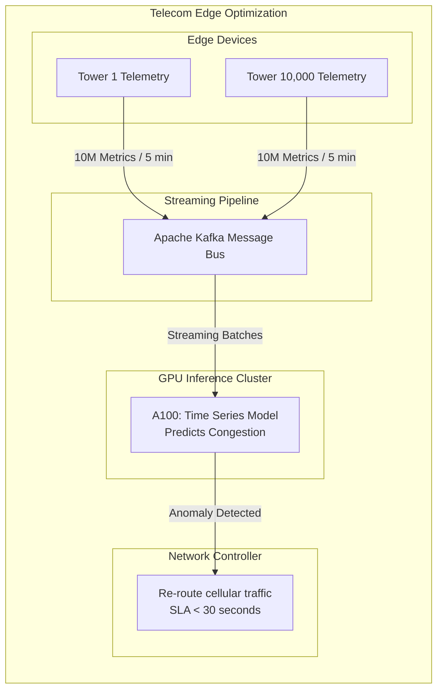

# Chapter 6: Telecommunications

| Chapter metadata | Value |
|---|---|
| Volume | 22 — Customer Workshops |
| Difficulty | Intermediate |
| Estimated reading time | 35 minutes |

## Overview

Telecom networks manage 10,000-100,000 network elements. ML operates at:
1. Real-time anomaly detection (per-device, &lt;5 sec latency)
2. Optimization modeling (10,000 devices, updated every 5 minutes)
3. Capacity planning (3-6 month forecast, weekly)

## Beginner's Primer: The Edge Cloud

Telecommunications (Telco) companies like AT&T or Verizon operate massive, physically distributed networks. They have thousands of cell towers scattered across the country.

In a traditional AI architecture, all the data from those cell towers would be sent back to a central datacenter in Virginia for processing. But in Telco, sending terabytes of telemetry data across the country every 5 seconds is impossible due to network congestion and latency.

The Telco solution is **Edge Computing with AI**.
Instead of sending the data to the AI, they bring the AI to the data. Small, efficient GPUs (like the NVIDIA L4 or T4) are deployed directly into the small concrete huts at the base of the cell towers (the "Edge"). 

These Edge GPUs run real-time inference (using frameworks like Apache Kafka to stream the data directly into TensorRT engines) to predict network congestion or detect failing antennas instantly. This drastically reduces wide-area network traffic and allows the Telco to re-route cellular traffic before customers even realize there is a problem. 

## Use Case: Network Optimization (10,000 cell towers)

### Requirements
- Network elements: 10,000
- KPIs per element: 1,000 metrics
- Update frequency: Every 5 minutes
- Latency SLA: &lt;30 seconds per optimization cycle
- Uptime: 99.99%

### Architecture: 8 A100s + Kafka streaming

**Data volume:**
- 10K cells × 1K KPIs × 1 sample/5min = 10M data points
- Per-sample inference: ~10ms on GPU
- Total: 100K seconds compute needed
- Budget: 5 minutes = 300 seconds
- Solution: Batch 1,000 cells in parallel = 100 sec (within budget) ✓

**Pipeline:**
- Kafka ingests 10M messages per 5 minutes
- 8 A100s batch 1,000 cells in parallel
- LSTM predicts congestion 5-10 min ahead
- Actions sent to network controller

**Availability:**
- Primary: 8 A100s (active inference)
- Standby: 2 A100s (hot standby, failover &lt;30 sec)
- Degraded mode: 2 A100s = 30% throughput (acceptable for 30 sec)

## Cost Justification

**Annual benefit: $2M+ (avoided congestion)**
**GPU cluster cost: $50K/year**
**ROI: 40×**

## Architecture Summary

Telco AI architectures are defined by extreme data velocity and geographic distribution. Instead of training massive LLMs in a single datacenter, Telecom companies deploy real-time streaming architectures where Apache Kafka feeds millions of telemetry metrics directly into localized inference clusters to predict and prevent network congestion within 5-minute SLAs.

## Related Chapters

- **Prev:** [Chapter 5 — Pharmaceuticals](./chapter-05-pharmaceuticals-and-drug-discovery.md)
- **Next:** [Chapter 7 — Healthcare](./chapter-07-healthcare-and-medical-imaging.md)
