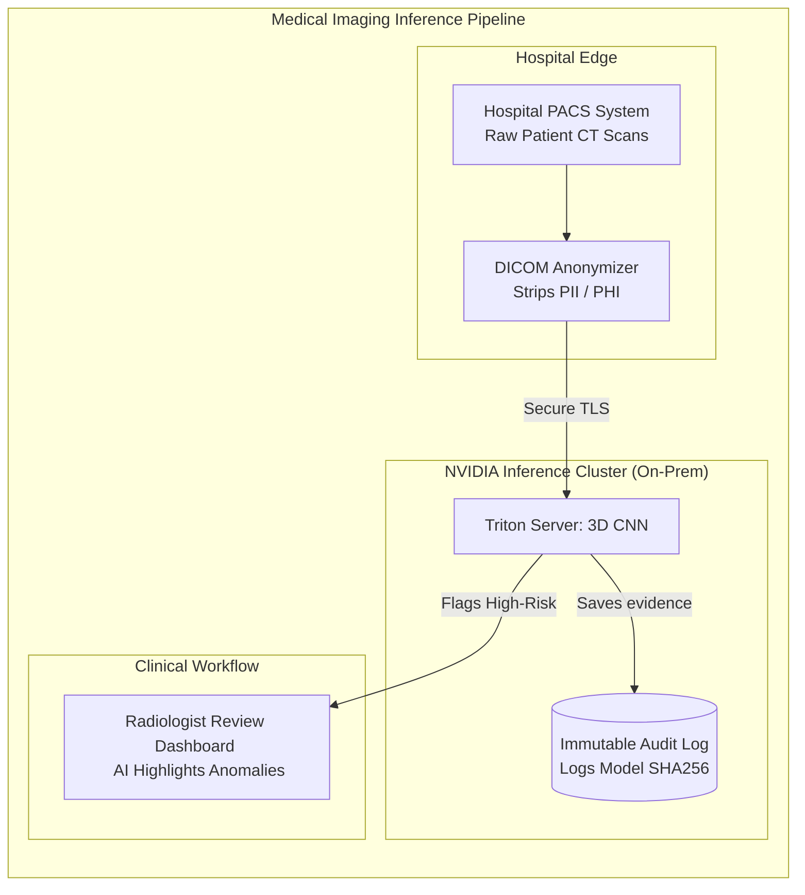

# Chapter 7: Healthcare and Medical Imaging

| Chapter metadata | Value |
|---|---|
| Volume | 22 — Customer Workshops |
| Difficulty | Intermediate |
| Estimated reading time | 40 minutes |

## Overview

GPU-accelerated medical imaging analysis reduces radiologist review time 80% while maintaining clinical accuracy.

## Beginner's Primer: AI as a Medical Device

When selling AI into a hospital system, you are no longer just selling software; you are selling a "Medical Device." 

If a hospital uses AI to scan a chest X-Ray for cancer, the architecture is bound by two extreme constraints:
1. **HIPAA (Data Privacy):** The hospital cannot simply upload patient X-Rays to an S3 bucket in the public cloud. The architecture must feature zero-trust data handling, edge-redaction of PII (removing patient names from the metadata of the image), and Confidential Computing (Volume 18) to ensure encryption during math execution.
2. **FDA Regulations (Auditability):** If the AI flags a patient for cancer, and the patient sues the hospital a year later, the hospital must be able to mathematically prove exactly what AI model made that decision. 

A Senior Solutions Architect does not just design the GPU cluster; they design the **Model Lineage** pipeline. Every time an inference runs, the system must log the SHA256 cryptographic hash of the exact model weights used, the exact version of Triton Inference Server, and the exact timestamp. This ensures that the AI's diagnosis is completely reproducible during a legal audit.

## Use Case: CT Lung Cancer Screening (50,000 patients/year)

### Requirements
- Studies/year: 50,000
- Slices per study: 300 (3D CT)
- Radiologist time: 25 min/study (current)
- AI goal: Flag high-risk cases (2 min/study)
- Time saved: 50,000 × 23 min = 19,167 hours/year = $1.9M value

### Architecture: 4 A100s + HIPAA-compliant gateway

**Performance:**
- Model: 3D CNN (ResNet50-based, 24M params)
- Inference time: 8 seconds per study (A100)
- Throughput: 137 studies/day = 50K/year ✓

**Compliance:**
- HIPAA: AES-256 encryption at rest + in transit
- Audit trail: Every inference logged with timestamp + user
- Model version: SHA256 checksum in audit log
- Data retention: 6-year audit logs

### Cost Model
- Hardware: $240K (2-year amortized = $80K/year)
- Power/cooling: $7.6K/year
- Staff: $37.5K/year (0.25 engineer)
- FDA compliance: $20K/year
- **Total: $144.6K/year**

- Radiologist time saved: $1.9M/year (19,167 hours/year × ~$100/hour blended rate, from Requirements)
- **Net benefit: ~$1.76M/year, payback in under 2 months**

## Architecture Summary

Healthcare AI architectures justify their GPU hardware costs by drastically reducing highly-paid specialist review time (e.g., Radiologists). However, these architectures must integrate seamlessly with legacy hospital systems (PACS) and enforce rigid HIPAA data privacy, requiring edge-anonymization of DICOM images before the data ever touches the GPU inference cluster.

## Related Chapters

- **Prev:** [Chapter 6 — Telecom](./chapter-06-telecommunications.md)
- **Next:** [Chapter 8 — Manufacturing](./chapter-08-manufacturing-and-predictive-maintenance.md)
- **Lab:** [Lab 04 — Medical Imaging Pipeline](./labs/lab-04-medical-imaging-pipeline.md)
