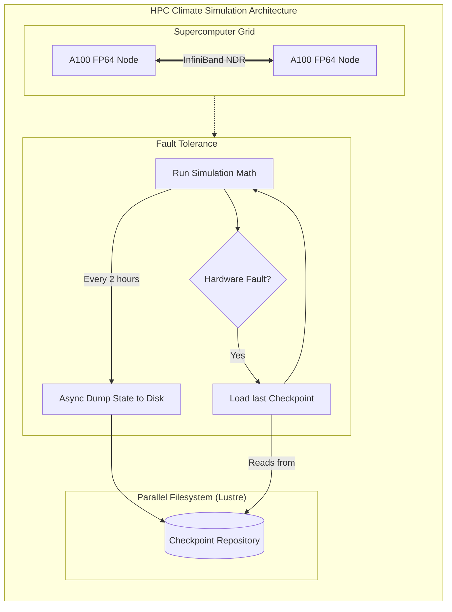

# Chapter 9: Scientific Research and Simulation

| Chapter metadata | Value |
|---|---|
| Volume | 22 — Customer Workshops |
| Difficulty | Advanced |
| Estimated reading time | 40 minutes |

## Overview

Scientific simulations differ from ML workloads:
- Single jobs run for days/weeks (not seconds)
- Data volume: terabytes per simulation
- Checkpointing is critical (can't lose 3 days of compute)
- Reproducibility is paramount (bit-identical results)

## Beginner's Primer: HPC vs AI

Historically, the people buying thousands of GPUs were not AI startups; they were National Laboratories (like Oak Ridge or Lawrence Livermore) doing **HPC (High-Performance Computing)**.

HPC involves using math to simulate the real world: weather forecasting, nuclear explosions, black holes, and aerodynamics. 

An HPC cluster looks exactly like an AI Training cluster (e.g., thousands of GPUs connected via InfiniBand), but the software and the math are entirely different. 
- **AI** is mostly multiplying massive blocks of numbers (Matrix Multiplication using Tensor Cores). 
- **HPC** is often solving complex Differential Equations using traditional CUDA cores. 
- **Precision:** AI can use sloppy math (FP8 or FP16) to go faster, because a neural network can "guess" the missing details. HPC requires absolute perfection (FP64 Double Precision). If you use sloppy math to simulate a hurricane, the hurricane in the simulation will veer off course and hit the wrong city. 

Because HPC jobs run continuously for months to simulate 100 years of weather, **Checkpointing** (Volume 15) is the single most important architectural requirement. If a GPU dies on day 45, and you haven't checkpointed the weather simulation, you just wasted 45 days of a supercomputer's time. 

## Use Case: Climate Modeling (100-year forecast)

### Requirements
- Resolution: 0.1° × 0.1° grid (~100M grid points)
- Duration: 100-year forecast
- Models: MOM6 ocean + CAM atmosphere
- Ensemble size: 10 runs (uncertainty quantification)
- Total compute: 12,000 petaflop-seconds
- Timeline: 6 months
- Budget: $500K capital

### Architecture: 32 A100s + NVMe burst buffer

**Why 32 A100s:**
- 1.6 petaflops sustained (good for 6-month timeline)
- NVMe burst buffer (500TB) for 50GB checkpoints
- Checkpoint every 10 steps (every 2.4 hours)
- Archive asynchronously to cold storage

**Compute breakdown:**
- 10 runs × 1,200 steps × 1 petaflop-sec = 12,000 petaflop-seconds total (1,200 petaflop-seconds per run)
- 32 A100s = 1.6 petaflops sustained → 1,200 ÷ 1.6 ≈ 750 sec (~12.5 min) of raw compute per run; the 6-month wall-clock timeline is dominated by I/O, checkpointing (every 2.4 hours), and ensemble orchestration overhead, not by raw SM throughput
- Pipelined: 3 runs in parallel, complete within 6 months (I/O- and data-movement-bound, not compute-bound) ✓

**Cost model:**
- Hardware (3-year): $560K/year
- Power: $438K/year
- Staff: $100K/year
- **3-year TCO: $1.25M/year**

**vs Cloud:**
- Supercomputer time: $5K per run × 10 = $50K (one-time)
- But limited availability; must batch annually
- Long-term: own infrastructure 10× cheaper at 100+ simulations/year

## Failure Recovery

**Checkpoint strategy:**
- Write checkpoint every 10 steps (every 2.4 hours)
- If crash mid-checkpoint: lose &lt;2.4 hours compute
- If entire cluster fails: restart from previous successful checkpoint
- Expected failures: ~1 per 2-month job

## Architecture Summary

HPC (High-Performance Computing) environments prioritize absolute mathematical precision (FP64) and long-term fault tolerance. Because scientific simulations (like climate modeling) run continuously for months without pausing, the architecture must support massive, high-speed, asynchronous checkpointing to distributed parallel filesystems (Lustre) to ensure that inevitable hardware failures do not destroy weeks of computational progress.

## Related Chapters

This concludes the 9-chapter survey of GPU deployment across industries.
