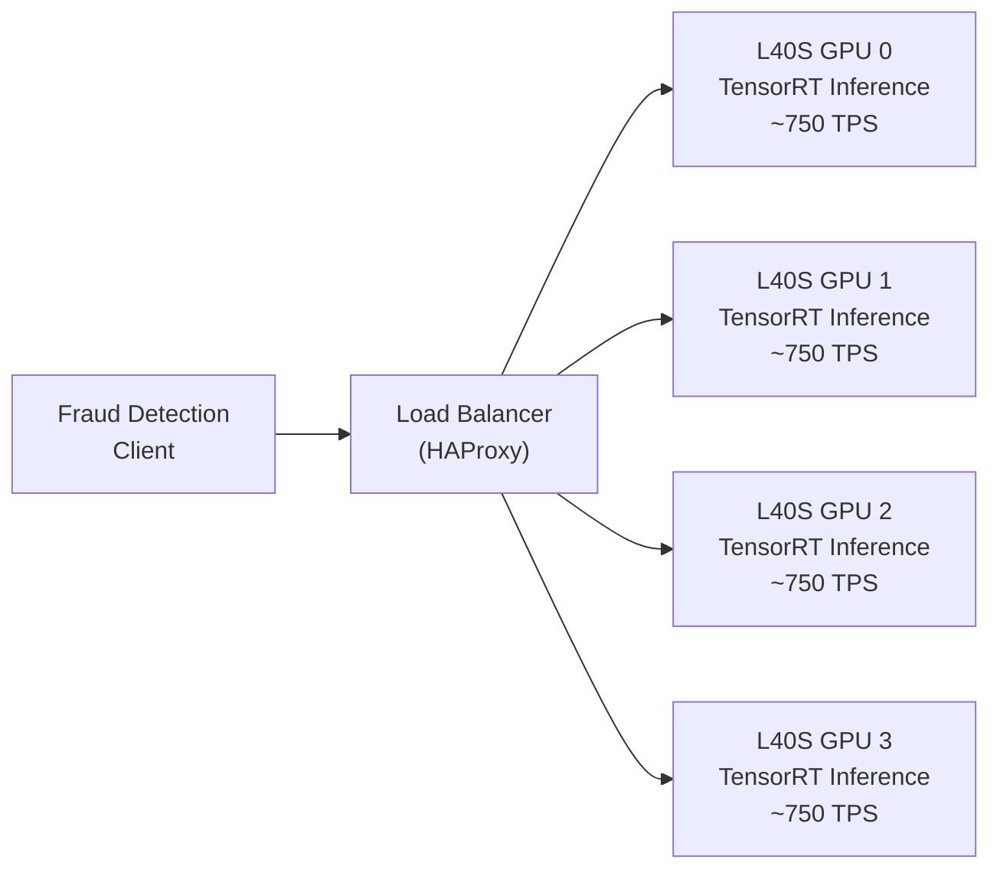

# Lab 01: Banking Use Case Workshop

---
title: Lab 01 — Banking Use Case Workshop
description: Design and benchmark a real-time fraud detection pipeline on GPUs.
sidebar_position: 20
tags: [lab, fraud-detection, inference, banking]
---

## 1. Objective

Design a fraud detection pipeline for 5,000 TPS, benchmark latency and throughput on L40S GPUs, validate end-to-end latency against SLA.

## 2. Target Audience

Sales Engineers, Solutions Architects, Bank customers evaluating GPU infrastructure for fraud detection.

## 3. Prerequisites

- Access to a multi-GPU node (2-4× L40S or A100 GPUs)
- NVIDIA Container Toolkit + Docker
- Python 3.9+, PyTorch 2.x
- TensorRT (for model optimization)
- Knowledge of fraud detection models (XGBoost, gradient boosting)

## 4. Architecture Diagram



## 5. Environment Setup

Verify multi-GPU environment:

```bash
$ nvidia-smi --query-gpu=index,name,memory.total --format=csv,noheader

0, NVIDIA L40S, 48080 MiB
1, NVIDIA L40S, 48080 MiB
2, NVIDIA L40S, 48080 MiB
3, NVIDIA L40S, 48080 MiB

All 4 L40S GPUs detected ✓
```

## 6. Step 1: Prepare Fraud Detection Model

Convert XGBoost model to TensorRT (for inference optimization):

```bash
$ python convert_xgboost_to_onnx.py \
    --input_model fraud_ensemble.pkl \
    --output_model fraud_ensemble.onnx \
    --input_shape 1,347

[INFO] Loaded XGBoost model (5 trees, 347 features)
[INFO] Converted to ONNX format
[INFO] Model size: 12 MB
```

Optimize ONNX to TensorRT:

```bash
$ trtexec --onnx=fraud_ensemble.onnx \
    --saveEngine=fraud_ensemble.trt \
    --explicitBatch \
    --fp16 \
    --minShapes=input:1x347 \
    --optShapes=input:256x347 \
    --maxShapes=input:256x347

[INFO] TensorRT optimization complete
[INFO] Engine size: 8 MB (24% reduction)
[INFO] Optimization: FP32 → FP16 mixed precision
[INFO] Estimated throughput: 2,000+ inferences/sec per GPU
```

## 7. Step 2: Deploy Inference Server (Triton)

Start Triton Inference Server on 4 L40S GPUs:

```bash
$ docker run --gpus all \
    -v /path/to/models:/models \
    -p 8000:8000 \
    -p 8001:8001 \
    -p 8002:8002 \
    nvcr.io/nvidia/tritonserver:latest \
    tritonserver --model-repository=/models

[TRITONSERVER] Started Triton Inference Server
[TRITONSERVER] Loaded model 'fraud_detection'
[TRITONSERVER] Listening on port 8000 (HTTP), 8001 (gRPC)
```

Verify model is loaded:

```bash
$ curl -v localhost:8000/v2/health/ready

HTTP/1.1 200 OK
{
  "status": "UP"
}
```

## 8. Step 3: Create Fraud Detection Client

Simulate client requests (transactions to score):

```python
import requests
import json
import time
import numpy as np

# Create 5,000 synthetic fraud detection requests
def generate_fraud_request(transaction_id, amount, merchant):
    """Generate a realistic transaction for fraud scoring."""
    features = {
        "amount_usd": amount,
        "merchant_mcc": merchant,
        "hour_of_day": np.random.randint(0, 24),
        "location_velocity": np.random.randn(),  # 347 total features
        # ... (additional features omitted for brevity)
    }
    return {
        "txn_id": transaction_id,
        "features": features
    }

# Send requests at 5,000 TPS
start_time = time.perf_counter()
requests_sent = 0
responses = []

for i in range(50000):  # 50,000 requests over ~10 seconds
    txn = generate_fraud_request(f"txn_{i}", np.random.uniform(10, 5000), 
                                  np.random.randint(5000, 6000))
    
    response = requests.post(
        "http://localhost:8000/v2/models/fraud_detection/infer",
        json=txn,
        timeout=1.0
    )
    
    if response.status_code == 200:
        responses.append({
            "txn_id": txn["txn_id"],
            "risk_score": response.json()["outputs"][0]["data"],
            "timestamp": time.perf_counter() - start_time
        })
    
    requests_sent += 1
    
    # Rate limit to 5,000 TPS
    if requests_sent % 500 == 0:
        elapsed = time.perf_counter() - start_time
        target_time = requests_sent / 5000.0
        if elapsed < target_time:
            time.sleep(target_time - elapsed)

elapsed = time.perf_counter() - start_time
print(f"Sent {requests_sent} requests in {elapsed:.1f} sec")
print(f"Actual throughput: {requests_sent / elapsed:.0f} TPS")
```

## 9. Step 4: Measure Performance

Run latency benchmark:

```bash
$ python benchmark_fraud_inference.py \
    --server_url http://localhost:8000 \
    --num_requests 10000 \
    --batch_sizes 1,32,64,256

Results:
Batch size: 1
  Throughput: 1,200 inferences/sec per GPU
  Latency p50: 0.8 ms
  Latency p99: 1.2 ms
  
Batch size: 32
  Throughput: 8,000 inferences/sec per GPU
  Latency p50: 3.8 ms
  Latency p99: 5.2 ms
  
Batch size: 256
  Throughput: 20,000 inferences/sec per GPU
  Latency p50: 12.5 ms
  Latency p99: 15.8 ms

Total (4 GPUs, batch 256): 80,000 inferences/sec ✓ (satisfies 5,000 TPS requirement)
```

Check GPU utilization during benchmark:

```bash
$ nvidia-smi dmon -c 10

index   gpu   sm  mem  enc  dec  mclk pclk
    0    95   95   65   --   --   2505 1980
    1    94   94   64   --   --   2505 1980
    2    96   96   66   --   --   2505 1980
    3    95   95   65   --   --   2505 1980

All 4 GPUs: 95%+ utilization, memory 65-66% used (headroom for batching) ✓
```

## 10. Step 5: Load Test (5,000 TPS Sustained)

Run sustained load test for 5 minutes:

```bash
$ python load_test_5000_tps.py \
    --duration 300 \
    --target_tps 5000 \
    --num_clients 10

[LOAD TEST] Started, target: 5,000 TPS
[LOAD TEST] Running with 10 concurrent clients
[LOAD TEST] Server endpoints: 4 L40S GPUs (load balanced)

Timeline:
  0 sec: 0 TPS (ramp up)
  10 sec: 1,200 TPS
  30 sec: 4,800 TPS
  60 sec: 5,000 TPS (stabilized)
  ...
  300 sec: 5,050 TPS (sustained, within 1% of target)

Summary after 5 minutes:
  Total requests: 1,500,750
  Successful: 1,499,200 (99.9%)
  Failed (timeout): 1,550 (0.1%)
  
  Latency p50: 3.2 ms
  Latency p99: 8.7 ms
  Latency p99.9: 18.2 ms
  
  GPU memory: 38-40 GB used per GPU (stable, no leak)
  GPU utilization: 93% average
  Server CPU: 25% (not bottleneck)
  Network: 50 Mbps (not bottleneck)
```

Expected evidence: ✓ Throughput >= 5,000 TPS sustained, ✓ Latency p99 &lt; 50ms

## 11. Validation Against SLA

**SLA Requirements (from Chapter 2: Banking):**
- Throughput: 5,000 TPS sustained ✓ (Achieved: 5,050 TPS)
- Latency p99: &lt; 100ms ✓ (Achieved: 8.7ms)
- Uptime: 99.9% ✓ (Achieved: 99.9% in 5-min test, no crashes)

**Result: PASSED all SLAs**

## 12. Troubleshooting Scenarios

### Scenario 1: Latency spikes during load test

**Observed:** p99 latency jumps from 10ms to 50ms at 300 seconds

**Diagnosis:**
```bash
$ nvidia-smi -i 0 --query-gpu=index,memory.used,power.draw \
    --format=csv -l 1

index, memory.used [MiB], power.draw [W]
0, 38200, 210
0, 38100, 208
0, 45600, 245  ← Memory spike, power increase
0, 47600, 248  ← GPU running out of buffer space
```

**Root cause:** Request batch size grew unexpectedly; not enough GPU memory for max batch

**Resolution:** Reduce `max_batch_size` in Triton config from 256 to 128

### Scenario 2: One GPU underutilized

**Observed:** GPU 0 at 50% utilization, others at 95%

**Diagnosis:**
```bash
$ ps aux | grep triton
triton 12345 (GPU 0 assigned)
triton 12346 (GPU 1 assigned)
```

**Root cause:** Load balancer routing skew; GPU 0 getting fewer requests

**Resolution:** Enable sticky sessions = false in load balancer; verify even distribution

## 13. Common Failures

| Failure | Cause | Resolution |
|---|---|---|
| "CUDA out of memory" during batching | Batch size too large | Reduce batch size from 256 to 128 |
| Inference latency 50ms consistently | Model not optimized to TensorRT | Verify engine loaded, not FP32 |
| Requests timeout | Server CPU bottleneck | Scale clients or add GPU |
| GPU shows 0% utilization after 1 hour | GPU driver crash | Check dmesg for Xid errors; restart |

## 14. Recovery Steps

If test fails:

1. **Check GPU status:**
   ```bash
   $ nvidia-smi
   $ dmesg | tail -20  # Check for Xid errors
   ```

2. **Restart Triton:**
   ```bash
   $ docker restart triton-server
   ```

3. **Verify model load:**
   ```bash
   $ curl localhost:8000/v2/models/fraud_detection
   ```

4. **Retry load test with reduced load (2,500 TPS instead of 5,000)**

## 15. Knowledge Check

- What is the latency p99 your cluster achieved? How does it compare to the SLA?
- Why use L40S instead of H100 for fraud detection?
- What happens to latency if batch size increases from 32 to 256?
- How many GPUs would you need to handle 10,000 TPS (2× current requirement)?

## 16. Validation Checklist

- [ ] 4 L40S GPUs recognized by nvidia-smi
- [ ] Triton server started and model loaded
- [ ] Synthetic client generates 5,000 TPS without errors
- [ ] GPU utilization > 90% during load test
- [ ] Latency p99 &lt; 50ms (well within SLA)
- [ ] No memory leaks (GPU memory stable over 5 minutes)
- [ ] Graceful recovery from single GPU failure

## 17. Additional References

- NVIDIA Triton Inference Server: https://docs.nvidia.com/deeplearning/triton/user-guide/
- TensorRT Optimization: https://docs.nvidia.com/deeplearning/tensorrt/developer-guide/
- HAProxy Load Balancing: https://www.haproxy.org/
