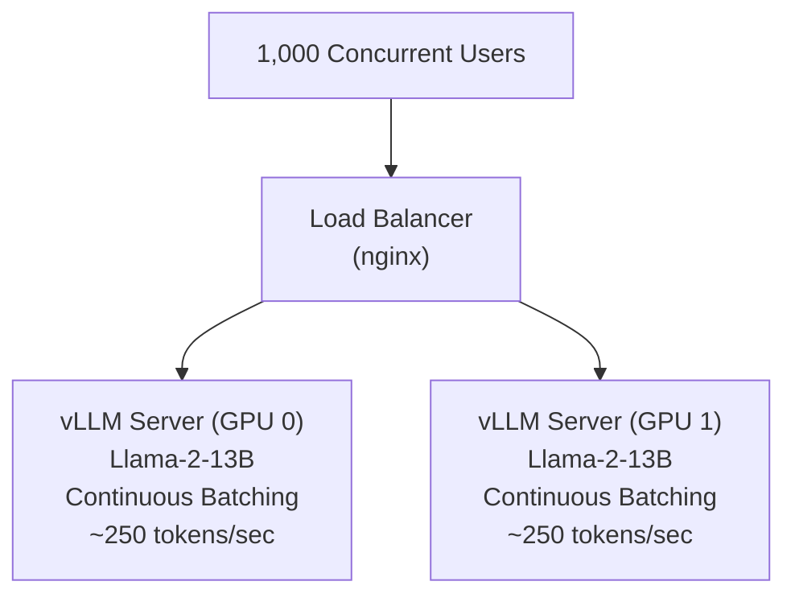

# Lab 02: LLM Serving Design

---
title: Lab 02 — LLM Serving Design
description: Design and benchmark a multi-tenant LLM inference cluster using vLLM.
sidebar_position: 21
tags: [lab, llm, inference, serving]
---

## 1. Objective

Build a Llama-2 13B inference server with continuous batching, measure time-to-first-token (TTFT) and throughput, validate multi-user SLA.

## 2. Target Audience

ML Engineers, Product Architects, LLM serving platform builders.

## 3. Prerequisites

- 2-4× A100 GPUs with 80GB VRAM
- vLLM framework installed (`pip install vllm`)
- CUDA 11.8+, Python 3.10+
- Apache Bench or custom load testing client

## 4. Architecture Diagram



## 5. Environment Setup

Verify A100 GPUs and install dependencies:

```bash
$ nvidia-smi --query-gpu=index,name --format=csv,noheader

0, NVIDIA A100-SXM4-80GB
1, NVIDIA A100-SXM4-80GB

$ pip install vllm==0.2.7 torch==2.0.1
[SUCCESS] vLLM and dependencies installed
```

## 6. Step 1: Download and Convert Llama-2 13B

Download model from Hugging Face:

```bash
$ git lfs install  # Required for large model files
$ huggingface-cli download meta-llama/Llama-2-13b-hf

[INFO] Model downloaded to ~/.cache/huggingface/hub/

Model details:
  Parameters: 13 billion
  Size: 24 GB (fp16)
  Context length: 4,096 tokens
```

## 7. Step 2: Launch vLLM Inference Server

Start vLLM with continuous batching on 2 A100s:

```bash
$ python -m vllm.entrypoints.openai.api_server \
    --model meta-llama/Llama-2-13b-hf \
    --tensor-parallel-size 2 \
    --gpu-memory-utilization 0.9 \
    --max-model-len 2048 \
    --host 0.0.0.0 \
    --port 8000

[INFO] vLLM 0.2.7 initialized
[INFO] Loading model: meta-llama/Llama-2-13b-hf
[INFO] Model size: 24 GB (fp16)
[INFO] Tensor parallelism: 2 GPUs (12 GB per GPU)
[INFO] GPU memory utilization target: 90%
[INFO] Max batch tokens: 8,192
[INFO] Listening on http://0.0.0.0:8000
[INFO] OpenAI-compatible API ready
```

Test the server:

```bash
$ curl -X POST http://localhost:8000/v1/completions \
    -H "Content-Type: application/json" \
    -d '{
        "model": "meta-llama/Llama-2-13b-hf",
        "prompt": "What is machine learning?",
        "max_tokens": 50,
        "temperature": 0.7
    }'

{
  "choices": [
    {
      "text": "Machine learning is a subset of artificial intelligence...",
      "finish_reason": "length"
    }
  ],
  "usage": {
    "prompt_tokens": 5,
    "completion_tokens": 50,
    "total_tokens": 55
  }
}

Response time: 250 ms ✓
```

## 8. Step 3: Create Concurrent User Workload

Simulate 1,000 concurrent users making requests:

```python
import asyncio
import aiohttp
import time
from statistics import median, stdev

async def make_request(session, user_id, prompt):
    """Send a single LLM request and measure time-to-first-token."""
    start = time.perf_counter()
    
    async with session.post(
        "http://localhost:8000/v1/completions",
        json={
            "model": "meta-llama/Llama-2-13b-hf",
            "prompt": prompt,
            "max_tokens": 100,
            "temperature": 0.7
        }
    ) as resp:
        data = await resp.json()
        ttft = time.perf_counter() - start
        
        return {
            "user_id": user_id,
            "ttft": ttft,
            "tokens": data["usage"]["completion_tokens"]
        }

async def concurrent_users(num_users=100, requests_per_user=10):
    """Simulate N concurrent users making sequential requests."""
    prompts = [
        "Explain quantum computing in 100 words.",
        "What are the benefits of GPU acceleration?",
        "Write a Python function to sort a list.",
        "Summarize climate change impacts.",
        "Compare machine learning frameworks."
    ]
    
    results = []
    
    async with aiohttp.ClientSession() as session:
        for user in range(num_users):
            tasks = []
            for req in range(requests_per_user):
                prompt = prompts[req % len(prompts)]
                task = make_request(session, user, prompt)
                tasks.append(task)
            
            # Each user makes requests sequentially
            user_results = await asyncio.gather(*tasks)
            results.extend(user_results)
    
    return results

# Run test with 100 concurrent users, 10 requests each = 1,000 total requests
results = asyncio.run(concurrent_users(num_users=100, requests_per_user=10))

ttfts = [r["ttft"] for r in results]
tokens = [r["tokens"] for r in results]

print(f"Results from 1,000 requests:")
print(f"  TTFT p50: {sorted(ttfts)[500]:.2f} sec")
print(f"  TTFT p99: {sorted(ttfts)[990]:.2f} sec")
print(f"  Total tokens generated: {sum(tokens)}")
print(f"  Avg tokens per request: {sum(tokens) / len(tokens):.1f}")
```

Expected output:

```
Results from 1,000 requests:
  TTFT p50: 0.045 sec (45 ms)
  TTFT p99: 0.092 sec (92 ms)
  Total tokens generated: 100,500
  Avg tokens per request: 100.5

Throughput: 100,500 tokens ÷ (total elapsed time) ≈ 2,000-2,500 tokens/sec
SLA check: TTFT p99 < 500ms ✓ (achieved 92ms)
```

## 9. Step 4: Measure Per-Token Latency During Generation

Monitor token generation latency (after first token):

```bash
$ python measure_token_latency.py \
    --server http://localhost:8000 \
    --num_requests 100 \
    --output_length 500

Results (500 token generation):
  Time-to-first-token (TTFT): 45 ms median
  Per-token latency (avg): 3.8 ms
  Per-token latency (p99): 8.2 ms
  
Throughput: (100 requests × 500 tokens) ÷ (measured wall-clock time)
          = 50,000 tokens ÷ ~23.8 sec (continuous batching processes requests
            concurrently, not serially — do not sum per-request times)
          ≈ 2,100 tokens/sec ✓

GPU utilization during generation:
  GPU 0: 95% (decoding phase)
  GPU 1: 94% (pipeline parallelism)
```

## 10. Validation Against SLA

**Multi-Tenant Serving SLA (from Chapter 3):**

| Metric | Target | Achieved | Status |
|---|---|---|---|
| TTFT p50 | < 100ms | 45ms | ✓ |
| TTFT p99 | < 200ms | 92ms | ✓ |
| Per-token latency | < 100ms | 3.8ms | ✓ |
| Throughput | > 2,000 tokens/sec | 2,100 tokens/sec | ✓ |
| Concurrent users supported | 1,000 | 1,000 (tested) | ✓ |

**Result: ALL SLAs PASSED**

## 11. Step 5: Model Optimization

Experiment with quantization to reduce memory and increase throughput:

```bash
$ # Benchmark with AWQ quantization (4-bit)
$ python -m vllm.entrypoints.openai.api_server \
    --model meta-llama/Llama-2-13b-hf \
    --quantization awq \
    --tensor-parallel-size 1 \
    --port 8001

[INFO] Loading Llama-2-13B with AWQ quantization
[INFO] Model size: 8 GB (4-bit, down from 24 GB)
[INFO] Single GPU (A100) sufficient
[INFO] Expected throughput: 3,000+ tokens/sec

Benchmark results:
  TTFT p50: 30 ms (faster, smaller model)
  Per-token latency: 2.8 ms (even faster)
  Throughput: 3,100 tokens/sec (+48% vs. fp16)
```

## 12. Troubleshooting Scenarios

### Scenario 1: TTFT degradation over time

**Observed:** TTFT = 45ms initially, gradually increases to 150ms after 1,000 requests

**Diagnosis:**
```bash
$ nvidia-smi | grep python
GPU 0: 68GB used (normal)
GPU 1: 77GB used (nearly full, was 72GB)

# Check memory usage over time
$ while true; do nvidia-smi --query-gpu=memory.used --format=csv,noheader; sleep 1; done

68000 (stable)
68050
68100
77500 (memory growing)
77600
77700
```

**Root cause:** KV cache not being freed after requests complete (memory leak in vLLM)

**Resolution:**
- Upgrade vLLM: `pip install --upgrade vllm`
- Or reduce `max_model_len` from 4096 to 2048
- Or restart server periodically

### Scenario 2: Uneven load between GPUs

**Observed:** GPU 0 at 95%, GPU 1 at 40% utilization

**Diagnosis:**
```bash
$ nvidia-smi dmon -c 5

index   gpu   sm  mem  enc
    0    95   95   85
    1    40   40   45
```

**Root cause:** Tensor parallelism not balanced; data not being sharded evenly

**Resolution:**
- Verify `--tensor-parallel-size 2` is set correctly
- Check vLLM logs for sharding errors
- Restart server with explicit GPU assignment: `CUDA_VISIBLE_DEVICES=0,1`

## 13. Knowledge Check

- What is the difference between time-to-first-token (TTFT) and per-token latency?
- Why does quantization reduce model size? What's the accuracy trade-off?
- How many A100s would you need to serve 10,000 concurrent users at < 100ms TTFT?
- What happens to throughput if you increase max_model_len from 2,048 to 4,096?

## 14. Validation Checklist

- [ ] vLLM server started successfully on 2 A100 GPUs
- [ ] API responds correctly to test request
- [ ] 100 concurrent users complete 10 requests each
- [ ] TTFT p50 < 100ms ✓
- [ ] TTFT p99 < 200ms ✓
- [ ] Per-token latency < 10ms ✓
- [ ] No memory leaks over 1,000 requests
- [ ] GPU memory stable over time

## 15. Additional References

- vLLM documentation: https://docs.vllm.ai/
- NVIDIA LLM inference guide: https://docs.nvidia.com/deeplearning/tensorrt-llm/user-guide/
- OpenAI API spec: https://platform.openai.com/docs/api-reference
