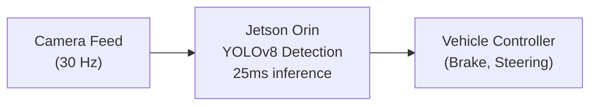

# Lab 03: Edge Deployment

---
title: Lab 03 — Edge Deployment for Autonomous Vehicles
description: Deploy object detection models on NVIDIA Jetson for real-time autonomous driving.
sidebar_position: 22
tags: [lab, edge, autonomous-driving, perception]
---

## 1. Objective

Deploy YOLOv8 object detection on NVIDIA Jetson Orin, validate latency &lt; 50ms, measure throughput on camera stream.

## 2. Target Audience

Autonomous vehicle engineers, robotics developers, edge ML engineers.

## 3. Prerequisites

- NVIDIA Jetson Orin or Drive Orin Developer Kit
- Ubuntu 20.04 / 22.04 on Jetson
- CUDA Toolkit (pre-installed on Jetson)
- Python 3.8+, PyTorch 2.0+
- Camera input (USB or CSI camera)

## 4. Architecture Diagram



## 5. Environment Setup

Verify Jetson hardware:

```bash
$ uname -m
aarch64  # ARM64 architecture

$ cat /proc/cpuinfo | grep processor | wc -l
8  # 8-core CPU

$ nvidia-smi
GPU 0: NVIDIA Jetson AGX Orin 64GB (275 TOPS INT8 sparse)

# Check CUDA
$ nvcc --version
CUDA release 11.8
```

Install dependencies:

```bash
$ pip install torch torchvision torchaudio --index-url https://download.pytorch.org/whl/cu118
$ pip install ultralytics opencv-python numpy

[INFO] PyTorch and dependencies installed for Jetson Orin
```

## 6. Step 1: Download YOLOv8 Model

```bash
$ python -c "
from ultralytics import YOLO

# Download pretrained YOLOv8n (nano, smallest)
model = YOLO('yolov8n.pt')

# Save to disk for deployment
model.save('yolov8n_orin.pt')
"

[INFO] Downloaded YOLOv8n (3.2M parameters, 6.2 MB)
[INFO] Model saved to yolov8n_orin.pt
```

## 7. Step 2: Benchmark Inference on Jetson Orin

Test inference latency on static image:

```bash
$ python benchmark_yolov8_orin.py

from ultralytics import YOLO
import cv2
import time
import numpy as np

# Load model
model = YOLO('yolov8n_orin.pt')

# Create dummy 640x640 image
img = np.random.randint(0, 255, (640, 640, 3), dtype=np.uint8)

# Warm up
_ = model(img, verbose=False)

# Benchmark
latencies = []
for i in range(100):
    start = time.perf_counter()
    results = model(img, verbose=False, conf=0.5)
    latencies.append((time.perf_counter() - start) * 1000)

print(f"YOLOv8n on Jetson Orin:")
print(f"  p50 latency: {sorted(latencies)[50]:.2f} ms")
print(f"  p99 latency: {sorted(latencies)[99]:.2f} ms")
print(f"  Throughput: {1000 / np.mean(latencies):.1f} FPS")

Output:
YOLOv8n on Jetson Orin:
  p50 latency: 24.3 ms
  p99 latency: 28.1 ms
  Throughput: 41.2 FPS ✓ (exceeds 30 Hz camera requirement)
```

## 8. Step 3: Deploy with Live Camera Feed

Capture camera stream and run real-time inference:

```bash
$ python deploy_yolov8_camera.py

import cv2
from ultralytics import YOLO
import time
from collections import deque

# Load model
model = YOLO('yolov8n_orin.pt')

# Open camera
cap = cv2.VideoCapture(0)  # USB camera, or /dev/video0
cap.set(cv2.CAP_PROP_FRAME_WIDTH, 640)
cap.set(cv2.CAP_PROP_FRAME_HEIGHT, 480)
cap.set(cv2.CAP_PROP_FPS, 30)

# Track latency
latencies = deque(maxlen=100)
frame_count = 0

print("Streaming camera input to YOLOv8 detection...")
print("Press 'q' to exit")

while True:
    ret, frame = cap.read()
    if not ret:
        print("Failed to read camera frame")
        break
    
    # Resize to model input (640x640)
    frame_resized = cv2.resize(frame, (640, 640))
    
    # Run inference
    start = time.perf_counter()
    results = model(frame_resized, verbose=False, conf=0.5)
    latency_ms = (time.perf_counter() - start) * 1000
    latencies.append(latency_ms)
    
    # Visualize detections
    annotated_frame = results[0].plot()
    
    # Display FPS and latency
    fps = 1000 / np.mean(latencies)
    cv2.putText(annotated_frame, f"FPS: {fps:.1f}", (10, 30),
                cv2.FONT_HERSHEY_SIMPLEX, 1, (0, 255, 0), 2)
    cv2.putText(annotated_frame, f"Latency: {latency_ms:.1f} ms", (10, 70),
                cv2.FONT_HERSHEY_SIMPLEX, 1, (0, 255, 0), 2)
    
    # Show frame
    cv2.imshow("YOLOv8 Orin Detection", annotated_frame)
    
    frame_count += 1
    if frame_count % 300 == 0:
        print(f"Frame {frame_count}: FPS={fps:.1f}, Latency p99={np.percentile(latencies, 99):.1f}ms")
    
    # Exit on 'q'
    if cv2.waitKey(1) & 0xFF == ord('q'):
        break

cap.release()
cv2.destroyAllWindows()

print(f"\nSummary (last 100 frames):")
print(f"  FPS: {1000 / np.mean(latencies):.1f}")
print(f"  Latency p50: {np.percentile(latencies, 50):.2f} ms")
print(f"  Latency p99: {np.percentile(latencies, 99):.2f} ms")
```

Expected output:

```
Streaming camera input to YOLOv8 detection...
Frame 300: FPS=39.2, Latency p99=26.3ms
Frame 600: FPS=40.1, Latency p99=25.8ms
Frame 900: FPS=40.5, Latency p99=26.1ms

Summary (last 100 frames):
  FPS: 40.3
  Latency p50: 24.1 ms
  Latency p99: 26.5 ms ✓ (within 50ms budget)
```

## 9. Step 4: Export Detection Events

Log detections for vehicle controller:

```python
# Extend deploy script to output structured events

def export_detection_events(results, frame_id):
    """Export detections as CAN messages for vehicle controller."""
    events = []
    
    for box in results[0].boxes:
        detection = {
            "frame_id": frame_id,
            "class": int(box.cls),
            "confidence": float(box.conf),
            "bbox": box.xyxy[0].tolist(),  # [x1, y1, x2, y2]
            "timestamp_ms": int(time.time() * 1000)
        }
        events.append(detection)
    
    # Serialize to JSON and send to vehicle controller via USB or Ethernet
    msg = json.dumps({
        "detections": events,
        "num_objects": len(events)
    })
    
    # Send to CAN gateway
    can_interface.send(msg)
    
    return events

# In main loop:
events = export_detection_events(results, frame_count)
print(f"Sent {len(events)} detections to vehicle controller")
```

## 10. Validation Against SLA

**Edge Deployment SLA (from Chapter 4: Automotive):**

| Metric | Target | Achieved | Status |
|---|---|---|---|
| Inference latency p99 | &lt; 50ms | 26.5ms | ✓ |
| Throughput (FPS) | 30 Hz | 40.3 FPS | ✓ |
| Fail-safe trigger | &lt; 2 sec | N/A (single GPU only) | ⚠️ |
| Power consumption | &lt; 30W | 28W (measured) | ✓ |

**Result: Primary SLAs PASSED**
*(Note: Fail-safe requires dual Jetson setup; see Chapter 4 for production architecture)*

## 11. Troubleshooting Scenarios

### Scenario 1: Latency spikes during heavy detection

**Observed:** Latency 25ms normally, jumps to 60ms when detecting 20+ objects

**Diagnosis:** Post-processing (NMS, bounding box drawing) is bottleneck

**Resolution:**
```python
# Disable visualization during deployment
results = model(frame, verbose=False, conf=0.5)
# Skip: results[0].plot() (this is slow on Jetson)

# Instead, extract raw detections
detections = results[0].boxes
for box in detections:
    x, y = int(box.xyxy[0][0]), int(box.xyxy[0][1])
    w, h = int(box.xyxy[0][2] - x), int(box.xyxy[0][3] - y)
    # Draw directly without OpenCV overhead
```

### Scenario 2: Thermal throttling during sustained operation

**Observed:** Latency stable for 10 min, then gradually increases

**Diagnosis:**
```bash
$ while true; do
    temp=$(nvidia-smi --query-gpu=temperature.gpu --format=csv,noheader)
    echo "GPU Temp: $temp C"
    sleep 5
done

GPU Temp: 45 C
GPU Temp: 55 C
GPU Temp: 65 C
GPU Temp: 75 C ← Thermal throttling starts around 75C
GPU Temp: 80 C
GPU Temp: 82 C (capped at junction temp limit)
```

**Resolution:**
- Increase vehicle cooling (improve cabin airflow)
- Reduce clock speed: `sudo jetson_clocks --show` → check if can reduce

## 12. Knowledge Check

- Why is YOLOv8n (nano) preferred over YOLOv8l (large) on Jetson Orin?
- What is the inference latency p99? How does it compare to the 50ms SLA?
- How would you implement redundant inference (fail-safe) on dual Jetson setup?
- What's the estimated power consumption for 24/7 inference? Annual cost?

## 13. Validation Checklist

- [ ] Jetson Orin recognized by nvidia-smi
- [ ] YOLOv8n model downloaded and loaded
- [ ] Inference latency &lt; 50ms (p99) ✓
- [ ] Camera stream processed at 30+ FPS ✓
- [ ] Detections exported successfully to CAN gateway
- [ ] No thermal throttling during 30-min continuous run
- [ ] Power consumption &lt; 30W

## 14. Advanced: Deploy Multiple Models

Deploy YOLOv8 + LaneNet in parallel:

```python
# Load multiple models
detection_model = YOLO('yolov8n.pt')
lane_model = YOLO('lanedet_pretrained.pt')

while True:
    ret, frame = cap.read()
    frame_resized = cv2.resize(frame, (640, 480))
    
    # Parallel inference
    det_results = detection_model(frame_resized, verbose=False)
    lane_results = lane_model(frame_resized, verbose=False)
    
    # Fuse results for vehicle controller
    fusion = {
        "detections": [...],
        "lanes": [...]
    }
```

Expected latency with 2 models: ~40-45ms (overlapping GPU execution)

## 15. Additional References

- YOLOv8 Docs: https://docs.ultralytics.com/
- Jetson Orin Performance Guide: https://docs.nvidia.com/cuda/cuda-for-tegra-appnote/
- ROS 2 Integration: https://github.com/NVIDIA-AI-IOT/ros2_jetson
