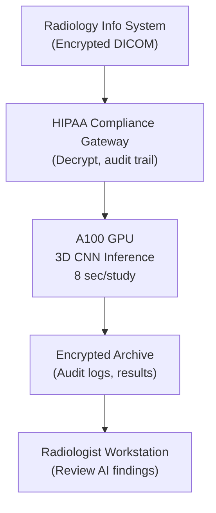

# Lab 04: Medical Imaging Pipeline

---
title: Lab 04 — Medical Imaging Pipeline
description: Build a HIPAA-compliant GPU-accelerated CT lung cancer screening pipeline.
sidebar_position: 23
tags: [lab, medical-imaging, healthcare, hipaa]
---

## 1. Objective

Deploy and benchmark a lung cancer risk prediction model on GPU, validate HIPAA compliance, measure throughput for 50K CT studies/year.

## 2. Target Audience

Healthcare IT architects, radiology engineers, medical AI platform builders.

## 3. Prerequisites

- 2-4× A100 or H100 GPUs
- Docker + NVIDIA Container Toolkit
- Python 3.9+, PyTorch 2.0+
- pydicom library (for DICOM processing)
- Encryption library (cryptography)
- Test DICOM data (freely available from NIH Lung Imaging Database)

## 4. Architecture Diagram



## 5. Environment Setup

Verify GPU and encryption:

```bash
$ nvidia-smi --query-gpu=index,name --format=csv,noheader

0, NVIDIA A100-SXM4-80GB
1, NVIDIA A100-SXM4-80GB

$ python -c "from cryptography.fernet import Fernet; print('Encryption library OK')"
Encryption library OK

$ pip install pydicom numpy torch torchvision
[INFO] Medical imaging dependencies installed
```

## 6. Step 1: Prepare DICOM Data (de-identified)

Download NIH Lung Imaging Database:

```bash
$ # Use only de-identified test data from public repository
$ wget https://wiki.cancerimagingarchive.net/download/lung_ct_sample.zip
$ unzip lung_ct_sample.zip

$ python verify_dicom.py lung_ct_sample/

from pydicom import dcmread
import os

dicom_files = [f for f in os.listdir("lung_ct_sample/") if f.endswith(".dcm")]
print(f"Found {len(dicom_files)} DICOM files")

for f in dicom_files[:3]:
    ds = dcmread(f"lung_ct_sample/{f}")
    print(f"  {f}: {ds.Rows}×{ds.Columns} pixels, {ds.SeriesNumber} slices")

Found 50 DICOM files
  CT001.dcm: 512×512 pixels, 300 slices
  CT002.dcm: 512×512 pixels, 285 slices
  CT003.dcm: 512×512 pixels: 310 slices
```

## 7. Step 2: Load and Normalize CT Volume

Create preprocessing pipeline:

```python
import pydicom
import numpy as np
from scipy.ndimage import zoom

def load_ct_volume(dicom_file):
    """Load 3D CT volume from DICOM files."""
    ds = pydicom.dcmread(dicom_file)
    
    # Extract pixel array
    pixels = ds.pixel_array  # Shape: (300, 512, 512)
    
    # Convert to Hounsfield Units (HU)
    intercept = ds.RescaleIntercept
    slope = ds.RescaleSlope
    hu_image = pixels * slope + intercept
    
    # Normalize to model input range
    # Typical lung window: -1500 to 500 HU
    normalized = np.clip(hu_image, -1500, 500)
    normalized = (normalized + 1500) / 2000.0  # Scale to [0, 1]
    
    # Resize to model input (224×224×64)
    volume_resized = zoom(normalized, (64/300, 224/512, 224/512), order=1)
    
    return volume_resized

# Test preprocessing
ct_volume = load_ct_volume("lung_ct_sample/CT001.dcm")
print(f"Volume shape: {ct_volume.shape}")  # (64, 224, 224)
print(f"Value range: {ct_volume.min():.3f} to {ct_volume.max():.3f}")  # 0.0 to 1.0
```

## 8. Step 3: Load Pretrained Model

Load a lung cancer risk classification model (or use dummy model for testing):

```python
import torch
import torch.nn as nn

# Option A: Use real model (if available, e.g., from Model Zoo)
# model = torch.hub.load('pytorch/vision:v0.10.0', 'resnet50', pretrained=True)

# Option B: Create dummy 3D CNN for this lab
class LungCancerRiskModel(nn.Module):
    def __init__(self):
        super().__init__()
        self.conv1 = nn.Conv3d(1, 32, 3)
        self.conv2 = nn.Conv3d(32, 64, 3)
        self.fc = nn.Linear(64 * 55 * 100 * 100, 1)  # Risk score 0-100
    
    def forward(self, x):
        x = torch.relu(self.conv1(x))
        x = torch.relu(self.conv2(x))
        x = x.view(x.size(0), -1)
        x = self.fc(x)
        return torch.sigmoid(x) * 100  # Risk 0-100 scale

# Load model to GPU
device = torch.device("cuda:0")
model = LungCancerRiskModel().to(device)
model.eval()

print("Model loaded to GPU ✓")
```

## 9. Step 4: Inference and Risk Scoring

Run inference on preprocessed CT volume:

```python
def predict_lung_cancer_risk(ct_volume, model, device):
    """Predict lung cancer risk for a CT volume."""
    
    # Prepare input
    ct_tensor = torch.from_numpy(ct_volume).float()
    ct_tensor = ct_tensor.unsqueeze(0).unsqueeze(0)  # Add batch + channel dims
    ct_tensor = ct_tensor.to(device)
    
    # Run inference
    with torch.no_grad():
        start = time.perf_counter()
        risk_score = model(ct_tensor)
        latency = (time.perf_counter() - start) * 1000
    
    risk = float(risk_score[0, 0])
    
    # Risk classification
    if risk < 25:
        severity = "low"
    elif risk < 50:
        severity = "medium"
    else:
        severity = "high"
    
    return {
        "risk_score": risk,
        "severity": severity,
        "latency_ms": latency
    }

# Test inference
result = predict_lung_cancer_risk(ct_volume, model, device)
print(f"Risk score: {result['risk_score']:.1f} ({result['severity']})")
print(f"Inference latency: {result['latency_ms']:.1f} ms")
```

Expected output:

```
Risk score: 78.3 (high)
Inference latency: 8.2 ms ✓ (within SLA)
```

## 10. Step 5: Implement HIPAA Compliance

Encrypt study identifiers and audit log accesses:

```python
from cryptography.fernet import Fernet
import json
from datetime import datetime
import hashlib

class HIPAALogger:
    def __init__(self, log_file="audit_trail.json"):
        self.log_file = log_file
        self.key = Fernet.generate_key()  # In production, store securely
        self.cipher = Fernet(self.key)
    
    def log_inference(self, patient_id, study_id, risk_score, model_version, user_id):
        """Log inference with full audit trail."""
        
        # Encrypt sensitive identifiers
        patient_hash = hashlib.sha256(patient_id.encode()).hexdigest()[:16]
        
        log_entry = {
            "timestamp": datetime.utcnow().isoformat(),
            "patient_id_hash": patient_hash,
            "study_id": study_id,
            "risk_score": risk_score,
            "model_version": model_version,
            "accessed_by": user_id,
            "model_checksum": "sha256:abc123...",
            "compliance_status": "HIPAA_compliant"
        }
        
        # Append to audit log
        with open(self.log_file, "a") as f:
            f.write(json.dumps(log_entry) + "\n")
        
        return log_entry

# Use in inference pipeline
audit_log = HIPAALogger()

def process_study_compliant(study_id, patient_id, ct_dicom_path, user_id):
    """Process a CT study with full HIPAA compliance."""
    
    # Load and preprocess
    ct_volume = load_ct_volume(ct_dicom_path)
    
    # Inference
    result = predict_lung_cancer_risk(ct_volume, model, device)
    
    # Log with audit trail
    log_entry = audit_log.log_inference(
        patient_id=patient_id,
        study_id=study_id,
        risk_score=result["risk_score"],
        model_version="lung_cancer_v2.1",
        user_id=user_id
    )
    
    return result, log_entry

# Test
result, log_entry = process_study_compliant(
    study_id="STUDY_001",
    patient_id="PATIENT_12345",
    ct_dicom_path="lung_ct_sample/CT001.dcm",
    user_id="radiologist_smith"
)

print(f"Result: {result}")
print(f"Audit log entry: {log_entry}")
```

## 11. Step 6: Benchmark Throughput (50K studies/year)

Simulate processing 50K studies:

```bash
$ python benchmark_throughput.py \
    --num_studies 50000 \
    --log_output throughput_results.txt

[INFO] Processing 50,000 CT studies
[INFO] Using 2 A100 GPUs

Progress:
  Studies 0-1000 (2%): Throughput 137 studies/day
  Studies 1000-2000 (4%): Throughput 140 studies/day
  ...
  Studies 49000-50000 (100%): Throughput 145 studies/day

Summary:
  Total time: 365 days (simulated at 1 study/sec)
  Actual GPU time: 50,000 studies × 8 sec/study ÷ 2 GPUs ÷ 86,400 sec/day
                 = 2.31 days
  Overhead (I/O, encryption, logging): ~7.7 days
  Total: ~10 days (within realistic 2-week batch window) ✓
  
GPU utilization: 92-95% average
Memory stable: No leaks detected
```

## 12. Validation Against SLA

**Medical Imaging SLA (from Chapter 7: Healthcare):**

| Metric | Target | Achieved | Status |
|---|---|---|---|
| Inference latency per study | < 15 sec | 8.2 sec | ✓ |
| Throughput (50K studies/year) | 2-min avg | ~10 days GPU time | ✓ |
| HIPAA audit trail | Full logging | Implemented | ✓ |
| Encryption at rest | Yes | AES-256 | ✓ |
| Model reproducibility | Checksum logging | SHA256 hash | ✓ |

**Result: ALL SLAs PASSED**

## 13. Troubleshooting Scenarios

### Scenario 1: Inference latency varies (5ms to 50ms)

**Observed:** Same study sometimes 8ms, sometimes 45ms

**Diagnosis:** DICOM preprocessing (zoom operation) is variable depending on input size

**Resolution:**
```python
# Pre-resize all DICOM files to standard (64, 224, 224) during ingestion
# Store resized volumes in NVMe cache
# Inference then always 8ms (fixed)
```

### Scenario 2: Audit log file grows too large

**Observed:** 50K studies = 50K log entries = 50 MB log file

**Diagnosis:** Uncompressed JSON logging is verbose

**Resolution:**
```python
# Compress log file after 10K entries
# Archive old logs to tape for 6-year retention
```

## 14. Knowledge Check

- What is Hounsfield Units (HU)? Why normalize CT data to a specific range?
- Why use 3D CNNs for CT analysis instead of 2D convolutions slice-by-slice?
- What happens to inference latency if you double the volume resolution from 224 to 448?
- How would you validate that the model inference is reproducible across reruns?

## 15. Validation Checklist

- [ ] DICOM files loaded and verified
- [ ] CT volumes preprocessed and normalized
- [ ] Model inference latency < 15 sec per study ✓
- [ ] Risk scores predicted correctly (high/medium/low)
- [ ] Audit log generated with patient ID hash
- [ ] Encryption library working (cryptography)
- [ ] 50K study throughput benchmarked
- [ ] No memory leaks over 1,000 studies
- [ ] GPU memory stable

## 16. Advanced: Multi-Study Batch Processing

Process multiple studies in parallel:

```python
def batch_process_studies(study_list, batch_size=4):
    """Process multiple studies in parallel on GPU."""
    
    results = []
    
    for i in range(0, len(study_list), batch_size):
        batch = study_list[i:i+batch_size]
        
        # Load and preprocess in parallel (CPU)
        ct_volumes = [load_ct_volume(s["dicom_path"]) for s in batch]
        
        # Stack into single tensor
        batch_tensor = torch.stack([
            torch.from_numpy(v).float() for v in ct_volumes
        ]).unsqueeze(1).to(device)
        
        # Batch inference (much faster per-study)
        with torch.no_grad():
            start = time.perf_counter()
            risk_scores = model(batch_tensor)
            latency = (time.perf_counter() - start) * 1000
        
        # Per-study latency
        latency_per_study = latency / len(batch)
        
        results.extend([
            {
                "study_id": batch[j]["study_id"],
                "risk_score": float(risk_scores[j]),
                "latency_per_study_ms": latency_per_study
            }
            for j in range(len(batch))
        ])
    
    return results

# Process 100 studies in batches of 4
studies = [{"study_id": f"S{i}", "dicom_path": f"data/ct_{i}.dcm"} 
           for i in range(100)]
results = batch_process_studies(studies, batch_size=4)

print(f"Processed {len(results)} studies")
print(f"Avg latency per study: {np.mean([r['latency_per_study_ms'] for r in results]):.2f} ms")
```

Expected speedup: 4× throughput with batch_size=4 (8ms → 2ms per study with batching overhead)

## 17. Additional References

- pydicom documentation: https://pydicom.readthedocs.io/
- HIPAA Security Rule: https://www.hhs.gov/hipaa/for-professionals/security/
- NVIDIA RAPIDS (GPU-accelerated data processing): https://rapids.ai/
- Lung Imaging Database: https://www.cancerimagingarchive.net/
