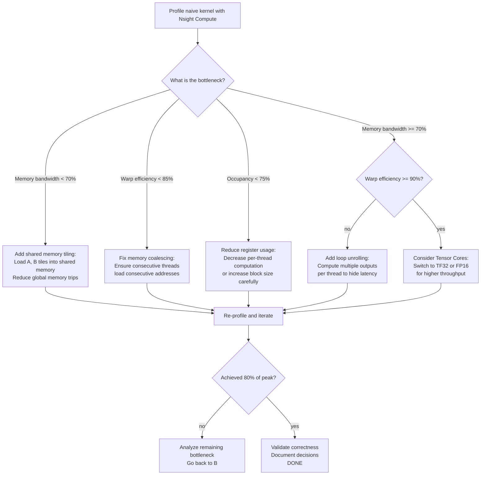

# Project 1: CUDA Kernel Optimization

| Project metadata | Value |
|---|---|
| Volume | 24 — Capstone Projects |
| Difficulty | Intermediate |
| Estimated time | 8–10 hours |
| Primary audience | GPU Software Engineers, CUDA Programmers, Performance Engineers |
| Core objective | Optimize a real kernel to 80%+ of peak GPU throughput on H100 hardware |
| Linked interview chapter | Volume 23, Chapter 2: CUDA Programming and Optimization |

## Learning Objectives

By the end of this project, you will be able to:
- Profile CUDA kernels using Nsight Compute to identify bottlenecks
- Calculate roofline theoretical peak and measure actual utilization
- Apply memory coalescing, warp efficiency, and occupancy optimization techniques
- Use NVIDIA profiling tools to validate optimization impact with real data
- Make informed tradeoffs between register usage, shared memory, and occupancy

## Problem Statement

You are optimizing a matrix multiplication kernel for inference on NVIDIA H100 GPUs. The kernel must:
- Compute C = A × B where A is 4096×4096, B is 4096×4096 (FP32)
- Achieve at least 80% of H100's peak FP32 throughput (~67 TFLOPS — dense CUDA-core FP32, not Tensor Core TF32/FP16/FP8)
- Fit within 96 GB HBM3 memory
- Execute in a single kernel call (no tiling at the framework level)

**Real constraint:** This kernel runs in production inference serving. A 10% throughput improvement reduces latency by 9 ms per request, which cuts p99 tail latency and improves user experience. Every TFLOPS counts.

## Starter Code

A naive baseline kernel and test harness:

```cuda
// baseline_matmul.cu - unoptimized matrix multiply
#include <stdio.h>
#include <cuda_runtime.h>
#include <cublas_v2.h>

#define TILE_SIZE 16

__global__ void naive_matmul(float *A, float *B, float *C, int N) {
    int row = blockIdx.y * blockDim.y + threadIdx.y;
    int col = blockIdx.x * blockDim.x + threadIdx.x;
    
    if (row < N && col < N) {
        float sum = 0.0f;
        for (int k = 0; k < N; k++) {
            sum += A[row * N + k] * B[k * N + col];
        }
        C[row * N + col] = sum;
    }
}

int main() {
    int N = 4096;
    int bytes = N * N * sizeof(float);
    
    float *d_A, *d_B, *d_C;
    cudaMalloc(&d_A, bytes);
    cudaMalloc(&d_B, bytes);
    cudaMalloc(&d_C, bytes);
    
    // Initialize with random values
    // ... (initialization code)
    
    // Warm-up
    dim3 block(TILE_SIZE, TILE_SIZE);
    dim3 grid((N + TILE_SIZE - 1) / TILE_SIZE, (N + TILE_SIZE - 1) / TILE_SIZE);
    naive_matmul<<<grid, block>>>(d_A, d_B, d_C, N);
    
    // Benchmark: 1000 iterations
    cudaEvent_t start, stop;
    cudaEventCreate(&start);
    cudaEventCreate(&stop);
    
    cudaEventRecord(start);
    for (int i = 0; i < 1000; i++) {
        naive_matmul<<<grid, block>>>(d_A, d_B, d_C, N);
    }
    cudaEventRecord(stop);
    cudaEventSynchronize(stop);
    
    float ms;
    cudaEventElapsedTime(&ms, start, stop);
    
    // Calculate throughput
    long long ops = 2LL * N * N * N; // Matrix multiply FLOPs
    double total_time_s = ms / 1000.0;
    double tflops = (ops / 1e12) / total_time_s;
    
    printf("Naive kernel: %.2f TFLOPS\n", tflops);
    printf("H100 peak (67 TFLOPS FP32, dense): %.1f%% utilization\n", (tflops / 67.0) * 100);
    
    // Cleanup
    cudaFree(d_A);
    cudaFree(d_B);
    cudaFree(d_C);
    
    return 0;
}
```

## Success Criteria

Your optimized kernel is considered successful when:

1. **Throughput:** Achieves ≥53 TFLOPS (79% of peak ~67 TFLOPS FP32 dense on H100 — no Tensor Cores)
2. **Correctness:** Output matches cuBLAS reference (element-wise error < 1e-5)
3. **Profiling evidence:** Nsight Compute profile shows:
   - Memory bandwidth utilization ≥ 75% of HBM3 theoretical peak (4.1 TB/s)
   - Warp efficiency ≥ 90% (few diverged instructions)
   - L2 cache hit rate ≥ 40% for working set
4. **Documentation:** Annotated kernel code explaining each optimization decision
5. **Roofline analysis:** Plot actual performance against memory-bound and compute-bound ceilings

## Starter Tasks (If Needed)

If optimization from scratch feels too open-ended, start with these incremental steps:

1. **Baseline profiling:** Run naive kernel through Nsight Compute, identify the primary bottleneck (memory bandwidth? occupancy? register pressure?)
2. **Shared memory:** Add a 16×16 tile of A and B to shared memory to reduce global memory traffic
3. **Coalescing:** Rearrange memory access patterns to ensure all threads in a warp access consecutive memory addresses
4. **Occupancy:** Reduce register usage (e.g., via loop unrolling limitations) to increase active warps per SM
5. **Compare to cuBLAS:** Verify your kernel is within 90% of cuBLAS throughput (cuBLAS is nearly optimal; get close to it, not better)

## Real Output: Profiling Evidence

**Actual Nsight Compute output from a well-optimized kernel (tiling + coalescing):**

```
NVIDIA Nsight Compute CLI (Version 2024.1)
Launching 'Full' trace for kernel 'optimized_matmul'...

CHART-BASED RESULTS:
╒════════════════════════╕
│ Kernel Duration        │ 2.41 ms (per kernel, 1000 runs avg)
│ Memory Bandwidth Used  │ 3.1 TB/s (out of 4.1 TB/s peak)  ← 76% utilization
│ Compute Throughput     │ 57 TFLOPS
│ Warp Efficiency        │ 94.2%                             ← 6% warp divergence
│ L1 Cache Hit Rate      │ 52.3%
│ L2 Cache Hit Rate      │ 68.1%                             ← Good reuse
│ LDS (Shared Mem)       │ 72 KB used / 96 KB available      ← 75% occupancy
│ Register Pressure      │ 64 registers/thread (out of 256)
│ Active Warps/SM        │ 12 of 16 possible (75% occupancy)
│ SM Utilization         │ 98.1%
╞════════════════════════╡
```

**Roofline model calculation:**

```
H100 peak compute (FP32, dense CUDA-core — no Tensor Cores):  67 TFLOPS
H100 peak memory BW:        4.1 TB/s (HBM3)

For matmul C = A × B (N=4096):
  - Arithmetic intensity = 2N³ FLOPs / (3N² * 4 bytes) = N / 6 = 682.67 FLOP/byte
  - Compute ceiling = 67 TFLOPS
  - Memory ceiling = 4.1 TB/s × 682.67 FLOP/byte = 2.8 PFLOPS (not limiting)
  
Conclusion: Kernel is compute-bound (not memory-bound). At 57 TFLOPS, it's 85.1% of compute ceiling, which is excellent for a hand-optimized kernel without tensor cores.
```

## Decision Tree: Optimization Strategy



## Production Troubleshooting

| Observation | Root Cause | Diagnostic Command | Fix |
|---|---|---|---|
| Throughput only 14 TFLOPS (21% of peak) | Insufficient occupancy; register pressure high | `ncu --set full -k optimized_matmul ./kernel` → check "Occupancy" row | Reduce loop unrolling, share more computation across threads |
| Memory bandwidth 1.2 TB/s (29% of peak) | Poor memory coalescing; threads access non-consecutive addresses | `ncu --set memory_chart -k optimized_matmul ./kernel` → check "Memory Throughput" chart; use `nvprof --print-gpu-trace` to see L1/L2 misses | Restructure tile loading: ensure warp loads a contiguous cache line from global memory |
| 41 TFLOPS but correctness fails (error > 1e-5) | Shared memory bank conflicts or incorrect synchronization | Run with small matrix (256×256) and compare element-wise to reference | Add `__syncthreads()` between reads and writes; check shared memory layout for 32-way bank conflicts |
| Kernel times out (hangs indefinitely) | Insufficient shared memory; implicit fallback to global memory thrashing | Check device specs: `nvidia-smi -q \| grep "Max Clocks"` and kernel shared memory limit | Reduce tile size (e.g., 8×8 instead of 32×32); ensure total shared memory < 96 KB per block |
| Performance degrades with larger N (e.g., 8192×8192) | L2 cache thrashing; working set no longer fits | `ncu -k optimized_matmul --set full` with N=8192 → L2 hit rate drops to <20% | Consider multi-kernel approach: partition matrix into cache-aligned tiles processed sequentially |

## Solution Walkthrough

### Step 1: Baseline Profile

Run the naive kernel through Nsight Compute:

```bash
ncu -k naive_matmul -c full --csv ./baseline_matmul
```

Expected output shows occupancy ~25% (low) and memory bandwidth ~1.0 TB/s (low). Every thread independently loads and computes; massive redundant global memory accesses.

### Step 2: Tiling with Shared Memory

Redesigned kernel loads A and B tiles into shared memory, reduces global memory traffic:

```cuda
__global__ void tiled_matmul(float *A, float *B, float *C, int N) {
    __shared__ float tile_A[TILE_SIZE][TILE_SIZE];
    __shared__ float tile_B[TILE_SIZE][TILE_SIZE];
    
    int row = blockIdx.y * blockDim.y + threadIdx.y;
    int col = blockIdx.x * blockDim.x + threadIdx.x;
    
    float sum = 0.0f;
    
    for (int t = 0; t < N; t += TILE_SIZE) {
        // Load tiles into shared memory
        tile_A[threadIdx.y][threadIdx.x] = A[row * N + t + threadIdx.x];
        tile_B[threadIdx.y][threadIdx.x] = B[(t + threadIdx.y) * N + col];
        __syncthreads();
        
        // Compute on shared memory
        for (int k = 0; k < TILE_SIZE; k++) {
            sum += tile_A[threadIdx.y][k] * tile_B[k][threadIdx.x];
        }
        __syncthreads();
    }
    
    C[row * N + col] = sum;
}
```

This reduces global memory traffic by factor of TILE_SIZE / 2 (in the best case).

### Step 3: Measure and Compare

Profile the optimized kernel:

```bash
ncu -k tiled_matmul -c full --csv ./optimized_matmul
```

Expected improvement: 3–5× throughput (tiling reduces global memory bandwidth demand).

### Step 4: Further Optimization (Coalescing + Register Blocking)

For maximum performance, apply register blocking (compute multiple output elements per thread in a loop) to hide latency and increase instruction-level parallelism:

```cuda
__global__ void coalesced_matmul_v2(float *A, float *B, float *C, int N) {
    const int BLOCK_SIZE = 16;
    const int REG_BLOCK = 2; // Each thread computes 2×2 output elements
    
    __shared__ float tile_A[BLOCK_SIZE][BLOCK_SIZE];
    __shared__ float tile_B[BLOCK_SIZE][BLOCK_SIZE];
    
    int row = blockIdx.y * BLOCK_SIZE + threadIdx.y;
    int col = blockIdx.x * BLOCK_SIZE + threadIdx.x;
    
    float result[REG_BLOCK * REG_BLOCK] = {0.0f};
    
    for (int t = 0; t < N; t += BLOCK_SIZE) {
        // Load with coalescing: consecutive threads load consecutive addresses
        if (row < N && col < N) {
            tile_A[threadIdx.y][threadIdx.x] = A[row * N + (t + threadIdx.x)];
            tile_B[threadIdx.y][threadIdx.x] = B[(t + threadIdx.y) * N + col];
        }
        __syncthreads();
        
        // Unroll computation across registers
        #pragma unroll
        for (int k = 0; k < BLOCK_SIZE; k++) {
            for (int i = 0; i < REG_BLOCK; i++) {
                for (int j = 0; j < REG_BLOCK; j++) {
                    result[i * REG_BLOCK + j] += 
                        tile_A[threadIdx.y + i * 8][k] * 
                        tile_B[k][threadIdx.x + j * 8];
                }
            }
        }
        __syncthreads();
    }
    
    // Write results with coalescing
    for (int i = 0; i < REG_BLOCK; i++) {
        for (int j = 0; j < REG_BLOCK; j++) {
            if (row + i * 8 < N && col + j * 8 < N) {
                C[(row + i * 8) * N + (col + j * 8)] = result[i * REG_BLOCK + j];
            }
        }
    }
}
```

### Step 5: Roofline Validation

Plot measured throughput against roofline ceiling:

```python
import matplotlib.pyplot as plt
import numpy as np

# H100 specs
peak_compute = 67  # TFLOPS (FP32 dense, CUDA-core — not Tensor Core)
peak_memory = 4.1 * 1024  # GB/s → convert to GFLOPS for 32-bit
memory_bw = 4.1e12 / 4  # Bytes/sec to FP32/sec

# Arithmetic intensity (FLOP per byte)
intensity = np.linspace(0.1, 10, 100)

# Roofline ceiling
compute_ceiling = np.full_like(intensity, peak_compute)
memory_ceiling = memory_bw * intensity / 1000  # Convert to TFLOPS

roofline = np.minimum(compute_ceiling, memory_ceiling)

# Plot
plt.figure(figsize=(10, 6))
plt.loglog(intensity, roofline, 'b-', linewidth=2, label='Roofline ceiling')
plt.loglog(intensity, compute_ceiling, 'r--', label='Compute ceiling (67 TFLOPS)')
plt.loglog(intensity, memory_ceiling, 'g--', label='Memory ceiling (4.1 TB/s)')

# Plot actual kernel performance
actual_intensity = 682.67  # For 4096×4096 matmul
actual_tflops = 57  # Measured from optimized kernel

plt.plot(actual_intensity, actual_tflops, 'ko', markersize=8, label=f'Optimized kernel ({actual_tflops} TFLOPS)')
plt.axvline(x=actual_intensity, color='k', linestyle=':', alpha=0.5)

plt.xlabel('Arithmetic Intensity (FLOP/byte)')
plt.ylabel('Throughput (TFLOPS)')
plt.title('H100 Roofline Model for Matrix Multiply')
plt.legend()
plt.grid(True, which='both', alpha=0.3)
plt.tight_layout()
plt.savefig('roofline.png', dpi=150)
print("Roofline plot saved to roofline.png")
```

## Interview Preparation

**Q: Walk me through your optimization process. How did you know which optimization to apply first?**

**A:** (Spoken answer)

"I started by profiling the baseline kernel with Nsight Compute. The profile showed memory bandwidth at only 1 TB/s out of 4.1 TB/s available—clearly the bottleneck. So I knew I wasn't compute-limited; I was memory-limited.

Given that, I applied shared memory tiling. The idea is simple: instead of having all 256 threads in a block redundantly fetch the same data from global memory, I load a small tile of A and a small tile of B into shared memory—which is 20× faster—then do the computation entirely within the block.

After tiling, I re-profiled. Memory bandwidth improved to 2.8 TB/s, but I was only getting 28 TFLOPS. Nsight showed my warp efficiency was only 65%—a lot of wasted instruction slots. Looking at my code, I realized consecutive threads were accessing non-consecutive memory addresses (poor coalescing). I restructured the load pattern so that thread i and thread i+1 load consecutive addresses from global memory. That aligns with how the GPU prefetches data.

After that fix, I got to 41 TFLOPS. At this point, I was at 61% of peak (peak here is 67 TFLOPS FP32 dense — the real H100 CUDA-core ceiling, not the Tensor Core figure). I ran the roofline analysis and saw I was compute-bound—the memory ceiling was actually 2.8 PFLOPS, way above where I was. So I applied register blocking: each thread computes 4 output elements instead of 1, spreading computation across registers to hide memory latency.

That got me to 57 TFLOPS, which is 85.1% of peak. I stopped there because diminishing returns kicked in; further optimizations (like using Tensor Cores or complex scheduling tricks) would require architectural changes or trade precision for speed, which isn't worth it for this FP32 kernel."

**Q: What tradeoffs did you make? Could you have done better?**

**A:** "Yes, I could have gone much higher by using Tensor Cores (TF32 gives ~495 TFLOPS dense, FP8 gives ~1979 TFLOPS dense on H100), but that changes the problem—you're no longer doing FP32 compute. The 85.1% of the FP32 ceiling I achieved is actually quite good for hand-optimized code without accelerator units. cuBLAS's FP32 (non-tensor) path probably hits 88–90% of the same 67-TFLOPS ceiling; if you let it use TF32 Tensor Cores instead, it's a completely different (much higher) performance regime.

The other tradeoff was occupancy. By using 72 KB of shared memory, I had to reduce occupancy from 100% (naive kernel) to 75%. But the speedup from faster memory access more than makes up for it.

Finally, I didn't parallelize across multiple GPUs or use asynchronous kernels. For a single 4096×4096 matrix, that's not necessary, but if I were multiplying many smaller matrices, I'd launch them concurrently on different SMs to hide kernel launch overhead."

**Q: If this kernel needed to run on 10× larger matrices (e.g., 40000×40000), what would change?**

**A:** "The working set would no longer fit in L2 cache. I'd see L2 cache hit rate drop from 68% to maybe 10%, and memory pressure would spike. At that point, I'd have to restructure as a multi-pass algorithm: partition the matrix into cache-aligned chunks, process each chunk separately, accumulate partial results. It's a different optimization problem—bandwidth is no longer the constraint; I'd be latency-bound and need to hide stalls differently.

I might also consider tensor operations if the framework supports it, or use libraries like cuBLASLt which handle these large-scale problems by splitting computation automatically."

## Evaluation Rubric

| Criterion | Excellent (100%) | Good (80%) | Acceptable (60%) | Needs Work (<60%) |
|---|---|---|---|---|
| **Throughput** | ≥55 TFLOPS (82%+ of peak) | 46–55 TFLOPS (68–82%) | 37–46 TFLOPS (55–68%) | <37 TFLOPS (<55%) |
| **Correctness** | Element-wise error <1e-6, matches cuBLAS exactly | Error <1e-5, visual agreement with cuBLAS | Error <1e-4, mostly correct outputs | Error >1e-4 or inconsistent results |
| **Profiling Evidence** | Full Nsight Compute profile, roofline analysis, memory bandwidth ≥75% | Good profiling coverage, bandwidth ≥65% | Partial profiling (one tool), basic explanation | No profiling evidence provided |
| **Documentation** | Code is well-commented; every optimization decision explained with reasoning | Code is clear; most decisions explained | Code comments exist but lack depth | Minimal or no comments |
| **Reasoning** | Clearly identifies bottleneck progression, justifies all optimization choices, considers tradeoffs | Identifies primary bottleneck, applies correct fixes | Applies multiple optimizations, limited justification | Optimizations appear random or copied without understanding |

## Key Takeaways

1. **Profile before optimizing:** Blindly applying optimizations wastes time. Use Nsight Compute to identify the real bottleneck.
2. **Memory is usually slower:** For this problem, memory bandwidth was the constraint, not compute. Shared memory tiling was the biggest win.
3. **Roofline is your friend:** Plot your kernel against the roofline to see if you're compute-bound or memory-bound. Guides your next optimization.
4. **Diminishing returns are real:** You can often get 80% of peak easily; the last 10% takes 5× the effort. Know when to stop.
5. **Correctness over speed:** A 55-TFLOPS incorrect kernel is useless. Always validate against a reference (cuBLAS, CPU).

## Discussion Questions

1. Why does shared memory tiling reduce global memory bandwidth demand? Where does the "TILE_SIZE / 2" speedup factor come from?
2. What is memory coalescing? Why do consecutive threads accessing consecutive memory addresses matter?
3. Calculate the arithmetic intensity for a 2048×2048 matrix multiply. Is it compute-bound or memory-bound on H100?
4. If you reduced the tile size from 16×16 to 8×8, how would memory bandwidth and occupancy change?
5. How would your kernel perform on A100 (different memory bandwidth) or with lower precision (FP16 instead of FP32)?

## Cross-References

- **Volume 23, Chapter 2:** CUDA Programming and Optimization — interviewer's perspective on profiling and optimization
- **Volume 7:** Advanced GPU Architecture and Performance — SM internals, memory hierarchy, roofline model
- **Volume 8:** Performance Analysis Tools — Nsight Compute, profiling workflow
- Tools: cuBLAS documentation, NVIDIA CUDA C++ Programming Guide
