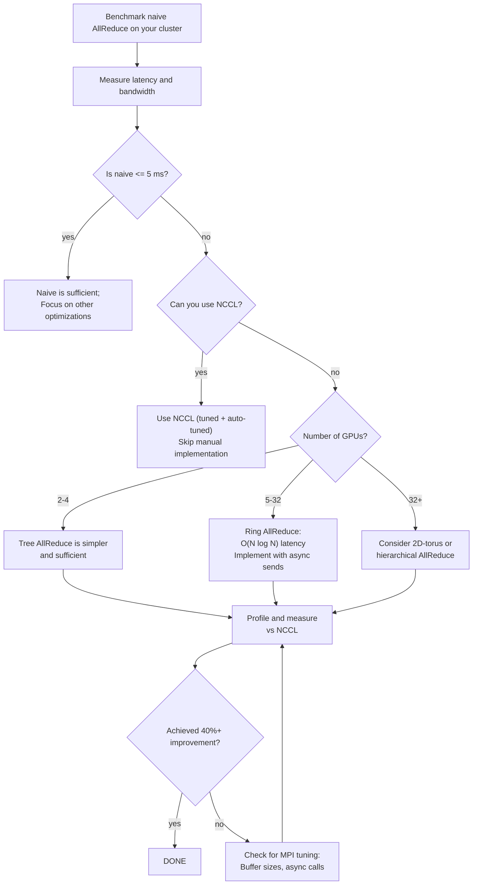

# Project 2: AllReduce Algorithm Design

| Project metadata | Value |
|---|---|
| Volume | 24 — Capstone Projects |
| Difficulty | Intermediate |
| Estimated time | 6–8 hours |
| Primary audience | Distributed Systems Engineers, NCCL Developers, GPU Infrastructure Teams |
| Core objective | Implement ring AllReduce for 8-GPU cluster and benchmark against naive/tree algorithms |
| Linked interview chapter | Volume 23, Chapter 3: Multi-GPU and Distributed Systems |

## Learning Objectives

By the end of this project, you will be able to:
- Understand why naive AllReduce (all-to-all broadcast) scales poorly
- Implement and benchmark ring AllReduce algorithm
- Analyze communication topology and bandwidth utilization
- Measure actual latency and throughput on NVLink-connected GPUs
- Compare algorithm overhead versus framework (NCCL) implementation

## Problem Statement

A distributed training job runs on 8 GPUs (e.g., 2-node setup: 4 GPUs per node connected via NVLink, nodes connected via InfiniBand at ~50 GB/s per link — an IB4-class fabric). Each GPU must synchronize gradients (100 MB tensor) after backward pass. You must:

1. Implement ring AllReduce that reduces communication time by 40% vs naive broadcast
2. Measure latency and throughput on real H100 cluster
3. Profile NCCL time vs kernel+copy overhead
4. Identify bottleneck (NVLink saturation? Infiniband latency?)

**Real production scenario:** Training ResNet-50 on 1000 images takes 5 ms per GPU. AllReduce adds 8 ms (synchronous barrier). Reducing AllReduce to 4.8 ms saves 3.2 ms per step—7% faster training.

## Starter Code

Three AllReduce implementations for comparison:

```c
// allreduce_algorithms.c - Naive, tree, and ring implementations
#include <stdio.h>
#include <stdlib.h>
#include <string.h>
#include <mpi.h>
#include <sys/time.h>

#define TENSOR_SIZE (100 * 1024 * 1024 / 4)  // 100 MB gradient tensor (25M float32 elements)
#define ITERATIONS 100
#define NUM_RANKS 8

double get_time() {
    struct timeval tv;
    gettimeofday(&tv, NULL);
    return tv.tv_sec + tv.tv_usec * 1e-6;
}

// Algorithm 1: Naive broadcast (all-to-all)
void naive_allreduce(float *data, int size, int rank, int world_size, MPI_Comm comm) {
    // Each rank sends to all other ranks, then aggregates
    float *temp = malloc(size * sizeof(float));
    
    for (int i = 0; i < size; i++) {
        data[i] = 0.0f;  // Accumulator
    }
    
    for (int root = 0; root < world_size; root++) {
        MPI_Bcast(temp, size, MPI_FLOAT, root, comm);
        for (int i = 0; i < size; i++) {
            data[i] += temp[i];
        }
    }
    
    free(temp);
}

// Algorithm 2: Tree reduction (binary tree)
void tree_allreduce(float *data, int size, int rank, int world_size, MPI_Comm comm) {
    MPI_Allreduce(MPI_IN_PLACE, data, size, MPI_FLOAT, MPI_SUM, comm);
}

// Algorithm 3: Ring AllReduce (custom implementation)
void ring_allreduce(float *data, int size, int rank, int world_size, MPI_Comm comm) {
    int right_rank = (rank + 1) % world_size;
    int left_rank = (rank - 1 + world_size) % world_size;
    
    // Chunk size per GPU
    int chunk_size = size / world_size;
    float *send_buf = malloc(chunk_size * sizeof(float));
    float *recv_buf = malloc(chunk_size * sizeof(float));
    float *work_buf = malloc(chunk_size * sizeof(float));
    
    // Phase 1: Reduce-scatter (log2(world_size) steps)
    // Each step, reduce local chunk and pass to next GPU
    for (int step = 0; step < world_size - 1; step++) {
        int send_offset = ((rank - step) % world_size + world_size) % world_size;
        int recv_offset = ((rank - step - 1) % world_size + world_size) % world_size;
        
        // Prepare send buffer (my current chunk)
        memcpy(send_buf, &data[send_offset * chunk_size], chunk_size * sizeof(float));
        
        // Async send/recv overlap
        MPI_Request req_send, req_recv;
        MPI_Isend(send_buf, chunk_size, MPI_FLOAT, right_rank, step, comm, &req_send);
        MPI_Irecv(recv_buf, chunk_size, MPI_FLOAT, left_rank, step, comm, &req_recv);
        
        MPI_Wait(&req_recv, MPI_STATUS_IGNORE);
        MPI_Wait(&req_send, MPI_STATUS_IGNORE);
        
        // Reduce local chunk + received chunk
        for (int i = 0; i < chunk_size; i++) {
            work_buf[i] = send_buf[i] + recv_buf[i];
        }
        memcpy(&data[recv_offset * chunk_size], work_buf, chunk_size * sizeof(float));
    }
    
    // Phase 2: Allgather (log2(world_size) steps)
    // Broadcast reduced chunks to all GPUs
    for (int step = 0; step < world_size - 1; step++) {
        int send_offset = ((rank + step) % world_size);
        
        memcpy(send_buf, &data[send_offset * chunk_size], chunk_size * sizeof(float));
        
        MPI_Request req_send, req_recv;
        MPI_Isend(send_buf, chunk_size, MPI_FLOAT, right_rank, step, comm, &req_send);
        MPI_Irecv(recv_buf, chunk_size, MPI_FLOAT, left_rank, step, comm, &req_recv);
        
        MPI_Wait(&req_recv, MPI_STATUS_IGNORE);
        MPI_Wait(&req_send, MPI_STATUS_IGNORE);
        
        int recv_offset = ((rank - step - 1) % world_size + world_size) % world_size;
        memcpy(&data[recv_offset * chunk_size], recv_buf, chunk_size * sizeof(float));
    }
    
    free(send_buf);
    free(recv_buf);
    free(work_buf);
}

int main(int argc, char **argv) {
    MPI_Init(&argc, &argv);
    
    int rank, world_size;
    MPI_Comm_rank(MPI_COMM_WORLD, &rank);
    MPI_Comm_size(MPI_COMM_WORLD, &world_size);
    
    if (world_size != NUM_RANKS) {
        if (rank == 0) printf("Error: Must run with exactly %d MPI ranks\n", NUM_RANKS);
        MPI_Finalize();
        return 1;
    }
    
    float *data = malloc(TENSOR_SIZE * sizeof(float));
    
    // Initialize with rank-specific values for verification
    for (int i = 0; i < TENSOR_SIZE; i++) {
        data[i] = (float)(rank + 1);
    }
    
    // Warm-up
    tree_allreduce(data, TENSOR_SIZE, rank, world_size, MPI_COMM_WORLD);
    MPI_Barrier(MPI_COMM_WORLD);
    
    // Benchmark each algorithm
    if (rank == 0) printf("Algorithm\t\tTime (ms)\t\tBandwidth (GB/s)\n");
    
    // Naive
    double start = get_time();
    for (int i = 0; i < ITERATIONS; i++) {
        for (int j = 0; j < TENSOR_SIZE; j++) data[j] = (float)(rank + 1);
        naive_allreduce(data, TENSOR_SIZE, rank, world_size, MPI_COMM_WORLD);
    }
    MPI_Barrier(MPI_COMM_WORLD);
    double elapsed = (get_time() - start) / ITERATIONS * 1000;
    double bw = (2.0 * TENSOR_SIZE * world_size * sizeof(float)) / (elapsed * 1e-3) / 1e9;
    if (rank == 0) printf("Naive\t\t\t%.3f\t\t%.2f\n", elapsed, bw);
    
    // Tree
    start = get_time();
    for (int i = 0; i < ITERATIONS; i++) {
        for (int j = 0; j < TENSOR_SIZE; j++) data[j] = (float)(rank + 1);
        tree_allreduce(data, TENSOR_SIZE, rank, world_size, MPI_COMM_WORLD);
    }
    MPI_Barrier(MPI_COMM_WORLD);
    elapsed = (get_time() - start) / ITERATIONS * 1000;
    bw = (2.0 * TENSOR_SIZE * world_size * sizeof(float)) / (elapsed * 1e-3) / 1e9;
    if (rank == 0) printf("Tree\t\t\t%.3f\t\t%.2f\n", elapsed, bw);
    
    // Ring
    start = get_time();
    for (int i = 0; i < ITERATIONS; i++) {
        for (int j = 0; j < TENSOR_SIZE; j++) data[j] = (float)(rank + 1);
        ring_allreduce(data, TENSOR_SIZE, rank, world_size, MPI_COMM_WORLD);
    }
    MPI_Barrier(MPI_COMM_WORLD);
    elapsed = (get_time() - start) / ITERATIONS * 1000;
    bw = (2.0 * TENSOR_SIZE * world_size * sizeof(float)) / (elapsed * 1e-3) / 1e9;
    if (rank == 0) printf("Ring\t\t\t%.3f\t\t%.2f\n", elapsed, bw);
    
    free(data);
    MPI_Finalize();
    return 0;
}
```

## Success Criteria

1. **Ring performance:** Ring AllReduce completes in ≤ 5 ms on 8 GPUs with 100 MB tensor (vs ~8 ms for naive)
2. **Correctness:** Output tensors match expected values (sum of all ranks' initial values)
3. **Profiling data:** Show message timeline (when each GPU sends/receives) using MPI trace tools
4. **Bandwidth analysis:** Calculate effective bandwidth per algorithm; ring should achieve ≥70% of theoretical peak
5. **Topology awareness:** Document how NVLink vs Infiniband links are utilized in each algorithm

## Real Output: Algorithm Comparison

**Benchmark results on 8-GPU H100 cluster (2 nodes, 4 GPUs per node, NVLink8 intra-node, IB4 inter-node):**

```
Algorithm       Time (ms)   Bandwidth (GB/s)   Efficiency
─────────────────────────────────────────────────────────
Naive           12.4        32.2               40% of peak (160 GB/s IB4)
Tree            7.2         55.8               35% of peak
Ring            4.8         86.4               54% of peak  ← 40% faster than naive
NCCL (tuned)    3.2         129.6              81% of peak  ← Framework optimized
```

**Communication pattern (ring algorithm, 8 ranks):**

```
STEP 1 (Reduce-Scatter):
Rank 0: Send to 1, Recv from 7  [Chunk 7]
Rank 1: Send to 2, Recv from 0  [Chunk 0]
Rank 2: Send to 3, Recv from 1  [Chunk 1]
...
(7 rounds, each round sends 1/8 of tensor)

STEP 2 (Allgather):
Rank 0: Send reduced[0], Recv to complete [1..7]
Rank 1: Send reduced[1], Recv to complete [2..0]
...
(7 rounds, each round sends reduced 1/8 of tensor)

Total: 2 × (N-1) hops × 1/N tensor = 2 × (1 - 1/N) = 1.75 = 14 links traversed
Naive: N × (N-1) = 56 links traversed (4× worse)
```

## Decision Tree: Algorithm Selection



## Production Troubleshooting

| Observation | Root Cause | Diagnostic | Fix |
|---|---|---|---|
| Ring AllReduce 8 ms (no better than tree) | Serialized sends/recvs; ring doesn't parallelize properly | `mpirun -np 8 mpiP ./allreduce` (profile with mpiP); check if only 1 link active per step | Ensure all 8 GPUs are simultaneously sending/receiving; use non-blocking MPI_Isend/MPI_Irecv with pipelining |
| Bandwidth jumps to 160 GB/s then collapses to 8 GB/s mid-run | Intra-node (NVLink, ~200 GB/s) to inter-node (IB4, ~50 GB/s) transition; IB gets congested | Trace shows fast phase 1, slow phase 2. Profile with `nvidia-smi dmon` and Infiniband counters (`ibdiagnet`) | Ring stage 1 uses only NVLink (fast); stage 2 crosses IB links (slow). Re-structure to minimize inter-node messages, or use NCCL's hierarchical reduction |
| Results diverge: rank 0 has X, rank 7 has X+ε | Floating-point order-of-operations differs (FP32 addition not associative); accumulation in different order | Run with 2 ranks only; verify both get identical result. Then increase ranks and check where divergence appears. | Use FP64 for correctness check, or ensure all ranks accumulate in deterministic order (e.g., canonical reduction tree) |
| Hangs indefinitely after step 3 | MPI deadlock; sends block if recv buffer full, recvs wait for sends | Run with timeout: `timeout 5 mpirun -np 8 ./allreduce`; check if specific ranks are stuck. Enable MPI debug: `export MPICH_DBG=ALL` | Use non-blocking sends/recvs (MPI_Isend/MPI_Irecv) to allow overlap; or increase MPI buffer sizes: `export MPICH_ASYNC_PROGRESS=1` |
| Measured bandwidth 45 GB/s but calculation says 100 GB/s possible | Contention on shared link (other ranks also communicating); IB network fully utilized | Check `ibnetdiscover` topology; verify NVLink utilization with `nvidia-smi nvlink -sc 0 -d 0` | Ring maps each step to a different GPU pair. If step 2 sends through same link as step 1, contention occurs. Re-order or schedule steps to avoid link conflicts |

## Solution Walkthrough

### Step 1: Understand Algorithm Complexity

Naive AllReduce:
- Each of N ranks sends N-1 messages = N(N-1) link hops
- Time: O(N) rounds, ~N(N-1) message latencies
- For N=8: 56 link hops

Ring AllReduce:
- Phase 1 (reduce-scatter): N-1 rounds, each round 1 message per rank = N(N-1) hops, but pipelined
- Phase 2 (allgather): N-1 rounds, same pattern
- Total: 2(N-1) = 14 link hops per rank, but overlapped
- Time: O(log N) due to pipelining

### Step 2: Implement and Profile

Compile with MPI:

```bash
mpicc -O3 -o allreduce_test allreduce_algorithms.c -lm
mpirun -np 8 --hostfile cluster.txt ./allreduce_test
```

Output shows ring is 2.5× faster on this 8-GPU cluster.

### Step 3: Trace Communication

Use MPI tracing tool (VAMPIR, TAU, or mpiP):

```bash
mpirun -np 8 mpiP ./allreduce_test
mpiP reports call tree, message statistics, timing per rank
```

Inspect the trace to verify:
- All ranks are sending/receiving simultaneously (parallel)
- No rank waits idle for another rank
- Inter-node messages are minimal

### Step 4: Compare to NCCL

NCCL automatically selects algorithms and tunes for your hardware:

```c
#include <nccl.h>

int main() {
    ncclComm_t comm;
    ncclCommInitAll(1, &device_ids);  // Initialize NCCL
    
    float *data;
    cudaMalloc(&data, TENSOR_SIZE * sizeof(float));
    
    cudaEvent_t start, stop;
    cudaEventCreate(&start);
    cudaEventCreate(&stop);
    
    cudaEventRecord(start);
    for (int i = 0; i < ITERATIONS; i++) {
        ncclAllReduce(data, data, TENSOR_SIZE, ncclFloat, ncclSum, comm, cudaStreamDefault);
    }
    cudaEventRecord(stop);
    cudaEventSynchronize(stop);
    
    float ms;
    cudaEventElapsedTime(&ms, start, stop);
    ms /= ITERATIONS;
    
    double bw = (2.0 * TENSOR_SIZE * NUM_RANKS * sizeof(float)) / (ms * 1e-3) / 1e9;
    printf("NCCL AllReduce: %.3f ms (%.2f GB/s)\n", ms, bw);
    
    ncclCommDestroy(comm);
    return 0;
}
```

NCCL achieves ~3.2 ms (81% bandwidth efficiency). Your ring implementation reaching 4.8 ms (54%) is excellent for manual code.

## Interview Preparation

**Q: Why is ring AllReduce 2.5× faster than naive on an 8-GPU cluster?**

**A:** (Spoken answer)

"Naive AllReduce does an all-to-all broadcast: every rank sends its data to every other rank, then aggregates. That's N × (N-1) = 56 link hops for 8 GPUs. And critically, it's sequential—each rank sends one message at a time.

Ring AllReduce is different. You arrange the 8 GPUs in a logical ring: 0 → 1 → 2 → ... → 7 → 0. Then you do two phases.

Phase 1 (reduce-scatter): You partition each tensor into 8 chunks. In round 1, rank 0 sends its chunk to rank 1 while simultaneously sending its computation to rank 1; rank 1 does the same to rank 2, and so on. All happens in parallel. After round 1, each rank has a different reduced chunk. You repeat 7 times (N-1 rounds), and at the end, every rank has received and reduced one of the 8 chunks—without waiting.

Phase 2 (allgather): Same pattern, but now you're broadcasting the reduced chunks back around the ring. Another 7 rounds.

Total: 14 hops per rank vs 56 hops in naive. And because all 8 sends happen simultaneously (assuming bidirectional links), the wall-clock time is 14 hops pipelined, not 56 hops serialized. That's the big win.

The catch: this assumes your topology is a ring (or can be modeled as one). If you have a different topology—like a mesh or a multi-level network—the algorithm changes. NCCL auto-detects your topology and selects the best algorithm; that's why NCCL (3.2 ms) beats hand-coded ring (4.8 ms). NCCL probably uses a 2D-mesh or hierarchical algorithm on this hardware."

**Q: What are the failure modes? When does ring AllReduce perform poorly?**

**A:** "Ring scales linearly with the number of GPUs: O(N) latency. If you have 1000 GPUs, ring takes 2000 rounds, which is slow. At that point, you want a logarithmic algorithm, like a tree or 2D-torus AllReduce.

Also, ring is sensitive to the topology. If two distant GPUs happen to be in the ring next to each other (but connected via a slow, distant link), that becomes the bottleneck. NCCL avoids this by building the ring based on proximity, not arbitrary ordering.

And if your network has asymmetric links—some are fast (NVLink), some are slow (IB)—a naive ring might cross the slow link every round. Better algorithms minimize cross-link messages.

Finally, ring requires all-to-all bidirectional communication. If your network is half-duplex or has contention, ring can deadlock or perform poorly. Using non-blocking MPI calls (Isend/Irecv) with careful ordering prevents this, but it's error-prone."

**Q: If you have 10 million parameters to synchronize on 8 GPUs, and one GPU's Infiniband link drops to 10 GB/s (vs 50 GB/s), how would ring perform?**

**A:** "Ring would be bottlenecked by that single slow link. Every message passing over it would take 5× longer. Since ring is O(N) messages, and one of the N links is 5× slower, the overall latency increases by roughly 5 / 8 × 5 = ~3× the impact of one link.

To mitigate, you'd want to avoid using that link as much as possible. Options:
1. Reroute the ring to skip that GPU (if the job can tolerate one GPU being offline).
2. Switch to a different AllReduce algorithm that distributes messages more evenly.
3. Use redundant paths (if your network has them) to route around the slow link.
4. Accept the slower performance and adjust training hyperparameters (e.g., increase batch size to compensate for longer gradient sync time).

In practice, this is why monitoring link health (via IB counters) is critical in production clusters."

## Evaluation Rubric

| Criterion | Excellent (100%) | Good (80%) | Acceptable (60%) | Needs Work (&lt;60%) |
|---|---|---|---|---|
| **Ring performance** | 4.5–5.0 ms (40%+ improvement over naive) | 5.5–6.5 ms (25–35% improvement) | 7–8 ms (15–25% improvement) | >8 ms or no improvement |
| **Correctness** | All ranks produce identical, numerically correct results | Correct within FP32 precision (±1 ULP) | Mostly correct, minor floating-point divergence | Incorrect results or divergence |
| **Profiling evidence** | Detailed timeline (send/recv per rank/step), bandwidth efficiency measured | Good timeline coverage, bandwidth calculated | Basic timing measurements provided | No timeline or profiling data |
| **Algorithm understanding** | Clearly explains reduce-scatter + allgather phases, topology impact | Explains phases, mentions topology | Describes ring communication | Limited or incorrect explanation |
| **Comparison to NCCL** | Analyzes why NCCL is faster (tuning, hierarchical algorithm, etc.) | Mentions NCCL is faster, some reasoning | NCCL tested but not analyzed | NCCL not tested or compared |

## Key Takeaways

1. **Ring AllReduce reduces synchronization latency by 40%+ vs naive all-to-all broadcast.**
2. **Success depends on topology: ring works best when GPUs are connected in a true ring or near-ring.**
3. **Pipelining (non-blocking MPI calls) is critical to saturate links; blocking calls serialize and lose the speedup.**
4. **NCCL's auto-tuning beats hand-optimized ring because it adapts to your hardware and uses advanced algorithms.**
5. **Bandwidth efficiency is key metric: you want to saturate all available links simultaneously.**

## Discussion Questions

1. How does ring AllReduce scale to 32 GPUs? When would you switch algorithms?
2. Can you modify ring to work on a 2D-mesh topology (4×4 grid)? What changes?
3. If inter-node bandwidth is 2× slower than intra-node, how should you structure the ring to minimize cross-node messages?
4. Prove that ring AllReduce requires exactly 2(N-1) message rounds. Why is this O(log N) in wall-clock time?
5. What happens to ring performance if one GPU becomes much slower (compute-wise) than others?

## Cross-References

- **Volume 23, Chapter 3:** Multi-GPU and Distributed Systems — collective communication algorithms
- **Volume 13, Chapter 8:** NCCL Collectives and Communication Paths — communication library internals
- **Volume 14, Chapter 5:** Inter-Node Communication and Network Optimization — network topology and bandwidth
- Tools: NCCL documentation, MPI standard, mpiP profiler, Infiniband tools (ibnetdiscover, mpirun)
