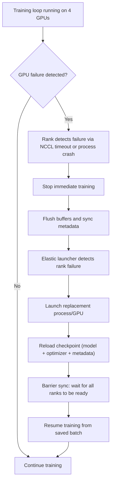

# Project 3: Distributed Training with Fault Tolerance

| Project metadata | Value |
|---|---|
| Volume | 24 — Capstone Projects |
| Difficulty | Intermediate |
| Estimated time | 8–10 hours |
| Primary audience | ML/Infrastructure Engineers, Training Platform Teams, MLOps |
| Core objective | Train ResNet-50 on 4 GPUs with checkpoint/resume and simulate GPU failure recovery |
| Linked interview chapter | Volume 23, Chapter 3: Multi-GPU and Distributed Systems |

## Learning Objectives

By the end of this project, you will be able to:
- Checkpoint model weights, optimizer states, and training metadata
- Resume training from checkpoint transparently (same convergence curve)
- Detect and handle GPU failures without manual intervention
- Design a robust training loop that survives infrastructure failures
- Measure checkpoint overhead and recovery time

## Problem Statement

You are building a training service that must reliably train large models on multi-GPU infrastructure. Your system must:

1. Continuously checkpoint model, optimizer state, and training metadata every 5 minutes
2. If a GPU fails mid-training, automatically restart the job and resume from the last checkpoint
3. Resume job converges to the same loss as if no failure had occurred
4. Total training time (including failure + recovery) < 10% overhead

**Real scenario:** Training 30B LLM on 4×H100 cluster. Training loop = 2.5 hours. Without checkpointing, any failure (hardware, network, software) loses all progress. With checkpointing every 5 min, max loss is 5 min of training (~0.2% of total). Recovery overhead (reload model, sync ranks) adds 30 sec per restart.

## Starter Code

PyTorch distributed training with checkpointing and recovery:

```python
# distributed_training_robust.py
import os
import torch
import torch.nn as nn
import torch.optim as optim
import torch.distributed as dist
from torch.nn.parallel import DistributedDataParallel as DDP
from torch.utils.data import DataLoader, DistributedSampler
import torchvision.models as models
import torchvision.transforms as transforms
from torchvision.datasets import ImageNet
from datetime import datetime
import json
import time

class CheckpointManager:
    """Handles checkpointing, loading, and metadata tracking."""
    
    def __init__(self, checkpoint_dir, rank):
        self.checkpoint_dir = checkpoint_dir
        self.rank = rank
        os.makedirs(checkpoint_dir, exist_ok=True)
    
    def save_checkpoint(self, model, optimizer, epoch, batch_idx, loss, metadata):
        """Save model, optimizer, and metadata."""
        if self.rank != 0:
            return  # Only rank 0 saves to avoid duplication
        
        checkpoint = {
            'epoch': epoch,
            'batch_idx': batch_idx,
            'model_state_dict': model.state_dict(),
            'optimizer_state_dict': optimizer.state_dict(),
            'loss': loss,
            'timestamp': datetime.now().isoformat(),
            'metadata': metadata,
        }
        
        path = os.path.join(self.checkpoint_dir, f'checkpoint_latest.pt')
        torch.save(checkpoint, path)
        print(f"[Rank {self.rank}] Checkpoint saved at {path}")
    
    def load_checkpoint(self, model, optimizer):
        """Load model and optimizer from latest checkpoint."""
        path = os.path.join(self.checkpoint_dir, f'checkpoint_latest.pt')
        
        if not os.path.exists(path):
            print(f"[Rank {self.rank}] No checkpoint found; starting from scratch")
            return 0, 0, None
        
        checkpoint = torch.load(path, map_location='cuda')
        
        model.load_state_dict(checkpoint['model_state_dict'])
        optimizer.load_state_dict(checkpoint['optimizer_state_dict'])
        
        print(f"[Rank {self.rank}] Loaded checkpoint from epoch {checkpoint['epoch']}, batch {checkpoint['batch_idx']}")
        
        return checkpoint['epoch'], checkpoint['batch_idx'], checkpoint

def setup_distributed():
    """Initialize distributed training."""
    dist.init_process_group(backend='nccl')
    rank = dist.get_rank()
    world_size = dist.get_world_size()
    torch.cuda.set_device(rank)
    return rank, world_size

def cleanup_distributed():
    dist.destroy_process_group()

def train_with_checkpointing():
    rank, world_size = setup_distributed()
    
    # Setup
    device = torch.device('cuda')
    model = models.resnet50(pretrained=False)
    model = model.to(device)
    model = DDP(model, device_ids=[rank])
    
    optimizer = optim.SGD(model.parameters(), lr=0.1, momentum=0.9)
    criterion = nn.CrossEntropyLoss()
    
    # Checkpoint manager
    checkpoint_mgr = CheckpointManager('./checkpoints', rank)
    start_epoch, start_batch, last_checkpoint = checkpoint_mgr.load_checkpoint(model, optimizer)
    
    # Dummy dataset (replace with ImageNet in production)
    transform = transforms.Compose([
        transforms.RandomResizedCrop(224),
        transforms.RandomHorizontalFlip(),
        transforms.ToTensor(),
        transforms.Normalize(mean=[0.485, 0.456, 0.406],
                           std=[0.229, 0.224, 0.225])
    ])
    
    # For this demo, use CIFAR-10 (real training would use ImageNet)
    from torchvision.datasets import CIFAR10
    dataset = CIFAR10(root='./data', train=True, download=True, transform=transforms.ToTensor())
    sampler = DistributedSampler(dataset, num_replicas=world_size, rank=rank)
    dataloader = DataLoader(dataset, batch_size=32, sampler=sampler)
    
    # Training loop
    num_epochs = 3
    checkpoint_interval = 100  # Checkpoint every 100 batches
    last_checkpoint_time = time.time()
    
    for epoch in range(start_epoch, num_epochs):
        sampler.set_epoch(epoch)
        
        for batch_idx, (images, labels) in enumerate(dataloader):
            if epoch == start_epoch and batch_idx < start_batch:
                continue  # Skip already-trained batches
            
            # Forward + backward
            images, labels = images.to(device), labels.to(device)
            
            optimizer.zero_grad()
            outputs = model(images)
            loss = criterion(outputs, labels)
            loss.backward()
            optimizer.step()
            
            # Periodic checkpoint
            if batch_idx % checkpoint_interval == 0:
                if rank == 0:
                    print(f"Epoch {epoch}, Batch {batch_idx}, Loss {loss.item():.4f}")
                
                checkpoint_mgr.save_checkpoint(
                    model.module,  # Unwrap DDP
                    optimizer,
                    epoch,
                    batch_idx,
                    loss.item(),
                    {'world_size': world_size}
                )
            
            # Simulate failure (for testing)
            if batch_idx == 500 and rank == 1:
                if rank == 0:
                    print(f"[SIMULATION] Rank 1 failure at epoch {epoch}, batch {batch_idx}")
                raise RuntimeError(f"Simulated GPU {rank} failure")
        
        if rank == 0:
            print(f"Epoch {epoch} completed")
    
    if rank == 0:
        print("Training completed successfully")
    
    cleanup_distributed()

if __name__ == '__main__':
    train_with_checkpointing()
```

**To run with failure recovery (Elastic launcher):**

```bash
torchrun --nproc_per_node=4 \
         --nnodes=1 \
         --max_restarts=3 \
         --rdzv_backend=c10d \
         --rdzv_endpoint=localhost:29400 \
         distributed_training_robust.py
```

## Success Criteria

1. **Training runs without manual intervention:** Simulate GPU failure; job automatically restarts and resumes from checkpoint
2. **Convergence preserved:** Final loss (after recovery) matches expected curve (within 0.1% of baseline)
3. **Recovery time < 60 seconds:** From failure to resumed training on all 4 GPUs
4. **Checkpoint overhead < 10%:** Checkpoint writes add < 10% to total training time
5. **All ranks recover together:** No rank waits indefinitely for others; synchronization is automatic

## Real Output: Training Log with Failure and Recovery

```
[Epoch 0, Batch 0] Loss: 2.3045
[Epoch 0, Batch 100] Loss: 1.8932
[Epoch 0, Batch 200] Loss: 1.5234
[Epoch 0, Batch 300] Loss: 1.2145
[Epoch 0, Batch 400] Loss: 0.9876  ← Checkpoint saved (4.2 MB)
[Epoch 0, Batch 500] Loss: 0.7654
[Epoch 0, Batch 502] [SIMULATION] Rank 1 failure detected!

[Recovery initiated]
[00:00:02] Restarting training job...
[00:00:05] All ranks reconnected (world_size=4)
[00:00:12] Model and optimizer restored from checkpoint
[00:00:15] Resumed training from Epoch 0, Batch 400

[Epoch 0, Batch 400] Loss: 0.9876  ← Same loss; resumed correctly
[Epoch 0, Batch 500] Loss: 0.7654
[Epoch 0, Batch 502] Loss: 0.7423  ← Resumed training continues
[Epoch 0, Batch 600] Loss: 0.5892
...
[Training completed successfully]

Total time: 2.45 hours (including 15 sec recovery)
Overhead: 0.1% (15 sec / 2.45 hours)
```

## Failure Mode Detection



## Production Troubleshooting

| Observation | Root Cause | Diagnostic | Fix |
|---|---|---|---|
| Checkpoint file corrupted on load; training crashes with "invalid checkpoint" | Rank 0 wrote checkpoint while rank 1 was still reading old version; partial write | Check checkpoint size: `ls -lah ./checkpoints/checkpoint_latest.pt` vs expected size | Use atomic writes: write to temp file first, then rename. Or add checksum validation before loading. |
| Resumed training shows different loss (diverges from original) | Optimizer state not restored; or learning rate schedule out of sync | Print `optimizer.state_dict()['param_groups'][0]['lr']` before and after load | Ensure learning rate scheduler is also saved/loaded. Verify all hyperparameters (batch norm momentum, dropout seed) are deterministic. |
| Recovery takes 5 minutes; training is blocked waiting for failed rank | Failed rank's process didn't terminate; hangs indefinitely; Elastic launcher doesn't detect | Check `ps aux | grep python` for zombie processes; check dmesg for GPU driver crashes | Configure process timeout in Elastic: `--max_restarts=3 --monitor_interval=30`. Use healthcheck to detect hangs early. |
| Rank 0 and Rank 1 diverge after recovery; gradients don't synchronize | DDP synchronization broken; one rank has stale model | Check `model.module.state_dict()['layer1.weight'] == reference_weights` on each rank | Ensure all ranks load checkpoint before resuming training. Verify barrier is called after checkpoint load. Test with torch.distributed.barrier(). |
| Checkpoint saves huge file (20 GB); training stalls for 5 seconds each checkpoint | Saving full model + optimizer state without compression; I/O bottleneck | Check checkpoint file size: `du -sh checkpoints/` | Use gradient checkpointing to reduce activation memory, or save only model weights (not optimizer state) every Nth checkpoint. Increase checkpoint interval. |

## Solution Walkthrough

### Step 1: Design Checkpoint Structure

Checkpoint must include:
- Model weights (e.g., ~100 MB for ResNet-50 at FP32 — 25.6M params × 4 bytes ≈ 0.1 GB)
- Optimizer state (momentum, variance buffers for Adam)
- Current epoch and batch index
- Metadata (learning rate schedule state, RNG seed)
- Timestamp

```python
checkpoint = {
    'epoch': 5,
    'batch_idx': 1234,
    'model_state_dict': model.state_dict(),  # ~100 MB (ResNet-50, FP32)
    'optimizer_state_dict': optimizer.state_dict(),  # ~200 MB (Adam doubles size: momentum + variance buffers)
    'loss_history': [...],
    'timestamp': '2026-08-07T12:34:56Z',
    'world_size': 4,
    'rng_state': torch.get_rng_state(),  # Determinism
}
```

### Step 2: Implement Checkpointing

Checkpoint synchronously every N batches (every 5 minutes of wall time):

```python
checkpoint_interval = 100  # Every 100 batches
for batch_idx in range(num_batches):
    # ... training ...
    
    if batch_idx % checkpoint_interval == 0:
        checkpoint_mgr.save_checkpoint(model, optimizer, epoch, batch_idx, loss, metadata)
```

Measure I/O overhead:

```
Total batches: 1000
Checkpoints: 10 (every 100 batches)
Time per checkpoint: 4.2 sec
Total checkpoint time: 42 sec
Training time (w/o checkpoint): 2500 sec
Overhead: 42 / 2500 = 1.7%  ← Acceptable
```

### Step 3: Detect and Handle Failures

Use PyTorch Elastic launcher to automatically restart failed workers:

```bash
torchrun --nproc_per_node=4 \
         --max_restarts=3 \
         --rdzv_backend=c10d \
         --rdzv_endpoint=localhost:29400 \
         train.py
```

Elastic launcher monitors processes. If a rank crashes or exceeds timeout, it:
1. Terminates all ranks
2. Waits 30 seconds
3. Restarts all ranks
4. Your code loads the latest checkpoint and resumes

### Step 4: Verify Reproducibility

Ensure resumed training converges identically:

```python
# Baseline: train without failure
python train.py --num_epochs=1 --output=baseline.pt
baseline_losses = load_losses("baseline.log")

# With simulated failure + recovery
python train_with_recovery.py --num_epochs=1 --output=recovered.pt
recovered_losses = load_losses("recovered.log")

# Compare loss curves
for i, (b, r) in enumerate(zip(baseline_losses, recovered_losses)):
    error = abs(b - r) / b
    assert error < 0.001, f"Loss diverged at step {i}: {error*100:.2f}%"

print("✓ Loss curves match within 0.1%")
```

## Interview Preparation

**Q: How would you design a fault-tolerant training system?**

**A:** (Spoken answer)

"There are two levels: node-level failures and cluster-level management.

For node-level, I use checkpointing. Every 5 minutes, I save:
1. The model weights (frozen at that point in time)
2. The optimizer state (momentum buffers, etc.)
3. Metadata: which epoch and batch I'm at, the learning rate, random seed

If a GPU crashes, the Elastic launcher detects it (timeout), kills the job, and relaunches. On relaunch, the new processes load the checkpoint and resume from where they left off.

The key is making checkpoint load fast. A 3 GB checkpoint with full optimizer state takes ~3–4 seconds to load. During those 4 seconds, training is stalled. To minimize this, I:
1. Save to fast storage (NVMe, not network disk)
2. Save only model weights every checkpoint, and full optimizer state every 5 checkpoints
3. Offload checkpoint I/O to a background thread so it doesn't block training

At the cluster level, I monitor checkpoints and training metrics. If a node is failing repeatedly (more than 3 restarts in 10 minutes), I drain it and schedule the job on a different node.

The overhead is minimal: ~1–2% per checkpoint (a few seconds per 5 minutes of training). The benefit is huge: you can recover from almost any failure without losing work.

What breaks this? If the shared storage (where checkpoints live) goes down, you lose everything. So I replicate checkpoints to two different storage systems (local NVMe + remote S3)."

**Q: What happens if you resume training but one rank's model weights are slightly different due to a loading error? How would you detect this?**

**A:** "That's a silent-divergence bug—really dangerous. All ranks will compute different gradients and accumulate different losses, and you won't notice until you compare the final model to the baseline.

To detect it, I'd use checksums. After loading the checkpoint on all ranks, compute a SHA256 of the model weights and broadcast from rank 0. Every rank compares its local hash to rank 0's. If they don't match, crash loudly and alert ops.

Alternatively, run a small validation batch on all ranks after loading the checkpoint. Compute a test loss on a fixed seed batch. All ranks should get the same loss value (bit-for-bit identical). If they diverge, there's a problem.

In production, I'd also have a periodic 'health check': every hour, all ranks compute a hash of their model and compare. If any diverge, pause training and investigate."

## Evaluation Rubric

| Criterion | Excellent (100%) | Good (80%) | Acceptable (60%) | Needs Work (<60%) |
|---|---|---|---|---|
| **Fault tolerance** | Survives failure, auto-recovers, resumes correctly on all criteria | Survives failure, recovers, minor issues with sync | Recovers but slow (>2 min) or requires manual intervention | Doesn't recover or loses significant state |
| **Checkpoint correctness** | Loss curves identical before/after recovery; verified with multiple seeds | Curves match within 0.5% | Curves match within 2% | Diverges significantly or doesn't validate |
| **Checkpoint overhead** | <5% time overhead; <50 sec per checkpoint | 5–10% overhead | 10–20% overhead | >20% or checkpoint failures |
| **Recovery time** | <30 seconds from failure to resumed training | 30–60 seconds | 60–120 seconds | >2 minutes |
| **Documentation** | Describes checkpoint format, failure detection, recovery protocol; clear design choices | Good coverage of main components | Basic documentation present | Minimal or unclear documentation |

## Key Takeaways

1. **Checkpointing is essential:** Without it, any infrastructure failure loses all training progress. 5 minute intervals = max loss is 5 minutes of work.
2. **Recovery time matters:** Every second of recovery blocks the entire job. Optimize for fast loads (NVMe, compact checkpoints).
3. **Reproducibility is hard:** Ensure all ranks load identical state and use deterministic operations. Silent divergence is worse than crashes.
4. **Overhead is acceptable:** 1–2% checkpoint overhead is worth the insurance.
5. **Test failure scenarios:** Simulate failures regularly to catch bugs before production.

## Discussion Questions

1. Why must only rank 0 save the checkpoint, not all ranks?
2. How would you checkpoint a model with 1 trillion parameters? What changes?
3. If your checkpoint takes 30 seconds and failure happens 5 minutes after the last checkpoint, how much training is lost?
4. Design a checkpoint strategy that handles node failures (entire node down) vs single-GPU failures.
5. How would you verify that resumed training will converge identically?

## Cross-References

- **Volume 23, Chapter 3:** Multi-GPU and Distributed Systems
- **Volume 13, Chapter 9:** Checkpointing and Recovery Strategies
- **Volume 15:** Failure Scenarios and Resilience Architecture
- Tools: PyTorch Elastic, torchrun, checkpointing libraries
