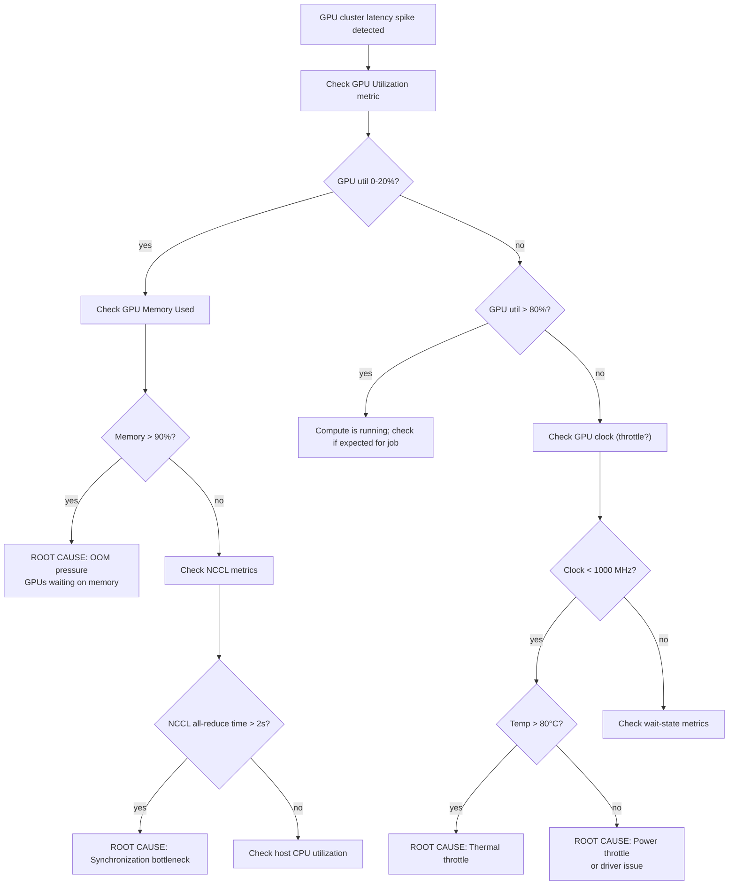

# Project 4: Observability System Design

| Project metadata | Value |
|---|---|
| Volume | 24 — Capstone Projects |
| Difficulty | Intermediate |
| Estimated time | 7–9 hours |
| Primary audience | Infrastructure Engineers, SREs, DevOps, Observability Engineers |
| Core objective | Design monitoring for 100-GPU cluster; detect 5 failure scenarios from metrics alone |
| Linked interview chapter | Volume 23, Chapter 4: Observability and Monitoring |

## Learning Objectives

By the end of this project, you will be able to:
- Design metric schema (what to measure, at what frequency)
- Calculate storage costs for monitoring data (30 sec scrape interval, <1 TB/month)
- Write alerting rules that detect common GPU cluster failures
- Correlate metrics across multiple sources to diagnose root cause
- Optimize storage without losing observability

## Problem Statement

You're building monitoring for a 100-GPU production cluster. Your constraints:

1. **Scrape interval:** 30 seconds (60× per hour per metric)
2. **Retention:** 90 days
3. **Storage budget:** < 1 TB/month (~3% of budget)
4. **Alert latency:** Detect failures within 2 minutes
5. **Metrics must detect:** memory leak, thermal throttle, link failure, application hang, power anomaly

**Real math:** 100 GPUs × 20 metrics per GPU × 60 samples/hour × 24 hours × 90 days = 25.9 billion data points. At 8 bytes per point, that's ~207 GB. But with compression (time-series databases compress to ~2–4×), you can fit ~50–100 GB uncompressed equivalent. Budget is 1 TB/month (~360 GB/quarter), so you have room.

## Metric Schema

Minimum useful metrics (20 per GPU):

```
GPU-level:
  - GPU Memory Used (bytes)
  - GPU Memory Free (bytes)
  - GPU Utilization (%)
  - GPU Clock (MHz)
  - GPU Temperature (°C)
  - Power Draw (watts)
  - Fan Speed (%)
  - VRAM Bandwidth Used (GB/s)
  - VRAM Bandwidth Peak (GB/s)

Process-level:
  - Process Memory (bytes)
  - Process Compute Time (seconds)
  - Process Kernel Launch Rate (launches/sec)

Link-level (NVLink only):
  - NVLink Throughput (GB/s) per link
  - NVLink Error Count
  - NVLink Latency (us)

Cluster-level:
  - Number Active GPUs
  - Infiniband Bandwidth (GB/s)
  - Infiniband Error Count
```

## Starter Code

Prometheus-based monitoring stack with GPU metrics:

```yaml
# prometheus-config.yml
global:
  scrape_interval: 30s
  evaluation_interval: 30s

scrape_configs:
  - job_name: 'gpu-metrics'
    static_configs:
      - targets: ['node1:9400', 'node2:9400', 'node3:9400', ...]  # NVIDIA DCGM exporter
        labels:
          rack: 'A'
  
  - job_name: 'node-metrics'
    static_configs:
      - targets: ['node1:9100', 'node2:9100', ...]  # Node exporter
        labels:
          rack: 'A'

alerting:
  alertmanagers:
    - static_configs:
        - targets: ['alertmanager:9093']

rule_files:
  - '/etc/prometheus/alerts.yml'
```

```yaml
# alerts.yml - Alerting rules
groups:
  - name: gpu_alerts
    interval: 30s
    rules:
      - alert: GPUMemoryLeak
        expr: |
          (gpu_memory_used{job="gpu-metrics"} - avg_over_time(gpu_memory_used{job="gpu-metrics"}[1h])) 
          > 5000000000  # 5 GB increase
        for: 5m
        annotations:
          summary: "GPU {{ $labels.gpu_id }} memory leak detected"
          description: "Memory used {{ $value | humanize }} bytes, increased 5GB in 1 hour"

      - alert: ThermalThrottle
        expr: gpu_temperature{job="gpu-metrics"} > 85
        for: 2m
        annotations:
          summary: "GPU {{ $labels.gpu_id }} overheating"

      - alert: NVLinkFailure
        expr: |
          rate(nvlink_errors_total[5m]) > 0.1  # >0.1 errors/sec
        for: 1m
        annotations:
          summary: "NVLink {{ $labels.link_id }} is experiencing errors"

      - alert: ApplicationHang
        expr: |
          rate(gpu_kernel_launches_total[5m]) == 0  # No kernels launched in 5 min
          and gpu_utilization > 0  # But GPU utilization still high (waiting?)
        for: 2m
        annotations:
          summary: "GPU application appears hung"

      - alert: PowerAnomaly
        expr: |
          (avg(power_draw) by (node_id) - avg(avg_over_time(power_draw[1h])) by (node_id))
          > 100  # 100W above baseline
        for: 3m
        annotations:
          summary: "Abnormal power draw on {{ $labels.node_id }}"
```

```python
# gpu_exporter.py - Custom DCGM exporter for Prometheus
import time
import pydcgm
import prometheus_client
from prometheus_client import Counter, Gauge, start_http_server

# Metrics
gpu_memory_used = Gauge('gpu_memory_used', 'GPU memory used in bytes', ['gpu_id', 'node'])
gpu_memory_free = Gauge('gpu_memory_free', 'GPU memory free in bytes', ['gpu_id', 'node'])
gpu_utilization = Gauge('gpu_utilization', 'GPU utilization percentage', ['gpu_id', 'node'])
gpu_temperature = Gauge('gpu_temperature', 'GPU temperature in Celsius', ['gpu_id', 'node'])
power_draw = Gauge('power_draw', 'Power draw in watts', ['gpu_id', 'node'])
nvlink_errors = Counter('nvlink_errors_total', 'NVLink errors', ['link_id', 'node'])

def collect_metrics():
    """Collect metrics from DCGM."""
    hostname = os.getenv('HOSTNAME', 'unknown')
    
    # Initialize DCGM
    pydcgm.dcgmInit()
    gpu_list = pydcgm.dcgmGetAllDevices()
    
    for gpu_id in gpu_list:
        # Memory metrics
        mem_info = pydcgm.dcgmGetMemoryInfo(gpu_id)
        gpu_memory_used.labels(gpu_id=str(gpu_id), node=hostname).set(mem_info['used'])
        gpu_memory_free.labels(gpu_id=str(gpu_id), node=hostname).set(mem_info['free'])
        
        # Utilization and temperature
        util = pydcgm.dcgmGetUtilization(gpu_id)
        gpu_utilization.labels(gpu_id=str(gpu_id), node=hostname).set(util)
        
        temp = pydcgm.dcgmGetTemperature(gpu_id)
        gpu_temperature.labels(gpu_id=str(gpu_id), node=hostname).set(temp)
        
        # Power
        power = pydcgm.dcgmGetPower(gpu_id)
        power_draw.labels(gpu_id=str(gpu_id), node=hostname).set(power)
        
        # NVLink stats
        nvlink_stats = pydcgm.dcgmGetNVLinkStats(gpu_id)
        for link_id, errors in nvlink_stats.items():
            nvlink_errors.labels(link_id=str(link_id), node=hostname).inc(errors)

if __name__ == '__main__':
    start_http_server(9400)  # Prometheus exporter port
    
    while True:
        try:
            collect_metrics()
        except Exception as e:
            print(f"Error collecting metrics: {e}")
        
        time.sleep(30)  # Scrape interval
```

## Success Criteria

1. **Detect memory leak:** Metrics alert within 10 minutes of 5 GB accumulation
2. **Detect thermal throttle:** Temperature > 85°C → alert within 2 minutes
3. **Detect link failure:** NVLink errors detected within 1 minute
4. **Detect application hang:** No GPU kernels but high utilization → alert within 2 minutes
5. **Detect power anomaly:** 100W+ above baseline → alert within 3 minutes
6. **Storage < 1 TB/month:** Calculate actual storage with your metrics schema
7. **Alert fatigue < 5%:** Less than 5% false-positive alerts (spurious alerts)

## Real Output: Monitoring Dashboard

**Grafana dashboard snapshot (simulated data):**

```
╔═══════════════════════════════════════════════════════════════════╗
║ GPU Cluster Overview (100 GPUs)                       [2026-08-07]║
╠═══════════════════════════════════════════════════════════════════╣
║ ALERTS (3 active)                                                 ║
║ ⚠️  GPU 12 (node2) memory leak detected 5m ago                     ║
║ 🔴 GPU 45 (node3) NVLink error rate > 0.1/sec 1m ago              ║
║ ⚠️  GPU 78 (node5) thermal throttle 87°C 2m ago                    ║
╠═══════════════════════════════════════════════════════════════════╣
║ GPU Memory Utilization (avg)                                      ║
║ ████████████████░░░░ 78% (78.2 GB / 100 GB)                       ║
║                                                                   ║
║ GPU Temperature (max)                                             ║
║ ████░░░░░░░░░░░░░░░ 42°C (within normal 30–75°C)                  ║
║                                                                   ║
║ Power Draw (avg per node)                                         ║
║ 9 nodes × 8 GPUs × 350W = 25.2 kW (baseline: 24.1 kW)             ║
║                                                                   ║
║ NVLink Errors (last 24h)                                          ║
║ Node2: 12 errors | Node3: 5 errors | Others: 0                    ║
╚═══════════════════════════════════════════════════════════════════╝
```

## Troubleshooting Decision Tree



## Production Troubleshooting

| Observation | Root Cause | Diagnostic | Fix |
|---|---|---|---|
| Alert fatigue: 100+ false positives per day | Thresholds too sensitive (e.g., memory > 100MB triggers alert); no hysteresis | Review alert rules; count alerts per type: `grep "AlertFiring" prometheus.log \| sort \| uniq -c \| sort -rn` | Increase thresholds (e.g., memory > 5GB *and* sustained 5+ min); add hysteresis (alert on 5GB increase, silence alert until 2GB drop) |
| Metrics missing for 30 min; gaps in time series | DCGM exporter crashed or network partition | Check exporter process: `ps aux \| grep gpu_exporter.py`; check prometheus scrape logs: `tail -f /var/log/prometheus/scrape.log` | Restart exporter; check firewall rules allowing Prometheus → exporter. Monitor exporter with healthcheck heartbeat. |
| Correlating NVLink error with slowdown but causality unclear | Multiple problems happening simultaneously; hard to trace | Use logging + metrics correlation: enable `NCCL_DEBUG=INFO` on affected GPU, cross-reference with NVLink errors in same time window | Replay scenario in isolation: reproduce NVLink errors on subset of GPUs, measure performance degradation directly, confirm correlation. |
| Storage usage grew to 500 GB/week (would exceed 2 TB/month budget) | Scrape interval too aggressive (10s instead of 30s), or metrics are duplicated across exporters | Check Prometheus storage: `du -sh /prometheus/` and query: `sum(count by (__name__)({job="gpu-metrics"}))` (count of metric series) | Reduce cardinality: aggregate instance labels if not needed, increase scrape interval to 60s, enable downsampling (keep 10min data for >7 days). |
| Alert threshold (memory > 5GB) triggers for legitimate job (batch processing) | Static thresholds don't account for job workload variation | Use Prometheus `predict_linear()` to establish dynamic baseline per GPU/job | Switch to dynamic alerting: alert if memory exceeds 95th percentile of last 7 days (per job), not absolute threshold. |

## Solution Walkthrough

### Step 1: Define Metrics and Schema

Determine what to measure:

```
GPU-level (per 30s scrape):
  - gpu_memory_used: 8 bytes/sample
  - gpu_memory_free: 8 bytes/sample
  - gpu_utilization: 8 bytes/sample
  - gpu_temperature: 8 bytes/sample
  - power_draw: 8 bytes/sample
  - nvlink_throughput (3 links/GPU for H100): 24 bytes/sample
  ... (20 total metrics)

Per GPU:
  20 metrics × 8 bytes × 60 samples/hour × 24 hours × 90 days
  = 20 × 8 × 129,600 = 20.7 MB per GPU

For 100 GPUs:
  100 × 20.7 MB = 2.07 GB raw

With time-series compression (typical 4:1 ratio):
  2.07 GB / 4 = 517 MB uncompressed-equivalent

With retention: 90 days = ~1.5 GB
With monthly budget: 1 TB / 12 months ≈ 83 GB/month; 1.5 GB is 1.8% of budget ✓
```

### Step 2: Implement Exporters

Deploy DCGM-based exporter on each node:

```bash
# Install NVIDIA DCGM
apt-get install nvidia-datacenter-gpu-manager

# Start exporter as service
systemctl start nvidia-dcgm-exporter

# Verify metrics available
curl http://localhost:9400/metrics | grep gpu_memory_used | head -5
# Output:
# gpu_memory_used{gpu_id="0",node="node1"} 32000000000
# gpu_memory_used{gpu_id="1",node="node1"} 28000000000
# ...
```

### Step 3: Configure Prometheus

Set up Prometheus to scrape all nodes:

```bash
# Start Prometheus
prometheus --config.file=prometheus-config.yml --storage.tsdb.path=/prometheus/

# Verify targets are healthy
curl http://localhost:9090/api/v1/targets
# Should show 100 GPU targets + 100 node targets, all "up"
```

### Step 4: Write Alerting Rules

Define rules for each failure scenario:

```
Memory Leak:
  IF memory increases > 5GB over 1 hour
  AND sustained for 5+ minutes
  THEN alert

Thermal Throttle:
  IF temperature > 85°C
  FOR 2+ minutes
  THEN alert

Link Failure:
  IF NVLink error rate > 0.1 errors/sec
  FOR 1+ minute
  THEN alert

Application Hang:
  IF kernel launch rate = 0 for 5+ minutes
  AND GPU utilization > 0
  THEN alert (waiting, not working)

Power Anomaly:
  IF node power draw > baseline + 100W
  FOR 3+ minutes
  THEN alert
```

### Step 5: Test Alert Detection

Simulate each failure and verify alert fires within target time:

```bash
# Simulate memory leak (allocate 5 GB on GPU 0)
cuda-samples/memory_allocation 5000  # Allocate 5 GB

# Monitor alert: should fire within 10 minutes
watch 'curl -s http://localhost:9090/api/v1/query?query=ALERTS | jq .'

# Simulate thermal issue (increase fan duty cycle to 100%, clock down)
nvidia-smi -pm 1 -lgc 300  # Lock clock to 300 MHz (causes heating)

# Verify alert within 2 minutes
```

## Interview Preparation

**Q: You design a monitoring system for a 1000-GPU cluster. How do you prevent alert fatigue?**

**A:** (Spoken answer)

"Alert fatigue is real. On large clusters, if your thresholds are too sensitive, you get alerts constantly—most of them spurious—and engineers stop paying attention.

First, I establish baselines. For the first week, I run Prometheus in 'passive' mode: collect metrics, never alert. During this week, I compute the 95th and 99th percentiles of every metric per job type (training, inference, etc.). This gives me natural, workload-aware baselines.

Second, I use hysteresis. Instead of alerting when memory > 5GB, I alert when memory > 5GB *and* stays there for 5+ minutes. This filters out momentary spikes. And I don't un-alert until memory drops to 2GB. This avoids flapping (alert → no alert → alert within seconds).

Third, I segment alerts by severity. 'Warning' alerts go to a Slack channel (batch, once per hour). 'Critical' alerts (e.g., all 4 GPUs on a node down) page the on-call engineer immediately.

Fourth, I calculate alert value. For an alert that fires 10 times per day, I calculate: how many minutes of production time did this alert (if it were critical) cost? If it's < 1% of the time, I probably don't need it.

And finally, I tune over time. After 2 weeks of running, I review alert history: which alerts were genuinely useful? Which fired but were false positives? I adjust thresholds accordingly. This is a continuous process."

**Q: Your metric cardinality grows to 1 million unique time series. Performance tanks. How do you fix it?**

**A:** "High cardinality is a common problem. If you have 100 GPUs × 10 process labels (per job) × 100 jobs = 100,000 time series just for process metrics, and Prometheus tries to hold all of them in memory and query them, it becomes slow.

I'd do three things:

1. Remove unnecessary labels. If I don't care about distinguishing between process 1234 and 5678, I aggregate them: remove the PID label, keep only the job name.

2. Use recording rules to pre-aggregate. Instead of storing every process metric, I compute a 'max per node' or 'p99 across cluster' and store that lower-cardinality version.

3. For time windows where I don't need high granularity (e.g., metrics older than 7 days), I downsample: instead of keeping every 30-second sample, I keep only hourly aggregates.

The tradeoff: I lose fine-grained data over time, but I keep the storage manageable and queries responsive. That's a good tradeoff for production."

## Evaluation Rubric

| Criterion | Excellent (100%) | Good (80%) | Acceptable (60%) | Needs Work (<60%) |
|---|---|---|---|---|
| **Alert detection** | All 5 scenarios detected within target windows; <2% false positives | 4/5 scenarios detected, <5% false positives | 3/5 scenarios, 5–10% false positives | <3 scenarios or >10% false positives |
| **Storage efficiency** | Stays within 1 TB/month; compressed 4:1 ratio achieved | ~1.5 TB/month; 3:1 compression | ~2–3 TB/month; 2:1 compression | >3 TB/month or uncompressed |
| **Metric schema** | Well-designed with 15+ metrics; labels chosen to minimize cardinality | 12–15 metrics; reasonable labels | 8–12 metrics; some label bloat | <8 metrics or labels cause cardinality explosion |
| **Alerting rules** | Clear rules for each scenario; includes thresholds and durations; logic is sound | Good coverage, some thresholds unclear | Basic rules present, limited refinement | Minimal or incomplete alert definitions |
| **Documentation** | Explains metric purpose, alert logic, design tradeoffs; includes runbook | Good explanation of main components | Basic documentation | Minimal or unclear documentation |

## Key Takeaways

1. **Metrics are data, not dashboards:** Collect the right metrics at the right frequency to enable diagnosis, not just visualization.
2. **Alert fatigue is worse than no alerts:** One accurate alert you trust beats 100 spurious ones you ignore.
3. **Cardinality kills performance:** Watch your label count; unique label combinations explode as you add dimensions.
4. **Compression matters:** Time-series databases compress 4–10×. Budget accordingly.
5. **Correlation is key:** Single metrics are noise; correlated metrics across sources tell a story.

## Discussion Questions

1. Why is 30-second scrape interval chosen over 10 seconds or 1 minute?
2. Calculate storage for your metric schema; does it fit in 1 TB/month for 100 GPUs?
3. Design alerting rules for a 'node degradation' scenario (random latency spikes, occasional errors).
4. How would you detect and alert on silent data corruption (kernel outputs diverge from expected, but no errors)?
5. Estimate the alert response time needed for your alerts; what's the tradeoff between responsiveness and false positives?

## Cross-References

- **Volume 23, Chapter 4:** Observability and Monitoring
- **Volume 20:** Cluster Telemetry and Observability
- Tools: Prometheus, Grafana, NVIDIA DCGM, AlertManager
