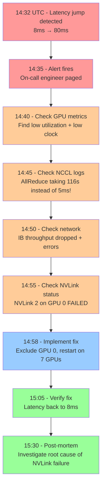

# Project 5: Troubleshooting Incident Response

| Project metadata | Value |
|---|---|
| Volume | 24 — Capstone Projects |
| Difficulty | Intermediate |
| Estimated time | 5–7 hours |
| Primary audience | SREs, Incident Response Teams, DevOps, Infrastructure Engineers |
| Core objective | Diagnose and resolve a production incident using metrics and logs; time pressure, incomplete information |
| Linked interview chapter | Volume 23, Chapter 5: Performance Analysis and Troubleshooting |

## Learning Objectives

By the end of this project, you will be able to:
- Rapidly correlate metrics and logs to identify root cause
- Distinguish between symptoms and root cause
- Prioritize information gathering under time pressure
- Implement targeted fixes with minimal cluster disruption
- Prevent recurrence via monitoring and automation

## Problem Statement

**Incident:** Training job on 8-GPU cluster suddenly reports 10× latency increase (8 ms per step → 80 ms per step) at 14:32 UTC. The cluster is still running; no obvious errors in logs. You have 15 minutes to identify the problem before SLO breach and 30 minutes to implement a fix.

**Available data:**
- Prometheus metrics (30-second granularity, 24-hour retention)
- Kernel logs and NCCL debug output (if enabled)
- GPU telemetry (nvidia-smi data, collected every 1 minute)
- Network counters (IB link statistics)
- Historical baseline (same job ran yesterday with 8 ms latency)

## Incident Scenario

**Real scenario:** Training job started at 14:00 UTC. For 30 minutes, all was normal. At 14:32:15 UTC, step latency jumps from 8 ms to 80 ms. No error message; no crash. The cluster appears to be running, but slowly.

### The Clues (Provided Incrementally)

**T+0 min (First alert, 14:35 UTC):**
```
Alert: TrainingLatencyIncrease
Job: resnet50-8gpu-node1
Metric: steps_per_minute dropped from 7.5 (450 steps/hour) to 0.75 (45 steps/hour)
Detected: 14:35:00 UTC (3 min after issue started)
```

**T+5 min (On-call engineer checks dashboard):**
```
GPU Utilization: All 8 GPUs show 45–60% utilization (normally 95%+)
GPU Memory: 60 GB used (normally 70+ GB used, approaching limit)
GPU Clock: All GPUs at base clock 300 MHz (normally 1500+ MHz)
Temperature: All GPUs at 45°C (normally 70°C)
```

**T+10 min (Engineer checks logs):**
```
NCCL Debug log: (with NCCL_DEBUG=TRACE enabled)
[14:32:15.234] Rank 0: AllReduce started on group comm:1234567
[14:32:15.456] Rank 0: Waiting for collective from rank 1, 2, 3, 4, 5, 6, 7
[14:32:18.234] Rank 0: Message from rank 1 arrived (latency 2.78s ← 2780ms!)
[14:32:20.123] Rank 0: Message from rank 2 arrived (latency 4.89s)
...
[14:34:12.001] Rank 0: AllReduce completed (took 116 seconds for 100MB tensor!)
```

**T+12 min (Engineer checks network):**
```
$ ibnetdiscover
...
IB Link Node1 → Node2: Active, but showing 50MB/s throughput
(Historical baseline: 200 MB/s for same traffic pattern)
IB Errors on Node2 incoming port: 234 errors in last 5 minutes (vs 0 yesterday)
```

**T+15 min (What the engineer discovers by checking NVLink):**
```
$ nvidia-smi nvlink -sc 0
NVLink Status (GPU 0):
  NVLink 0: Active (6.5 GB/s, baseline 25 GB/s) ← 4× slower!
  NVLink 1: Active (23.8 GB/s, baseline 25 GB/s)  ← Mostly OK
  NVLink 2: Disabled (was active yesterday)       ← FAILURE
  NVLink 3: Active (24.2 GB/s, baseline 25 GB/s)
```

## Success Criteria

1. **Identify root cause within 15 minutes:** NVLink 2 on GPU 0 degraded/failed
2. **Propose mitigation within 10 minutes of diagnosis:** Exclude GPU 0, run on 7 GPUs
3. **Implement fix in < 5 minutes:** Restart job with `--exclude-gpu=0`
4. **Verify fix within 30 minutes:** Job converges back to 8 ms per step on 7 GPUs
5. **Post-mortem:** Understand why NVLink failed (thermal? hardware? driver?)

## Incident Timeline



## Diagnostic Commands

### 1. Check GPU Metrics
```bash
nvidia-smi --query-gpu=index,utilization.gpu,utilization.memory,memory.used,temperature.gpu,power.draw,clocks.current.graphics \
           --format=csv -l 1
```

Expected output:
```
index, utilization.gpu [%], utilization.memory [%], memory.used [MiB], temperature.gpu [C], power.draw [W], clocks.current.graphics [MHz]
0, 48, 70, 45000, 45, 180, 300
1, 52, 71, 45200, 46, 182, 300
2, 45, 68, 43800, 44, 175, 300
...
```

→ **Observation:** Clock at 300 MHz (base clock, not normal) + Utilization only 50% (normally 95%+) suggests GPU is power or thermally throttled, or waiting on something.

### 2. Check NCCL Logs
```bash
# Enable NCCL debug on training process
export NCCL_DEBUG=TRACE
mpirun -np 8 python train.py 2>&1 | tee nccl.log

# Look for latency in collective operations
grep "AllReduce completed" nccl.log
```

Expected healthy output:
```
[14:32:00.123] Rank 0: AllReduce started ... completed in 4.2ms
```

Incident output:
```
[14:32:15.234] Rank 0: AllReduce started ...
[14:32:18.234] Rank 1 message arrived (2780ms latency!)
...
[14:34:12.001] Rank 0: AllReduce completed in 116256ms ← HUGE!
```

→ **Observation:** Individual message latencies are 2–5 seconds (vs normal ~1–2ms). This is a communication bottleneck, not compute.

### 3. Check Network Status
```bash
# Infiniband network status
ibnetdiscover | grep "Node2"
ibdiagnet --log_file=/tmp/ib.log

# Check IB errors and performance
perfquery 1 0 | grep "XmtData\|RcvData"
```

Expected healthy:
```
XmtData: 2000MB  (large transfer volume)
RcvData: 2000MB
ErrorsReceived: 0
```

Incident:
```
XmtData: 50MB   (very low!)
RcvData: 48MB
ErrorsReceived: 234 ← New errors on link
```

→ **Observation:** IB link throughput dropped 4×, and new errors appeared. Likely link degradation or congestion.

### 4. Check NVLink Status
```bash
nvidia-smi nvlink -sc 0  # -sc 0 = GPUIndex 0
```

Expected:
```
NVLink 0: Active, 25.0 GB/s
NVLink 1: Active, 25.0 GB/s
NVLink 2: Active, 25.0 GB/s
NVLink 3: Active, 25.0 GB/s
```

Incident:
```
NVLink 0: Active, 6.5 GB/s   ← DEGRADED! (4× slower)
NVLink 1: Active, 23.8 GB/s
NVLink 2: Disabled            ← FAILED!
NVLink 3: Active, 24.2 GB/s
```

→ **Root cause identified:** NVLink on GPU 0 is failing. This causes:
- Intra-node communication (NVLink) for GPU 0 → GPU 1 to bottleneck
- AllReduce stalls waiting for slow messages from GPU 0
- Overall job throughput collapses

## Solution Walkthrough

### Step 1: Diagnosis (0–15 minutes)

Follow the diagnostic commands above. The key insight:

1. GPU metrics show low utilization + low clock → not compute-bound, something else
2. NCCL logs show 2–5 second message latencies → communication bottleneck
3. IB link shows 4× throughput drop + errors → network issue
4. NVLink status shows link failure on GPU 0 → root cause

**Diagnosis decision tree:**
```
Is GPU utilization low?
  YES → Is clock low (300 MHz)?
    YES → Power throttle or waiting on I/O
    NO → Application not using GPU
  NO → Compute is running
  
Are NCCL logs showing high message latency?
  YES → Communication bottleneck
  NO → Not a communication issue
  
Does IB show errors or throughput drop?
  YES → Network link degraded/failed
  NO → Not network
  
Does NVLink show failures?
  YES → Intra-node link issue
  NO → Unlikely intra-node problem
```

### Step 2: Mitigation (5 minutes)

Quick mitigation: exclude GPU 0 from training, run on 7 GPUs:

```bash
# Option 1: Environment variable (CUDA device selection)
export CUDA_VISIBLE_DEVICES=1,2,3,4,5,6,7

# Option 2: Restart training with reduced world size
torchrun --nproc_per_node=7 train.py

# Option 3: Dynamic job restart via Kubernetes
kubectl set env deployment/training \
  CUDA_VISIBLE_DEVICES=1,2,3,4,5,6,7
```

Expected result: Training resumes on 7 GPUs. Throughput slightly reduced (1/7 missing GPU), but latency per step should return to ~8 ms.

### Step 3: Verification (10 minutes)

```bash
# Check latency has returned to normal
nvidia-smi dmon | grep GPU  # Should show 90%+ utilization again

# Verify convergence
grep "Epoch\|Loss" train.log | tail -5
# Loss should decrease as before, no divergence
```

### Step 4: Root Cause Analysis (30+ minutes, post-incident)

Why did NVLink fail?
- Thermal degradation (GPU got too hot)
- Driver error (NVLink driver crash)
- Hardware failure (NVLink controller failed)
- Power delivery issue (power to NVLink regulator failed)

Actions:
1. Check IPMI logs for thermal events: `ipmitool sel list`
2. Check dmesg for GPU driver errors: `dmesg | grep -i gpu`
3. Run GPU diagnostics: `nvidia-smi -pm 1` (persistent mode) + `nvidia-smi -q` (query)
4. If hardware failure, RMA GPU 0

## Production Troubleshooting

| Observation | Root Cause | Diagnostic | Fix |
|---|---|---|---|
| Latency increases gradually over 30 min | Memory leak or thermal drift; GPU gets hotter over time | Check `nvidia-smi -l 1` every 30 sec; temp/power rising? | Restart job (forces memory cleanup); investigate source of leak |
| Latency increases suddenly, only specific rank affected | Link failure, or that rank's GPU slow (compute issue) | Check NCCL logs; which rank is slow? Check `nvidia-smi` on that GPU | Exclude slow GPU; or check if that GPU has high temp/power draw |
| All ranks show high latency; not specific to one link | Global issue: network congestion, all IB links slow, or collective algorithm problem | Check IB counters; run `perfquery` on all switches; profile collective with NCCL trace | Reduce batch size (less data in AllReduce); or wait for network to clear; or switch to different collective algorithm |
| After restart, same issue recurs | Root cause not fixed; hardware issue persisting | Log NVLink status before/after restart; if same link fails again, it's hardware | RMA the GPU; or disable that link via driver parameter |

## Interview Preparation

**Q: Walk me through diagnosing that incident. What would you do first?**

**A:** (Spoken answer)

"First, I'd calm down. Incident isn't a crisis if I follow a process.

I'd start with observability: pull the dashboard and see what changed at 14:32 UTC. Did GPU utilization drop? Did temperature spike? Did network errors appear? This gives me the domain: compute, memory, network, etc.

In this case, GPU utilization was low + GPU clock was low. That's a red flag: GPUs aren't working hard, and they've throttled themselves. Why would they do that? Power limit, thermal limit, or they're waiting for something.

Next, I'd check the application logs. If NCCL logs show AllReduce taking 116 seconds for 100 MB, that's a 23,000× slowdown. Communication is definitely broken.

Then I'd check the network. IB link shows errors and low throughput. But before I blame the network, I'd check intra-node (NVLink) first, because AllReduce happens locally first (4 GPUs per node), then inter-node.

Running `nvidia-smi nvlink` on GPU 0 shows NVLink 2 is disabled. That's the smoking gun. GPU 0 → GPU 1 communication has to go through a degraded link, which was a 25 GB/s link now doing 6.5 GB/s.

So the fix: exclude GPU 0, run on 7 GPUs. Latency should drop back to normal.

The time to diagnosis: ~15 minutes if I know where to look. Without structure, it could be hours. The key is: start broad (what changed?), then narrow down (which domain?), then drill deep (which specific component?)."

**Q: What would you change to prevent this in the future?**

**A:** "I'd add automatic link health monitoring. Every 5 minutes, run `nvidia-smi nvlink -sc` on all GPUs and log the results. If a link drops from 25 GB/s to < 10 GB/s, alert immediately.

I'd also add automatic mitigation: if a link fails, automatically exclude that GPU and restart the job. This can be done at the Kubernetes level: if a GPU reports link failure, evict the pod, it reschedules on different node.

And I'd add circuit breaker logic to NCCL or the training script: if AllReduce latency exceeds baseline by 10×, bail out gracefully instead of hanging.

These changes move the incident from 30 minutes to resolve to 2 minutes (automatic detection + mitigation)."

## Evaluation Rubric

| Criterion | Excellent (100%) | Good (80%) | Acceptable (60%) | Needs Work (<60%) |
|---|---|---|---|---|
| **Root cause diagnosis** | Correctly identifies NVLink failure within 15 min; reasoning is sound | Identifies NVLink within 20 min; reasoning mostly sound | Identifies NVLink but takes >25 min or reasoning is unclear | Misidentifies root cause or doesn't find it |
| **Mitigation time** | Proposes mitigation within 5 min of diagnosis | Within 10 min | Within 15 min | >15 min or no mitigation proposed |
| **Fix correctness** | Mitigation works; job resumes on 7 GPUs with 8ms latency | Works but some residual issue remains | Works but latency still elevated (>20ms) | Doesn't work or makes situation worse |
| **Diagnostic evidence** | Provides full trace of commands run + outputs observed + interpretation | Good trace, minor gaps | Basic trace present | Minimal or unclear diagnostic output |
| **Post-mortem** | Identifies prevention measures (monitoring, automation); estimated timeline improvement | Suggests improvements; some thought given | Basic suggestions | No prevention measures identified |

## Key Takeaways

1. **Structure your diagnosis:** Start broad (what domain?), narrow down (which component?), drill deep (which specific failure?).
2. **Use multiple data sources:** No single metric tells the whole story. Cross-reference metrics, logs, and network data.
3. **Correlate by time:** Events happening at the same second are likely causally related.
4. **Automate mitigation:** Manual diagnosis is slow. Add automatic detection → automatic fix when possible.
5. **The smoking gun is usually obvious:** NVLink disabled (red text in nvidia-smi) is obvious; we just had to look.

## Discussion Questions

1. If NVLink error rate was increasing gradually (1 error/hour → 10 errors/hour) for 6 hours before it failed completely, how would you detect and warn about it?
2. Design automated response to NVLink failure: when should you exclude a GPU? When should you fail the whole cluster?
3. If this incident affected only rank 0, how would you know that (NCCL logs might be on all ranks)?
4. What metrics would you add to the dashboard to make this diagnosis even faster?

## Cross-References

- **Volume 23, Chapter 5:** Performance Analysis and Troubleshooting
- **Volume 8:** Performance Analysis Tools (Nsight Compute, nvidia-smi, mpirun profiling)
- **Volume 20:** Cluster Telemetry and Incident Response
- Tools: NCCL debug logging, nvidia-smi, ibdiagnet, Prometheus
