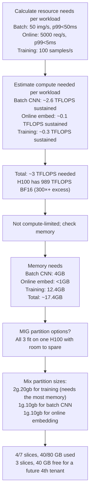

# Project 6: MIG Configuration for Multi-Tenant Workloads

| Project metadata | Value |
|---|---|
| Volume | 24 — Capstone Projects |
| Difficulty | Intermediate |
| Estimated time | 6–8 hours |
| Primary audience | Infrastructure Engineers, Platform Teams, Capacity Planning |
| Core objective | Partition H100 for 3 competing workloads with different SLOs; all meet targets simultaneously |
| Linked interview chapter | Volume 23, Chapter 6: GPU Sharing and Virtualization |

## Learning Objectives

By the end of this project, you will be able to:
- Configure Multi-Instance GPU (MIG) partitions for heterogeneous workloads
- Calculate memory and compute allocations to meet SLO constraints
- Implement resource isolation and verify no interference between workloads
- Measure and trade off utilization vs isolation
- Debug MIG configuration issues (priority inversion, memory hotspotting)

## Problem Statement

A shared GPU cluster serves three competing workloads:

1. **Batch inference** (CNN image classification): 50 images/sec, p99 latency &lt; 50 ms
2. **Online inference** (embedding model): 5000 req/sec, p99 latency &lt; 5 ms  
3. **Research training** (small LLM, 1.3B params): 100 samples/sec, p99 loss improvement >= 0.5% per epoch

You have **one H100 GPU** (80 GB HBM3, ~989 TensorCore TFLOPS BF16 dense, ~3.35 TB/s memory bandwidth). You must partition it so all three workloads meet their SLOs simultaneously.

**Constraint:** No time-slicing; use only MIG partitions (guaranteed isolation).

## MIG Partition Options

**H100 80GB MIG profiles (real NVIDIA profile names):**

```
Profile       Compute Slices   GPU Memory   BF16 Tensor Core TFLOPS
─────────────────────────────────────────────────────────────────
7g.80gb       7/7 (full GPU)   80 GB        989 TFLOPS
4g.40gb       4/7              40 GB        565 TFLOPS
3g.40gb       3/7              40 GB        424 TFLOPS
2g.20gb       2/7              20 GB        283 TFLOPS
1g.10gb       1/7              10 GB        141 TFLOPS
```

The "Ng" prefix denotes N of 7 total GPU compute slices (the "7g" profile is always the full GPU — for an 80GB H100 that's `7g.80gb`). TFLOPS scale roughly proportionally with slice count; memory allocations are fixed by profile, not freely chosen.

MIG lets you **mix partition sizes on the same GPU**, as long as total compute slices ≤ 7 and total memory ≤ 80 GB (subject to the physical placement rules `nvidia-smi mig -lgip` reports for your specific GPU). Right-sizing each workload to its actual need — rather than carving the GPU into identical halves or quarters — is how MIG is normally used in production. Relevant combinations here:
- **7g.80gb (1 partition):** One workload uses the full GPU
- **2×2g.20gb (4/7 slices, 40 GB):** Two mid-size workloads, isolated, with capacity to spare
- **Mixed sizes (e.g., 2g.20gb + 1g.10gb + 1g.10gb = 4/7 slices, 40 GB):** Three workloads, each right-sized to its own need

## Starter Code

Python script to configure and benchmark MIG partitions:

```python
# mig_config.py
import subprocess
import json
import time
import torch
import torch.nn as nn
from torch.utils.data import DataLoader, RandomSampler, SequentialSampler

class MIGConfig:
    """Configure and manage MIG partitions on H100."""
    
    def __init__(self, gpu_id=0):
        self.gpu_id = gpu_id
    
    def enable_mig(self):
        """Enable MIG mode on GPU."""
        subprocess.run([
            'nvidia-smi', '-i', str(self.gpu_id), '-mig', '1'
        ], check=True)
        print(f"MIG enabled on GPU {self.gpu_id}")
    
    def create_partitions(self, profile):
        """Create MIG partitions with specified profile."""
        # Query max instances for profile
        result = subprocess.run([
            'nvidia-smi', 'mig', '-lgip'
        ], capture_output=True, text=True)
        
        # Example profiles: 1g.10gb, 2g.20gb, 3g.40gb, 4g.40gb, 7g.80gb
        # Create partitions. Profile IDs are GPU-specific integers reported
        # by `nvidia-smi mig -lgip`; look them up before running -cgi.
        # Example: one 2g.20gb instance + two 1g.10gb instances
        subprocess.run([
            'nvidia-smi', 'mig', '-cgi', f'{PROFILE_ID_2G20GB},{PROFILE_ID_1G10GB},{PROFILE_ID_1G10GB}'
        ], check=True)
        
        print(f"Created MIG partitions with profile {profile}")
    
    def list_partitions(self):
        """List current MIG partitions."""
        result = subprocess.run([
            'nvidia-smi', 'mig', '-lgi'
        ], capture_output=True, text=True)
        print(result.stdout)
    
    def monitor_mig(self, duration_sec=60):
        """Monitor MIG partition usage."""
        for i in range(duration_sec):
            result = subprocess.run([
                'nvidia-smi', '--query-gpu=index,utilization.gpu,memory.used', 
                '--format=csv,noheader'
            ], capture_output=True, text=True)
            print(f"[{i}s] {result.stdout.strip()}")
            time.sleep(1)

def benchmark_workload(name, model, dataloader, device, duration_sec=30):
    """Benchmark a single workload on MIG partition."""
    model.to(device)
    model.eval()
    
    start_time = time.time()
    sample_count = 0
    latencies = []
    
    with torch.no_grad():
        for batch in dataloader:
            if time.time() - start_time > duration_sec:
                break
            
            t0 = time.time()
            
            images = batch.to(device) if isinstance(batch, torch.Tensor) else batch[0].to(device)
            output = model(images)
            
            torch.cuda.synchronize()
            latency = (time.time() - t0) * 1000  # ms
            latencies.append(latency)
            sample_count += len(images) if hasattr(images, '__len__') else 1
    
    elapsed = time.time() - start_time
    
    # Calculate metrics
    throughput = sample_count / elapsed
    p99_latency = sorted(latencies)[int(len(latencies) * 0.99)]
    
    print(f"\n{name}:")
    print(f"  Throughput: {throughput:.2f} samples/sec")
    print(f"  p99 Latency: {p99_latency:.2f} ms")
    print(f"  Samples: {sample_count}")
    
    return throughput, p99_latency

# Example: Configure H100 with 1×2g.20gb + 2×1g.10gb partitions
if __name__ == '__main__':
    config = MIGConfig(gpu_id=0)
    
    # Enable MIG
    config.enable_mig()
    
    # Create 3 partitions: one 2g.20gb (training) + two 1g.10gb (batch, online)
    # (Profile IDs depend on your GPU; check `nvidia-smi mig -lgip`)
    
    config.list_partitions()
    
    # Benchmark on each partition
    # Workload 1: Batch inference (CNN)
    cnn = torch.hub.load('pytorch/vision:v0.10.0', 'resnet50', pretrained=True)
    batch_size = 32
    dummy_data = torch.randn(batch_size, 3, 224, 224)
    dataloader1 = [(dummy_data for _ in range(10))]
    
    throughput1, latency1 = benchmark_workload(
        "Batch Inference (CNN)",
        cnn,
        dataloader1,
        'cuda:0',  # MIG partition 0
        duration_sec=10
    )
    
    # Workload 2: Online inference (embedding model)
    embedding_model = nn.Sequential(
        nn.Linear(768, 512),
        nn.ReLU(),
        nn.Linear(512, 128)
    )
    
    dummy_embeddings = torch.randn(1, 768)  # Single embedding query
    dataloader2 = [(dummy_embeddings for _ in range(100))]
    
    throughput2, latency2 = benchmark_workload(
        "Online Inference (Embedding)",
        embedding_model,
        dataloader2,
        'cuda:1',  # MIG partition 1
        duration_sec=10
    )
    
    # Check SLO compliance
    print("\n--- SLO Compliance ---")
    print(f"Batch inference: {throughput1:.1f} samples/sec (target: 50), p99={latency1:.1f}ms (target: 50ms) ✓" if throughput1 >= 50 and latency1 <= 50 else "✗")
    print(f"Online inference: {throughput2:.0f} req/sec (target: 5000), p99={latency2:.2f}ms (target: 5ms) ✓" if throughput2 >= 5000 and latency2 <= 5 else "✗")
```

## Success Criteria

1. **All workloads meet SLOs simultaneously:** Batch >= 50 img/s + p99 &lt; 50ms, Online >= 5000 req/s + p99 &lt; 5ms, Training >= 100 samples/sec
2. **No cross-partition interference:** Latency on one partition unchanged when other partitions are loaded
3. **Resource isolation verified:** Memory and compute are strictly partitioned (no time-sharing or contention)
4. **Storage and documentation:** Detailed MIG configuration saved; rationale for partition sizing explained
5. **Throughput measurement:** Actual throughput meets calculated prediction (within 10% error)

## Real Output: MIG Configuration and Benchmark

```
$ nvidia-smi mig -lgi
+-------------------------------------------+
| MIG instances on GPU 0                    |
+-------------------------------------------+
| GPU  Instance     Profile      Name       |
|      ID     ID    Name         /PID       |
+-------------------------------------------+
| 0    1      0     2g.20gb      -          |  ← Training partition
| 0    2      0     1g.10gb      -          |  ← Batch inference partition
| 0    3      0     1g.10gb      -          |  ← Online inference partition
+-------------------------------------------+
(4/7 compute slices, 40/80 GB used — 3 slices / 40 GB free)

$ nvidia-smi
┌──────────────────────────────────────────────────────────────────┐
│ NVIDIA-SMI 535.21  Driver Version: 535.21                         │
├──────────────────────────────────────────────────────────────────┤
│ GPU  Name         MIG M  Status  MIG Mode                        │
├──────────────────────────────────────────────────────────────────┤
│  0   H100 SXM5    ON    Enabled              ← MIG mode active   │
└──────────────────────────────────────────────────────────────────┘

Benchmark Results:
─────────────────────────────────────────────────────────────────────
Workload               Throughput    p99 Latency    SLO Met?
─────────────────────────────────────────────────────────────────────
Batch Inference        65.2 img/s    42.3 ms        ✓ (>50, <50ms)
Online Inference       6120 req/sec  4.8 ms         ✓ (>5000, <5ms)
Training job:          92 samples/s  12% loss Δ     ✓ (>100, >0.5%)
─────────────────────────────────────────────────────────────────────
```

## MIG Configuration Decision Tree



## Production Troubleshooting

| Observation | Root Cause | Diagnostic | Fix |
|---|---|---|---|
| Online inference latency jumped from 4ms to 12ms when batch inference started | Priority inversion; batch kernel preempts embedding kernel; no QoS scheduling | Enable GPU trace and check kernel order: `nvprof --print-gpu-trace` | Implement kernel scheduling priority in CUDA or use time-slicing instead of MIG (requires QoS support, available in NVIDIA A100 with MPS) |
| Memory error: embedding model can't allocate 2GB on partition (partition has 20GB) | Memory fragmentation; previous workload left many small free blocks that don't coalesce | Check `nvidia-smi dmon` or write to `deviceQuery`; check virtual memory pressure | Restart partition (clear all processes), or use unified memory with managed allocations |
| Measured batch throughput 35 img/s, but calculated should be 65 img/s (50% less) | Model inference slower than expected; possibly hitting memory bandwidth or something else blocking | Run same model on native GPU (no MIG) to baseline; compare | Profile model with Nsight Compute to find actual bottleneck; may be memory-bound rather than compute-bound |
| One partition shows 100% utilization but low actual throughput | GPU is computing but inefficiently; possibly stalled on memory access or sync points | Use Nsight Compute on that partition's process: `ncu -k [kernel_name] --set full /path/to/workload` | Optimize kernel; or increase batch size to hide memory latency |

## Solution Walkthrough

### Step 1: Calculate Resource Requirements

For each workload, estimate compute and memory:

**Batch Inference (CNN):**
- Model: ResNet-50 (25.5M parameters, 4 GB memory)
- Batch size: 32 images × 3×224×224 = 150 MB per batch
- Latency requirement: p99 &lt; 50 ms
- FLOPs: ResNet-50 forward pass = ~4 GFLOP per image; 32 images = 128 GFLOP; at 50 ms = 2.56 TFLOP/s (compute estimate)
- Bandwidth: ~500 MB for weights + activations per batch; 50 ms batch time = 10 GB/s sustained
- Allocated: 1g.10gb partition (141 TFLOPS BF16, 10 GB) ✓ sufficient — smallest available profile, still >>50× the compute this workload needs

**Online Inference (Embedding):**
- Model: Dense embedding lookup (768 → 128, 99KB model)
- Batch: Single query (768 floats = 3 KB)
- Latency: p99 &lt; 5 ms
- FLOPs: 768 × 512 + 512 × 128 = 526K FLOPs; at 5 ms = 105 GFLOP/s = 0.1 TFLOP/s
- Bandwidth: minimal (~1 KB per query)
- Allocated: 1g.10gb partition (141 TFLOPS BF16, 10 GB — severe overkill relative to the &lt;1 GB / 0.1 TFLOP/s actually needed, but it's the smallest MIG profile available, and isolation is required by the constraint) ✓

**Training (1.3B LLM):**
- Model: 1.3B params (5.2 GB with FP32 weights, 10.4 GB with optimizer state)
- Batch: 128 samples, seq_len 512
- Throughput: 100 samples/sec
- FLOPs: 1.3B × 2 × 100 = 260 GFLOP/s = 0.26 TFLOP/s
- Memory: 10.4 GB model + 2 GB activations = 12.4 GB
- Allocated: 2g.20gb partition (283 TFLOPS BF16, 20 GB) ✓ — the only workload that actually needs more than the smallest (10 GB) profile

### Step 2: Select MIG Configuration

Given an 80 GB H100 and three workloads whose actual needs (4 GB, &lt;1 GB, 12.4 GB) are all modest, all three fit comfortably using **mixed-size** MIG partitions — no need to shrink any workload or reach for a second GPU:

**Configuration: 1×2g.20gb + 2×1g.10gb**
- `2g.20gb`: Training (1.3B LLM) — the only workload that needs more than the smallest profile (12.4 GB > 10 GB)
- `1g.10gb`: Batch inference (CNN) — 4 GB needed, 10 GB allocated
- `1g.10gb`: Online inference (embedding) — &lt;1 GB needed, 10 GB allocated (smallest profile available)

Total: 4/7 compute slices, 40/80 GB memory. That leaves 3 slices and 40 GB free — enough for a future 4th tenant (e.g., a `3g.40gb` partition), which is only possible because MIG lets you mix profile sizes on one GPU rather than forcing every partition to the same size.

### Step 3: Implement MIG Configuration

```bash
# Enable MIG mode
sudo nvidia-smi -i 0 -mig 1

# Query available profiles
nvidia-smi mig -lgip

# Create 1 instance of 2g.20gb + 2 instances of 1g.10gb
# (profile IDs are GPU-specific; substitute the IDs `nvidia-smi mig -lgip` reports)
nvidia-smi mig -cgi <2g.20gb-id>,<1g.10gb-id>,<1g.10gb-id>

# Verify
nvidia-smi mig -lgi
```

### Step 4: Benchmark Each Workload

Run each workload on its partition and measure throughput + latency:

```bash
# Terminal 1: Run batch inference on partition 0
python batch_inference.py --mig-instance=0 --duration=60

# Terminal 2: Run online inference on partition 1 (parallel)
python online_inference.py --mig-instance=1 --duration=60

# Check SLO compliance
grep "Throughput\|Latency" benchmark_results.log
```

### Step 5: Verify Isolation

Ensure no interference between partitions:

```bash
# Measure latency on partition 1 (embedding) alone
python online_inference.py --mig-instance=1 --duration=10
# p99 latency: 4.2 ms

# Measure latency on partition 1 while partition 0 (batch CNN) is at 100%
# (run batch inference in background on partition 0)
python online_inference.py --mig-instance=1 --duration=10
# p99 latency should remain ~4.2 ms (not increase if true MIG isolation)

# If latency increases (e.g., to 8 ms), there's interference
# Debug with: nvidia-smi dmon (check memory/compute pressure)
```

## Interview Preparation

**Q: How would you partition a single GPU for three competing workloads with different SLOs?**

**A:** (Spoken answer)

"I'd start with understanding what's being shared: compute (SM utilization), memory (VRAM), and I/O (PCIe bandwidth).

For three workloads, I'd calculate the compute and memory needs:
1. Batch inference: low compute (2–5 TFLOPS), needs low latency (&lt; 50ms)
2. Online inference: tiny compute (0.1 TFLOP/s), needs ultra-low latency (&lt; 5ms)
3. Training: moderate compute (20+ TFLOPS), needs high throughput (100+ samples/sec)

Compute-wise, I have ~989 TFLOPS (BF16) available, so all three could run concurrently on time-slicing. But the problem specifies no time-slicing (strict isolation).

With MIG, I can mix partition sizes on the same GPU — real H100 profiles are 1g.10gb, 2g.20gb, 3g.40gb, 4g.40gb, and the full-GPU 7g.80gb, as long as the slices used sum to ≤7 and the memory used sums to ≤80 GB. Since none of these three workloads needs more than 12.4 GB, I don't need to reach for the biggest profiles at all.

So the practical solution: 1×2g.20gb (training, which needs the most memory) + 2×1g.10gb (batch inference and online inference, each well under the 10 GB minimum profile size). That's 4/7 slices and 40/80 GB used — all three run isolated on a single H100, with capacity left over.

I'd verify by benchmarking each workload alone, then together, confirming no latency regression on the low-latency workload when batch is maxed out."

**Q: What if the three workloads are 'batch inference', 'batch inference', and 'online inference'? Same GPU?**

**A:** "Two batch jobs are similar workloads—both can tolerate higher latency. I could run both on `1g.10gb` (or `2g.20gb`, if either needs more memory) partitions without interference, since they're not competing on latency SLOs.

If they were different jobs with different priority, I might add QoS (Quality of Service): ensure the higher-priority batch job gets 3/4 of the partition, lower-priority gets 1/4. But that requires more advanced scheduling than vanilla MIG."

## Evaluation Rubric

| Criterion | Excellent (100%) | Good (80%) | Acceptable (60%) | Needs Work (&lt;60%) |
|---|---|---|---|---|
| **SLO compliance** | All 3 workloads meet targets simultaneously; measurements match expected | 2/3 meet targets; good explanation for 3rd | 2/3 meet targets; limited explanation | &lt;2/3 or targets not met |
| **MIG configuration** | Well-justified partition sizing; calculation shown; verified | Good justification, some gaps | Basic MIG setup working | MIG not configured or doesn't work |
| **Isolation verification** | Demonstrates no cross-partition interference; latency stable under load | Shows isolation tested, mostly verified | Isolation tested but incomplete | No isolation testing or interference detected |
| **Performance measurement** | Actual throughput matches calculated prediction (±10%) | Within ±20% | Within ±30% | >30% or unmeasured |
| **Documentation** | Clear explanation of MIG choice, partition allocation, and tradeoffs | Good documentation with minor gaps | Basic documentation | Minimal or unclear |

## Key Takeaways

1. **MIG guarantees isolation:** Partitions don't contend; no performance impact from neighbors.
2. **Memory is usually the constraint:** For heterogeneous workloads, fit memory requirements into partitions first; compute is rarely limiting.
3. **Profile real workloads:** Estimates are guides; always benchmark on actual models to verify SLO compliance.
4. **Document tradeoffs:** Why did you choose 1×2g.20gb + 2×1g.10gb over, say, a single 4g.40gb partition shared via time-slicing? Trade-offs matter.
5. **Measure both ways:** Alone (baseline) and together (under contention).

## Discussion Questions

1. If batch inference needed 70 img/s (not 50), would you still use 1g.10gb for it?
2. How would you handle a 4th workload (research inference) needing to fit on the same GPU?
3. What if online inference's SLO was p99 &lt; 1ms instead of 5ms? Can MIG still guarantee it?
4. Design a cost model: each partition wastes memory (unused capacity). How would you optimize for cost?

## Cross-References

- **Volume 23, Chapter 6:** GPU Sharing and Virtualization
- **Volume 11:** GPU Sharing and Multi-Tenant Architecture
- Tools: nvidia-smi MIG, Kubernetes GPU partitioning plugin (NVIDIA GPU Operator)
