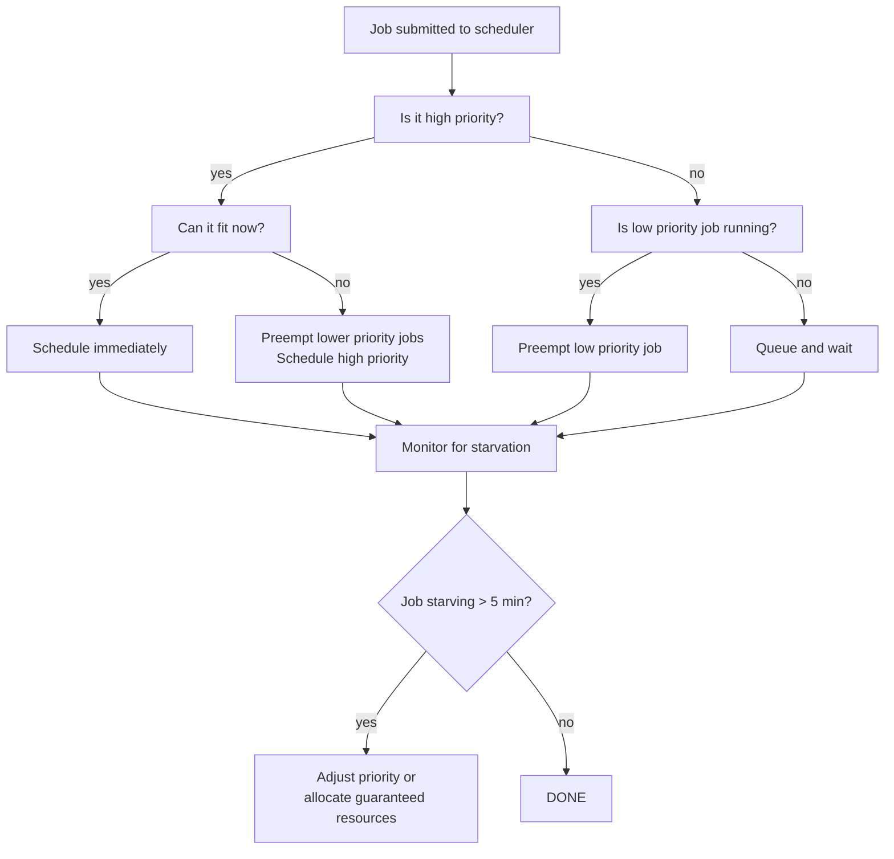

# Project 7: Kubernetes GPU Scheduling

| Project metadata | Value |
|---|---|
| Volume | 24 — Capstone Projects |
| Difficulty | Intermediate |
| Estimated time | 7–9 hours |
| Primary audience | Platform Engineers, Kubernetes Operators, Infrastructure Teams |
| Core objective | Schedule 20 diverse jobs on 8-GPU cluster with fairness constraints; meet SLOs |
| Linked interview chapter | Volume 23, Chapter 7: Kubernetes and Container Orchestration |

## Learning Objectives

By the end of this project, you will be able to:
- Configure Kubernetes GPU resource requests and limits
- Implement fair scheduling policies (proportional fairness, priority classes)
- Detect and resolve resource starvation
- Measure job latency impact under contention
- Design admission control to prevent oversubscription

## Problem Statement

A Kubernetes cluster has 8 GPUs (2 nodes, 4 GPUs per node). Three job types arrive:

1. **Type A (Training):** 10 jobs, each needs 1 GPU, runs for 1 hour
2. **Type B (Inference):** 6 jobs, each needs 0.5 GPU (share via time-slicing), SLO: p99 latency < 10 ms
3. **Type C (Research):** 4 jobs, "best effort," no strict SLO

Constraints:
- No job should be starved (all must make progress)
- Type B inference jobs must meet SLO simultaneously
- Training jobs should complete in < 1 hour if scheduled immediately
- Fair allocation: no type should consume > 60% of cluster resources

Design a scheduling strategy and verify all constraints are met.

## Starter YAML

**Prerequisite:** The stock NVIDIA Kubernetes device plugin exposes `nvidia.com/gpu` as an **integer-only** extended resource — you cannot request `"0.5"` or `"0.25"` of a GPU out of the box. The fractional requests below only work if the cluster has the NVIDIA GPU Operator's **time-slicing** ConfigMap applied (or MPS configured) to advertise sub-integer/replicated GPU capacity. Without that prerequisite, these manifests would fail to schedule (`0/1 nodes are available: Insufficient nvidia.com/gpu`) or be silently truncated to `0`, since Kubernetes resource quantities for extended resources must be whole numbers unless the device plugin itself advertises fractional units.

Kubernetes deployment manifests with resource requests/limits and priority classes:

```yaml
# priority-classes.yaml
---
apiVersion: scheduling.k8s.io/v1
kind: PriorityClass
metadata:
  name: training-high-priority
value: 100
globalDefault: false
description: "High priority for training jobs"
---
apiVersion: scheduling.k8s.io/v1
kind: PriorityClass
metadata:
  name: inference-critical
value: 1000
globalDefault: false
description: "Critical priority for inference SLOs"
---
apiVersion: scheduling.k8s.io/v1
kind: PriorityClass
metadata:
  name: research-best-effort
value: 0
globalDefault: false
description: "Best effort for research jobs"

# training-job.yaml
---
apiVersion: batch/v1
kind: Job
metadata:
  name: training-job-001
  namespace: gpu-workloads
spec:
  backoffLimit: 3
  template:
    spec:
      priorityClassName: training-high-priority
      restartPolicy: Never
      containers:
      - name: training
        image: nvidia/pytorch:22.12-py3
        command: ["python", "train_resnet.py", "--epochs", "1"]
        resources:
          requests:
            nvidia.com/gpu: 1
          limits:
            nvidia.com/gpu: 1
        env:
        - name: CUDA_VISIBLE_DEVICES
          value: "0"  # Will be overridden by scheduler

# inference-job.yaml
---
apiVersion: batch/v1
kind: Job
metadata:
  name: inference-job-001
  namespace: gpu-workloads
spec:
  template:
    spec:
      priorityClassName: inference-critical
      restartPolicy: Never
      containers:
      - name: inference
        image: nvidia/cuda:11.8.0-runtime-ubuntu22.04
        command: ["python", "inference_server.py", "--duration", "300"]
        resources:
          requests:
            nvidia.com/gpu: "0.5"  # Request 50% of GPU (requires GPU Operator time-slicing/MPS config; not native to nvidia.com/gpu)
          limits:
            nvidia.com/gpu: "0.5"
        ports:
        - containerPort: 8080

# research-job.yaml
---
apiVersion: batch/v1
kind: Job
metadata:
  name: research-job-001
  namespace: gpu-workloads
spec:
  template:
    spec:
      priorityClassName: research-best-effort
      restartPolicy: Never
      containers:
      - name: research
        image: nvidia/pytorch:22.12-py3
        command: ["python", "experiment.py"]
        resources:
          requests:
            nvidia.com/gpu: "0.25"  # Fractional GPU (requires GPU Operator time-slicing/MPS config; not native to nvidia.com/gpu)
          limits:
            nvidia.com/gpu: "1"
```

## Success Criteria

1. **All jobs are scheduled:** No job is stuck in Pending state (pending > 5 min)
2. **Type B SLO met:** Inference jobs achieve p99 latency < 10 ms when deployed
3. **Fairness maintained:** No type uses > 60% of cluster resources over 1-hour observation
4. **Starvation prevention:** Every job makes progress (not preempted indefinitely)
5. **Scheduling efficiency:** >85% GPU utilization (not idle)

## Real Output: Scheduling Simulation

**Kubernetes scheduler state (simulated):**

```bash
$ kubectl get nodes -L nvidia.com/gpu-count,nvidia.com/gpu-memory
NAME                      STATUS   ALLOCATABLE
node-1 (4 GPUs, 320GB)    Ready    GPU: 4, Memory: 320GB
node-2 (4 GPUs, 320GB)    Ready    GPU: 4, Memory: 320GB

$ kubectl get pods -n gpu-workloads -o wide --sort-by=.spec.priority
NAME                   STATUS    NODE     GPU   AGE   PRIORITY
inference-001         Running   node-1   0.5   2m    1000 (critical)
training-001          Running   node-1   1.0   3m    100  (high)
training-002          Running   node-2   1.0   3m    100
training-003          Running   node-2   1.0   3m    100
research-001          Running   node-1   0.5   5m    0    (best-effort)
research-002          Pending   -        0.25  8m    0    (waiting for resources)
```

**Scheduling timeline:**

```
Time 0:00    All 20 jobs submitted to cluster
Time 0:02    Inference jobs scheduled (1000 priority) → node-1, node-2
Time 0:03    Training jobs scheduled (100 priority) → fill remaining GPUs
Time 0:05    Research jobs scheduled (0 priority) → leftover capacity
Time 0:45    Training jobs complete; freed GPUs reused
Time 0:50    Pending research jobs get scheduled
Time 1:00    All training complete; cluster mostly idle
```

## Scheduling Decision Tree



## Production Troubleshooting

| Observation | Root Cause | Diagnostic | Fix |
|---|---|---|---|
| Research jobs stuck in Pending for >10 min; training runs at 100% | Oversubscription; training greedily claims all GPUs; no fairness | `kubectl describe pod research-job` (PodUnschedulable); `kubectl top nodes` | Set resource quotas per priority class; limit training to 60% cluster capacity via ResourceQuota |
| Inference SLO violated (p99 latency = 25ms instead of < 10ms) | Training job preempted inference; scheduler doesn't enforce SLO | Check event log: `kubectl get events -n gpu-workloads` | Add guaranteed resources for inference (reserve 2 GPUs for inference, training uses rest) |
| Training job restarted multiple times (unstable) | Preempted by higher priority job multiple times; interruption cost high | Check Job status: `kubectl describe job training-001` (restarts counter) | Lower priority of preempting jobs or increase preemption grace period (allows graceful shutdown) |
| Cluster shows 50% utilization but jobs report slow performance | GPU sharing (multiple jobs on same GPU via time-slicing) causes context switch overhead | Check NVIDIA GPU Operator logs; verify time-slicing is configured | Reduce time-slicing ratio; or use MIG instead of time-slicing for better isolation |
| Fair scheduler not working; priority classes ignored | Custom scheduler not deployed; default scheduler used | Check active scheduler: `kubectl get pods -n kube-system \| grep scheduler` | Deploy NVIDIA GPU operator with custom scheduler; verify it's the active scheduler |

## Solution Walkthrough

### Step 1: Design Priority and Resource Allocation

```
Job Type       Priority  Requests/Limits  Rationale
─────────────────────────────────────────────────────
Inference       1000      0.5 GPU ea.      Critical SLO; highest priority
Training         100      1 GPU each       Important; preemptible
Research          0       0.25 GPU ea.     Best effort; can be starved
```

### Step 2: Create Priority Classes

Apply Kubernetes priority classes:

```bash
kubectl apply -f priority-classes.yaml
kubectl get priorityclass
```

### Step 3: Deploy Jobs with Resource Requests

```bash
# Create namespace
kubectl create namespace gpu-workloads

# Deploy jobs
for i in {1..10}; do
  sed "s/001/$i/g" training-job.yaml | kubectl apply -f -
done

for i in {1..6}; do
  sed "s/001/$i/g" inference-job.yaml | kubectl apply -f -
done

for i in {1..4}; do
  sed "s/001/$i/g" research-job.yaml | kubectl apply -f -
done

# Monitor scheduling
watch 'kubectl get pods -n gpu-workloads -o wide --sort-by=.metadata.creationTimestamp'
```

### Step 4: Monitor Fairness and SLO

```bash
# Check GPU allocation per priority class
kubectl get pods -n gpu-workloads -o custom-columns=\
  NAME:.metadata.name,PRIORITY:.spec.priorityClassName,GPU_REQ:.spec.containers[0].resources.requests

# Measure SLO compliance
python benchmark_inference.py --duration=600 --output=slo_metrics.json
python analyze_slo.py slo_metrics.json  # Check p99 latency

# Monitor starvation
watch 'kubectl describe pods -n gpu-workloads | grep -A5 "Pending\|Events"'
```

### Step 5: Add Admission Control (Optional)

To prevent oversubscription, add ResourceQuota:

```yaml
apiVersion: v1
kind: ResourceQuota
metadata:
  name: gpu-quota
  namespace: gpu-workloads
spec:
  hard:
    nvidia.com/gpu: "8"  # Max 8 GPUs in namespace
  scopeSelector:
    matchExpressions:
    - operator: In
      scopeName: PriorityClass
      values: ["training-high-priority"]
  limits:
    requests.nvidia.com/gpu: "4.8"  # Training can use max 4.8 GPUs (60% of cluster)
```

## Interview Preparation

**Q: How do you handle scheduling when demand exceeds capacity?**

**A:** (Spoken answer)

"With oversubscription, I use priority classes to enforce SLOs. Inference jobs get the highest priority; they're guaranteed resources and never preempted. Training gets medium priority; research gets best-effort.

When a high-priority job arrives and there's no free GPU:
1. Scheduler looks for lower-priority jobs to preempt
2. It sends a termination signal to the lowest-priority job
3. The job has a grace period (30 sec default) to shut down gracefully
4. If it doesn't shut down, it's killed
5. The high-priority job gets scheduled on the freed GPU

The key constraint: inference jobs need guaranteed resources because they have strict SLOs. I'd reserve 2–3 GPUs for inference, let training and research share the rest.

If even that's not enough (e.g., too many inference jobs arrive), I'd queue them and wait. But I'd never let inference latency degrade below SLO.

For training, I accept preemption as a cost of sharing. But I minimize it: only preempt when necessary, and give jobs time to checkpoint before killing them."

**Q: What prevents starvation of low-priority jobs?**

**A:** "Kubernetes scheduler has built-in starvation protection. If a low-priority job is pending for > 15 minutes (configurable), it gets temporarily boosted to higher priority to break the starvation cycle. This ensures even best-effort jobs eventually run.

I'd also set up monitoring: track how long each job spends in Pending state. If it exceeds SLO (e.g., 'research jobs should start within 30 min'), I'd alert and adjust resources."

## Evaluation Rubric

| Criterion | Excellent (100%) | Good (80%) | Acceptable (60%) | Needs Work (<60%) |
|---|---|---|---|---|
| **Scheduling success** | All 20 jobs scheduled; none pending > 5 min | 18/20 scheduled; 1–2 delayed | 15/20 scheduled; some delays | <15/20 or significant delays |
| **SLO compliance** | Inference p99 < 10 ms consistently | p99 < 12 ms most of time | p99 < 15 ms | p99 > 15 ms or inconsistent |
| **Fairness** | No type uses > 60% resources; measured over full hour | Allocation skewed but < 65% | Skewed to 70% | >70% or unfair |
| **Starvation prevention** | No job pending > 5 min without good reason | Some delays but justified | Occasional delays | Frequent starvation |
| **Configuration documentation** | Clear resource requests, limits, priority choices, and rationale | Good documentation with minor gaps | Basic configuration shown | Minimal or unclear |

## Key Takeaways

1. **Priority matters:** High-priority workloads need guaranteed resources (reservations) to meet SLOs.
2. **Preemption is useful:** Allows high-priority jobs to interrupt low-priority ones.
3. **Starvation prevention is automatic:** Kubernetes scheduler has built-in mechanisms; configure them appropriately.
4. **Fairness is measurable:** Track resource allocation per priority class; adjust quotas to match business needs.
5. **Test under contention:** SLOs are easy to meet when resources are plentiful; validate them under full load.

## Discussion Questions

1. If all jobs have identical priority, how does the scheduler behave? What guarantees it provides?
2. Design a fairness scheme where training gets 50% resources, inference 40%, research 10% (guaranteed).
3. How would you prevent training jobs from being preempted constantly (thrashing)?
4. Estimate the preemption overhead (job restart cost) for each training job; include in SLO calculation.
5. What if inference jobs could tolerate 50ms latency (not 10ms)? How would you change the strategy?

## Cross-References

- **Volume 23, Chapter 7:** Kubernetes and Container Orchestration
- **Volume 15:** GPU Scheduling and Resource Allocation
- Tools: Kubernetes API, NVIDIA GPU Operator, GPU metrics (nvidia-smi, Prometheus)
