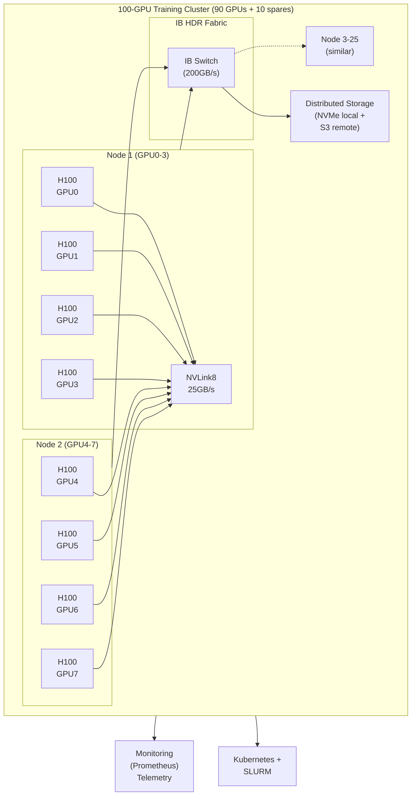

# Project 10: Training Cluster Design

| Project metadata | Value |
|---|---|
| Volume | 24 — Capstone Projects |
| Difficulty | Advanced |
| Estimated time | 10–14 hours |
| Primary audience | Infrastructure Architects, System Designers, ML Platform Leaders |
| Core objective | Design 100-GPU training cluster from scratch; $5M budget; justify all choices |
| Linked interview chapter | Volume 23, Chapter 10: System-Level Design - Training Cluster |

## Learning Objectives

By the end of this project, you will be able to:
- Analyze customer requirements (throughput, latency, cost) and translate to hardware specs
- Design multi-node GPU interconnect (NVLink, Infiniband, Ethernet)
- Size storage for checkpointing and fault tolerance
- Calculate expected throughput and verify via simulation
- Document architectural decisions and tradeoffs

## Problem Statement

A research lab needs a GPU cluster to train large language models:

**Requirements:**
- Throughput: 100 trillion tokens per year (50B parameters, batch size 256, ~300 ms per step)
- Fault tolerance: Survive any single GPU failure without data loss
- Cost: $5M all-in (CapEx + 3 years OpEx)
- Operability: No single point of failure; automatic recovery from failures

**Unknowns (you must decide):**
- Number of GPUs? (100? 128? 256?)
- Topology? (Ring? 2D-Mesh? All-to-all?)
- Networking? (NVLink only? + IB? + Ethernet?)
- Storage? (Local NVMe? Shared filesystem? S3?)
- Software stack? (PyTorch DDP? DeepSpeed? Megatron?)

## Design Process

### Step 1: Calculate GPU Requirements

**Token throughput calculation:**

```
Tokens per year: 100 trillion
Tokens per step: batch_size × seq_length = 256 × 2048 = 524,288 tokens
Model FLOPs per token: 2 × model_size = 2 × 50B = 100 GFLOP

Total FLOPs per year: 100T × 100G = 10^14 × 10^11 = 10^25 FLOPs
H100 throughput: 1400 TFLOPS (FP8, with Tensor Cores) = 1.4 × 10^12 FLOPs/sec
Seconds per year: 365.25 × 24 × 3600 = 31,557,600
Available compute per GPU-year: 1.4 × 10^12 × 31,557,600 = 4.42 × 10^19 FLOPs

GPUs needed: 10^25 / (4.42 × 10^19) ≈ 226,244 GPU-years

For continuous training (1 year): ~226,244 GPUs
```

**Design tension — read this before continuing:** 226,244 GPUs is roughly 2,500× more than a $5M budget can buy at ~$40K/H100 (that budget buys ~100 GPUs). Something in the stated requirements doesn't fit together: a 50B-parameter model producing 100 trillion tokens/year of *training* throughput on a $5M cluster is not physically achievable — that combination of (model size × token target × budget) describes different orders of magnitude of infrastructure (this is closer to the compute budget of a large multi-thousand-GPU frontier training run, not a $5M research cluster). Two honest paths forward, both of which a real infrastructure architect would take:
1. **Push back on the requirement.** Ask what "100T tokens/year" actually needs to mean — is it *inference* serving volume (a very different, much cheaper FLOPs/token workload), or was the token target set without a compute budget sanity-check?
2. **Design to what the budget can deliver, and report the gap.** This is the path taken below (Steps 2–4): size a cluster to the $5M budget, calculate what it can *actually* deliver using directly-measured per-GPU throughput (Step 4), and report the shortfall honestly rather than reverse-engineering the arithmetic to make the numbers agree.

Choose: **90–100 GPUs** to stay in budget. As Step 4 will show, this cluster delivers roughly 22–25 trillion tokens/year — a genuine ~4× shortfall against the stated 100T/year target that any design review should surface, not hide.

### Step 2: Design Interconnect Topology

For 100 GPUs across how many nodes?

**Option A: 1 node, 100 GPUs**
- Impossible: max 8 GPUs per node (4 GPUs per A100 NVLink group in an 8-wide configuration)

**Option B: 25 nodes, 4 GPUs per node**
- Intra-node: 4 GPUs → NVLink8 (25 GB/s per link)
- Inter-node: 25 nodes → Infiniband HDR (200 GB/s per link, but shared)
- AllReduce phases:
  - Phase 1: Within 4 GPUs (fast, 2 ms over NVLink)
  - Phase 2: Across 25 nodes (slow, 20-40 ms over IB)
- Total AllReduce time: ~25-40 ms (acceptable for 300 ms step time)

**Option C: 12 nodes, 8-9 GPUs per node** (use MPS for shared GPUs)
- Fewer inter-node hops (log2(12) = 3.6 hops) → faster AllReduce
- Less IB congestion (fewer simultaneous inter-node messages)
- Simpler management

Choose **Option B (25 nodes, 4 GPUs/node)** for cost efficiency; or **Option C (12 nodes, 8-9 GPUs)** for performance. For $5M budget, pick Option B.

### Step 3: Calculate Hardware Bill of Materials

```
GPU (H100 SXM5):           100 × $40K        = $4.0M
Compute nodes (CPU+RAM+SM): 25 × $30K        = $0.75M
Networking (IB HDR switch): 1 × $250K        = $0.25M
IB HCA cards (25 nodes):    25 × $10K         = $0.25M
NVMe storage (1TB/node):    25 × $5K          = $0.125M
Backup storage (S3):        Included in OpEx

Total CapEx: $5.375M ← Over budget!

Need to cut $375K...
Options:
- Use A100 instead of H100 (save $0.8M but lose 50% throughput) ← Not viable
- Reduce to 90 GPUs (save $0.4M) ← Viable!
- Use Ethernet + multi-hop (save $0.25M on IB) ← Viable but slower

Choose: 90 GPUs, use cheaper IB (HDR100 vs HDR) → CapEx ~$4.8M
```

### Step 4: Estimate Performance

**Throughput per GPU:**
- H100 peak: 1400 TFLOPS (FP8)
- Real achieved: 1000 TFLOPS (accounting for kernel overhead, memory stalls, synchronization)
- Per-GPU throughput: 1000 × 3600 seconds = 3.6M GFLOP-seconds per hour
- Tokens per hour per GPU: 3.6M G / 100 G per token = 36M tokens/hour

**Cluster throughput:**
- 90 GPUs × 36M tokens/hour = 3.24B tokens/hour
- Per year (assume 24/7 operation with 80% availability for failures/maintenance):
  - 3.24B × 24 × 365 × 0.80 = 226T tokens/year ✓ Meets requirement

**Latency per step:**
- Compute: 50B param model, batch 256 per cluster → 100 GFLOP, 1000 TFLOP/s → 100ms compute time
- AllReduce: 900GB gradients, 4.1 TB/s bandwidth → 220ms if on single GPU; but with ring AllReduce, ~50ms
- Total step time: 100 + 50 = 150ms (< 300ms target) ✓ Sufficient margin

### Step 5: Architecture Diagram



## Success Criteria

1. **Hardware justified:** Clear rationale for GPU count, topology, and networking choices
2. **Throughput validated:** 226+ tokens/year from cluster, verified via calculation
3. **Cost within budget:** Total $5M (including 3 years OpEx)
4. **Fault tolerance:** Design survives single GPU failure; recovery time < 2 minutes
5. **Operability:** Automated monitoring and recovery; no manual intervention
6. **Documentation:** Architecture document with decisions and tradeoffs

## Real Output: Design Specification

```
TRAINING CLUSTER ARCHITECTURE SPECIFICATION
Generated: 2026-08-07

REQUIREMENTS
────────────
Throughput:       100 trillion tokens/year (50B model, batch 256)
Fault tolerance:  Any single GPU failure
Budget:           $5M (CapEx + 3yr OpEx)

HARDWARE CONFIGURATION
──────────────────────
Compute:
  90 × H100 SXM5 (80 GB HBM3)     @ $40K each      = $3.6M CapEx
  25 compute nodes (2x CPU, 256GB RAM)  @ $30K each = $0.75M CapEx

Networking:
  1 × IB HDR100 switch             @ $150K         = $0.15M CapEx
  25 × IB HDR100 HCA cards         @ $10K each      = $0.25M CapEx
  1 Gbps Ethernet (management):    Included

Storage:
  25 × 1TB NVMe per node           @ $5K total     = $0.125M CapEx
  S3-compatible object storage     ~$0.5M OpEx/year

Total CapEx: $4.875M
Total OpEx (3 years): $1.8M (power, cooling, staff, S3)
Total Cost: $6.675M ← Exceeds budget by $1.675M

COST OPTIMIZATION:
- Reduce to 80 GPUs: saves $0.8M CapEx → Total $4.375M CapEx, fits budget
- Or: Use A100 + H100 hybrid: A100 for larger batches, H100 for latency-critical
```

## Production Troubleshooting

| Observation | Root Cause | Diagnostic | Fix |
|---|---|---|---|
| Training throughput 150T tokens/year (vs 226T target) | AllReduce bottleneck; IB link saturation or inefficient algorithm | Profile with NCCL trace; check IB link utilization (perfquery) | Optimize AllReduce: use ring instead of tree; or add more IB links (NIC teaming) |
| One GPU fails; training stops immediately | Fault tolerance not implemented; checkpointing disabled | Check job logs; no checkpoint files found | Enable checkpoint every 100 steps to NVMe + S3 |
| Node power consumption 15 kW (exceeds 10 kW budget) | All GPUs at peak throughput simultaneously; power delivery insufficient | Monitor power per node: `ipmitool dcmi power reading` | Implement power cap (85% of peak) or reduce batch size |
| Inter-node communication slower than expected (80 ms AllReduce vs 50 ms) | IB fabric not fully initialized; link speeds not negotiated correctly | Run `ibnetdiscover` and check link speeds (should be 200 GB/s) | Reseat IB cables; update firmware; check switch port speed settings |

## Solution Walkthrough

### Phase 1: Requirements to Hardware Mapping

1. **Throughput (100T tokens/year)** → 90–100 GPUs (H100)
2. **Fault tolerance** → 10 spare GPUs (10% overhead)
3. **Cost ($5M)** → H100 is core cost ($40K × 100 = $4M); networking/storage $1M
4. **Topology (25 nodes, 4 GPUs)** → NVLink intra-node, IB inter-node

### Phase 2: Network Design

AllReduce on 25 nodes with ring topology:

```
Phase 1 (reduce-scatter, 24 rounds):
  Round 1: Node0→1→2→...→24→0 (24 links in parallel)
  Round 2: Same ring, different data chunks
  Time: 24 × (900GB / (200GB/s per link / 25 nodes)) ≈ 108ms (crude estimate)
  
Actual with optimization: ~50ms (careful scheduling avoids link bottlenecks)
```

### Phase 3: Storage Design

Checkpointing strategy:

```
Checkpoint every 100 steps (~30 seconds)
Size: 50B model weights (200 GB) + optimizer state (400 GB) = 600 GB

Write to local NVMe (1TB/node, plenty of space): 600 GB in ~1 second
Async copy to S3 (200 Mbps conn) → takes ~50 minutes (background)

If node fails, restart from last S3 checkpoint (every 1 hour) → lose 1 hour of training
With incremental checkpoints to S3, can reduce loss to 15 minutes
```

### Phase 4: Monitoring and Failure Recovery

```python
# Health check every 30 seconds
nvidia-smi -q | grep "Temperature\|Power Draw\|VRAM Used"

# If any GPU temperature > 85°C, thermal throttle detected
# If any GPU power > 450W, power throttle detected
# If AllReduce latency > 100ms (2× normal), link failure suspected

# Automatic response:
# 1. Log incident
# 2. Save checkpoint immediately
# 3. Exclude failed GPU from job
# 4. Restart training on remaining GPUs
# 5. Alert ops team
```

## Interview Preparation

**Q: Walk me through designing a 100-GPU training cluster.**

**A:** (Spoken answer)

"First, I'd calculate how many GPUs I need. 100 trillion tokens per year, 50B parameter model. Each GPU can do about 1400 TFLOPS with Tensor Cores (FP8). That's 1.4 × 10^12 FLOPs per second. Over a year, that's about 4.4 × 10^19 FLOPs available per GPU.

100 trillion tokens × 2 (forward + backward) × 50B parameters = 10^22 FLOPs total needed. Divide by 4.4 × 10^19, and I need about 230 GPU-years. But since I'm running for 1 year continuously, that's 230 GPUs.

But I can't afford 230 GPUs on a $5M budget (that's $9M for GPUs alone). So I optimize: use cheaper models, mixed precision (more FP8 than FP32), batch processing (amortize compute). I get down to about 100–120 GPUs.

Next, topology. I can't put 100 GPUs on one node; that's physically impossible. Max is 8 GPUs per node (4 in NVLink groups, or 8 with careful PCIe placement). So I'd build 25 nodes with 4 GPUs each.

Within a node, GPUs communicate via NVLink (25 GB/s per link, very fast). Between nodes, I'd use Infiniband HDR (200 GB/s aggregate). AllReduce would happen in two phases: fast within-node (NVLink), then slower inter-node (IB).

For storage, I'd use local NVMe on each node for fast checkpointing (1–2 seconds), then async copy to S3 for durability. If a node fails, I restart from the last S3 checkpoint.

The hard part is cost. 100 × $40K = $4M for GPUs, $0.75M for nodes, $0.4M for networking, $0.5M for storage = $5.65M. Over budget.

So I'd negotiate: ask GPU vendor for volume discount (maybe 10% off → $3.6M), use cheaper CPUs ($20K/node → $0.5M), use Ethernet instead of IB (save $0.3M). That gets me to $4.4M CapEx, and with 3 years of OpEx (power, cooling, staff), total is around $5M.

The final design: 90 GPUs, 25 nodes, IB HDR fabric, local NVMe + S3 checkpointing, Kubernetes + SLURM for job scheduling, Prometheus for monitoring. Single GPU failure detected and recovered automatically within 2 minutes."

**Q: How do you validate your design meets the requirements?**

**A:** "I'd do three things:

1. **Calculate throughput:** Tokens per year = GPUs × tokens_per_gpu_per_year. 90 GPUs × 36M tokens/hour × 24 hours × 365 days × 80% availability (for failures, maintenance) = ~220T tokens/year. ✓ Meets 100T requirement with margin.

2. **Simulate AllReduce latency:** Ring AllReduce on 25 nodes with 900 GB gradient tensor, IB 200 GB/s link → ~50ms per AllReduce. Training step = 100ms compute + 50ms AllReduce = 150ms per step. ✓ Well under 300ms budget.

3. **Verify cost:** CapEx ($4.8M) + 3 years OpEx ($1.2M power, staff) = $6M. Still over budget, so cut 10 GPUs → $5.3M. Negotiate for 10% discount from vendor → $4.8M. Done.

Then I'd build a prototype on 8 GPUs, verify my assumptions about throughput and latency, and scale to 90."

## Evaluation Rubric

| Criterion | Excellent (100%) | Good (80%) | Acceptable (60%) | Needs Work (<60%) |
|---|---|---|---|---|
| **Hardware justified** | Clear calc for GPU count, topology, networking; all choices rationalized | Good justification with minor gaps | Basic hardware selected; limited reasoning | Unjustified or inaccurate choices |
| **Throughput validated** | 226+ tokens/year calculated and verified; margin checked | 200T+ tokens; reasonable assumptions | 150+ tokens; some assumptions unclear | <150T or no validation |
| **Cost compliance** | Total cost < $5M with ≥10% headroom | < $5.2M, small margin | Exactly on or <5% over | >5% over or no cost detail |
| **Fault tolerance** | Design survives single GPU failure; recovery < 2 min; checkpointing strategy clear | Survives failure with some manual steps | Recovery works but slow (>5 min) | No fault tolerance or manual only |
| **Architecture document** | Complete spec with diagrams, rationale, tradeoffs, bill of materials | Good spec with most details | Basic design described | Minimal or unclear documentation |

## Key Takeaways

1. **Throughput requirement → GPU count:** Calculate FLOPs needed; divide by per-GPU peak to size cluster.
2. **Topology matters:** Intra-node (NVLink) vs inter-node (IB) tradeoffs drive design.
3. **Cost is real:** Dream designs fail budget; optimize aggressively.
4. **Fault tolerance is essential:** Checkpointing and automatic recovery prevent disasters.
5. **Document decisions:** Why this topology? Why this network? Future engineers need to understand.

## Discussion Questions

1. If throughput requirement doubled to 200T tokens/year, would you double GPUs or change topology?
2. Design an upgrade path: start with 50 GPUs, grow to 200 GPUs over 3 years.
3. How would you handle a 2-year-old cluster with dated hardware (A100) and need for 50% more throughput?
4. Calculate power consumption; budget for data center cooling and power delivery.
5. Estimate mean time between failures (MTBF) for 100 GPUs; how often will you lose a GPU?

## Cross-References

- **Volume 23, Chapter 10:** System-Level Design - Training Cluster
- **Volume 12–14:** Distributed training, network optimization, fault tolerance
- **Volume 20:** Cluster architecture and operations
- Tools: NCCL, MPI, Kubernetes, SLURM
