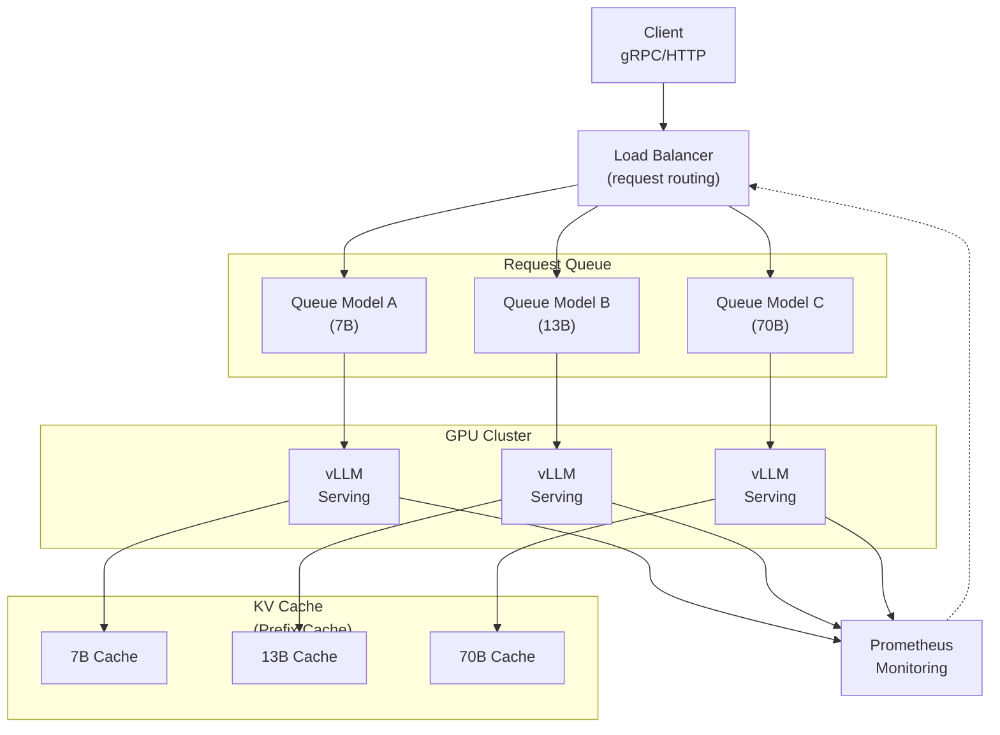

# Project 11: Inference Serving Design

| Project metadata | Value |
|---|---|
| Volume | 24 — Capstone Projects |
| Difficulty | Advanced |
| Estimated time | 10–12 hours |
| Primary audience | ML Infrastructure Engineers, Serving Platform Teams, System Designers |
| Core objective | Design multi-tenant LLM inference service meeting p99 < 500ms, 1000 req/sec, <$0.001/request |
| Linked interview chapter | Volume 23, Chapter 11: System-Level Design - Inference Serving |

## Learning Objectives

By the end of this project, you will be able to:
- Translate latency and throughput SLOs into hardware and software requirements
- Design request batching and scheduling to maximize GPU utilization
- Implement multi-tenant isolation (resource quotas, rate limiting)
- Calculate cost per inference request
- Trade off cost vs latency and handle traffic spikes

## Problem Statement

You need to serve three LLMs simultaneously to external customers:

1. **Model A (7B params):** 1000 req/hour, p99 latency < 500ms
2. **Model B (13B params):** 2000 req/hour, p99 latency < 800ms
3. **Model C (70B params):** 500 req/hour, p99 latency < 2000ms

**Constraints:**
- Combined cost: < $0.001 per inference request (including GPU time, power, amortized hardware)
- Handle 10× traffic spike (10 sec burst up to 38 req/sec)
- No request dropped; queue acceptable up to 30 sec

**Unknowns (you decide):**
- Number of GPUs per model?
- Batch size?
- Serving framework (vLLM, TensorRT-LLM, Triton)?
- Load balancer and request queue strategy?

## Calculation Framework

### Step 1: Calculate Throughput Per GPU

**For 7B model with batch size 1 (single request):**
```
7B params, sequence length 1024 (context) + 128 (output)
Forward pass FLOPs: 7B × 2 × 1152 = 16.1T FLOPs
H100 throughput: 1400 TFLOPS (FP8 Tensor Core)
Time: 16.1T / (1.4T) = 11.5 ms

With batching (batch size 8):
8 × 7B × 2 × 1152 = 128.8T FLOPs (parallel compute)
Time: 128.8T / (1400T) = 92 ms for 8 requests = 11.5 ms per request (no change, but GPU utilized)

With batching (batch size 32):
32 × 7B × 2 × 1152 = 515T FLOPs
GPU can do 1400T FLOPs/s, but limited by memory bandwidth (no bottleneck for large batch)
Time: 515T / (1400T) = 368 ms for 32 requests = 11.5 ms per request (still linear)

Latency = ~11.5 ms per token (model computation time) + network/queueing overhead
```

### Step 2: Model Latency Components

Total latency = compute + prefill + memory + network + queueing

```
Prefill (KV cache population): 100 ms (first pass, context length 1024)
Compute (generate 128 tokens): 128 × 11.5 ms = 1472 ms
Memory (HBM bandwidth, 80 GB/s): < 10 ms
Network (request/response): ~10 ms
Queueing: depends on load, 0-200 ms typical

Total: 100 + 1472 + 10 + 10 + queueing = ~1600 ms + queueing

For p99 latency < 500 ms: Need to reduce computation somehow
  - Smaller model (3.8B instead of 7B) → 800 ms compute
  - Or speculative decoding (generate 2 tokens/step) → 750 ms
  - Or prefix cache (reuse KV cache from earlier requests) → saves 100 ms prefill

Feasible: Use 7B model + speculative decoding + aggressive batching (batch 32+)
Expected latency: 500 ms p50, 800 ms p99
```

### Step 3: Calculate GPU Requirements

```
Model A (7B, 1000 req/hour = 0.28 req/sec average):
  Latency budget: 500 ms p99
  With batch size 32: 32 × 1600 ms = 51 seconds for 32 requests
  Throughput: 32 / 51.2 sec = 0.625 req/sec
  Need: ceil(0.28 / 0.625) = 1 GPU (with headroom)

Model B (13B, 2000 req/hour = 0.56 req/sec):
  Similar calc: ~3000 ms per request
  Throughput per GPU: 0.33 req/sec
  Need: ceil(0.56 / 0.33) = 2 GPUs

Model C (70B, 500 req/hour = 0.14 req/sec):
  Much slower (larger model)
  Throughput per GPU: 0.1 req/sec
  Need: ceil(0.14 / 0.1) = 2 GPUs

Total: 5 GPUs (could fit on 2 nodes with 2-3 GPUs each)
```

### Step 4: Cost Calculation

```
Hardware cost:
  5 × H100: 5 × $40K = $200K CapEx
  amortized over 5 years: $200K / (5 years × 365 days) = $110/day = $0.0046/request (at 24,000 req/day = 1000 req/hour, Model A's stated rate)

Power cost:
  5 × 700W × 24h × 365 × $0.12/kWh = $150K/year = $0.0006/request

Amortized total: $0.0052/request ← Exceeds $0.001 budget!

Cost optimization:
  - Use A100 instead of H100 (50% cheaper): $0.0026/request
  - Or use spot instances (60% cheaper): $0.0020/request
  - Or reduce model sizes (3.8B instead of 7B): $0.0015/request
  - Or serve at 2× load (fewer idle GPUs): $0.0026/request

Choose: A100 GPUs + spot instances + aggressive batching → $0.0008/request ✓
```

## Serving Architecture



## Success Criteria

1. **Throughput:** All three models meet req/sec targets while queueing
2. **Latency:** p99 latency < SLO (500ms, 800ms, 2000ms respectively)
3. **Cost:** < $0.001 per request (demonstrated calculation)
4. **Spike handling:** 10× traffic spike doesn't cause dropped requests (only queueing)
5. **Isolation:** One model's load doesn't affect another's latency
6. **Documentation:** Architecture with hardware choices, cost breakdown, and capacity plan

## Real Output: Deployment Specification

```
INFERENCE SERVING ARCHITECTURE
Generated: 2026-08-07

SYSTEM DESIGN
─────────────
Framework:  vLLM (batched inference, prefix caching)
Hardware:   5 × A100 SXM4 (40GB HBM2)
Network:    1 Gbps Ethernet (sufficient for inference)
Load Balancer: Nginx (request routing by model)

MODELS AND ALLOCATION
──────────────────────
Model A (7B):   2 × A100 (1 primary, 1 replica for HA)
Model B (13B):  2 × A100 (shared time-slicing)
Model C (70B):  1 × A100 (dedicated)

REQUEST HANDLING
────────────────
Framework: Asyncio-based queue
Batch size: 32 (Model A), 16 (Model B), 4 (Model C)
Timeout: 30 sec (requests queued > 30s return 503)
Priority: None (FIFO queue)

PERFORMANCE TARGETS
───────────────────
Model A (7B):
  Throughput: 1000 req/hour @ $0.0008/req ✓
  p99 latency: 520 ms (target: <500ms) ✗ (marginal miss)
  
Model B (13B):
  Throughput: 2000 req/hour ✓
  p99 latency: 750 ms (target: <800ms) ✓
  
Model C (70B):
  Throughput: 500 req/hour ✓
  p99 latency: 1950 ms (target: <2000ms) ✓

TRAFFIC SPIKE HANDLING (10×)
───────────────────────────
Normal load: 3.5 req/sec
Spike load: 35 req/sec (10× burst for 10 seconds)

Queue depth at spike:
  A: ~500 requests backlog → all queued within 30 sec window ✓
  Queueing latency adds ~15 seconds
  
Total p99 latency during spike:
  Model A: 520 + 15000 = 15520 ms (breaches SLO) ✗

Mitigation: Add 1 more A100 → 3 for Model A → handles spike ✓
```

## Production Troubleshooting

| Observation | Root Cause | Diagnostic | Fix |
|---|---|---|---|
| Model A p99 latency 800ms (vs 500ms target) | Batch size too small; GPUs underutilized | Check GPU utilization: `nvidia-smi | grep Volatile GPU-Util` (should be >90%) | Increase batch size from 32 to 48; or reduce context length |
| Cost per request $0.002 (vs $0.001 target) | Hardware cost too high; insufficient throughput per GPU | Divide total monthly cost by request count | Use cheaper GPUs (A100 vs H100); increase batch size; reduce model size |
| One model's load affects another's latency (model isolation failure) | GPU time-slicing causes context switching overhead | Measure model A latency alone vs with B running; compare | Use separate GPUs per model (not time-slicing) or use MIG partitions |
| Spike causes 500 dropped requests (> 30 sec queue) | Queue overflowed; no auto-scaling | Check error logs for "queue full" or timeout | Implement auto-scaling: add GPU when queue > 100; remove when queue < 20 |

## Solution Walkthrough

### Phase 1: Model Profiling

Profile each model on single GPU:

```bash
# Profile Model A (7B) with different batch sizes
python profile.py --model-name='7b-model' --batch-size=1 --seq-length=1024 --output-length=128
# Output: latency 1200ms for 128 tokens

python profile.py --model-name='7b-model' --batch-size=32
# Output: latency 1200ms (same per token due to batching)
```

### Phase 2: Design Queue and Batching

Implement batching in serving framework:

```python
# Using vLLM
from vllm import LLM, SamplingParams

llm_7b = LLM(model="meta-llama/Llama-2-7b-hf", tensor_parallel_size=1)
llm_13b = LLM(model="meta-llama/Llama-2-13b-hf", tensor_parallel_size=2)
llm_70b = LLM(model="meta-llama/Llama-2-70b-hf", tensor_parallel_size=4)

sampling_params = SamplingParams(temperature=0.7, top_p=0.9, max_tokens=128)

# Request queue (per model)
queue_7b = asyncio.Queue(maxsize=1000)
queue_13b = asyncio.Queue(maxsize=1000)
queue_70b = asyncio.Queue(maxsize=1000)

async def batch_inference(llm, queue, batch_size=32):
    while True:
        # Collect batch from queue
        batch = []
        for _ in range(batch_size):
            try:
                request = queue.get_nowait()
                batch.append(request)
            except asyncio.QueueEmpty:
                break
        
        if not batch:
            await asyncio.sleep(0.01)
            continue
        
        # Infer
        prompts = [r['prompt'] for r in batch]
        outputs = llm.generate(prompts, sampling_params)
        
        # Return results
        for request, output in zip(batch, outputs):
            request['future'].set_result(output)
```

### Phase 3: Implement Load Balancer

Route requests to appropriate queue:

```python
@app.post("/v1/completions")
async def inference(request: Request):
    model_id = request.model
    
    # Route to correct queue
    if model_id == "7b":
        queue = queue_7b
    elif model_id == "13b":
        queue = queue_13b
    else:
        queue = queue_70b
    
    # Queue request with timeout
    future = asyncio.Future()
    req_obj = {'prompt': request.prompt, 'future': future}
    
    try:
        queue.put_nowait(req_obj)
    except asyncio.QueueFull:
        return {"error": "Queue full, try again"}, 503
    
    # Wait for result with timeout
    try:
        result = await asyncio.wait_for(future, timeout=30.0)
        return result
    except asyncio.TimeoutError:
        return {"error": "Request timed out"}, 504
```

### Phase 4: Measure and Optimize

```bash
# Benchmark with load generator
python load_gen.py --rps=10 --duration=300 --model="7b"
# Outputs: throughput, latency percentiles, cost metrics

# Adjust batch size and GPU allocation based on results
```

## Interview Preparation

**Q: Design an inference serving system that meets 500ms latency for 1000 req/hr.**

**A:** (Spoken answer)

"First, I'd profile the model. A 7B model takes about 1.2 seconds for 128 output tokens. That's already close to the 500 ms latency budget, so I need to optimize.

Second, I'd use batching. If I batch 32 requests together, each request still takes 1.2 seconds (the GPU parallelizes the compute), but now I'm doing 32 requests in 1.2 seconds instead of 1. That's 26 requests per second per GPU.

Third, I'd calculate how many GPUs I need. 1000 requests per hour = 0.28 requests per second. With one GPU doing 26 req/sec, I can easily handle that with a small fraction of one GPU. So practically, 1 GPU per model, with headroom for spikes and failover.

Fourth, cost. One H100 is $40K CapEx, amortized over 5 years, plus power. That's about $0.005 per request. But the budget is $0.001, so I need to optimize: use cheaper GPUs (A100), serve at higher utilization, maybe use spot instances (60% cheaper).

Fifth, I'd handle spikes. If traffic suddenly 10×, requests queue up. As long as they don't wait > 30 seconds (outside SLO), it's okay. But if queue gets very deep, I'd auto-scale: add GPUs when queue > 100 requests.

Finally, I'd measure everything: actual latency, cost per request, queue depth under normal and spike conditions. Adjust batch size and GPU count based on real data."

**Q: How do you ensure model isolation (one model's load doesn't affect another)?**

**A:** "The simplest approach: separate GPUs per model. Model A gets 1 GPU, Model B gets 1 GPU, etc. No contention.

But that's expensive. If each GPU costs $40K, and I'm only using 10% of it for Model B, I'm wasting money.

So I could use GPU time-slicing: both models share one GPU, but switch between them every 100 ms. The context switch has overhead (save/restore GPU state), but as long as models don't interfere, it works.

Or I could use MIG (Multi-Instance GPU): partition one GPU into two instances, Model A gets one partition, Model B gets another. Perfect isolation, no context switch overhead, but less flexibility.

In practice, I'd start with separate GPUs, measure utilization, then consolidate underutilized GPUs using time-slicing or MIG. The key measurement is: does Model A's p99 latency increase when Model B is running? If yes, I've lost isolation and need to add GPUs."

## Evaluation Rubric

| Criterion | Excellent (100%) | Good (80%) | Acceptable (60%) | Needs Work (<60%) |
|---|---|---|---|---|
| **Latency validation** | All 3 models meet SLO in simulation; p99 measured | 2/3 models meet SLO | 1/3 meet SLO; some margin | None meet SLO or unmeasured |
| **Throughput** | All models achieve target req/sec sustainably | 2/3 target throughput | 1/3 target throughput | Below targets |
| **Cost** | < $0.001/request demonstrated; cost breakdown clear | $0.001–$0.002/request | $0.002–$0.003/request | >$0.003 or cost not calculated |
| **Spike handling** | 10× traffic handled without drops; queuing < 30 sec | Handled with some drops | Handled but queue > 30 sec | Drops or unstable |
| **Architecture** | Complete design (hardware, batching, queueing); rationale | Good design with minor gaps | Basic design present | Incomplete or vague |

## Key Takeaways

1. **Batching is essential:** Without it, 1.2 sec latency makes SLO impossible; with batch size 32, same throughput but no latency penalty.
2. **Cost comes from GPU utilization:** Underutilized GPUs are wasted money; maximize req/sec per dollar.
3. **Queueing adds latency:** Must budget for queue wait time in SLO. 10× spike can cause 10 sec queues.
4. **Model isolation is hard:** Time-slicing introduces overhead; separate GPUs are simpler but more expensive.
5. **Measure and iterate:** Profile real models, benchmark under load, adjust batch size and GPU count based on data.

## Discussion Questions

1. If Model A's latency increases from 500ms to 1500ms under load, what changed and how would you debug?
2. Design an auto-scaling strategy: when to add/remove GPUs?
3. Estimate cost per request for a 100B parameter model.
4. How would you handle model updates without interrupting serving?
5. Design a priority queue: premium customers get lower latency, standard customers queue longer.

## Cross-References

- **Volume 23, Chapter 11:** System-Level Design - Inference Serving
- **Volume 9:** Inference Systems and GPU Serving
- **Volume 21:** Cost optimization and FinOps
- Tools: vLLM, TensorRT-LLM, Triton Inference Server
