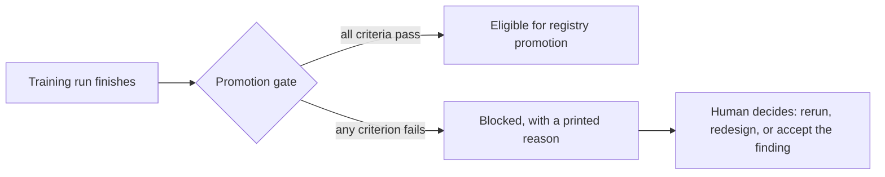

# Chapter 01: Why MLOps: The Cost of Ungoverned ML

| Chapter metadata | Value |
|---|---|
| Volume | 25 — MLOps Engineering |
| Difficulty | Foundational |
| Estimated reading time | 25 minutes |
| Primary audience | MLOps Engineers, ML Infrastructure Engineers, anyone who's been told "just train a model" |
| Core question | What specifically goes wrong when you skip experiment tracking, data versioning, and validation discipline — and why isn't "just be more careful" a sufficient fix? |

## Learning Outcome

By the end of this chapter, you will be able to:
- Explain why manual experiment tracking fails in enterprise environments.
- Identify the cost of silent data leakage and irreproducible model training.
- Map the core pillars of MLOps (Data Versioning, Experiment Tracking, Model Registry).
- Justify the ROI of MLOps to business stakeholders.

## Beginner's Primer: The MLOps Reality Check

If Volumes 1 through 24 taught you how to build the hardware, network, and software of an AI Factory, Volume 25 teaches you how to keep the humans using it from burning the factory down.

In an academic setting, a Data Scientist writes a Python script on their laptop, downloads a CSV file, trains a model, gets 95% accuracy, and writes a research paper.

In an Enterprise setting, if a Data Scientist trains a model and pushes it to production to make automated stock trades, the stakes change.
- **The "Works on my machine" Problem:** What happens when the model starts losing money 3 months later? The Data Scientist tries to retrain the model to fix it, but they *overwrite the original CSV file*. They can never reproduce the original 95% accuracy because the training data is gone forever.
- **The "Magic Seed" Problem:** The model only got 95% accuracy because of a lucky Random Number Seed. When someone else runs the exact same code, it gets 60% accuracy.

**MLOps (Machine Learning Operations)** is the discipline of treating AI models like traditional software. It forces Data Scientists to put their datasets into Version Control (like Git, but for data). It forces them to log every single metric into a central database. It physically prevents a model from reaching production unless it passes an automated suite of tests. This volume teaches you how to build that pipeline.

## WHY

Before this volume's pipeline existed, the same underlying project — predicting large price moves in a financial time series from historical candle data — was attempted with a much more common, much less disciplined workflow: pull some data, engineer some features by hand, run a training script once or twice, look at which features came out with high importance scores, and build a rule-based system around whatever looked convincing.

That approach lost real money. Not because the underlying idea (predicting large moves from price action) was wrong, but because the *process* of validating the idea was broken in a specific, common way: a small number of training runs produced *different, contradictory* answers about which features mattered, and the difference between those runs was noise, not signal. Trusting the seemingly-most-convincing run — rather than checking whether the result reproduced — is a $ mistake with a name: it's what happens when there's no governance layer between "a training run finished" and "we act on this."

MLOps is the set of practices that puts a governance layer there. It's not a product you install; it's a discipline the rest of this volume mechanizes into actual tooling.

## WHAT

MLOps sits at the intersection of three things that, individually, are well-understood:

1. **Data engineering** — getting the right data, cleaned, in one place.
2. **Software engineering / DevOps** — version control, CI/CD, reproducible environments.
3. **Data science / ML** — model architectures, training loops, metrics.

None of those three disciplines alone catches the specific failure mode from the WHY section. Data engineering doesn't know a model was trained on a particular data snapshot. Classic DevOps version-controls code, not multi-gigabyte datasets or trained model weights. Data science, left to its own devices, will happily report the best-looking number out of several runs without being forced to check whether it reproduces.

MLOps is the specific practices that close those three gaps:

| Gap | MLOps practice | This volume's chapter |
|---|---|---|
| "Which exact data produced this model?" is unanswerable | Data versioning | Chapter 3 |
| No record of what was tried, only what's remembered | Experiment tracking | Chapter 4 |
| A model can be evaluated on data it indirectly saw | Leakage-safe dataset construction | Chapter 5 |
| A single good-looking run gets trusted | A promotion gate with hard, mechanical criteria | Chapter 7 |

## HOW

The mechanism that turns "be more disciplined" from a nice sentiment into something that actually holds under pressure is **making the discipline structural, not optional**. Concretely, in this project:

- Every dataset transformation writes a *new*, timestamped file rather than mutating one in place, and gets a content-hashed pointer committed to version control (Chapter 3). You cannot silently overwrite a dataset version — the old one is still addressable.
- Every training run, without exception, logs to a tracking server before its metrics are trusted (Chapter 4). There is no "quick script I ran outside the tracked pipeline" path in this project's actual code — `run_experiment.py` opens an MLflow run as literally its first action.
- The promotion gate (Chapter 7) is a function that returns pass/fail based on hard-coded criteria — number of folds evaluated, cross-fold variance, whether the candidate beat a logged baseline, whether the result reproduced across seeds — and it is *called*, its exit code checked, not eyeballed. Section-by-section proof of this exact behavior is in Chapter 7; here's the shape of the guarantee:



The critical property: **the gate function has no code path that promotes a model because a human found the number impressive.** It either mechanically passes every check or it doesn't.

## WHEN

You need this governance layer specifically when the cost of a wrong "the model works" conclusion is asymmetric and real — financial trading decisions, medical predictions, safety-critical automation, anything where being wrong costs meaningfully more than the model being merely mediocre.

You need it *less* urgently for pure research exploration where a wrong conclusion just means a wasted afternoon rerunning an experiment. Even there, though, experiment tracking (Chapter 4) pays for itself almost immediately — every ML practitioner has, at some point, been unable to reproduce a result from "a few weeks ago" because nothing was logged.

## TRADEOFFS

| Approach | Speed to first result | Trustworthiness of that result | Cost when wrong |
|---|---|---|---|
| No tracking, no versioning, one run | Fastest | Lowest — you cannot tell luck from signal | Highest — this is the failure mode Chapter 1 describes |
| Tracking + versioning, no promotion gate | Fast | Better — you *can* check for reproducibility, but nothing forces you to | Medium — the tooling exists but discipline can still lapse under time pressure |
| Full pipeline (tracking + versioning + a hard promotion gate) | Slower to first "production-ready" model | Highest — a bad result is mechanically blocked, not just discouraged | Lowest, but at the cost of iteration speed and infrastructure investment |

The honest trade this volume makes: everything from Chapter 2 onward is slower to set up than "just write a training script." It is exactly that setup cost that buys the guarantee.

## PRODUCTION

In production, this governance layer isn't a one-time setup — it's what every subsequent model iteration runs through. Concretely, in this project, the standing rule (carried forward from the earlier failure) is: **no model architecture or feature choice gets adopted based on fewer than the full walk-forward fold set, and no configuration is considered stable until it's been re-run with at least two additional random seeds and produced consistent results.** That rule is enforced by the promotion gate's code, not by a team's memory of "we should really check that."

**Q: Doesn't this just slow everything down without changing what the model actually learns?**
**A:** Yes and no. It does not change what a *correctly validated* model would have found anyway — a real, reproducible signal survives multiple folds and multiple seeds by definition. What it changes is whether you find out a result *wasn't* real before or after you've acted on it. The past failure mode in this exact project is proof of the "after" cost.

## TROUBLESHOOTING

### Scenario 1: "We got a great result, why can't we ship it?"

**Symptom:** A training run shows strong metrics (high ROC-AUC/PR-AUC), and there's pressure to deploy immediately.

**Diagnosis:** A single good run, on its own, is indistinguishable from a lucky run. This is a probabilistic property of small-sample evaluation, not a criticism of the specific number.

**Evidence vs. Proof:** A high metric on one fold is evidence the model *might* have found something real. It is not proof — proof requires seeing the same (or a compatibly close) result across independent folds and independent random seeds, which is exactly what a single run cannot show by construction.

**Resolution:** Run the full walk-forward fold set and at least 2 additional seeds before treating the result as real. This project's `promotion_gate.py` (Chapter 7) automates the check so it isn't a judgment call under deadline pressure.

### Scenario 2: "The model's features changed between two runs and nobody knows why"

**Symptom:** Two training runs a week apart, same code, produce meaningfully different results, and the team can't explain the discrepancy.

**Diagnosis:** Without data versioning, "same code" doesn't mean "same data" — an upstream data pipeline may have run again in between and silently changed the underlying dataset (this project's own raw spot-price CSV is exactly this kind of continuously-updated source).

**Evidence vs. Proof:** Identical training code across two runs is evidence the discrepancy is data-related, not code-related. It is not proof until the actual dataset hashes from both runs are compared.

**Resolution:** Compare the DVC hash (Chapter 3) logged as an MLflow parameter (Chapter 4) for both runs. If the hashes differ, the mystery is solved immediately — different data, not the same data doing something different. If the hashes match, the investigation correctly shifts to seed/environment nondeterminism instead.

```bash
# Compare the exact dataset version each MLflow run was trained on
mlflow runs list --experiment-id <exp_id>
# then inspect the logged 'dataset_path' / DVC hash param on each run
```

## Interview Preparation

**Conceptual:** "What's the difference between a data scientist doing careful, disciplined experimentation and an MLOps pipeline enforcing the same discipline?"

**Model Answer:** "A careful individual can absolutely follow good practice manually — track their own runs in a spreadsheet, remember to check multiple seeds, keep a mental note of which dataset version produced which result. The problem MLOps solves isn't that careful people don't exist; it's that manual discipline degrades under deadline pressure, doesn't survive a team member leaving, and doesn't scale past one person's memory. An MLOps pipeline takes the exact same checks — did this reproduce across folds and seeds, what data produced this model, does it beat a logged baseline — and makes them structural: the training script logs to a tracking server as its first action, the dataset transformation writes an immutable versioned artifact instead of overwriting a file, and the promotion function returns a hard pass/fail instead of a human's impression. It's the difference between 'we're supposed to check this' and 'the code physically can't skip checking this.'"

**Architecture:** "You're brought into a team that has a training script, no experiment tracking, and a habit of manually copying good-looking results into a spreadsheet. What's the first thing you'd change, and why that first?"

**Model Answer:** "I'd add experiment tracking before touching anything else, because it's the lowest-cost, highest-leverage change — it requires no change to the model or data pipeline, just wrapping the existing training call with a tracking context, and it immediately makes every subsequent decision auditable. Data versioning and a promotion gate matter just as much long-term, but experiment tracking is the prerequisite for both: you can't build a promotion gate that compares cross-fold or cross-seed metrics if those metrics aren't being captured anywhere queryable in the first place. I'd sequence it as tracking first, then versioning (once I know what the tracked runs actually need to reference), then the promotion gate last, once there's enough tracked history to define reasonable pass/fail thresholds from real data rather than guesses."

**Troubleshooting:** "A model that performed well in offline validation is performing much worse in production. Walk through how you'd investigate, given this volume's tooling."

**Model Answer:** "First, I'd check whether the offline validation itself was leakage-free — Chapter 5 covers this project's real example of a labeling bug where dropped rows would have broken lookback context across day boundaries, which is exactly the kind of subtle leak that inflates offline metrics without being obvious from the numbers alone. Second, I'd pull the exact MLflow run that was promoted and check whether it passed the full promotion gate — all folds, low cross-fold variance, multiple seeds — or whether it was an exception that got waved through under pressure, which is the Chapter 1 failure mode recurring. Third, I'd compare the DVC-versioned training data's statistical properties (date range, class balance, feature distributions) against what production is actually seeing now — a regime shift between the training window and live traffic is a completely different failure from a leaky offline metric, and the two require different fixes."

## Architecture Summary

MLOps is the application of strict software engineering principles to the non-deterministic world of Machine Learning. Without MLOps, AI models are "black boxes" that cannot be audited, reproduced, or safely rolled back when they inevitably degrade in production. A mature MLOps pipeline enforces strict Data Versioning (DVC), Centralized Experiment Tracking (MLflow), and Automated Promotion Gates to eliminate human error.

```mermaid
flowchart TD
    subgraph The_Cost_of_Ungoverned_ML["Ungoverned ML vs MLOps Pipeline"]
        direction LR
        
        subgraph Ungoverned["The Ungoverned Nightmare"]
            direction TB
            CSV[Local CSV File <br/> Gets overwritten] --> Script[Jupyter Notebook <br/> 'final_v2_really_final.ipynb']
            Script --> Acc[99% Accuracy <br/> (Caused by Data Leakage)]
            Acc --> Deploy1[Manual Deployment <br/> Fails in Production]
        end
        
        subgraph MLOps["The MLOps Pipeline"]
            direction TB
            DVC[DVC: Data Versioning <br/> Immutable dataset hash] --> Train[CI/CD Training Pipeline <br/> Reproducible Code]
            Train --> MLflow[MLflow: Experiment Tracking <br/> Logs all hyperparameters]
            MLflow --> Gate{Promotion Gate <br/> Cross-validation tests}
            Gate -->|Passes| Registry[Model Registry]
            Registry --> Deploy2[Automated Deployment]
        end
    end
    
    style Ungoverned fill:#ffcccc,stroke:#cc0000
    style MLOps fill:#ccffcc,stroke:#006600
```

## Related Chapters

- **Next:** [Chapter 2 — GPU Cloud Provisioning for Training Workloads](./chapter-02-gpu-cloud-provisioning-for-training-workloads.md) — the infrastructure this governance layer runs on
- **Related:** [Chapter 9 — The Model Promotion Gate](./chapter-09-the-model-promotion-gate-governance-before-the-registry.md) — the concrete mechanism this chapter argues for
- **Related:** [Chapter 10 — End-to-End Case Study](./chapter-10-end-to-end-case-study-banknifty-big-move-prediction-pipeline.md) — the full story this chapter's opening anecdote is drawn from
