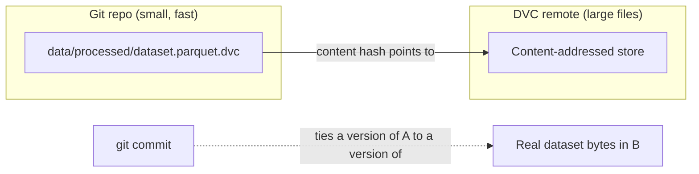

# Chapter 03: Data Versioning with DVC

| Chapter metadata | Value |
|---|---|
| Volume | 25 — MLOps Engineering |
| Difficulty | Intermediate |
| Estimated reading time | 45 minutes |
| Primary audience | MLOps Engineers, anyone who's tried to `git add` a 26MB CSV and regretted it |
| Core question | How do you get Git's guarantees (every version addressable, tied to a code commit) for files Git itself can't handle well? |

## WHY

Git is excellent at versioning text — it diffs, merges, and stores small changes to code efficiently. It is a poor fit for the kind of files ML pipelines produce: multi-megabyte-to-gigabyte datasets and model checkpoints that don't diff meaningfully (a one-row change to a CSV looks, to Git, like the entire file changed) and that would bloat a repository's history permanently, since Git never truly deletes old blob content from history.

Without a solution to this, teams fall back to informal conventions — "the training data is in this shared folder, don't touch it" — which is exactly the kind of ungoverned state Chapter 1 warns about: nothing ties a specific model back to the specific bytes of data that produced it.

## WHAT

DVC (Data Version Control) solves this by **not** putting the actual data in Git at all. Instead:

- The real data file lives in a **DVC cache/remote** (any storage — local disk, S3, or in this project's case, a plain directory reachable over SSH).
- Git tracks a tiny **`.dvc` pointer file** — a few lines of YAML containing the real file's content hash, size, and path.
- Because the pointer file is what Git commits, a specific Git commit now unambiguously identifies a specific version of the (much larger) real data — exactly the property Chapter 1 says is missing without data versioning.



## HOW

### Step 1 — Initialize DVC in the project

```bash
cd banknifty_bigmove_ml
dvc init --subdir   # --subdir because this project lives inside a larger repo, not at its root
```

This creates a `.dvc/` directory (config + internal state) that *does* get committed to Git — it's small metadata, not the data itself.

### Step 2 — Point DVC at a remote

This project's remote is a plain directory on the same GPU box provisioned in Chapter 2, reached over SSH — no S3 bucket, no managed service, because a single-node project doesn't need one:

```bash
dvc remote add -d nebius "ssh://jithin@<vm-ip>/data/mlops/dvc-store"
dvc remote modify nebius keyfile ~/.ssh/nvidia-lab
```

Resulting `.dvc/config`:

```ini
[core]
    remote = nebius
['remote "nebius"']
    url = ssh://jithin@<vm-ip>/data/mlops/dvc-store
    keyfile = /Users/jithinpjoseph/.ssh/nvidia-lab
```

### Step 3 — Track a real file and push it

```bash
dvc add data/processed/banknifty_bigmove_full_20260913T114427.parquet
```

Real output:

```text
To track the changes with git, run:

	git add data/processed/banknifty_bigmove_full_20260913T114427.parquet.dvc
```

The resulting `.dvc` file (this is the entire thing DVC asks Git to track):

```yaml
outs:
- md5: 1a563cac4812e2d61b8d5686e006fdd5...
  size: 11049241
  path: banknifty_bigmove_full_20260913T114427.parquet
```

Then push the real bytes to the remote:

```bash
dvc push
# 1 file pushed
```

**Verifying the round-trip actually worked** — not just trusting the "1 file pushed" message — by checking the remote directly:

```bash
ssh -i ~/.ssh/nvidia-lab jithin@<vm-ip> \
  'find /data/mlops/dvc-store -type f | head -5; du -sh /data/mlops/dvc-store'
# /data/mlops/dvc-store/files/md5/1a/563cac4812e2d61b8d5686e006fdd5
# 11M    /data/mlops/dvc-store
```

The path structure (`files/md5/1a/563cac...`) is DVC's content-addressed storage — the first two hex characters of the hash become a subdirectory, standard practice for avoiding millions of files in one flat directory (Git's own object store uses the identical trick).

## WHEN

Use DVC (or an equivalent — see TRADEOFFS) for any dataset or model artifact above a few megabytes that changes over the life of a project, and especially for anything an MLflow-tracked run needs to reference by exact version (Chapter 4 logs the dataset's filename/hash as a run parameter specifically so a training run and its data version are permanently linked).

Don't bother for genuinely static, small reference files (a lookup table under a few hundred KB) — plain Git handles those fine, and adding DVC's indirection has no payoff there.

## TRADEOFFS

| Approach | Pros | Cons |
|---|---|---|
| Git-LFS | Simpler mental model (still feels like Git) | Weaker pipeline/reproducibility story — no `dvc.yaml`-style stage tracking |
| DVC with a local/SSH remote (this project) | Zero extra infrastructure — reuses a box you already have | Doesn't scale to many concurrent users the way a real object store does |
| DVC (or similar) with S3/GCS remote | Scales, standard in larger orgs | Extra infrastructure and cost for a single-user project |
| No versioning, just a shared folder convention | Fastest to start | This is the exact gap Chapter 1 describes — silently reproduces the ungoverned-ML failure mode |

## PRODUCTION

In production, the same `.dvc` pointer file mechanism scales to team use by pushing to a shared, access-controlled remote (S3 with bucket policies, for instance) instead of one person's SSH-reachable box. The workflow doesn't change — `dvc add`, `dvc push`, commit the `.dvc` file — only the remote's storage backend does, which is why the CLI cleanly abstracts over remote type.

## TROUBLESHOOTING

### Scenario 1: `.dvc` pointer files are invisible to Git

**Symptom:** `dvc add` succeeds, but `git status` shows nothing, and `git add data/processed/foo.parquet.dvc` reports the file is ignored.

**Diagnosis:** A blanket `.gitignore` rule (`data/`) written for an earlier, non-DVC project convention was matching the entire `data/` directory tree — including the small `.dvc` pointer files that are supposed to be tracked, not just the large actual data files they point to.

**Evidence vs. Proof:** `git check-ignore -v <path>` printing a matching rule is proof, not just evidence — it shows exactly which `.gitignore` line is responsible:

```bash
git check-ignore -v "banknifty_bigmove_ml/data/processed/foo.parquet.dvc"
# .gitignore:56:data/    banknifty_bigmove_ml/data/processed/foo.parquet.dvc
```

**Resolution:** Add a targeted negation *for the directory itself* (not the files in it — the `*.parquet`/`*.csv` rules elsewhere in the same `.gitignore` still correctly keep the actual heavy files untracked):

```gitignore
data/
!banknifty_bigmove_ml/data/
!banknifty_bigmove_ml/data/**/
```

Re-verify with the same command — a `.dvc` file should no longer appear in the ignored list, while the `.parquet` file it points to still correctly does:

```bash
git check-ignore -v "banknifty_bigmove_ml/data/processed/foo.parquet.dvc"  # no output = not ignored
git check-ignore -v "banknifty_bigmove_ml/data/processed/foo.parquet"      # still ignored, correctly
```

### Scenario 2: A stale `.dvc` pointer file left after replacing a dataset version

**Symptom:** An old `<name>.dvc` file still exists in the repo after a corrected, renamed dataset (e.g., `banknifty_bigmove_labeled_*.parquet.dvc` superseded by `banknifty_bigmove_full_*.parquet.dvc`) was pushed.

**Diagnosis:** `dvc add` on a new filename creates a new pointer file; it doesn't automatically clean up a differently-named old one.

**Resolution:** Remove the stale pointer explicitly and commit the removal, same as retiring any other tracked file:

```bash
rm -f data/processed/banknifty_bigmove_labeled_20260913T112318.parquet.dvc
git add -u   # stages the deletion
```

## Interview Preparation

**Conceptual:** "Why can't you just put a large dataset in Git directly, and why doesn't compressing it first solve the problem?"

**Model Answer:** "Git's core design assumption is that most tracked content is text that diffs well and that history is cheap to keep forever — every version of every file ever committed stays in the repository's object database by default. A large binary dataset breaks both assumptions: it doesn't diff meaningfully (Git can't show you 'row 40,000 changed', it just sees a different blob), and keeping every historical version of a multi-gigabyte file forever makes the repository balloon and makes basic operations like clone and fetch progressively slower for everyone. Compressing it first doesn't fix either problem — it's still an opaque blob to Git's diffing, and it still accumulates in history. DVC's fix is structural, not just 'smaller files': the large content lives outside Git entirely, in a remote store, and Git only ever tracks a tiny, fixed-size pointer to it, so Git's repository size and performance stay independent of how much data you're actually versioning."

**Architecture:** "Design a data versioning setup for a team of five ML engineers, where datasets are already stored in an existing S3 bucket."

**Model Answer:** "I'd keep the S3 bucket as the DVC remote rather than introducing a new storage location — `dvc remote add -d <name> s3://<existing-bucket>/<prefix>` — so there's no data migration required. Each engineer runs the same `dvc add`/`dvc push`/`dvc pull` workflow against that shared remote, and the small `.dvc` pointer files go through normal Git PR review like any other code change, which naturally gives dataset version changes the same review/discussion process as code changes. I'd also make sure S3 bucket versioning or lifecycle policies don't silently delete content DVC still references via an old commit's pointer file, since DVC's guarantee that 'any past commit's data is still fetchable' depends on the remote actually retaining that content."

**Troubleshooting:** "`dvc pull` fails with a permission error on a teammate's machine but works on yours. What do you check?"

**Model Answer:** "First, whether the remote's authentication is per-user (their own SSH key, their own AWS credentials) rather than something hard-coded to my machine — this project's `.dvc/config` literally stores a keyfile path (`/Users/jithinpjoseph/.ssh/nvidia-lab`), which is my local path and wouldn't resolve the same way on a teammate's machine at all; a shared-team setup needs each person's local DVC config to point at their own key via `dvc remote modify --local`, not the committed shared config. Second, whether the remote-side access control (SSH `authorized_keys`, or S3 IAM policy) actually grants that teammate's identity access, separate from whether their local DVC config is even pointed at the right credentials."

## Related Chapters

- **Previous:** [Chapter 2 — GPU Cloud Provisioning](./chapter-02-gpu-cloud-provisioning-for-training-workloads.md) — the persistent volume this chapter's remote lives on
- **Next:** [Chapter 4 — Experiment Tracking with MLflow](./chapter-04-experiment-tracking-with-mlflow.md) — logs the DVC hash from this chapter as a run parameter, tying a model to its exact data version
- **Related:** [Chapter 6 — Building Leakage-Safe Training Datasets](./chapter-06-building-leakage-safe-training-datasets-for-time-series-ml.md) — what actually gets versioned by this chapter's pipeline
