# Chapter 06: Building Leakage-Safe Training Datasets for Time-Series ML

| Chapter metadata | Value |
|---|---|
| Volume | 25 — MLOps Engineering |
| Difficulty | Advanced |
| Estimated reading time | 55 minutes |
| Primary audience | ML Engineers working with any temporally-ordered data (finance, IoT sensor streams, user event logs) |
| Core question | How do you compute a label and split your data so that a model is never evaluated using information it wouldn't actually have at prediction time — and how do you catch it when you get this subtly wrong? |

## WHY

Time-series data has a property that trips up dataset construction far more often than people expect: **the correct answer for "what happened next" is only defined relative to a point in time, and it is extremely easy to accidentally let information from the future leak backward into either the label or the input features.** A model evaluated on leaked data looks great offline and fails in production, because production doesn't have access to the future the offline evaluation accidentally used.

This chapter documents two real leakage risks this project actually had to design around — one in labeling, one in dataset splitting — plus a real bug (not leakage, but a related data-loss failure mode) that was caught by testing a boundary condition directly.

## Beginner's Primer: Time Traveling Models

If you are training an AI model to detect cats and dogs, the order of the images does not matter. You can take 10,000 photos, shuffle them randomly, train on 80%, and test on 20%.

If you are training an AI model to predict the Stock Market (Time-Series data), shuffling the data is a catastrophic mistake. 

If you take 10 years of stock data, shuffle the days randomly, and train on 80% and test on 20%, you will experience **Data Leakage (Time Travel)**. 
The model will accidentally see data from 2023 during training, and then be "tested" on data from 2022. The model will score 99% accuracy because it literally saw the future. You will deploy the model, and it will immediately lose all your money because, in the real world, you cannot see tomorrow's prices.

To prevent Time Travel, MLOps engineers enforce strict **Walk-Forward Validation**. You are never allowed to shuffle data. You must train on Jan-March, and test on April. Then train on Jan-April, and test on May. This mathematically guarantees the model is only ever tested on the "unknown future."

## WHAT

Two independent properties, both required:

1. **Leakage-safe labels**: the label for a given point in time must be computable using *only* data that occurred strictly after that point (for a forward-looking label) or strictly before it (for a backward-looking feature) — never data from the same moment that wouldn't actually be observable yet, and never data that implicitly reaches across a boundary that shouldn't be crossed (in this project: the label must never be computed using candles from a different trading session).

2. **Leakage-safe splits**: a model's validation performance must be measured on data the model's training process — including any hyperparameter tuning — never touched, and never on data that chronologically precedes what it trained on (a "future-to-past" split silently lets the model implicitly benefit from patterns that only existed later).

## HOW

### Part 1 — Leakage-safe label computation

This project's label: for each 1-minute candle, does the price move ±0.3% at any point in the *next* 45 minutes?

```python
def label_session(high, low, close, horizon, pct):
    n = len(close)
    label = np.full(n, np.nan)
    if n <= horizon:
        return label   # not enough forward data in this session — leave undefined, not a guess

    fwd_max = sliding_window_view(high, horizon).max(axis=1)
    fwd_min = sliding_window_view(low, horizon).min(axis=1)

    valid_n = n - horizon
    upper = close[:valid_n] * (1 + pct)
    lower = close[:valid_n] * (1 - pct)

    # row t's forward window is candles [t+1, t+horizon] — NOT [t, t+horizon-1]
    window_max = fwd_max[1:valid_n + 1]
    window_min = fwd_min[1:valid_n + 1]
    label[:valid_n] = np.where((window_max >= upper) | (window_min <= lower), 1.0, 0.0)
    return label
```

Two leakage risks this directly guards against:

- **Off-by-one on the window boundary.** If the forward window accidentally included candle `t` itself (rather than starting at `t+1`), the label would trivially be influenced by the same candle it's supposedly predicting *from* — a textbook, easy-to-miss leak. This is why the code is tested with an explicit boundary assertion (see Part 3).
- **Cross-session leakage.** Computed **per trading session** (`label_session` is called once per calendar day, not once over the whole continuous series) — a label for the last candle of Monday must never be computed by looking at Tuesday's candles, since a real trading system wouldn't have Tuesday's data available at that point in time regardless of how the array happens to be laid out in memory.

### Part 2 — Chronological, expanding-window walk-forward splits

Never split time-series data randomly — a random 80/20 split would put some future timestamps in "training" and some past timestamps in "validation," letting the model implicitly learn from data chronologically after what it's being validated on.

```python
def build_walk_forward_folds(trading_days, initial_train_days, val_block_days):
    ...
    while train_end_idx + val_block_days <= n:
        val_start_idx = train_end_idx
        val_end_idx = train_end_idx + val_block_days
        folds.append(Fold(
            train_start=days[0], train_end=days[val_start_idx - 1],
            val_start=days[val_start_idx], val_end=days[val_end_idx - 1],
        ))
        train_end_idx = val_end_idx   # NEXT fold's training window EXPANDS to include this fold's validation block
```



```mermaid
gantt
    dateFormat X
    axisFormat %s
    section Fold 1
    Train :0, 4
    Val   :4, 5
    section Fold 2
    Train :0, 5
    Val   :5, 6
    section Fold 3
    Train :0, 6
    Val   :6, 7
```

Each fold's training window is strictly a prefix of time, and each fold's validation window is strictly the block immediately after it — chronology is never violated. A final block is reserved as an untouched holdout, never used for any hyperparameter decision, only for a final, one-time check after a model configuration is otherwise fully validated.

### Part 3 — A real bug: the holdout silently dropping the newest data

The first version of this splitting code capped the holdout at exactly one `val_block_days`-sized block:

```python
# BUGGY — do not use
holdout_end_idx = min(train_end_idx + val_block_days, n) - 1
```

Running it against the real dataset (1,242 trading days, `initial_train_days=400`, `val_block_days=100`) produced 7 folds and a holdout reported as **2026-02-16 → 2026-07-15** — but the actual dataset's last day was **2026-09-11**. Roughly 42 trading days (about two months) of the newest data were silently excluded from every fold *and* the holdout, because `train_end_idx + val_block_days` (1,100 + 100 = 1,200) was less than the true remaining day count (1,242), so `min()` picked the smaller value and simply never accounted for the leftover 42 days.

**This wasn't leakage — it was silent data loss, arguably worse in one respect: it doesn't show up as a suspiciously-good metric, it just quietly throws away the most recent, often most relevant, data with no error or warning.**

**The fix:**
```python
holdout_start_idx = train_end_idx
holdout_end_idx = n - 1   # ALWAYS the true end of the dataset — absorbs any remainder, never caps early
```

**How this was caught**: not by code review, but by printing the actual fold plan against the real dataset and manually checking the holdout's reported end date against the known last date in the file — a direct instance of the site-wide habit this whole bootcamp is built around: *a computed result is evidence toward a hypothesis ("the split logic is correct"), not proof, until you check it against ground truth directly.*

```bash
python3 splits.py
#   holdout (untouched): 2026-02-16 -> 2026-07-15     <- WRONG, dataset actually goes to 2026-09-11
# after the fix:
#   holdout (untouched): 2026-02-16 -> 2026-09-11     <- correct
```

A regression test now encodes this exact scenario permanently:

```python
def test_holdout_absorbs_full_remainder_not_capped_at_one_block():
    days = _days(1242)
    plan = build_walk_forward_folds(days, initial_train_days=400, val_block_days=100)
    assert plan.holdout_end == days[-1]   # every trailing day is covered, none dropped
```

## WHEN

Apply per-session (not whole-series) label computation any time your data has natural discontinuities that a naive sliding window would silently cross (trading sessions, daily sensor batches, per-user event streams). Apply chronological walk-forward splitting any time the data has a genuine time axis and future information could plausibly help predict the past (essentially always, for real time series). Test boundary conditions directly, by printing real output against known ground truth, any time a data pipeline's correctness can't be fully verified just by reading the code.

## TRADEOFFS

| Split strategy | Leakage risk | Realism (matches production) |
|---|---|---|
| Random 80/20 | High — future can leak into training | Low — production never gets to see "the future" during training |
| Single chronological train/test split | None | Medium — only tests one point in time |
| Expanding-window walk-forward (this project) | None | High — mimics how a model would actually be retrained and evaluated over time, at the cost of more compute (many folds instead of one) |

## PRODUCTION

In production, the untouched holdout block plays a specific, disciplined role: it is evaluated *exactly once*, after a model configuration has already passed the full walk-forward promotion gate (Chapter 9) on the other folds. If a configuration is tweaked based on the holdout's result and re-evaluated, the holdout has been "used" for tuning and is no longer a valid final check — this is a common, subtle way teams accidentally destroy their own holdout's validity without realizing it.

## TROUBLESHOOTING

### Scenario 1: Offline metrics look great, live performance doesn't match

**Symptom:** A model shows strong PR-AUC in walk-forward validation but performs close to random once deployed.

**Diagnosis:** Almost always a leakage issue somewhere upstream of the metric — either the label computation, an engineered feature, or the split itself is letting the model see something it wouldn't have access to live.

**Evidence vs. Proof:** A big gap between offline and live metrics is evidence of leakage. It is not proof by itself — a genuine regime shift (the market or data distribution changed) produces the identical symptom. Proof requires directly auditing whether any feature or label computation touches data from at or after the prediction timestamp.

**Resolution:** Audit every feature/label computation for an explicit "which timestamps does this read from" answer. If any read includes the current or a future timestamp relative to when the prediction would actually be made, that's the leak.

### Scenario 2: A pipeline's row counts silently change between two runs of "the same" split logic

**Symptom:** Two runs of the same splitting code, on what should be the same dataset, produce a different number of folds or a different holdout range.

**Diagnosis:** The underlying dataset grew between runs (new data arrived, as in this project's own continuously-updated raw feed) and the split boundaries are date-derived, not fixed indices — this is expected behavior, not a bug, but needs to be recognized as such rather than assumed to be an error.

**Resolution:** Always log the exact date range and fold count actually used for a given training run (Chapter 4's MLflow parameters), so two runs' results are only ever compared knowing whether they used the identical split or not.

## Interview Preparation

**Conceptual:** "What's the difference between data leakage and the holdout-truncation bug described in this chapter, and why does it matter that they're different?"

**Model Answer:** "Data leakage means the model saw information during training or validation that it wouldn't actually have access to at prediction time — it makes offline metrics look *artificially better* than they should. The holdout-truncation bug in this chapter is the opposite kind of problem: it didn't let the model see anything it shouldn't have, it just silently *excluded* real, valid data from ever being used at all. The practical difference matters because they have opposite symptoms and opposite fixes — leakage shows up as suspiciously good metrics that don't hold up in production, while silent data exclusion doesn't show up in the metrics at all, it just means you're training and validating on less (and often less recent) data than you think, which you'd only catch by directly checking the actual date ranges used against what you expected."

**Architecture:** "Design a labeling and validation scheme for a time-series problem where the label itself takes 30 days to be known (e.g., a 30-day customer churn label)."

**Model Answer:** "The core adaptation from this chapter's 45-minute-horizon label is that any row within the last 30 days of the available dataset simply cannot have a defined label yet, the same way this chapter's per-session labeling leaves the last `horizon` candles of each day undefined — those rows exist as valid input-context for other examples but can never themselves be a training target until 30 days after their timestamp have actually passed. For the walk-forward split, I'd make sure the validation block's end date is at least 30 days before 'today' at the time of evaluation, otherwise some validation-set labels would be provisional/incomplete rather than final ground truth, which is a more severe version of the same 'don't evaluate on undefined labels' principle."

**Troubleshooting:** "A colleague says their walk-forward validation must be leakage-free because they're 'not using random splits.' Is chronological splitting alone sufficient?"

**Model Answer:** "No — chronological splitting prevents the split-level leakage (future data appearing in a training set before a chronologically earlier validation set), but it says nothing about leakage inside the label or feature computation itself. This chapter's own project needed both: chronological walk-forward folds *and* a per-session, forward-window-only label computation that's separately leakage-safe. A team could have perfectly chronological splits and still leak badly if, say, a feature was computed using a centered rolling window that includes future values, or if daily/session boundaries aren't respected and a label reaches across a discontinuity it shouldn't. I'd ask specifically how the label and every engineered feature are computed, not just how the train/validation boundary is drawn."

## Architecture Summary

When building time-series datasets (financial trading, IoT sensor telemetry), MLOps pipelines must strictly enforce chronology to prevent "Data Leakage." If traditional random K-Fold cross-validation is used, the model will inadvertently train on future data to predict past events, resulting in artificially high offline accuracy and catastrophic failure in production. Engineers must implement sequential Walk-Forward validation splits.

```mermaid
flowchart TD
    subgraph Data_Leakage_Prevention["Time-Series Validation Splits"]
        direction TB
        
        subgraph Bad["Random K-Fold (Data Leakage!)"]
            direction LR
            D1[Train: 2021] --> D2[Train: 2023] --> D3[Test: 2022]
            D3 -.->|Model saw 2023 before predicting 2022!| Fail[Artificial 99% Accuracy]
        end
        
        subgraph Good["Walk-Forward Validation (Production Standard)"]
            direction LR
            W1[Train: Jan-Mar] --> W2[Test: Apr]
            W3[Train: Jan-Apr] --> W4[Test: May]
            W5[Train: Jan-May] --> W6[Test: Jun]
            
            W2 -.-> W3
            W4 -.-> W5
        end
    end
    
    style Bad fill:#ffcccc,stroke:#cc0000
    style Good fill:#ccffcc,stroke:#006600
```



## Related Chapters

- **Previous:** [Chapter 5 — Data Ingestion and Cleaning Pipeline Design](./chapter-05-data-ingestion-and-cleaning-pipeline-design.md)
- **Next:** [Chapter 7 — Model Architecture and Training Pipeline Design](./chapter-07-model-architecture-and-training-pipeline-design.md)
- **Related:** [Chapter 9 — The Model Promotion Gate](./chapter-09-the-model-promotion-gate-governance-before-the-registry.md) — consumes these exact fold boundaries to decide whether a model is trustworthy
