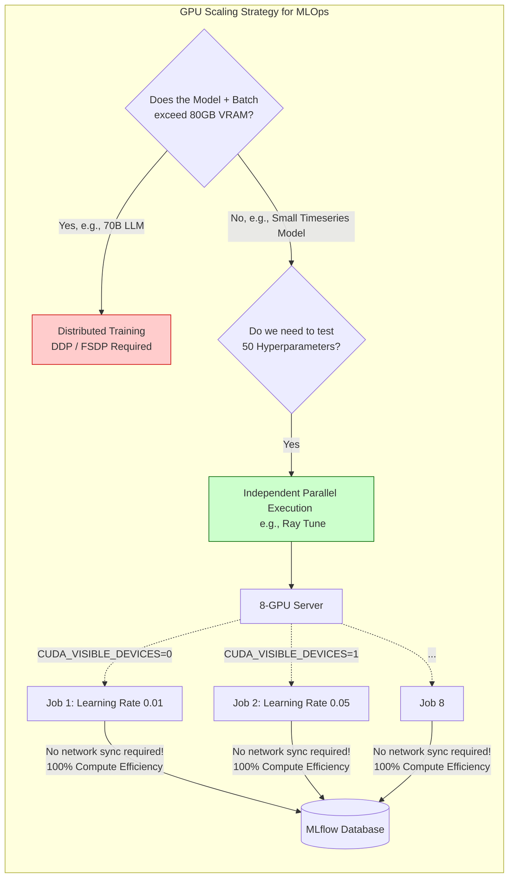

# Chapter 08: Scaling to Multi-Node Distributed Training

| Chapter metadata | Value |
|---|---|
| Volume | 25 — MLOps Engineering |
| Difficulty | Advanced |
| Estimated reading time | 40 minutes |
| Primary audience | ML Infrastructure Engineers deciding whether (and how) to scale a working single-GPU pipeline |
| Core question | When does a training pipeline actually need multiple GPUs or nodes, and what specifically has to change in the code to get there? |

## WHY

This project's entire model sweep — three single-timeframe architectures, a multi-timeframe fusion model, all 7 walk-forward folds, real training runs — ran on **one L40S GPU**, and every individual fold trained in well under two minutes. It is tempting, when a bootcamp volume mentions "GPU training," to assume distributed multi-node training is always the destination. It usually isn't. This chapter's job is to be honest about that, and to be precise about the two genuinely different reasons a project *does* eventually need it.

## Beginner's Primer: Do you actually need DDP?

In Volume 13, we learned the deep math behind Distributed Data Parallelism (DDP) and FSDP. We learned how to tie 1,000 GPUs together into a massive supercomputer to train ChatGPT.

But you are an MLOps engineer at a bank, predicting stock prices. Your dataset is 5 Gigabytes. Your model has 10 Million parameters. 
Your manager buys an 8-GPU server and tells you: *"Configure DDP so we can use all 8 GPUs to train our model!"*

**You must push back.**
If your model fits easily into a single GPU, turning on DDP is actually a terrible idea. 
Why? Because DDP adds a massive "Communication Tax" (Volume 13). If you split a tiny model across 8 GPUs, the GPUs will spend 90% of their time talking to each other over the network, and only 10% of their time doing math. The training job will actually run *slower* than if you just used 1 GPU.

So, what do you do with the other 7 GPUs?
You run **Independent Experiments**. 
Instead of forcing 8 GPUs to work on 1 model, you run 8 *different* models (with different hyperparameters) at the exact same time, each using exactly 1 GPU. This requires zero network communication, gets 100% compute efficiency, and speeds up your research by 8x. 

This chapter teaches you when to use DDP, and when to use independent scaling.

## WHAT

"Scaling" a training pipeline actually means one of two different things, and confusing them leads to the wrong infrastructure investment:

1. **Scaling one training run** across multiple GPUs/nodes, because a single GPU can't hold the model (memory) or can't finish it in acceptable time (compute) — this is what Volume 13 (Distributed Training Foundations) covers in depth: DDP, FSDP, tensor/pipeline parallelism, NCCL collectives.
2. **Scaling the *number* of independent training runs** happening at once — running many different hyperparameter configurations or walk-forward folds in parallel across multiple GPUs, where each individual run is still small enough to fit comfortably on one GPU.

**This project needed, and used, the second kind — not the first.** The TCN, LSTM, and Transformer models here have on the order of tens of thousands of parameters, not billions; the entire training dataset for the biggest fold is under 2GB in memory. None of that comes close to needing a single GPU's memory or compute to be split across multiple devices.

## HOW

### What actually would have to change for kind #1 (splitting one run across GPUs)

If a future version of this project used, say, a much larger Transformer over a much richer multi-asset, multi-timeframe feature set, and a single fold's training no longer fit comfortably on one L40S, the concrete changes would be:

1. **Launch with `torchrun` instead of a plain `python3` invocation:**
```bash
torchrun --nproc_per_node=2 run_experiment.py --model transformer --epochs 15
```
2. **Wrap the model in `DistributedDataParallel`**, so gradients computed independently on each GPU are averaged via NCCL All-Reduce before the optimizer step (this is Volume 13 Chapter 3's exact mechanism — this chapter doesn't re-derive it):
```python
model = DDP(model, device_ids=[local_rank])
```
3. **Replace this project's manual `torch.randperm` batching with a `DistributedSampler`**, so each GPU trains on a different shard of the fold's training data rather than redundantly processing the same rows:
```python
sampler = DistributedSampler(train_dataset, num_replicas=world_size, rank=rank)
```
4. **Critically: the walk-forward fold boundaries (Chapter 6) don't change at all.** Distributing *within* one fold's training is a completely orthogonal concern to how folds are chronologically split — this is the kind of "which layer does this belong to" question worth being explicit about: fold definition is a data-governance concern (Chapter 6); how one fold's training is executed on hardware is an infrastructure concern (this chapter).

### What actually would help kind #2 (this project's real situation)

Given this project's actual constraint — many small, independent training runs (architectures × timeframes × seeds × folds) rather than one big run — the useful scaling lever is running **more of them concurrently**, not splitting any single one:

```bash
# Sequential (what this project's sweep script actually did):
python3 run_experiment.py --model tcn ...
python3 run_experiment.py --model lstm ...
python3 run_experiment.py --model transformer ...

# vs. concurrent, if multiple GPUs were available:
CUDA_VISIBLE_DEVICES=0 python3 run_experiment.py --model tcn ... &
CUDA_VISIBLE_DEVICES=1 python3 run_experiment.py --model lstm ... &
wait
```

Each process gets its own GPU via `CUDA_VISIBLE_DEVICES`, entirely independent of the others — no NCCL, no gradient synchronization, no `DistributedSampler`, because these aren't pieces of one logical training run, they're genuinely separate ones that happen to run at the same time. This is dramatically simpler to implement correctly than kind #1, and for a hyperparameter/architecture sweep, it's almost always the higher-leverage investment: more GPUs means more configurations validated per hour, which directly serves this volume's "never trust one run" governance principle from Chapter 1 and Chapter 9.

## WHEN

Reach for kind #1 (DDP/FSDP, Volume 13) only when a single GPU genuinely cannot hold the model or cannot finish one run in acceptable time — verify this with real numbers (model parameter count, VRAM usage, wall-clock per epoch) before investing in the added complexity, rather than assuming a bigger model automatically needs it. Reach for kind #2 (parallel independent runs) whenever the actual bottleneck is "we need to validate more configurations/folds/seeds faster," which — per this volume's philosophy — should be a very common need, since the whole promotion-gate discipline (Chapter 9) depends on running many folds and seeds rather than trusting one.

## TRADEOFFS

| Scaling approach | Solves | Adds |
|---|---|---|
| Nothing (single GPU, sequential runs) — this project | Fine for small models/datasets | Slower wall-clock for a full sweep |
| Kind #2: parallel independent runs across GPUs | Faster sweeps, zero new distributed-systems complexity | Needs multiple GPUs available; no benefit to any single run's speed |
| Kind #1: DDP/FSDP across GPUs for one run | Lets a single run exceed one GPU's memory/compute limits | Real complexity — gradient sync correctness, stragglers, NCCL debugging (Volume 13's entire subject matter) |

## PRODUCTION

In a production MLOps platform running many teams' training jobs, both kinds of scaling typically coexist, managed by a scheduler (Kubernetes with `PyTorchJob`, or Slurm — Volume 10 and Volume 13) that can place several independent single-GPU jobs (kind #2) alongside a distributed multi-GPU job (kind #1) on the same cluster, each requesting exactly the resources its actual workload needs. The mistake this chapter is written to prevent is defaulting to kind #1's complexity for a workload that only ever needed kind #2 — or, just as commonly, never needed multiple GPUs of any kind at all.

## TROUBLESHOOTING

### Scenario 1: "We should add DDP to speed up training" for a model that already trains in under 2 minutes per fold

**Symptom:** A proposal to add distributed training complexity to a pipeline whose actual per-fold training time (this project: ~70-190 seconds depending on fold size) is already a small fraction of total sweep time.

**Diagnosis:** The actual bottleneck for a sweep across many configs/folds/seeds is almost always the *number* of sequential runs, not any single run's speed — check wall-clock time spent per individual run vs. total sweep time before assuming DDP is the fix.

**Evidence vs. Proof:** "Training feels slow" is evidence something should be faster. It's not proof that per-run speed (kind #1's target) rather than run *count* (kind #2's target) is the actual lever — that requires timing a single run in isolation and comparing it against total sweep wall-clock.

**Resolution:** If per-run time is already small and the sweep is slow because there are many sequential runs, invest in running more configs concurrently across available GPUs (kind #2), not in distributing any individual run.

### Scenario 2: Multi-GPU parallel independent runs (kind #2) silently contend for the same GPU

**Symptom:** Two processes both launched with the intent of using separate GPUs both show activity on GPU 0 in `nvidia-smi`, and both run slower than expected.

**Diagnosis:** `CUDA_VISIBLE_DEVICES` wasn't actually set differently for each process — a very easy copy-paste mistake when launching several background jobs from the same script.

**Resolution:**
```bash
# Verify BEFORE launching a sweep that each process's device assignment is genuinely distinct:
CUDA_VISIBLE_DEVICES=0 python3 -c "import torch; print(torch.cuda.get_device_name(0))" &
CUDA_VISIBLE_DEVICES=1 python3 -c "import torch; print(torch.cuda.get_device_name(0))" &
wait
# Should print the SAME GPU model but be genuinely running on two DIFFERENT physical devices —
# confirm via `nvidia-smi` showing both indices active simultaneously.
```

## Interview Preparation

**Conceptual:** "A colleague says 'we have a multi-GPU box, so we should use DistributedDataParallel for our training.' What question would you ask before agreeing?"

**Model Answer:** "I'd ask whether the goal is making one training run faster/bigger, or running more independent experiments concurrently — those are different problems with different solutions, and conflating them is a common way teams add real distributed-systems complexity (gradient synchronization, NCCL debugging, straggler handling) for a problem that a much simpler solution — just launching separate single-GPU processes with different `CUDA_VISIBLE_DEVICES` values — would have solved with none of that complexity. DDP is the right answer only when a single run genuinely needs more than one GPU's memory or compute; if the real need is 'validate more hyperparameter configs per hour,' running independent single-GPU jobs in parallel is both simpler and, for most sweep-style workloads, exactly as fast."

**Architecture:** "You have a fixed budget of 4 GPUs and need to run a 20-configuration hyperparameter sweep, where each configuration comfortably fits and trains quickly on one GPU. How would you use the 4 GPUs?"

**Model Answer:** "I'd run 4 configurations concurrently at any given time, one per GPU via distinct `CUDA_VISIBLE_DEVICES` assignments, cycling through the remaining 16 as each of the first 4 finishes — this maximizes GPU utilization without any distributed-training machinery, since each configuration's training is fully independent of the others. I would specifically avoid wrapping any single configuration's training in DDP across multiple GPUs here, since that would only make one run faster while leaving 3 GPUs idle for that duration — worse total sweep throughput than running 4 independent configs at once."

**Troubleshooting:** "A DDP-enabled training job hangs indefinitely at startup on a fresh multi-node allocation. Given this chapter's framing, what's the first thing you'd check — and where would you look for the deep mechanics?"

**Model Answer:** "First, I'd confirm whether this workload genuinely needed DDP in the first place, per this chapter's kind #1 vs. kind #2 distinction — if it's actually many independent small runs mistakenly wrapped in DDP, the fix might be to remove DDP entirely rather than debug it. If DDP is genuinely necessary (the model/data really doesn't fit on one GPU), the hang is almost always a process-group formation issue — mismatched `MASTER_ADDR`/`MASTER_PORT` across nodes, or a firewall blocking the rendezvous port between nodes — and Volume 13's Chapter 8 (NCCL Collectives) and its Lab 1 troubleshooting guide are the right place for the actual diagnostic sequence, since that's this bootcamp's dedicated deep-dive into that exact failure mode."

## Architecture Summary

MLOps Engineers must protect data scientists from unnecessary distributed systems complexity. If a model fits into a single GPU's VRAM, wrapping it in PyTorch DDP will only add NCCL network overhead and increase failure rates. Instead of scaling *up* (using DDP), MLOps pipelines for small-to-medium models should scale *out* (running dozens of independent Hyperparameter tuning jobs simultaneously across the cluster), maximizing hardware utilization without any network synchronization penalties.



## Related Chapters

- **Previous:** [Chapter 7 — Model Architecture and Training Pipeline Design](./chapter-07-model-architecture-and-training-pipeline-design.md)
- **Next:** [Chapter 9 — The Model Promotion Gate](./chapter-09-the-model-promotion-gate-governance-before-the-registry.md)
- **Deep dive:** [Volume 13 — Distributed Training Foundations](../volume-13/index.md) — the full mechanics of DDP, FSDP, and NCCL this chapter deliberately doesn't re-derive
