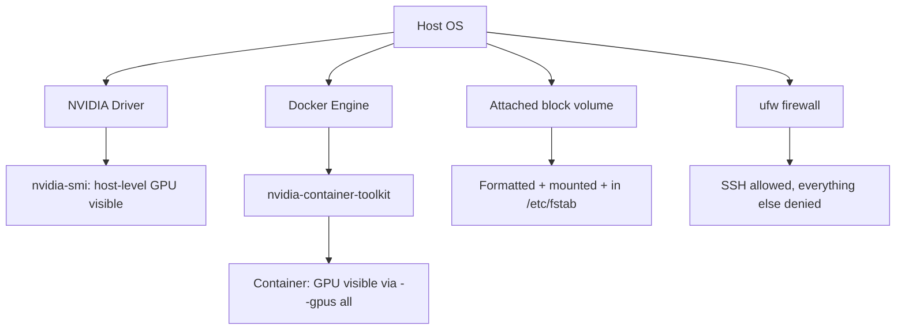

# Lab 01 — Provision a GPU Node and Verify the Stack

## 1. Objective
Take a freshly created GPU cloud VM and prove — not assume — that all four layers a training pipeline depends on actually work: driver, container GPU passthrough, persistent storage, and a locked-down firewall.

## 2. Target Audience
MLOps Engineers and Platform Engineers provisioning GPU infrastructure for the first time, or auditing an existing node they didn't set up themselves.

## 3. Prerequisites
- Access to any single GPU cloud instance (this lab was written against a Nebius L40S; any NVIDIA GPU cloud VM works identically).
- SSH access with sudo.
- An unformatted, attached block volume separate from the OS disk (most cloud providers let you attach one at VM creation).

## 4. Architecture Diagram


## 5. Environment Setup
```bash
ssh -i ~/.ssh/<your-key> <user>@<vm-ip> "echo connected; hostname; uname -a"
```

## 6. Execution Specifications

**Purpose:** Verify the driver layer.
**Command:**
```bash
nvidia-smi
```
**Expected Evidence:** A table showing the GPU model, driver version, and CUDA version — not an error.
**Explanation:** This proves the kernel module is loaded and can enumerate the physical device. It says nothing yet about container access.
**Common Failure:** `NVIDIA-SMI has failed because it couldn't communicate with the NVIDIA driver` — the driver isn't loaded (see Troubleshooting).

**Purpose:** Verify container GPU passthrough.
**Command:**
```bash
sudo docker run --rm --gpus all nvidia/cuda:12.4.1-base-ubuntu22.04 nvidia-smi
```
**Expected Evidence:** The identical GPU table, now printed from *inside* a container.
**Explanation:** This is a fundamentally different check from Step 1 — it proves `nvidia-container-toolkit` is correctly wired into the Docker daemon, which the host-level check alone cannot show.
**Common Failure:** `could not select device driver "" with capabilities: [[gpu]]` — the toolkit is installed but the Docker daemon hasn't been configured to use it.

**Purpose:** Provision persistent storage.
**Command:**
```bash
lsblk -d -o NAME,SIZE,TYPE
sudo blkid /dev/vdX   # replace vdX with your attached (unformatted) volume — confirm no output first
sudo mkfs.ext4 -F /dev/vdX
sudo mkdir -p /data/mlops
sudo mount /dev/vdX /data/mlops
UUID=$(sudo blkid -s UUID -o value /dev/vdX)
echo "UUID=$UUID /data/mlops ext4 defaults 0 2" | sudo tee -a /etc/fstab
```
**Expected Evidence:** `df -h /data/mlops` shows the new volume mounted with its full capacity available.
**Explanation:** Registering via UUID in `/etc/fstab` (not the raw device path) ensures the mount survives a reboot even if the device enumeration order changes.
**Common Failure:** Running `mkfs` on a volume that already has data — always check `blkid` returns *nothing* first.

**Purpose:** Lock down the firewall without losing access.
**Command:**
```bash
sudo ufw allow OpenSSH
sudo ufw --force enable
sudo ufw status verbose
```
**Expected Evidence:** `Status: active`, with only the SSH rule listed as `ALLOW IN`.
**Explanation:** `ufw enable` doesn't retroactively kill your current session, which is exactly why you must test with a *new* connection, not the one that ran the command.
**Common Failure:** Forgetting to allow SSH before enabling — always run the `allow` command first, in that order, every time.

## 7. Expected Evidence
All four commands above complete with the specific evidence described, and critically: a brand-new SSH connection (not your existing session) still succeeds after the firewall step.

## 8. Explanation of Behavior
Each of these four checks is independent and layered — a passing driver check tells you nothing about container passthrough, and a passing container check tells you nothing about storage or network configuration. Provisioning is "done" only when all four are independently verified, not when the VM boots successfully.

## 9. Performance Benchmarking
Not applicable to this lab — no training workload runs yet. (Lab 02 measures MLflow server responsiveness; training throughput benchmarking is covered in later volumes.)

## 10. Common Failures
- Driver present on host but toolkit not configured for Docker (Step 2's failure).
- Attempting `mkfs` on a volume that isn't actually empty — always verify with `blkid` first.
- Enabling the firewall from your only session with no fallback access path.

## 11. Safe Failure Injection
**Action:** Temporarily `sudo systemctl stop docker`, then retry the Step 2 GPU-in-container command.
**Expected Result:** A connection-refused error, clearly different from the toolkit-misconfiguration error — this helps you learn to distinguish "Docker itself is down" from "Docker is up but GPU passthrough is misconfigured."

## 12. Recovery Steps
```bash
sudo systemctl start docker
sudo docker run --rm --gpus all nvidia/cuda:12.4.1-base-ubuntu22.04 nvidia-smi
```

## 13. Troubleshooting Guide
- If `nvidia-container-toolkit` is installed but the container test still fails: `sudo nvidia-ctk runtime configure --runtime=docker && sudo systemctl restart docker`.
- If the firewall step seems to hang or a new session refuses: use your cloud provider's serial/console access (independent of SSH/network) to fix the `ufw` rules — never assume a locked-out SSH session will recover on its own.
- If the mount doesn't survive a reboot: confirm you used `UUID=` syntax in `/etc/fstab`, not a raw `/dev/vdX` path.

## 14. Validation
Reboot the VM (`sudo reboot`), reconnect after it comes back, and re-run all four verification commands from Step 6 — every one should still pass without re-running any setup steps, proving the configuration (not just the current session's state) is correct.

## 15. Real-World Pitfalls
- Some cloud GPU images ship with the driver and toolkit *already installed* — always check current state before running install steps that assume a blank slate (this project's own VM was exactly this case).
- A firewall rule for `OpenSSH` by name relies on `/etc/services`/`ufw` app profiles mapping correctly to port 22 — if SSH runs on a non-default port, use the explicit port number instead (`ufw allow 2222/tcp`).

## 16. Cleanup Procedures
```bash
# If tearing down this lab's test volume:
sudo umount /data/mlops
# Remove the fstab line you added before destroying the VM/volume
sudo sed -i '/\/data\/mlops/d' /etc/fstab
```

## 17. Knowledge Check
- Why does a passing `nvidia-smi` on the host not guarantee a training container will see the GPU?
- Why should storage be referenced by UUID rather than device path in `/etc/fstab`?
- Why must a firewall change always be verified from a *new* connection, not the session that made the change?

## 18. Additional References
- [NVIDIA Container Toolkit Installation Guide](https://docs.nvidia.com/datacenter/cloud-native/container-toolkit/latest/install-guide.html)
- Chapter 02 — GPU Cloud Provisioning for Training Workloads
