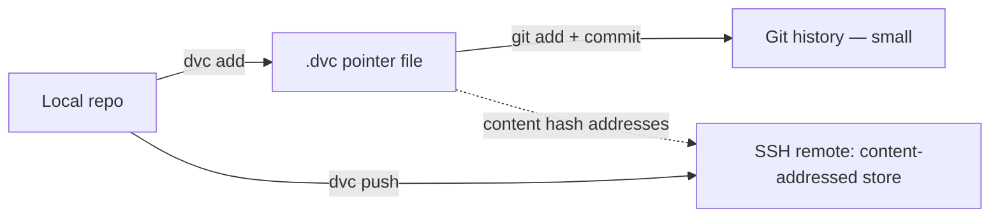

# Lab 03 — Wire a DVC Remote Over SSH and Version a Dataset

## 1. Objective
Version a real dataset file with DVC, push it to a remote reachable over SSH, and prove the push actually worked by inspecting the remote's storage directly — not just trusting the CLI's success message.

## 2. Target Audience
MLOps Engineers and Data Engineers who need dataset versions tied to specific Git commits without bloating the Git repository itself.

## 3. Prerequisites
- A Git repository (or a subdirectory of one) to initialize DVC into.
- SSH access to a remote host with a directory you can write to (this can be the same GPU box from Lab 01, or any reachable machine).
- `dvc` installed (`pip install "dvc[ssh]"` — the `[ssh]` extra is required for an SSH-type remote).

## 4. Architecture Diagram


## 5. Environment Setup
```bash
pip install "dvc[ssh]"
dvc --version
ssh <user>@<remote-host> 'mkdir -p /data/mlops/dvc-store'
```

## 6. Execution Specifications

**Purpose:** Initialize DVC.
**Command:**
```bash
cd your-project
dvc init --subdir   # omit --subdir if this IS the repo root
```
**Expected Evidence:** A new `.dvc/` directory; `git status` shows it as new, trackable files.

**Purpose:** Configure the remote.
**Command:**
```bash
dvc remote add -d myremote "ssh://<user>@<remote-host>/data/mlops/dvc-store"
dvc remote modify myremote keyfile ~/.ssh/<your-key>
```
**Expected Evidence:** `.dvc/config` shows the remote URL and keyfile path.
**Explanation:** `-d` sets this as the default remote, so plain `dvc push`/`dvc pull` (no `-r` flag needed) use it.

**Purpose:** Track and push a real file.
**Command:**
```bash
dvc add data/your_dataset.parquet
git add data/your_dataset.parquet.dvc
dvc push
```
**Expected Evidence:** `dvc push` reports `1 file pushed`.
**Common Failure:** `.dvc` file reported as ignored by Git — see Troubleshooting (this is a real bug this project hit).

**Purpose:** Independently verify the push — don't just trust the CLI message.
**Command:**
```bash
ssh <user>@<remote-host> 'find /data/mlops/dvc-store -type f | head -5; du -sh /data/mlops/dvc-store'
```
**Expected Evidence:** A file under `files/md5/<first-2-hex-chars>/<rest-of-hash>`, with a total size matching your dataset.
**Explanation:** This is the actual proof the bytes landed on the remote — the CLI's "1 file pushed" message is evidence, this direct inspection is proof.

## 7. Expected Evidence
A `.dvc` pointer file committed to Git (small, a few lines of YAML), and the real dataset content independently confirmed present on the remote via direct inspection.

## 8. Explanation of Behavior
DVC never puts the actual data in Git — the `.dvc` file is a content hash + size + path, small enough that Git handles it exactly like any other text file. The real bytes live in the remote's content-addressed store, addressed by hash, so identical file content is only ever stored once even if referenced by multiple `.dvc` files across the project's history.

## 9. Performance Benchmarking
Time a push and pull of a realistically-sized dataset for your project:
```bash
time dvc push
rm -rf .dvc/cache   # simulate a fresh clone with no local cache
time dvc pull
```
Compare against a plain `scp` of the same file to sanity-check DVC isn't adding meaningful overhead beyond the network transfer itself.

## 10. Common Failures
- `.dvc` pointer file silently git-ignored by an overly broad existing `.gitignore` rule (e.g., a blanket `data/` pattern) — this project hit exactly this.
- Using a laptop-local absolute path in `keyfile` that won't resolve on a teammate's machine or CI runner.
- Forgetting to `dvc push` after `dvc add` — the pointer file being committed doesn't mean the data was actually transferred.

## 11. Safe Failure Injection
**Action:** Delete your local DVC cache (`rm -rf .dvc/cache`) and the working copy of the dataset file, then run `dvc pull`.
**Expected Result:** The file is fully restored from the remote — this proves the remote, not your local cache, is the actual source of truth.

## 12. Recovery Steps
```bash
dvc pull   # restores any file whose .dvc pointer exists in your checked-out Git commit
```

## 13. Troubleshooting Guide
- **`.dvc` file reported as git-ignored:** run `git check-ignore -v <path>` to find the exact rule responsible. If a blanket directory-level rule (like `data/`) is the cause, add a targeted negation for the directory itself (`!path/to/data/` and `!path/to/data/**/`) rather than removing the broader rule, since other files in that directory may correctly still need to stay ignored.
- **`dvc push` reports success but the remote directory looks empty:** confirm the remote URL's path is correct and that the SSH user actually has write permission to it — a permission failure on the remote side doesn't always surface clearly through the SSH remote's error reporting.

## 14. Validation
```bash
# From a completely separate clone/checkout of the same repo:
git clone <repo>
cd <repo>
dvc pull
# The dataset file should now exist locally, having never been in Git itself
ls -la data/your_dataset.parquet
```

## 15. Real-World Pitfalls
- DVC's SSH remote is a fine choice for a single-node or small-team setup (as in this project), but doesn't scale to many concurrent users the way a real object store (S3, GCS) does — know when to graduate.
- A remote's storage isn't automatically backed up just because DVC manages it — back up the remote's underlying storage the same way you would any other durable data store.

## 16. Cleanup Procedures
```bash
# Remove a specific tracked file's pointer (does not delete the remote's stored content):
git rm data/your_dataset.parquet.dvc
```

## 17. Knowledge Check
- Why can't a `.dvc` pointer file alone reconstruct the data without also having remote access configured?
- What's the difference between `dvc push`/`dvc pull` failing due to network/auth issues versus a stale local cache?
- Why is content-addressed storage (hash-based paths) used instead of storing files by their original filename?

## 18. Additional References
- [DVC Data Management documentation](https://dvc.org/doc/user-guide/data-management)
- [Chapter 03 — Data Versioning with DVC](../chapter-03-data-versioning-with-dvc.md)
