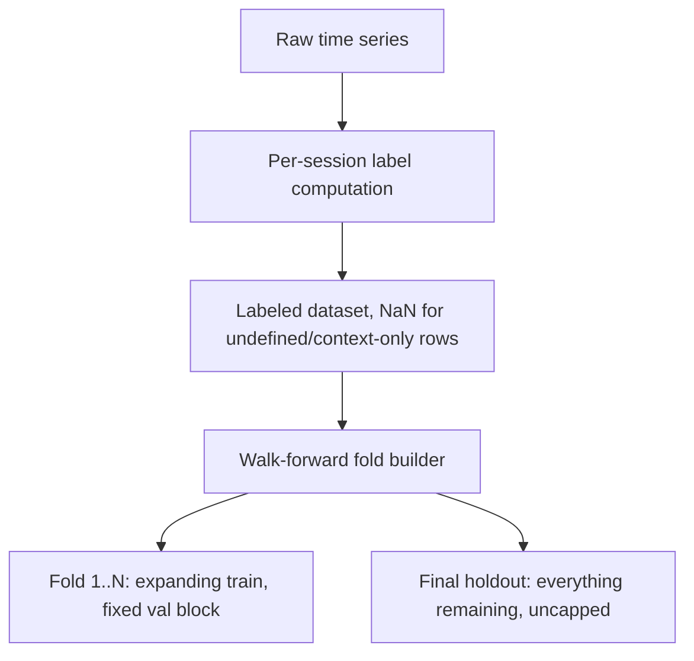

# Lab 04 — Build a Leakage-Safe Label and Walk-Forward Split Pipeline

## 1. Objective
Implement a forward-only, session-aware label computation and a chronological, expanding-window walk-forward split scheme for time-series data — and write tests that catch the exact class of off-by-one and boundary bugs this project actually hit in production.

## 2. Target Audience
ML Engineers building any training pipeline over temporally-ordered data — this project's domain is financial time series, but the same principles apply to sensor streams, user event logs, or any other sequential data.

## 3. Prerequisites
- Python with `numpy` and `pandas`.
- A time-ordered dataset with a `datetime` column and some numeric series you want to label (any OHLC-like or single-value series works for this lab).

## 4. Architecture Diagram


## 5. Environment Setup
```bash
pip install numpy pandas pytest
```

## 6. Execution Specifications

**Purpose:** Implement a forward-only label with a horizon and threshold.
**Command:** Write `label_logic.py`:
```python
import numpy as np
from numpy.lib.stride_tricks import sliding_window_view

def label_session(high, low, close, horizon, pct):
    n = len(close)
    label = np.full(n, np.nan)
    if n <= horizon:
        return label
    fwd_max = sliding_window_view(high, horizon).max(axis=1)
    fwd_min = sliding_window_view(low, horizon).min(axis=1)
    valid_n = n - horizon
    upper = close[:valid_n] * (1 + pct)
    lower = close[:valid_n] * (1 - pct)
    window_max = fwd_max[1:valid_n + 1]   # NOTE: starts at index 1, excluding the CURRENT candle's own window position
    window_min = fwd_min[1:valid_n + 1]
    label[:valid_n] = np.where((window_max >= upper) | (window_min <= lower), 1.0, 0.0)
    return label
```
**Expected Evidence:** Calling this on a synthetic array where you manually place a known spike produces a label of exactly `1.0` for every row whose forward window includes that spike, and `0.0` or `NaN` everywhere else.

**Purpose:** Write the boundary-condition test BEFORE trusting the function on real data.
**Command:** Write `test_label_logic.py`:
```python
def test_upward_touch_flags_one():
    n = 100
    close = np.full(n, 100.0); high = np.full(n, 100.05); low = np.full(n, 99.95)
    high[10] = 100.0 * 1.003          # a known spike at index 10
    label = label_session(high, low, close, horizon=45, pct=0.003)
    assert label[9] == 1.0            # window [10..54] includes index 10
    assert label[10] == 0.0           # window [11..55] EXCLUDES index 10 itself — this is the leakage check
```
**Explanation:** This single assertion (`label[10] == 0.0`) is the entire leakage guard for the off-by-one class of bug — if the window accidentally included the candle itself, this test fails immediately.

**Purpose:** Implement expanding-window walk-forward splits.
**Command:** Write `splits.py`:
```python
def build_walk_forward_folds(trading_days, initial_train_days, val_block_days):
    days = sorted(trading_days)
    n = len(days)
    folds = []
    train_end_idx = initial_train_days
    while train_end_idx + val_block_days <= n:
        val_start_idx = train_end_idx
        val_end_idx = train_end_idx + val_block_days
        if val_end_idx + val_block_days > n:
            break   # reserve this final block as the holdout instead of another fold
        folds.append((days[0], days[val_start_idx - 1], days[val_start_idx], days[val_end_idx - 1]))
        train_end_idx = val_end_idx
    holdout_start_idx = train_end_idx
    holdout_end_idx = n - 1   # <- the exact line this project's real bug got wrong (see Step 6)
    return folds, (days[holdout_start_idx], days[holdout_end_idx])
```

**Purpose:** Write the regression test for the real bug this project hit.
**Command:**
```python
def test_holdout_absorbs_full_remainder_not_capped_at_one_block():
    days = list(range(1242))   # simulate 1242 trading days
    folds, (holdout_start, holdout_end) = build_walk_forward_folds(days, initial_train_days=400, val_block_days=100)
    assert holdout_end == days[-1]   # every trailing day covered — this FAILS if holdout is capped at one block
```
**Expected Evidence:** This test passes with `holdout_end_idx = n - 1`, and would have failed immediately against the buggy version (`min(train_end_idx + val_block_days, n) - 1`) — run it against both to see the difference yourself.

## 7. Expected Evidence
All tests pass, and manually printing the fold plan against a real dataset's actual date range confirms the holdout's end date matches the dataset's true last date — not an artifact of the block size.

## 8. Explanation of Behavior
The label function's leakage safety comes from a single index offset (`window[1:]` not `window[0:]`) applied consistently. The split function's correctness comes from never capping the final holdout at a fixed size — it absorbs whatever remains, however much or little that is.

## 9. Performance Benchmarking
Time the vectorized `sliding_window_view` approach against a naive per-row Python loop computing the same forward-window max/min, on a dataset of ~400,000 rows:
```python
import time
t0 = time.time(); label_session(high, low, close, 45, 0.003); print(time.time() - t0)
```
Expect the vectorized version to be at least one to two orders of magnitude faster — this matters because label computation runs every time the pipeline is re-triggered by new incoming data.

## 10. Common Failures
- Off-by-one on the forward window boundary (Step 6's core assertion).
- Computing labels across the whole continuous series instead of per session/day, silently letting a label reach across a discontinuity (e.g., overnight gap) it shouldn't.
- Capping the holdout block size instead of letting it absorb the remainder (this project's real bug).

## 11. Safe Failure Injection
**Action:** Intentionally change `window_max = fwd_max[1:valid_n + 1]` to `window_max = fwd_max[0:valid_n]` (removing the offset) and re-run the boundary test.
**Expected Result:** `test_upward_touch_flags_one`'s `label[10] == 0.0` assertion fails, because the window now includes the candle's own spike — this is exactly what a real leakage bug looks like when caught by a test instead of live in production.

## 12. Recovery Steps
Revert the intentional break from Step 11 and re-run the full test suite to confirm it's back to green.

## 13. Troubleshooting Guide
- If real-data label positive rates look implausible (near 0% or near 100%), suspect the threshold/horizon combination before suspecting the code — verify against the boundary tests first, then sanity-check the domain parameters.
- If fold counts look wrong for a real dataset, print the actual fold plan (train/val date ranges) and manually eyeball it against the known date range, exactly as this project's real bug was caught.

## 14. Validation
Run the complete test suite and additionally spot-check ~20 real rows by hand against the raw source data, comparing the computed label to what you'd get by manually checking whether the price touched the threshold in the actual subsequent candles.

## 15. Real-World Pitfalls
- A dataset that keeps growing (new days added regularly) means fold boundaries computed today may differ from fold boundaries computed next week — always log the actual date ranges used for a given training run (Chapter 4), don't assume "the same split logic" means "the same split."
- Session/day boundaries aren't always obvious from a raw timestamp column alone — verify your specific domain's discontinuities (trading sessions, business days, sensor batch boundaries) are handled explicitly, not accidentally by the data happening to be already clean.

## 16. Cleanup Procedures
No persistent state created by this lab beyond local test files — no cleanup required.

## 17. Knowledge Check
- Why does `label[10] == 0.0` (not `1.0`) in the test prove the window excludes the current candle?
- Why is capping the holdout at exactly one block size a data-loss bug rather than a leakage bug, and why is that distinction useful?
- Why must label computation happen per session/day rather than over the whole continuous series?

## 18. Additional References
- Chapter 06 — Building Leakage-Safe Training Datasets for Time-Series ML
