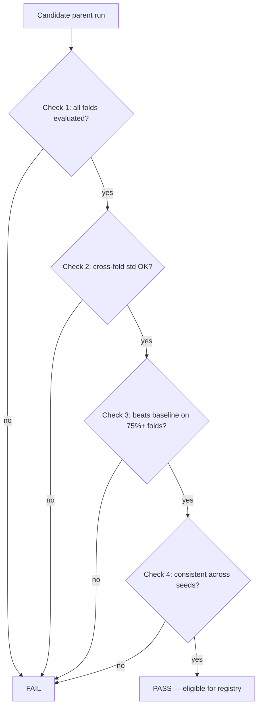

# Lab 05 — Implement a Promotion Gate and Watch It Correctly Block a Model

## 1. Objective
Implement the promotion gate's four checks against a real MLflow tracking server, then deliberately run it against an incomplete result and confirm it fails — for the correct, specific reasons — rather than being fooled by a good-looking partial result.

## 2. Target Audience
MLOps Engineers and ML Leads responsible for deciding when a model is actually validated, not just "looks good."

## 3. Prerequisites
- Completed Lab 02 (a working MLflow tracking server).
- A trained model logged with nested runs (parent = config, child = fold) — Lab 04's split logic feeding a simple training loop is enough; the model itself doesn't need to be sophisticated for this lab.
- A logged baseline run (even a trivial constant-prediction baseline) using the same fold structure.

## 4. Architecture Diagram


## 5. Environment Setup
```bash
export MLFLOW_TRACKING_URI=http://localhost:5000   # or via SSH tunnel if the server is remote
python3 -c "import mlflow; print(mlflow.get_tracking_uri())"
```

## 6. Execution Specifications

**Purpose:** Implement Check 1 — all folds evaluated.
**Command:**
```python
def check_all_folds_evaluated(parent_run, fold_metrics):
    n_total = int(parent_run.data.params.get("n_folds_total", -1))
    n_run = len(fold_metrics)
    return (n_run == n_total) and n_total > 0, f"{n_run}/{n_total} folds evaluated"
```
**Expected Evidence:** Passing a parent run with `n_folds_total=7` logged but only 3 actual child runs returns `False` with a message showing `3/7`.

**Purpose:** Implement Check 2 — cross-fold variance.
**Command:**
```python
def check_cross_fold_std(candidate_folds, max_std):
    values = [m.get("pr_auc") for m in candidate_folds.values() if m.get("pr_auc") is not None]
    std = float(np.std(values))
    return std <= max_std, f"cross-fold pr_auc std={std:.4f} (max allowed {max_std})"
```

**Purpose:** Implement Check 3 — fold-by-fold baseline comparison (not aggregate-to-aggregate).
**Command:**
```python
def check_beats_baseline(candidate_folds, baseline_folds, min_win_ratio):
    shared = sorted(set(candidate_folds) & set(baseline_folds))
    wins = sum(1 for f in shared if candidate_folds[f]["pr_auc"] > baseline_folds[f]["pr_auc"])
    ratio = wins / len(shared)
    return ratio >= min_win_ratio, f"beat baseline on {wins}/{len(shared)} folds ({ratio:.0%})"
```

**Purpose:** Implement Check 4 — seed consistency, failing closed when no seed runs are provided.
**Command:**
```python
def check_seed_consistency(client, run_ids, max_spread):
    means = [client.get_run(r).data.metrics.get("pr_auc_mean") for r in run_ids]
    means = [m for m in means if m is not None]
    if len(means) < 2:
        return False, f"need >=2 seed runs, got {len(means)}"
    spread = max(means) - min(means)
    return spread <= max_spread, f"seed spread={spread:.4f}"
```

**Purpose:** Run the gate against a deliberately incomplete candidate — a single-fold smoke-test run, not a full validation.
**Command:**
```bash
python3 promotion_gate.py --candidate-run-id <your-1-fold-run-id> --baseline-run-id <your-baseline-run-id>
```
**Expected Evidence:**
```text
=== Promotion gate ===
  FAIL: 1/7 folds evaluated
  PASS: cross-fold pr_auc std=0.0000 (max allowed 0.15)
  PASS: beat baseline on 1/1 folds (100%, need >=75%)
  FAIL: no --seed-run-ids given — cannot verify the result reproduces across seeds

Overall: FAIL — not promoted
```
**Explanation:** This is the single most important result in this lab — the model genuinely beat the baseline on the one fold it saw, and the gate *still correctly refused to promote it*, because "beat the baseline once" is not the same claim as "validated." If your gate instead reports PASS here, your implementation has a bug — go back and check Check 1 and Check 4's failure-closed behavior specifically.

## 7. Expected Evidence
The gate blocks the incomplete run, with a printed reason for each specific failing check — not a generic "no."

## 8. Explanation of Behavior
Each check is independent and mechanical. None of them can be satisfied by a human's judgment call — they either compute a hard pass/fail from actual logged data, or they don't. This is the entire point: a promotion decision that depends on a person's impression of a table is exactly the failure mode this lab's gate exists to prevent.

## 9. Performance Benchmarking
Not applicable — the gate's cost is in requiring more training runs (all folds, multiple seeds) upstream, not in the gate's own (near-instant) evaluation.

## 10. Common Failures
- Implementing Check 4 so that omitting `--seed-run-ids` is silently treated as "not applicable" rather than an automatic failure — this defeats the entire purpose of the check.
- Comparing baseline aggregate-to-aggregate instead of fold-by-fold, which can hide a candidate that only wins because of one or two outlier folds.

## 11. Safe Failure Injection
**Action:** Now run the full 7-fold version of the same model, plus 2 additional seed re-runs, and pass all of them to the gate.
**Expected Result:** If the model's result genuinely reproduces, the gate should now report PASS on all four checks — compare this output directly against Step 6's FAIL output to see the exact difference a complete validation makes.

## 12. Recovery Steps
If a run you expected to pass still fails on Check 3 (baseline), inspect the fold-by-fold breakdown directly rather than only looking at the aggregate — the specific fold(s) where the candidate lost to baseline are informative, not just noise to route around.

## 13. Troubleshooting Guide
- `check_all_folds_evaluated` always reports 0 folds found: confirm your training loop actually used `nested=True` when logging fold runs, and that the parent/child relationship is queryable (Lab 02's Step 9 validates this directly).
- Baseline comparison finds zero shared folds: confirm the baseline run used identical fold boundaries (same `initial_train_days`/`val_block_days` parameters) as the candidate — mismatched split configs between candidate and baseline produce fold IDs that don't correspond to the same date ranges.

## 14. Validation
Confirm the gate's exit code is actually checked by whatever process would call it — `sys.exit(1)` on failure only matters if something downstream (a CI step, a deployment script) actually inspects it rather than ignoring the exit code and proceeding regardless.

## 15. Real-World Pitfalls
- A gate that can be bypassed with a command-line flag ("just this once, skip the seed check") isn't a gate — the discipline only holds if there's no path around it, especially under deadline pressure.
- Don't loosen a threshold (e.g., `max_std`) just because a specific model fails it — investigate whether the failure reveals something real about the model's regime-dependence first (Chapter 9's Troubleshooting section covers this directly).

## 16. Cleanup Procedures
No persistent state beyond the MLflow runs themselves, which are worth keeping as a historical record rather than deleting.

## 17. Knowledge Check
- Why does Check 4 need to fail (not pass, not skip) when no seed runs are provided?
- Why is a fold-by-fold baseline comparison stricter than comparing two aggregate means?
- What's the practical difference between a model failing Check 2 (cross-fold std) versus failing Check 3 (baseline)?

## 18. Additional References
- [Chapter 09 — The Model Promotion Gate](../chapter-09-the-model-promotion-gate-governance-before-the-registry.md)
- [MLflow Model Registry documentation](https://mlflow.org/docs/latest/model-registry.html)
