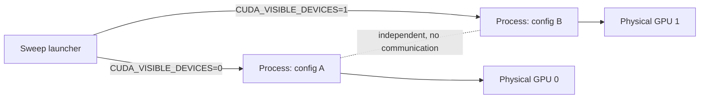

# Lab 06 — Run a Multi-Configuration Sweep in Parallel Across GPUs

## 1. Objective
Given multiple GPUs, run several independent training configurations concurrently — one per GPU — without any distributed-training machinery, and prove each process actually landed on a distinct physical device rather than silently contending for the same one.

## 2. Target Audience
MLOps/ML Infrastructure Engineers running hyperparameter or architecture sweeps who have more than one GPU available but whose individual models are small enough that no single one needs multi-GPU splitting.

## 3. Prerequisites
- Access to a machine with 2+ GPUs (or 2+ separate single-GPU instances).
- A training script that accepts a model/config argument and runs on whichever GPU CUDA reports as device 0 within its process (this is the default — no code changes needed).
- Completed Chapter 8's reading — this lab is "kind #2" scaling specifically, not DDP.

## 4. Architecture Diagram


## 5. Environment Setup
```bash
nvidia-smi -L   # confirm how many GPUs are actually visible and their indices
```

## 6. Execution Specifications

**Purpose:** Prove `CUDA_VISIBLE_DEVICES` actually isolates each process to a distinct physical GPU, before trusting a real sweep to it.
**Command:**
```bash
CUDA_VISIBLE_DEVICES=0 python3 -c "import torch; print('proc A sees:', torch.cuda.get_device_name(0), torch.cuda.current_device())" &
CUDA_VISIBLE_DEVICES=1 python3 -c "import torch; print('proc B sees:', torch.cuda.get_device_name(0), torch.cuda.current_device())" &
wait
```
**Expected Evidence:** Both processes print the same GPU *model name* (if both GPUs are identical hardware) but `nvidia-smi` run concurrently should show two DIFFERENT GPU indices actively in use, not one index handling both.
**Explanation:** Each process, inside its own `CUDA_VISIBLE_DEVICES`-scoped environment, sees whatever GPU it's been given as "device 0" — this is why both print the same relative index despite using different physical hardware.
**Common Failure:** Both processes show activity on the same physical GPU index in `nvidia-smi` — see Troubleshooting.

**Purpose:** Launch a real multi-configuration sweep, one config per GPU.
**Command:**
```bash
CUDA_VISIBLE_DEVICES=0 python3 run_experiment.py --model tcn --epochs 15 --seed 0 > tcn.log 2>&1 &
CUDA_VISIBLE_DEVICES=1 python3 run_experiment.py --model lstm --epochs 15 --seed 0 > lstm.log 2>&1 &
wait
echo "both configs finished"
```
**Expected Evidence:** Both `tcn.log` and `lstm.log` show a completed 7-fold run with a logged MLflow parent run ID, and both finished in roughly the same wall-clock time as either would have taken alone (proving they genuinely ran concurrently, not queued behind each other).

## 7. Expected Evidence
Two (or more) fully independent MLflow parent runs, produced in parallel, in roughly the wall-clock time of the *slowest single one* rather than the *sum* of all of them.

## 8. Explanation of Behavior
`CUDA_VISIBLE_DEVICES` is an environment variable read once at process start by the CUDA runtime — it filters which physical devices that process can see at all, remapping them to start at index 0 from that process's perspective. Two processes with different values are, from CUDA's point of view, running on completely separate, non-overlapping hardware, with no shared state and no need for any inter-process communication — unlike DDP, where processes explicitly coordinate via NCCL.

## 9. Performance Benchmarking
Compare total wall-clock time for N configurations run sequentially vs. run concurrently (N ≤ number of available GPUs):
```bash
time (python3 run_experiment.py --model tcn ...; python3 run_experiment.py --model lstm ...)   # sequential
time (python3 run_experiment.py --model tcn ... & python3 run_experiment.py --model lstm ... & wait)   # concurrent
```
Expect the concurrent version to take roughly as long as the *single slowest* configuration, not the sum — if it doesn't, something (shared CPU bottleneck, disk I/O contention, or an unintended GPU collision) is limiting the parallelism.

## 10. Common Failures
- Forgetting `CUDA_VISIBLE_DEVICES` entirely for one of the processes, so it defaults to GPU 0 and collides with another process also on GPU 0.
- Assuming N processes on N GPUs gives an N× speedup for the *whole sweep* when the sweep also has a CPU-bound preprocessing step (like this project's windowing) that isn't itself parallelized — profile the non-GPU portions too.

## 11. Safe Failure Injection
**Action:** Deliberately launch two processes with the SAME `CUDA_VISIBLE_DEVICES` value.
**Expected Result:** Both processes share the one GPU's memory and compute — `nvidia-smi` shows both process IDs listed against the same device, and both run measurably slower than if each had its own GPU. This is the exact failure mode Step 6's verification step is designed to catch before it happens in a real sweep.

## 12. Recovery Steps
Kill the colliding processes, verify `CUDA_VISIBLE_DEVICES` assignments are actually distinct, and relaunch.

## 13. Troubleshooting Guide
- If `nvidia-smi -L` and your intended device indices don't line up with what a script reports seeing, remember `CUDA_VISIBLE_DEVICES` remaps indices — device `1` in that variable becomes device `0` from inside that process, which can be confusing when reading a script's own logs.
- If total sweep time doesn't improve with more GPUs, check whether the actual bottleneck is elsewhere (CPU-bound data loading, disk I/O) rather than GPU compute — running `htop` alongside `nvidia-smi` during the sweep clarifies which resource is actually saturated.

## 14. Validation
Confirm, via MLflow, that both configurations' runs are complete, independently queryable, and neither shows metrics that look suspiciously identical (a sign the same GPU/process accidentally trained both, rather than two genuinely separate ones).

## 15. Real-World Pitfalls
- This pattern doesn't help at all if you only have one GPU — don't reach for it as a "just add more parallelism" reflex when the actual constraint is a single device; in that case, sequential runs (as this project's own real sweep did) are simply the correct approach.
- A sweep orchestrator (Optuna, Ray Tune, or a hand-rolled script like this lab's) needs its own bookkeeping to know which configs have finished and which GPU is free next — this lab's manual two-process example doesn't scale past a handful of concurrent jobs without that bookkeeping layer.

## 16. Cleanup Procedures
```bash
# Kill any lingering background training processes from this lab
pkill -f run_experiment.py
```

## 17. Knowledge Check
- Why does `CUDA_VISIBLE_DEVICES=1` make a process see that GPU as "device 0" internally rather than "device 1"?
- Why is this scaling pattern fundamentally simpler to get right than DDP, and what specific complexity does it avoid?
- When would this pattern stop being sufficient, and what would you reach for instead (per Chapter 8)?

## 18. Additional References
- [Chapter 08 — Scaling to Multi-Node Distributed Training](../chapter-08-scaling-to-multi-node-distributed-training.md)
- [Volume 13 — Distributed Training Foundations](../../volume-13/index.md) — for when a single run genuinely needs multiple GPUs
