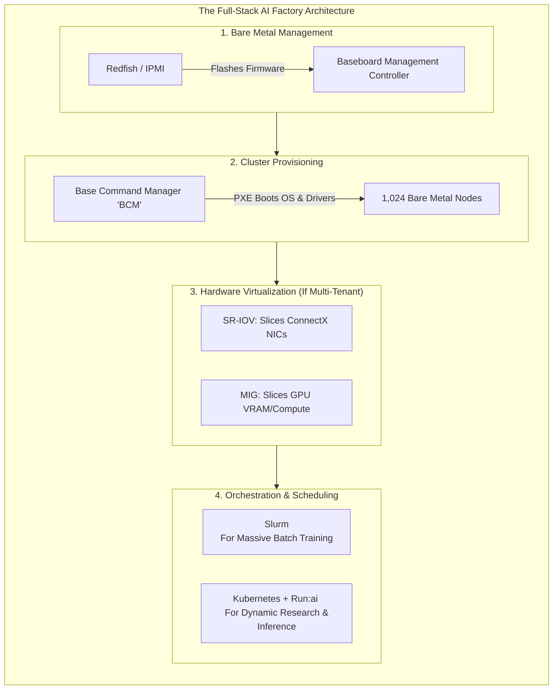

# Chapter 01 — Ultimate AI Factory Architect Interview Cheat Sheet

| Chapter metadata | Value |
|---|---|
| Volume | 26 — Interview Questions |
| Difficulty | Expert |
| Estimated reading time | 45 minutes |
| Primary audience | Senior Solutions Architect Candidates at NVIDIA |
| Core question | How do you tie Bare Metal, BCM, Redfish, InfiniBand, Slurm, K8s, and Run:ai into a single cohesive AI Factory architecture during a whiteboard interview? |

## Learning Outcome

By the end of this chapter, you will be able to:
- Explain the bare-metal provisioning lifecycle using Redfish and NVIDIA Base Command Manager (BCM).
- Contrast the scheduling philosophies of Slurm, plain Kubernetes, and Run:ai.
- Detail the exact role of SR-IOV in AI networking and virtualization.
- Navigate a full-stack System Design question spanning from the physical silicon up to the multi-tenant software layer.

## Beginner's Primer: The NVIDIA SA Interview

When you sit for a Senior Solutions Architect interview at NVIDIA, the panel is looking for "Full-Stack Hardware-to-Software" fluency. 

A standard Cloud Architect knows how to deploy a Kubernetes cluster in AWS. An NVIDIA Solutions Architect knows what happens *before* the cloud exists. They know how to rack 1,000 bare-metal servers, power them on, use out-of-band management (Redfish) to flash the firmware, use Base Command Manager (BCM) to push the Linux OS over the network, and then layer Slurm or Run:ai on top to orchestrate the workloads. 

In this interview, you cannot treat the hardware as a black box. You must prove you understand how physical electrical signals (PCIe, SR-IOV) dictate the software architecture (MIG, Containers). This chapter acts as your final, rapid-fire cheat sheet for the exact technologies NVIDIA interviewers will grill you on.

---

## 1. Bare Metal Management: BMC & Redfish

In a massive AI Factory, you do not plug a monitor and keyboard into a server to configure it. You use Out-of-Band (OOB) management.

**Q: "You just racked 1,000 DGX nodes. They have no operating system. How do you configure their BIOS and firmware without touching them?"**
**Model Answer:** "I would use **Redfish APIs** to communicate with the **BMC (Baseboard Management Controller)** on each node. The BMC is a tiny, independent computer on the motherboard that has its own dedicated network port. It operates even when the main server is powered off. Using Redfish (the modern, RESTful successor to IPMI), I can script the automation to remotely power on the servers, flash the BIOS, configure the RAID arrays, and set the boot order to PXE (Network Boot) simultaneously across all 1,000 nodes."

## 2. Cluster Provisioning: NVIDIA Base Command Manager (BCM)

*Note: BCM was formerly known as Bright Cluster Manager before NVIDIA acquired them.*

**Q: "How do you install an identical, optimized Linux OS and NVIDIA driver stack across 1,000 bare-metal servers?"**
**Model Answer:** "I would deploy **NVIDIA Base Command Manager (BCM)**. BCM acts as the central brain for bare-metal cluster provisioning. After configuring the nodes to PXE boot via Redfish, BCM acts as the DHCP and TFTP server. It pushes a unified 'Software Image' (containing the Linux OS, NVIDIA Kernel Drivers, OFED drivers for InfiniBand, and Docker) into the RAM of the 1,000 nodes. BCM guarantees that every single node is mathematically identical, eliminating configuration drift. BCM also automatically installs and configures workload managers like Slurm or Kubernetes."

## 3. Orchestration: Slurm vs. Kubernetes vs. Run:ai

An SA must know exactly when to recommend which orchestrator.

**Q: "When would you recommend Slurm over Kubernetes for an AI cluster?"**
**Model Answer:** "I recommend **Slurm** for pure, large-scale Distributed Training. Slurm is an HPC (High-Performance Computing) batch scheduler. It is natively designed for **Gang Scheduling**—meaning if a training job needs 512 GPUs, Slurm will wait until all 512 are available and start them at the exact same millisecond. If a node fails, Slurm kills the whole job so it can restart from a checkpoint. 
I recommend **Kubernetes** for Inference and microservices, because K8s is designed for high-availability, continuous uptime, and HTTP load balancing, but its default scheduler is terrible at gang-scheduling 512 tightly-coupled GPUs."

**Q: "A customer wants the dynamic flexibility of Kubernetes, but the fairness and GPU sharing capabilities of an HPC scheduler. What do you propose?"**
**Model Answer:** "I would propose deploying **Run:ai** on top of Kubernetes. The default K8s scheduler only understands whole integers (`nvidia.com/gpu: 1`) and FIFO (First-In-First-Out) queues. **Run:ai** replaces the default K8s scheduler. It introduces HPC-style features into Kubernetes: **Fair-Share Quotas** (guaranteeing departments get their allotted GPU time), **Preemption** (pausing a low-priority batch job to let a high-priority interactive Jupyter notebook run), and **Dynamic Fractional GPUs** (allowing multiple pods to share a single GPU memory space safely). It gives the customer the best of both worlds."

## 4. Hardware Virtualization: SR-IOV & MIG

**Q: "What is SR-IOV, and why is it critical for multi-tenant AI networking?"**
**Model Answer:** "SR-IOV stands for **Single-Root Input/Output Virtualization**. It is a hardware standard on the PCIe bus. In a virtualized environment (like vSphere), normally all network traffic goes through the software Hypervisor, which adds massive latency. **SR-IOV** allows a single physical network card (like a ConnectX-7) to physically slice itself into multiple 'Virtual Functions' (VFs) at the silicon level. We can pass these VFs directly into the Virtual Machines. The VMs bypass the hypervisor entirely and talk directly to the NIC hardware, achieving bare-metal RDMA/RoCE speeds while maintaining secure VM isolation."

**Q: "Compare SR-IOV to MIG."**
**Model Answer:** "They are philosophically the same thing, but for different pieces of silicon. **SR-IOV** slices a *Network Card* (NIC) into hardware-isolated virtual network cards. **MIG (Multi-Instance GPU)** slices a *GPU* into hardware-isolated virtual GPUs (Compute and Memory). By combining SR-IOV and MIG, we can give a multi-tenant customer a secure, hardware-isolated slice of compute AND a secure, hardware-isolated path to the network."

## 5. The Ultimate System Design Question

**Interviewer:** "Design an architecture for an enterprise customer. They have purchased 4 DGX SuperPODs (128 nodes, 1024 GPUs). They want to use 75% of it for training a massive Foundation Model, and 25% of it for 10 different internal research teams doing small experiments. Walk me through the stack from metal to user."

**The Senior SA Answer:**

1. **Hardware & Out-of-Band:** "We rack the 128 DGX nodes. We wire the management network to the **BMCs** and use **Redfish APIs** to upgrade all BIOS and firmware to a unified baseline."
2. **Provisioning (BCM):** "We deploy a highly available **Base Command Manager (BCM)** head node. BCM PXE-boots the entire fleet, pushing a hardened OS image containing the NVIDIA GPU drivers, MLNX_OFED for the networking, and container runtimes."
3. **Networking (InfiniBand & RoCE):** "For the Training partition, we wire the GPUs to a non-blocking **InfiniBand NDR** fat-tree topology. This ensures ultra-low latency for `AllReduce` NCCL collectives. For the Research partition, we use **RoCEv2** on Spectrum-X Ethernet to simplify integration with their existing enterprise IT networks."
4. **Storage:** "We deploy a massive **Lustre** parallel file system. We enable **GPUDirect Storage (GDS)** so the InfiniBand NICs can DMA data directly into the GPU VRAM, bypassing the Host CPUs entirely to prevent dataloader bottlenecks."
5. **Orchestration:** 
   - "For the 75% Foundation Model partition, we deploy **Slurm**. Slurm will handle the massive, 768-GPU gang-scheduled MPI/NCCL jobs perfectly."
   - "For the 25% Research partition, we deploy **Kubernetes with Run:ai**. Run:ai will allow the 10 research teams to submit Jupyter notebooks. Run:ai's fair-share scheduler will use **MIG** to slice the remaining GPUs into smaller instances, ensuring students and researchers don't starve each other's jobs."
6. **Observability:** "We deploy **DCGM-Exporter** across the entire fleet to scrape low-level silicon health (Xid errors, Thermal Throttling) and export it to a centralized Prometheus/Grafana stack. We configure alerts so if an ECC double-bit error occurs, the node is cordoned via BCM/Slurm automatically."

---

## Architecture Summary

Passing a Senior Solutions Architect interview requires proving that you understand the entire AI Factory supply chain. You must smoothly transition from discussing low-level electrical standards (PCIe, SR-IOV) to cluster imaging (BCM, Redfish), network topology (InfiniBand), and multi-tenant software orchestration (Run:ai, Slurm). 

## Related Chapters
- **Volume 10 & 11:** Kubernetes, GPU Operator, and GPU Sharing (MIG/Time-Slicing)
- **Volume 13:** Distributed Training and NCCL
- **Volume 21:** AI Factory Design Principles
- **Volume 24:** Capstone Design Projects
