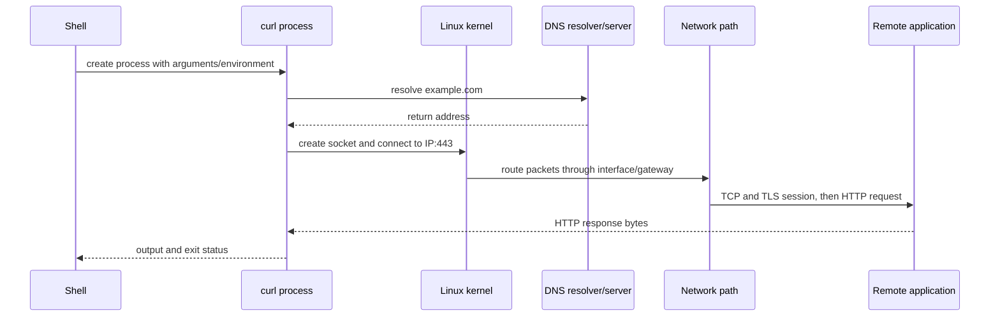

# Foundation — what Linux is and how to study a running system

## What this volume is trying to teach

Linux is the operating system underneath most cloud, Kubernetes, HPC and AI platforms. It sits between hardware and applications. It decides which process receives CPU time, which memory a process may use, how files reach storage, how packets enter and leave, and which actions an identity is allowed to perform.

You are not studying Linux to memorize commands. You are learning to answer: **what is the system doing, which layer owns it, and what evidence would distinguish healthy behavior from failure?**

## The first mental model

| Layer | Responsibility | Example evidence |
|---|---|---|
| Hardware | CPU, RAM, disk, NIC and GPU resources | `lscpu`, `lsblk`, `lspci` |
| Kernel | Scheduling, memory, devices, filesystems, networking and isolation | `/proc`, `dmesg`, pressure and device state |
| Process | A running program with identity, memory, threads and open resources | `ps`, `top`, `/proc/PID` |
| Service | Long-running system or application function | `systemctl`, `journalctl` |
| Application/workload | User-visible work such as an API or training job | application logs and outcome metrics |

When an application is slow, the application may be the cause—or it may be waiting on CPU scheduling, memory reclaim, storage, DNS, a remote dependency, a GPU, or another process. Volume 1 teaches the boundaries needed to tell those apart.

## Essential language

- A **program** is code stored on disk; a **process** is one running instance of it.
- A **thread** is an execution path inside a process.
- The **kernel** is privileged software controlling hardware and enforcing system rules.
- A **system call** is how a process requests a kernel operation.
- **Virtual memory** is the address-space view given to a process; it is not the same as physical RAM usage.
- A **file descriptor** is a process-local handle to a file, socket, pipe or device.
- A **filesystem** organizes files; a **mount** attaches one to the directory tree.
- A **socket** is a communication endpoint, usually identified through protocol, address and port.
- A **namespace** changes what resources a process can see.
- A **cgroup** accounts for and constrains resource use by a group of processes.
- **systemd** starts and supervises services on many Linux distributions.

Do not worry if these definitions still feel abstract. Each core chapter traces one of them through a real system.

## A real-life example

A GPU training job is slow even though Kubernetes reports its Pod as Running. That status says orchestration succeeded; it does not prove the Linux host is healthy. The process may be CPU-throttled, blocked on storage I/O, placed far from its GPU/NIC NUMA domain, reclaiming memory, or waiting on the network. A senior investigation needs Volume 1's process, memory, storage and network models before looking at GPU-specific tooling.

## Follow one request through Linux

When you run `curl https://example.com`, several ordinary Linux mechanisms cooperate:



This gives you a reusable failure tree:

- shell says command not found: executable/path/package boundary;
- name resolution fails: resolver configuration or DNS path;
- no route: address/interface/routing boundary;
- connection timeout/refused: packet path, firewall, listener or service state;
- TLS fails: identity, trust, protocol or time boundary;
- HTTP error: application/authentication/authorization/request boundary.

"The network is broken" skips every useful boundary.

## Processes, CPU and waiting

The shell asks the kernel to create a process. A process receives a PID, credentials, virtual address space and file descriptors. One or more threads become runnable when they have CPU work. The scheduler chooses when runnable threads execute.

Processes can also sleep while waiting for timers, files, sockets, locks or devices. Linux load average includes runnable work and certain uninterruptible waits, so high load is not automatically high CPU utilization.

First observations:

```bash
ps -eo pid,ppid,user,stat,pcpu,pmem,comm --sort=-pcpu | head
uptime
vmstat 1 5
```

Representative `ps` fields:

| Field | Meaning |
|---|---|
| PID/PPID | process and parent identifiers |
| STAT `R` | runnable/running |
| STAT `S` | interruptible sleep, commonly waiting |
| STAT `D` | uninterruptible sleep, often an I/O/kernel wait requiring investigation |
| `%CPU` | sampled CPU use over the tool's accounting interval |
| COMMAND | executable name, not necessarily full purpose/context |

Do not kill a `D`-state process merely because it appears stuck. First identify its wait channel, files and dependency; killing may not complete until the kernel wait returns.

## Memory from a process request to OOM

A process uses virtual addresses. The kernel maps virtual pages to physical memory or other backing as needed. File reads can populate the page cache. Under pressure, Linux reclaims clean cache, writes dirty pages, and may use swap when configured. Cgroups can impose a workload-specific boundary smaller than total host RAM.

```bash
free -h
cat /proc/meminfo | head -20
cat /proc/pressure/memory
```

Important distinctions:

- `MemFree` alone is not "available memory"; Linux intentionally uses spare RAM for caching.
- process virtual size is not the same as resident physical memory.
- a container can hit its cgroup limit while the host still has available RAM.
- an OOM kill is a decision after pressure; investigate allocation growth, limits, working set and recent change.

## Files, mounts and I/O

Linux exposes one directory tree, but different filesystems can be mounted at different directories. A path under `/data` might use local NVMe, NFS or a parallel filesystem. The application sees a path; operations inherit every layer below it.

```bash
findmnt -T /data
df -h /data
df -i /data
lsblk -o NAME,SIZE,FSTYPE,MOUNTPOINTS
```

`df -h` checks byte capacity, while `df -i` checks inode availability. Both can stop file creation. `findmnt -T` answers which filesystem backs the exact path; checking `/` when the application writes `/data` can inspect the wrong storage.

## Network layers with concrete questions

```bash
ip -brief address
ip route
getent ahosts example.com
ip route get 93.184.216.34
ss -lntup
```

| Evidence | Question answered |
|---|---|
| `ip address` | Which addresses/interfaces exist locally? |
| `ip route get` | Which source, interface and next hop would Linux select? |
| `getent ahosts` | What does the system resolver return? |
| `ss -lntup` | Which local sockets are listening, subject to permission? |
| packet capture | What packets actually crossed the observed interface? |

DNS success does not prove a service listens. A listener does not prove remote routing/firewall. A TCP connection does not prove TLS or application authorization.

## Identity and security controls

Linux uses layered controls:

1. process credentials: user, group and supplementary groups;
2. file ownership, mode bits and optionally ACLs;
3. privilege elevation such as controlled `sudo` rules;
4. Linux capabilities that divide some root privileges;
5. SELinux/AppArmor mandatory policy where enabled;
6. cgroup, namespace and container restrictions;
7. network firewall and service-level authentication/authorization;
8. audit and logs.

```bash
id
namei -l /path/to/file
getfacl /path/to/file
sudo -l
```

Do not solve an access failure with `chmod 777` or disabling SELinux. Prove which check denies the operation, then correct the narrowest policy or ownership error.

## systemd and evidence preservation

For a managed service:

```bash
systemctl status example.service
systemctl show example.service -p ActiveState -p SubState -p Result -p ExecMainStatus
journalctl -u example.service --since "15 minutes ago" --no-pager
```

Status describes current/most recent unit state; the journal provides a timeline. Capture both before restarting. A restart can mitigate impact, but it can also erase process state and change the evidence you were trying to understand.

## Guided lab — diagnose a local HTTP service

In one terminal, start a disposable unprivileged service:

```bash
python3 -m http.server 8080 --bind 127.0.0.1
```

In another terminal:

```bash
ps -ef | grep '[h]ttp.server'
ss -lntp | grep ':8080'
curl -v http://127.0.0.1:8080/
```

Then stop it with `Ctrl-C` and repeat `ss` and `curl`.

Explain the layers:

- Python process existed;
- socket listened only on loopback address and port 8080;
- `curl` completed TCP and HTTP locally;
- after shutdown, the route still existed but no process listened;
- binding to loopback would not make the service remotely reachable even if a host firewall allowed the port.

## Common beginner mistakes

- treating `top` as a root-cause tool instead of orientation;
- reading only `MemFree` and declaring a leak;
- checking the root filesystem when the application uses another mount;
- assuming DNS, routing, TCP, TLS and HTTP are one test;
- restarting before preserving logs and state;
- confusing a systemd unit, process, container and Kubernetes Pod;
- using broad permission changes instead of finding the denying control.

## Official and local reinforcement

- [Linux kernel documentation](https://docs.kernel.org/)
- [Linux cgroup v2 documentation](https://docs.kernel.org/admin-guide/cgroup-v2.html)
- [systemd manual](https://www.freedesktop.org/software/systemd/man/latest/systemd.html)
- [journalctl manual](https://www.freedesktop.org/software/systemd/man/latest/journalctl.html)
- Local Staff guide: `consolidated_guides/linux-systems_consolidated.md`
- Local SRE labs: `interview-prep/hands-on-labs/linux/` and `linux-admin/`

## How to study this volume

Study Chapters 1–6 first. For each chapter:

1. learn the five or ten basic nouns;
2. draw the healthy path;
3. run read-only observation commands;
4. predict an output before reading it;
5. explain one common failure without immediately restarting anything.

The senior deep dives assume this core model. Use them later to add scale, performance and production nuance.

## Readiness check

You are ready for the core chapters when you understand that:

- an operating system is an active resource manager, not merely a place applications run;
- process, service, container and Pod are related but different concepts;
- a metric or command is evidence about one boundary, not proof of the whole system;
- safe troubleshooting begins with scope, normal path and observation before mutation.
