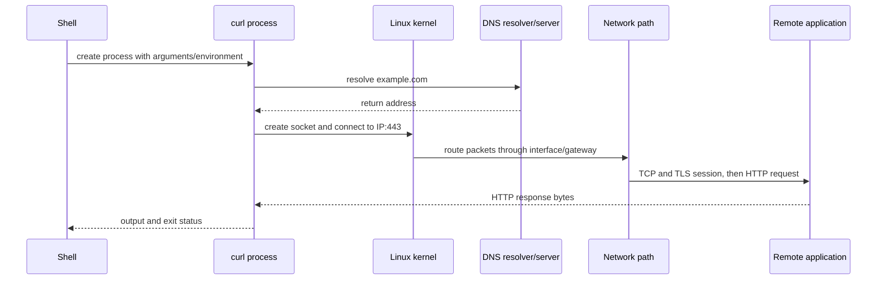
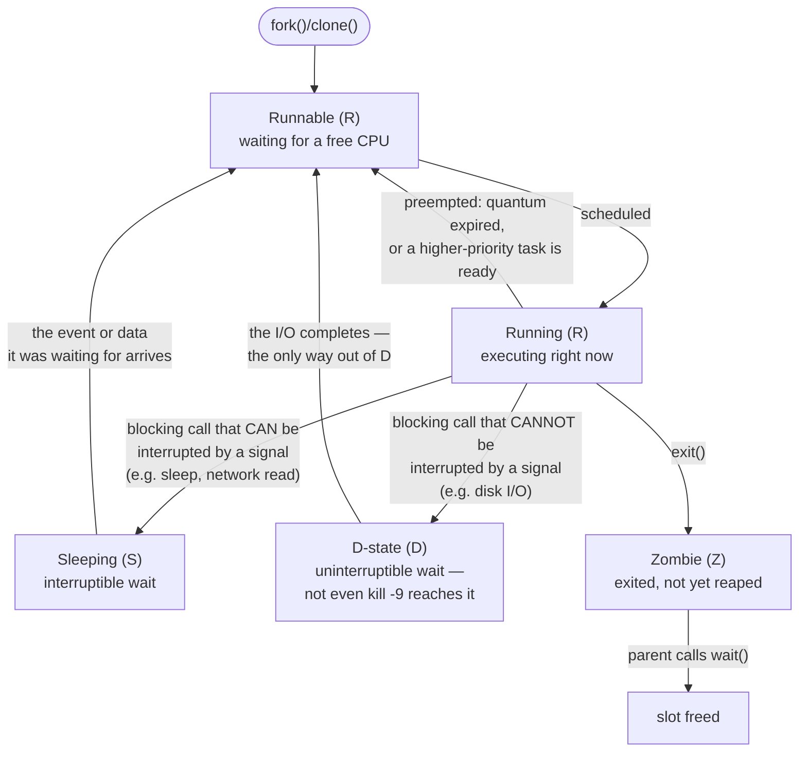
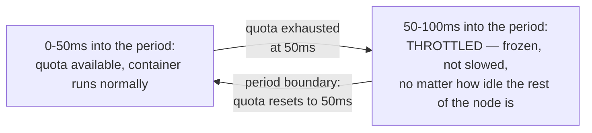
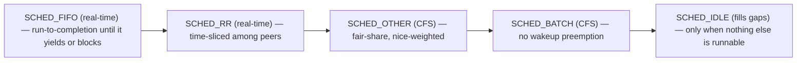

## Foundations: start here if this is new to you

This section will not make you a Linux expert. Its only job is to give you the vocabulary and mental models the rest of this chapter assumes you already have, so you can read the internals-level content below without getting stuck decoding basic terms mid-paragraph. If a term below already feels obvious to you, skim it and move on — but read the sections that don't.

### What a kernel actually does

**The problem.** Every program that wants to do anything useful — read a file, send network data, use memory, talk to a GPU — ultimately needs to touch physical hardware. If every program had to know the exact electrical details of every disk, network card, and CPU model it might run on, we'd need a different version of every program for every hardware combination, and two programs touching the same hardware at once would corrupt each other's work.

**The concept.** The **kernel** is the piece of software that sits between programs and hardware and mediates that access: programs ask the kernel to do things (read this file, send this network packet, give me some memory), and the kernel is the only thing that actually talks to the hardware. This is directly analogous to a database engine sitting between your application code and the raw disk blocks — your application never seeks to a byte offset on disk itself; it asks the database, and the database enforces rules (locking, consistency, permissions) on the way to the hardware. The kernel is that same kind of mediator, but for an entire computer instead of just data storage.

**The shape of it.** "Linux" as a name really refers to this kernel. Everything else you associate with a Linux system — the shell, command-line tools, package managers — is software that *runs on top of* the kernel and asks it to do things on their behalf.

**Why this matters here.** This chapter talks about things like scheduling, cgroups, and namespaces further down — all of these are kernel mechanisms for controlling *how* programs get access to hardware (CPU time, memory, isolation from each other). None of that will make sense unless "the kernel mediates hardware access" is already a settled idea in your head.

### Check your understanding

**Q1: If a kernel crashes, why does everything on the machine stop, not just one program?**
A: Because every program depends on the kernel to reach hardware at all — memory, disk, network. Without it, no program can do anything, the same way no application can do anything useful if the database engine it depends on goes down mid-operation.

**Q2: What's the software-engineering analogy used above, and where does it break down?**
A: A database engine mediating between application code and raw disk blocks. It breaks down in scope — a database mediates one resource (data on disk); the kernel mediates *all* hardware resources (CPU, memory, disk, network, devices) for every program on the machine, not just one.

### What a process actually is

**The problem.** A program sitting on disk (say, a compiled binary or a script) is just static data — instructions and data waiting to be read. But when you actually run it, something needs to track: which instruction is executing right now, what memory this specific run is using, and how this running instance is different from another run of the very same program started a second later.

**The concept.** A **process** is a running instance of a program: it has its own private memory, its own identity (a process ID, or PID), and its own execution state, separate from the program file on disk and separate from any other running instance of that same program. This is the same relationship as a class versus an object in object-oriented programming: the program on disk is like the class definition (static, one copy), and each process is like an object instantiated from it (its own state, its own identity, and you can have many of them running from the same class at once).

**The shape of it.** The kernel creates a process when a program is launched, gives it a PID, tracks its state (is it actively running on a CPU right now, waiting for something, or finished), and cleans up its resources when it exits.

**A first real example.** If you run the same command twice in two terminal windows, you get two processes, each with a different PID, each with its own memory — even though they started from the identical program file.

### Check your understanding

**Q1: If you run the same script three times at once, how many processes exist, and what's shared between them versus separate?**
A: Three processes. The program file on disk is shared (all three read the same instructions); each process's memory, PID, and execution state are separate.

**Q2: Why isn't "the program" and "the process" the same thing?**
A: The program is static data on disk — one copy, not running. A process is a live, running instance with its own identity and memory; there can be zero, one, or many processes for a single program at any moment.

### Files, file descriptors, and "everything is a file"

**The problem.** A running process needs some consistent way to read and write data — whether that data lives in a file on disk, is coming from your keyboard, is going to your screen, or is flowing over a network connection. If each of those needed a completely different set of operations, every program would need special-case code for every kind of data source.

**The concept.** Linux's answer is to make nearly everything — disk files, directories, keyboard input, terminal output, network connections, even hardware devices — accessible through the same small set of operations (open, read, write, close), organized as a single tree of **files**, starting at a root directory (`/`) and branching into subdirectories. This is a genuine design decision, not a marketing slogan: it means one uniform interface works for wildly different underlying things, the way a well-designed API might expose "read bytes" and "write bytes" as its only two verbs regardless of whether the backing store is a local disk, cloud storage, or an in-memory buffer.

When a process opens one of these files, the kernel hands it a small number called a **file descriptor** — think of it as a claim ticket or a table index: the process gives the kernel that number on future read/write calls, and the kernel looks up what it actually points to. It is very similar to a database connection handle in application code: your code doesn't manipulate the raw TCP socket to the database directly, it holds a handle (a number/reference) and passes that handle to future calls.

**The shape of it.** Every process starts with three file descriptors already open by convention: standard input (keyboard, typically descriptor 0), standard output (screen, descriptor 1), and standard error (also normally the screen, descriptor 2). Everything else a process opens — real files, network sockets — gets the next available descriptor number.

**Why this matters here.** Later in this chapter you'll inspect a process's open file descriptors as a diagnostic technique, and Volume 10's security material discusses file permissions — both assume you already know a file descriptor is "a process's handle to something it opened," not a mysterious internal detail.

### Check your understanding

**Q1: Why can the same small set of operations (open, read, write, close) work for both a disk file and a network connection?**
A: Because Linux deliberately represents both as "files" behind a uniform interface — the design choice is to hide the differences in the underlying thing behind one consistent set of verbs, similar to an API that exposes the same read/write calls regardless of backing store.

**Q2: What does a file descriptor actually hold — the data itself, or something else?**
A: Something else — it's a small number the process uses as a reference/claim-ticket. The kernel maps that number to the actual open file, socket, or device on the process's behalf.

### Permissions and ownership, at a basic level

**The problem.** On a machine used by more than one person, or running more than one service, you need a way to say "this user can read this file, but not that one," without one user's programs being able to freely read, change, or delete another's data.

**The concept.** Every file has an **owner** (a specific user) and an associated **group** (a set of users), and three categories of access are tracked separately for each: the owner, the group, and everyone else ("other"). For each of those three categories, three permissions can be granted independently: **read** (view contents), **write** (modify contents), and **execute** (run it as a program, or enter it if it's a directory). This is directly analogous to access-control lists you've likely configured on a cloud storage bucket or an API resource: a resource has an owner, and different principals get different allowed actions.

**The shape of it.** You'll commonly see this summarized as a compact string like `rwxr-xr--` — read it in three groups of three: owner permissions, group permissions, other permissions. `rwx` for owner means the owner can read, write, and execute; `r-x` for group means the group can read and execute but not write; `r--` for other means everyone else can only read.

**Why it matters for Volume 10.** Volume 10's security chapter builds directly on this — things like "why a container shouldn't run as root" or "why a world-writable file is a red flag" only make sense once owner/group/other and read/write/execute are already solid.

### Check your understanding

**Q1: A file shows permissions `rw-r--r--`. Can a user who is neither the owner nor in the file's group modify it?**
A: No. The "other" category (last three characters) is `r--` — read only, no write, no execute — for anyone who isn't the owner or in the group.

**Q2: Why are read, write, and execute tracked as three separate bits instead of one "access" flag?**
A: Because the three kinds of access are genuinely independent needs — you might want someone to read a config file without being able to change it, or run a script without being able to view or edit its contents. Separate flags let you grant exactly what's needed.

### What a shell actually is

**The problem.** The kernel doesn't have a conversational interface — it exposes low-level operations, not something you type commands into directly. Something needs to sit between a human typing text and the kernel carrying out requests.

**The concept.** A **shell** is an ordinary program — not part of the kernel — whose job is to read commands you type, figure out what they mean, and ask the kernel to do the corresponding work (like starting a new process, or opening a file). This is worth stating plainly because it's a common point of confusion: the shell is a program, not the operating system itself; you could replace it with a different shell program and the kernel underneath wouldn't change at all.

**The shape of it.** You type a command, the shell parses it, and typically the shell asks the kernel to start a new process to actually run that command (the earlier "process" concept in action).

**The absolute minimum command vocabulary.** These are shown here just so the words are familiar — the rest of this chapter is where you'll learn to actually treat their output as evidence to investigate with, per this chapter's evidence-vs-proof habit.

- `ls` — lists the contents of a directory.
- `cd` — changes which directory the shell currently considers "here."
- `cat` — prints a file's contents to the screen.
- `ps` — lists currently running processes.
- `top` — shows a live, continuously updating view of running processes and resource usage.

### Check your understanding

**Q1: If the shell is "just a program," what actually starts a new process when you type a command and press enter?**
A: The shell asks the kernel to start it — the shell itself doesn't have the power to create processes on its own; that's a kernel operation the shell requests on your behalf.

**Q2: Could you have two different shell programs installed and switch between them? Would the kernel change?**
A: Yes to switching, no to the kernel changing. The shell is a replaceable layer on top of the kernel; swapping shells changes how you type commands, not what the kernel underneath is doing.

### What a package manager does

**The problem.** Installing software by hand means finding the right files, putting them in the right places, and separately tracking every other piece of software it depends on to run — and doing all of that again, correctly, every time you update or remove it.

**The concept.** A **package manager** is a tool that installs, updates, and removes software for you, while automatically tracking what each piece of software depends on, so those dependencies get installed too (and aren't removed while something still needs them). Conceptually, this is the same problem a language-level dependency manager (like npm or pip) solves for a single project's libraries — a Linux package manager does the equivalent job for software installed on the whole machine.

**The shape of it.** You tell the package manager what you want installed; it consults a catalog of available software and their declared dependencies, resolves what actually needs to be fetched, and installs all of it in a consistent state.

We're intentionally not naming specific package manager commands here — that's operational detail the rest of this chapter will ground in real examples once the underlying model (dependency tracking, consistent installed state) is already familiar.

### Check your understanding

**Q1: Why is "installs software" an incomplete description of what a package manager does?**
A: Because the harder and more valuable part is dependency tracking — making sure everything that piece of software needs is also present, compatible, and not removed out from under it later.

**Q2: What's the closest thing you've already used that solves a similar problem, just at a different scope?**
A: A language-level dependency manager such as npm or pip — same core problem (track and install dependencies consistently), different scope (one project's libraries vs. the whole machine's installed software).

### The first mental model

| Layer | Responsibility | Example evidence |
|---|---|---|
| Hardware | CPU, RAM, disk, NIC and GPU resources | `lscpu`, `lsblk`, `lspci` |
| Kernel | Scheduling, memory, devices, filesystems, networking and isolation | `/proc`, `dmesg`, pressure and device state |
| Process | A running program with identity, memory, threads and open resources | `ps`, `top`, `/proc/PID` |
| Service | Long-running system or application function | `systemctl`, `journalctl` |
| Application/workload | User-visible work such as an API or training job | application logs and outcome metrics |

When an application is slow, the application may be the cause—or it may be waiting on CPU scheduling, memory reclaim, storage, DNS, a remote dependency, a GPU, or another process. Volume 1 teaches the boundaries needed to tell those apart.

### Follow one request through Linux

When you run `curl https://example.com`, several ordinary Linux mechanisms cooperate:



This gives you a reusable failure tree:

- shell says command not found: executable/path/package boundary;
- name resolution fails: resolver configuration or DNS path;
- no route: address/interface/routing boundary;
- connection timeout/refused: packet path, firewall, listener or service state;
- TLS fails: identity, trust, protocol or time boundary;
- HTTP error: application/authentication/authorization/request boundary.

"The network is broken" skips every useful boundary.

### Memory from a process request to OOM

A process uses virtual addresses. The kernel maps virtual pages to physical memory or other backing as needed. File reads can populate the page cache. Under pressure, Linux reclaims clean cache, writes dirty pages, and may use swap when configured. Cgroups can impose a workload-specific boundary smaller than total host RAM.

```bash
free -h
cat /proc/meminfo | head -20
cat /proc/pressure/memory
```

```text
$ free -h
              total    used    free    shared  buff/cache   available
Mem:           64Gi    18Gi   2.1Gi     1.2Gi        44Gi        45Gi
Swap:         8.0Gi      0B    8.0Gi

$ cat /proc/pressure/memory
some avg10=0.00 avg60=0.00 avg300=0.00 total=0
full avg10=0.00 avg60=0.00 avg300=0.00 total=0
```
The `free` column (2.1Gi) looks alarmingly low; `available` (45Gi) is the number that actually matters, because it accounts for cache that can be reclaimed instantly if a process needs it. The `/proc/pressure/memory` output being all zeros here means the kernel hasn't had to make anyone wait for memory recently — if those numbers were climbing instead, that would mean real stalls, regardless of what `free` shows.

Important distinctions:

- `MemFree` alone is not "available memory"; Linux intentionally uses spare RAM for caching.
- process virtual size is not the same as resident physical memory.
- a container can hit its cgroup limit while the host still has available RAM.
- an OOM kill is a decision after pressure; investigate allocation growth, limits, working set and recent change.

### Files, mounts and I/O

Linux exposes one directory tree, but different filesystems can be mounted at different directories. A path under `/data` might use local NVMe, NFS or a parallel filesystem. The application sees a path; operations inherit every layer below it.

```bash
findmnt -T /data
df -h /data
df -i /data
lsblk -o NAME,SIZE,FSTYPE,MOUNTPOINTS
```

```text
$ findmnt -T /data
TARGET SOURCE          FSTYPE OPTIONS
/data  /dev/nvme0n1p1  ext4   rw,relatime

$ df -h /data
Filesystem      Size  Used Avail Use% Mounted on
/dev/nvme0n1p1  3.5T  2.1T  1.3T  63% /data

$ df -i /data
Filesystem       Inodes  IUsed    IFree IUse% Mounted on
/dev/nvme0n1p1  234881024 41230  234839794    1% /data
```
`df -h` (63% used) looks completely fine — but `df -i` tracks a separate resource: the fixed number of inodes (one per file/directory) the filesystem was formatted with. A directory containing millions of tiny files can exhaust inodes and fail every new file creation with "No space left on device" while `df -h` still shows plenty of free bytes — two different capacity ceilings, and only one of them shows up in the number people check by habit.

`df -h` checks byte capacity, while `df -i` checks inode availability. Both can stop file creation. `findmnt -T` answers which filesystem backs the exact path; checking `/` when the application writes `/data` can inspect the wrong storage.

### Network layers with concrete questions

```bash
ip -brief address
ip route
getent ahosts example.com
ip route get 93.184.216.34
ss -lntup
```

```text
$ ip -brief address
lo               UNKNOWN 127.0.0.1/8
eth0             UP      10.20.30.5/24

$ ip route
default via 10.20.0.1 dev eth0
10.20.0.0/24 dev eth0 proto kernel scope link src 10.20.30.5

$ getent ahosts example.com
93.184.216.34   STREAM example.com

$ ip route get 93.184.216.34
93.184.216.34 via 10.20.0.1 dev eth0 src 10.20.30.5

$ ss -lntup
Netid State  Local Address:Port  Peer Address:Port Process
tcp   LISTEN 0.0.0.0:22          0.0.0.0:*         users:(("sshd",pid=812))
```
Each of these proves exactly one thing and no more: `ip -brief address` proves what addresses exist locally. `getent ahosts` proves what the resolver returns — nothing about whether that address is reachable. `ip route get` proves which route would actually be used, including the source IP the kernel would pick. `ss -lntup` proves what's listening locally, subject to your own permission to see other users' sockets. None of them, alone or together, proves a remote service actually accepted a connection — that's a separate test.

| Evidence | Question answered |
|---|---|
| `ip address` | Which addresses/interfaces exist locally? |
| `ip route get` | Which source, interface and next hop would Linux select? |
| `getent ahosts` | What does the system resolver return? |
| `ss -lntup` | Which local sockets are listening, subject to permission? |
| packet capture | What packets actually crossed the observed interface? |

DNS success does not prove a service listens. A listener does not prove remote routing/firewall. A TCP connection does not prove TLS or application authorization.

### Identity and security controls

Linux uses layered controls:

1. process credentials: user, group and supplementary groups;
2. file ownership, mode bits and optionally ACLs;
3. privilege elevation such as controlled `sudo` rules;
4. Linux capabilities that divide some root privileges;
5. SELinux/AppArmor mandatory policy where enabled;
6. cgroup, namespace and container restrictions;
7. network firewall and service-level authentication/authorization;
8. audit and logs.

```bash
id
namei -l /path/to/file
getfacl /path/to/file
sudo -l
```

```text
$ id
uid=1000(app) gid=1000(app) groups=1000(app),999(docker)

$ namei -l /data/checkpoints/step.pt
f: /data/checkpoints/step.pt
drwxr-xr-x root root /
drwxr-xr-x root root data
drwxr-xr-x app  app  checkpoints
-rw-r--r-- app  app  step.pt

$ getfacl /data/checkpoints/step.pt
# file: data/checkpoints/step.pt
# owner: app
# group: app
user::rw-
group::r--
other::r--

$ sudo -l
User app may run the following commands on this host:
    (root) NOPASSWD: /usr/bin/systemctl restart myapp.service
```
`namei -l` is the one people forget: it walks *every directory in the path*, not just the final file, and prints the permissions at each step — a file can have perfectly correct permissions while a parent directory somewhere above it blocks access entirely. `getfacl` matters specifically when a file *looks* restrictive under plain `ls -l` but actually has an ACL granting extra access (or the reverse) — `ls -l` alone can't show that. `sudo -l` shows exactly what elevated commands this user can run, which is the fastest way to confirm or rule out a privilege-escalation path without guessing.

Do not solve an access failure with `chmod 777` or disabling SELinux. Prove which check denies the operation, then correct the narrowest policy or ownership error.

### systemd and evidence preservation

For a managed service:

```bash
systemctl status example.service
systemctl show example.service -p ActiveState -p SubState -p Result -p ExecMainStatus
journalctl -u example.service --since "15 minutes ago" --no-pager
```

```text
$ systemctl status example.service
● example.service - Example Application
     Loaded: loaded (/etc/systemd/system/example.service; enabled)
     Active: active (running) since Wed 2026-07-30 09:00:11 UTC; 2h 14min ago
   Main PID: 8842 (python3)

$ systemctl show example.service -p ActiveState -p SubState -p Result -p ExecMainStatus
ActiveState=active
SubState=running
Result=success
ExecMainStatus=0

$ journalctl -u example.service --since "15 minutes ago" --no-pager
Jul 30 11:12:03 host example[8842]: request handled in 42ms
Jul 30 11:12:41 host example[8842]: WARN: upstream timeout, retrying
```
`systemctl status` gives a human-readable summary at a glance; `systemctl show -p ...` gives the exact machine-readable fields (`ExecMainStatus=0` specifically is the process's last exit code — nonzero here would mean it crashed, not that it's currently healthy) — the kind of field a script or alert should check, not the free-text summary. `journalctl -u` is the only one of the three with a timeline, which is why it's the one to capture before restarting: `status` only shows the *current* state, but the log entries showing what led up to it disappear from easy view once the service restarts and its state resets.

Status describes current/most recent unit state; the journal provides a timeline. Capture both before restarting. A restart can mitigate impact, but it can also erase process state and change the evidence you were trying to understand.

### Authentication versus authorization: two different questions

**The problem.** "Access denied" collapses two genuinely different failures into one message. A request can be rejected because the system doesn't know who is asking, or because the system knows exactly who is asking and has decided they still aren't allowed to do this specific thing. Treating those as the same problem sends you looking in the wrong place.

**The concept.** **Authentication** answers "who are you?" — proving identity through something like a password, an SSH key, a certificate, or a token. **Authorization** answers a completely separate question asked only *after* identity is settled: "now that I know who you are, what are you allowed to do?" — decided through mechanisms like the owner/group/other bits from earlier in this section, an ACL, a `sudo` rule, or an RBAC policy. This is the same two-step pattern as a building with a keycard door and then locked internal offices: the keycard at the front door is authentication (proving you're an employee); which internal doors your specific keycard opens is authorization (deciding what that employee is allowed into). A valid keycard that opens the front door does not imply it opens every office.

**The shape of it.** Every access decision on a Linux system runs through both steps in order: first establish identity (authentication), then check whether that identity is permitted the specific action requested (authorization). A failure can happen at either step, and the fix for one is never the fix for the other — issuing someone a valid login does nothing for a permissions error, and loosening a permission does nothing for a login that was never accepted in the first place.

**Check your understanding**

**Q1: A user's SSH key is accepted and they get a shell on the machine, but `cat /etc/shadow` still fails with "permission denied." What happened?**
A: Authentication succeeded (the key proved who they are) and authorization failed (their identity isn't permitted to read that specific file). Two separate checks, two separate outcomes — fixing the login wouldn't help here at all.

**Q2: Why doesn't it make sense to "fix" an authorization failure by giving the user a new password or key?**
A: Because a new credential only affects the authentication step (proving identity again, the same identity as before) — it does nothing to the authorization step, which is a separate policy decision about what that already-proven identity is allowed to do.

### Guided lab — diagnose a local HTTP service

In one terminal, start a disposable unprivileged service:

```bash
python3 -m http.server 8080 --bind 127.0.0.1
```

In another terminal:

```bash
ps -ef | grep '[h]ttp.server'
ss -lntp | grep ':8080'
curl -v http://127.0.0.1:8080/
```

Then stop it with `Ctrl-C` and repeat `ss` and `curl`.

Explain the layers:

- Python process existed;
- socket listened only on loopback address and port 8080;
- `curl` completed TCP and HTTP locally;
- after shutdown, the route still existed but no process listened;
- binding to loopback would not make the service remotely reachable even if a host firewall allowed the port.

### Common beginner mistakes

- treating `top` as a root-cause tool instead of orientation;
- reading only `MemFree` and declaring a leak;
- checking the root filesystem when the application uses another mount;
- assuming DNS, routing, TCP, TLS and HTTP are one test;
- restarting before preserving logs and state;
- confusing a systemd unit, process, container and Kubernetes Pod;
- using broad permission changes instead of finding the denying control.

### Official and local reinforcement

- [Linux kernel documentation](https://docs.kernel.org/)
- [Linux cgroup v2 documentation](https://docs.kernel.org/admin-guide/cgroup-v2.html)
- [systemd manual](https://www.freedesktop.org/software/systemd/man/latest/systemd.html)
- [journalctl manual](https://www.freedesktop.org/software/systemd/man/latest/journalctl.html)
- Local Staff guide: `consolidated_guides/linux-systems_consolidated.md`
- Local SRE labs: `interview-prep/hands-on-labs/linux/` and `linux-admin/`

### Check your understanding: follow the evidence

**Q1: A service is slow while CPU utilization is low. What does that prove?**
A: Only that sampled CPU execution is not saturated. The process may be waiting on storage, memory reclaim, a lock, DNS, a remote service, a GPU, or CPU quota. Check the relevant wait and dependency evidence before concluding.

**Q2: Why should you capture service state and logs before restarting?**
A: A restart changes the system and can erase the process state or timeline needed to distinguish causes. Restarting may be a mitigation, but it is not a diagnosis.

**Q3: If a local HTTP request succeeds on 127.0.0.1, what remains unproved?**
A: Remote routing, firewall policy, non-loopback binding, TLS, authentication, and the real application path all remain unproved.

### Glossary

- **Kernel** — the software that mediates all access to hardware so other programs don't touch hardware directly.
- **Process** — a running instance of a program, with its own memory, identity (PID), and execution state.
- **PID** — the numeric identity the kernel assigns to a process.
- **File** — in Linux, a uniform abstraction covering disk files, directories, devices, and more, all accessed through the same basic operations.
- **File descriptor** — a small number a process uses as a reference to something it has opened (a file, socket, or device); the kernel maps it to the real thing.
- **Owner / group / other** — the three categories of access control tracked on every file: the specific owning user, an associated group of users, and everyone else.
- **Read / write / execute** — the three independently-grantable permissions on a file: view contents, modify contents, run as a program (or enter, for a directory).
- **Shell** — an ordinary program that reads typed commands and asks the kernel to carry out the corresponding work; not part of the kernel itself.
- **Package manager** — a tool that installs, updates, and removes software while tracking its dependencies automatically.
- **System call** — a controlled request from a process to the kernel.
- **Virtual memory** — the process-specific address-space view mapped by the kernel to physical memory or other backing.
- **Mount** — the attachment of a filesystem at a directory in Linux's single directory tree.
- **Socket** — a communication endpoint identified by protocol and local/remote address information.
- **Namespace** — a kernel mechanism that changes which resources a process can see.
- **cgroup** — a kernel mechanism that accounts for and constrains resources used by a process group.
- **systemd** — the service manager used to start and supervise services on many Linux distributions.
- **Authentication** — proving who is making a request (password, SSH key, certificate, token).
- **Authorization** — deciding what an already-identified requester is permitted to do (mode bits, ACL, sudo rule, RBAC policy).

### Before you go deeper, make sure you can...

- Explain what a kernel mediates, and why programs don't talk to hardware directly.
- Explain the difference between a program on disk and a running process, using the class/object analogy or your own equivalent.
- Explain what a file descriptor actually is (a reference/handle, not the data itself).
- Read a permission string like `rwxr-xr--` and state exactly what owner, group, and other can each do.
- Explain why the shell is a program and not the kernel.
- State, in one sentence, what problem a package manager solves beyond "installing files."
- Explain the difference between authentication and authorization, and why fixing one never fixes a failure in the other.
- Trace a request through process, resolver, socket, route, remote service, and application boundaries.
- State what `ps`, `findmnt`, `ip route get`, `ss`, and `systemctl` each prove—and what remains unproved.

With that model in place, here's the full mechanism.

**VOLUME 1**

**Foundations Beneath Kubernetes**

Linux, networking, storage and container mechanisms from first principles

> Fourth Edition - Teaching text with mechanisms, examples, visuals, scenarios and exercises

Independent study guide based on public documentation and public practitioner material. Not an NVIDIA publication.

> Reading method For every mechanism: first understand the model, then run the commands, then interpret evidence, then work the incident. Kubernetes mapping comes after the Linux mechanism is clear.


Figure 1. Move downward through abstractions until the symptom maps to a mechanism.

# Chapter 1 — Processes, threads, CPU scheduling and load
*(original text preserved in full below; additions marked with ➕ so you can see exactly what changed)*

**Learning outcome:** Explain process/thread state, scheduler queues, CPU time, context switches, load average, throttling and the evidence that distinguishes them.

## 1.1 Process and thread model
A program on disk — a compiled binary or a script — is inert bytes; it does nothing until something runs it. A **process** is what exists once the kernel loads that program and starts executing it. Every process gets: its own virtual memory address space (so it can't read or write another process's memory), credentials (the user/group IDs the kernel checks on every permission decision), a table of open file descriptors (files, sockets, pipes it currently has open), and signal state (which signals it's ignoring, handling, or currently blocked on).

A process can contain multiple **threads**. All threads in the same process share that one address space and the same file descriptor table — a variable written by one thread is immediately visible to the others, and closing a file descriptor in one thread closes it for all of them. But each thread has its own stack, CPU registers and program counter, so the kernel can run, block, or preempt it independently of its sibling threads.

Why this matters for Kubernetes: the kernel scheduler has no concept of a "Pod." It only ever schedules threads (kernel-internal name: `task_struct`) onto CPUs. A Pod is a Kubernetes-level grouping of one or more containers, and each container is, at the OS level, one or more ordinary Linux processes. So when you're diagnosing CPU scheduling, throttling, or load, you have to reason in terms of processes and threads on the node — by the time the kernel is involved, the Pod abstraction is already gone.

**Inspect process identity, threads, state and file descriptors**
```bash
ps -eo pid,ppid,tid,stat,ni,psr,pcpu,pmem,comm --sort=-pcpu | head -30
ps -L -p <PID> -o pid,tid,psr,stat,pcpu,comm
cat /proc/<PID>/status
ls -l /proc/<PID>/fd | head
```

➕ **Sample output, annotated** (what you're actually looking for):
```text
$ ps -eo pid,ppid,tid,stat,ni,psr,pcpu,comm --sort=-pcpu | head -5
PID  PPID TID  STAT NI PSR %CPU COMMAND
8842 8801 8842 R    0  3   97.2 python3   ← running, pinned to CPU 3, hot
8842 8801 8855 S    0  11  0.4  python3   ← sibling thread, same PID, idle
9001 1    9001 D    0  7   0.0  java      ← STAT=D, 0% CPU but NOT the same as idle
```
The `D` line is the one that fools people: 0% CPU looks "fine" in a CPU-only dashboard, but a process stuck in `D` is exactly what inflates load average while CPU graphs look calm — this is the gap between "looks idle" and "is blocked" that Kubernetes CPU-based HPA metrics will completely miss.

➕ **Process state machine (what actually drives the transitions):**

`S` and `D` are two *separate, parallel* kinds of blocked, not stages of one path — a process picks one or the other depending on what it blocked on, and each has its own independent way back to `Runnable`. The diagram below deliberately draws them side by side rather than chained, because chaining them (as if D always passes through S on its way back) misrepresents the actual kernel behavior:



Both `Sleeping` and `Dstate` are reached directly from `Running`, and both return directly to `Runnable` — neither one passes through the other. The distinction that actually matters operationally is *which* of the two a blocked process is in: `S` responds to signals (you can interrupt or kill it), `D` does not (a `D`-state process ignores `kill -9` entirely until its I/O finishes on its own).

➕ **Memory hook:** *"RSDZT — Running Steadily, Dead Zombies Trapped."* R=running/runnable, S=sleeping (interruptible), D=disk-wait (uninterruptible — can't even `kill -9` it out, you have to wait for the I/O), Z=zombie (exited, unreaped), T=traced/stopped. The one to instinctively distrust in dashboards is D — it's invisible to CPU metrics and immune to normal signals.

## 1.2 Process states
| State | Meaning | Operational clue |
|---|---|---|
| R | running or runnable | CPU/run-queue pressure if many remain runnable |
| S | interruptible sleep | normally waiting for timer/event/I/O |
| D | uninterruptible sleep | often waiting on kernel I/O; cannot handle normal signals until wait completes |
| Z | zombie | child exited; parent has not reaped exit status |
| T | stopped/traced | job control or debugger/signal stopped the task |

D state is a classic reason load can be high while CPU utilization is not. Load average includes runnable tasks and tasks in uninterruptible sleep, so it is a queue-pressure signal, not a CPU percentage.

➕ **Shortcut — find every D-state process on a box in one line, ranked by how long it's been stuck:**
```bash
for p in $(ps -eo pid,stat | awk '$2 ~ /D/ {print $1}'); do
  echo "PID $p: $(cat /proc/$p/comm 2>/dev/null) — waiting on: $(cat /proc/$p/wchan 2>/dev/null)"
done
```
`/proc/<pid>/wchan` names the *kernel function* it's blocked in — e.g. `wait_on_page_bit` (page cache I/O) vs `nfs_wait_bit_uninterruptible` (NFS specifically) — this single field turns "something is stuck" into "NFS is the actual root cause" in one command, which is exactly the kind of evidence-first move a Senior SA interview is scoring you on.

➕ **Zombie cleanup reality check:** a zombie holds almost no resources (just a PID table entry + exit status) — the real problem is never the zombie itself, it's *why the parent isn't calling `wait()`* (buggy supervisor, or — very common in containers — PID 1 in a container image not reaping children at all, which is why `tini`/`dumb-init` exist as PID 1 wrappers). If asked "what's wrong with a container full of zombies," the answer is about PID 1 responsibility, not the zombies.

## 1.3 CPU scheduling, run queue and context switches
Linux time-slices runnable tasks across CPUs according to scheduling policy and priority. A context switch changes the executing task. Context switches are normal, but extremely high rates can indicate excessive thread count, lock contention or I/O wakeups. The run queue tells you whether runnable work is waiting for CPU.
```bash
uptime
vmstat 1
mpstat -P ALL 1
pidstat -u -w 1
# vmstat: r=run queue, cs=context switches/s, us/sy/id/wa=CPU state percentages
```

➕ **`uptime`, `mpstat -P ALL`, `pidstat -u -w`, annotated:**
```text
$ uptime
 11:14:02 up 12 days,  3:41,  2 users,  load average: 18.42, 15.90, 14.10

$ mpstat -P ALL 1 1
CPU  %usr  %nice  %sys %iowait  %irq  %soft  %idle
all  61.20   0.00  8.10    5.40  0.10   1.20  24.00
  0  95.30   0.00  4.10    0.00  0.00   0.10   0.50
  1   8.20   0.00  1.30   40.10  0.00   0.20  50.20

$ pidstat -u -w 1 1
UID       PID    %usr %system  %CPU  CPU  cswch/s nvcswch/s  Command
1000     8842   96.00    1.20 97.20    3    12.00    340.00  python3
```
`load average: 18.42` on its own means nothing until you know the core count — `uptime` doesn't tell you that, so it's always read alongside `nproc`/`lscpu`. `mpstat -P ALL` is what breaks a suspiciously calm `all` row apart: here CPU 0 is pegged at 95% while CPU 1 is mostly waiting on I/O (`%iowait=40.10`) — a single-core hot spot that an aggregate average would hide entirely. `pidstat -u -w` combines CPU and context-switch columns per process in one line, which is why it's the fast path to "is this process CPU-bound (`%CPU` high, `nvcswch/s` high — getting preempted because it wants the CPU) or something else" without running two separate tools.

➕ **Sample `vmstat 1` output, read left to right the way an interviewer wants to hear it:**
```
$ vmstat 1
procs -----------memory---------- ---swap-- -----io---- -system-- ------cpu-----
 r  b   swpd   free   buff  cache   si   so    bi    bo   in   cs us sy id wa st
12  3      0 812340  98213 3021144   0    0   140   220 4821 9902 71  8 15  6  0
```
Reading order: **r=12** on (say) an 8-core box already tells you CPU is oversubscribed *before* looking at `us`/`sy` — 12 runnable tasks, 8 cores, 4 are queued no matter what. **b=3** means 3 more are blocked (D-state) on top of that — combine with 1.2's `wchan` trick to name what they're blocked on. `cs=9902` is high; cross-check against thread count and lock-heavy code paths, not "the CPU is broken."

➕ **Scheduling policy — the piece most engineers never touch but a Senior SA should know exists:** default is `SCHED_OTHER` (CFS, fair-share, nice-value weighted). Real-time policies (`SCHED_FIFO`, `SCHED_RR`) exist for latency-critical work and **can starve everything else** if misused — `chrt -p <pid>` shows/sets policy. Relevant to HPC/GPU nodes running latency-sensitive control-plane daemons (e.g. some RDMA/fabric management agents) alongside best-effort workloads — a mis-set real-time priority is a real, if rare, "why is everything else on this node starving" root cause.

## 1.4 CPU quotas and throttling
A container can be CPU-starved even when the host has idle CPU if cgroup quota restricts it. Kubernetes CPU limits can translate into CFS bandwidth control. Throttling evidence therefore belongs beside host CPU metrics when an application reports latency under low node utilization.
```bash
# cgroup v2 examples; exact path depends on runtime
cat /sys/fs/cgroup/cpu.max
cat /sys/fs/cgroup/cpu.stat
# look for nr_throttled / throttled_usec
```

➕ **Sample `cpu.stat` and the arithmetic that actually proves throttling:**
```text
$ cat /sys/fs/cgroup/cpu.max
50000 100000              ← quota=50ms, period=100ms: this container gets 0.5 CPU cores, period-by-period

$ cat /sys/fs/cgroup/cpu.stat
nr_periods     128000
nr_throttled   41200      ← 32% of all 100ms windows: this container hit its quota and got paused
throttled_usec 890000000
```
`nr_throttled / nr_periods` is your throttling *rate* — 32% here is severe. The tell-tale symptom pattern: **P99 latency spiking in short, regular sawtooth bursts** (every ~100ms period boundary) while host-level `%CPU` for the container looks unremarkable when averaged — averaging hides throttling because the pauses are sub-second. This is the single most common "why is my container slow when the node has plenty of CPU" root cause in Kubernetes, and it's a direct trap for anyone who checks `kubectl top pod` (an average) instead of `cpu.stat` (the actual enforcement counter).

➕ **Diagram: the throttling cycle that repeats every period, not five separate incidents**

Every period runs through the identical two-phase cycle below — the diagram shows one cycle rather than five copies of it, because that repetition is exactly the point: this isn't five different events, it's the same 100ms cycle replaying continuously for as long as the container keeps demanding more than its quota.


CPU time used by the container within each 100ms period (quota = 50ms → 0.5 core). This is why throttling produces a regular, sawtooth-shaped latency pattern instead of steady degradation: the container runs at full speed until it exhausts its slice, is *frozen* (not merely slowed) until the next period opens, and a P99 latency spike lands exactly once per period boundary — right at the U→T transition above. `kubectl top`'s per-minute average smooths this sawtooth away completely, which is exactly why `cpu.stat`'s `nr_throttled` counter, not `kubectl top`, is the number that actually proves this is happening.

➕ **One-liner to check every pod on a node for throttling, not just one:**
```bash
for cg in /sys/fs/cgroup/kubepods*/*/cpu.stat; do
  t=$(grep nr_throttled "$cg" | awk '{print $2}')
  [ "$t" -gt 0 ] 2>/dev/null && echo "$cg: throttled $t times"
done
```

## Worked scenario
**Situation:** A 16-core node has load average 35, CPU utilization 45%, and application latency is rising.

1. Confirm the load pattern and run queue with uptime/vmstat. If r is small, high load may come from blocked D-state tasks rather than runnable CPU work.
2. Inspect process states with ps/pidstat. Count D-state processes and identify common commands/PIDs.
3. Inspect iostat and dependency latency if D-state tasks point to storage or network filesystems.
4. If the symptom is container-specific, inspect cgroup CPU throttling before buying more CPU.
5. Correlate the time window with deploys, storage events and kernel logs.

**Conclusion:** The correct first branch is "runnable versus blocked versus throttled," not "CPU is high or low."

➕ **Second worked scenario — the throttling trap specifically** (complements the one above, which is D-state-focused; this one is the CPU-limit-focused mirror image):
> **Situation:** A GPU-preprocessing sidecar container has `resources.limits.cpu: "2"`. Host shows 12 of 16 cores idle. The sidecar's P99 latency has 5x'd since a traffic increase, but average CPU usage for the container is only 40%.
> 1. `kubectl top pod` shows 40% — looks fine, resist the urge to stop here.
> 2. `cat cpu.stat` inside the container's cgroup → `nr_throttled` climbing fast → this is CFS bandwidth throttling, not a CPU shortage.
> 3. Root cause: the limit (2 cores) is set below the burst the workload actually needs during traffic spikes, even though *average* usage is low — averages hide burst throttling by design.
> 4. Fix options, in order of preference: raise the limit (if headroom exists, which it does — 12 idle cores on the host), or remove the CPU *limit* while keeping the *request* (lets it burst, at the cost of noisy-neighbor risk — name this tradeoff explicitly in an interview), or move to a node with better bin-packing.
> **Conclusion:** "CPU usage is low" and "CPU is not the bottleneck" are **not the same claim** — this is the exact sentence to say out loud in an interview when this pattern comes up.

## Practice
1. Explain load average to an interviewer without saying it is CPU utilization.
2. Create CPU pressure with a stress tool in a lab and observe vmstat r, mpstat and load average.
3. Find the cgroup of a container process and inspect CPU quota/statistics.

➕ 4. Using the `wchan` one-liner above, put a process into D-state deliberately (e.g. `dd if=/dev/zero of=/mnt/slow-nfs-mount/test bs=1M` against a throttled/slow mount) and confirm you can name the blocking kernel function.
➕ 5. Deliberately under-provision a container's CPU limit relative to its burst need, generate load, and reproduce the "`kubectl top` looks fine, `cpu.stat` shows throttling" mismatch yourself — this is the single highest-value lab exercise in this chapter for interview purposes.

---
## ➕ Going deeper (added — this is the "even more depth" pass)

### perf and bpftrace for CPU scheduling (beyond vmstat/mpstat)
`vmstat`/`mpstat` tell you *that* there's contention; `perf`/`bpftrace` tell you *which code path* is causing it.
```bash
perf top                                   # live, where CPU cycles actually go, by function
perf sched latency                         # per-task scheduling latency — who's waiting longest for CPU
perf sched record -- sleep 5 && perf sched timehist   # timeline of every context switch, with wait times
```
```
bpftrace -e 'tracepoint:sched:sched_switch { @[comm] = count(); }'   # context switches by process name, live
bpftrace -e 'kprobe:finish_task_switch { @wait[comm] = hist(nsecs - @start[tid]); }'  # run-queue wait histogram
```
```text
$ perf top
   Overhead  Shared Object      Symbol
    18.20%   [kernel]           [k] copy_user_enhanced_fast_string
    11.40%   libpython3.11.so   [.] _PyEval_EvalFrameDefault
     6.80%   [kernel]           [k] futex_wait_queue_me

$ perf sched latency
 Task              |  Runtime ms | Switches | Avg delay ms | Max delay ms
 grpc-worker-14     |   842.203   |   1204   |    40.120    |   210.400
 grpc-worker-09     |   790.115   |   1180   |    38.900    |   198.220
```
`perf top` ranks *where CPU cycles are actually going*, by function — `copy_user_enhanced_fast_string` at the top means the kernel is spending real time copying data between user and kernel space, a very different story from time spent in application logic (`_PyEval_EvalFrameDefault`). `perf sched latency`'s `Avg delay` column is the number `vmstat`'s `r` count can't give you: not just "12 tasks are queued" but "this specific worker waits 40ms on average every time it wants the CPU" — naming the actual component losing time, not just the aggregate symptom.

Interview framing: `vmstat` says "r=12, oversubscribed." `perf sched latency` says "this specific gRPC worker pool is waiting 40ms per scheduling cycle because of 200 threads on 8 cores." That second sentence is what "senior" sounds like — mechanism *and* which component, not just the symptom.

### Scheduling classes, compared (the table the JD's "advanced" bar expects)
| Class | Policy | Preemption | Typical use | Risk if misused |
|---|---|---|---|---|
| `SCHED_OTHER` (CFS) | fair-share, nice-weighted | normal timeslice | default for everything | none — it's the safe default |
| `SCHED_BATCH` | CFS variant, no wakeup preemption | lower priority for interactive | batch/background jobs | starved under interactive load — intentional |
| `SCHED_IDLE` | lowest possible | always preempted | best-effort filler work | can starve indefinitely — by design |
| `SCHED_FIFO` | real-time, run-to-completion | only by higher/equal RT priority | latency-critical daemons (fabric mgmt, some RDMA control paths) | **can starve the entire CPU**, including kernel threads, if buggy |
| `SCHED_RR` | real-time, round-robin | time-sliced among equal RT priority | similar to FIFO, bounded slices | same risk, bounded by quantum |
```bash
chrt -p <pid>            # show current policy/priority
chrt -f -p 50 <pid>       # set SCHED_FIFO priority 50 — dangerous outside controlled contexts
```
```text
$ chrt -p 8842
pid 8842's current scheduling policy: SCHED_OTHER
pid 8842's current scheduling priority: 0
```
`SCHED_OTHER` / priority `0` is the ordinary, safe default every process has unless someone deliberately changed it — seeing anything else (`SCHED_FIFO`, a nonzero real-time priority) on a process that shouldn't need real-time scheduling is itself a finding worth investigating, since that's exactly the misconfiguration that can starve every other class on the CPU.

➕ **Diagram: who gets the CPU first (preemption order among classes)**

Highest priority on the left (`SCHED_FIFO`) to lowest priority on the right (`SCHED_IDLE`).
A runnable `SCHED_FIFO` task always wins the CPU over every class to its right, including the kernel's own default class — this is the mechanism behind "a mis-set real-time priority can starve everything else on the CPU."

### GPU/AI-adjacent failure scenario (this chapter's concepts, applied to the actual job you're interviewing for)
> **Situation:** A multi-GPU training job's data-loader workers (CPU-side, `num_workers=32` in PyTorch DataLoader) are pinned to the same NUMA node as 2 other tenants' best-effort pods. GPU utilization oscillates between 90% and 10% in a regular pattern. Host CPU average looks fine (55%).
> 1. `vmstat 1` on the node during a "GPU util=10%" window → `r` spikes to 3-4x core count momentarily, `cs` spikes too — CPU contention is bursty, not sustained, which is exactly why the *average* looks fine.
> 2. `perf sched latency` during the same window → the DataLoader worker threads show high scheduling latency — they're ready to feed the GPU but not getting CPU time promptly.
> 3. Root cause: co-scheduled best-effort pods with no CPU limits are winning short bursts of CPU against the DataLoader's `SCHED_OTHER` threads at exactly the moments the DataLoader needs to prep the next batch.
> 4. Fix directions, with tradeoffs to state explicitly: (a) CPU-pin/reserve cores for the DataLoader via `cpuset` or K8s `static` CPU manager policy — deterministic, costs flexibility; (b) set requests/limits on the noisy neighbors — simpler, less precise; (c) increase `num_workers` and prefetch depth to smooth over short stalls — cheapest, doesn't fix root cause, just hides it with more buffering.
> This is a genuinely good interview answer because it connects Chapter 1 (scheduling) to the actual GPU utilization symptom the JD cares about, without ever needing to touch CUDA.

### Interview follow-up questions to have crisp one-liners ready for
- *"Load average is high but the box feels fine — do you page anyone?"* → depends on `r` vs `b` split; blocked-only high load on a non-latency-sensitive batch node may not need paging, runnable-heavy load on a latency-sensitive service does.
- *"What's the difference between a context switch and a mode switch (syscall)?"* → mode switch changes privilege ring (user↔kernel) without necessarily changing which task runs; context switch changes which task runs (and always involves at least one mode switch to get there via the scheduler).
- *"Why would you ever want SCHED_IDLE?"* → background compaction/GC-style work you want to run only on genuinely spare cycles, guaranteed never to compete with anything else — the opposite failure mode of the throttling scenario above (here, starvation is the *intended* behavior).
