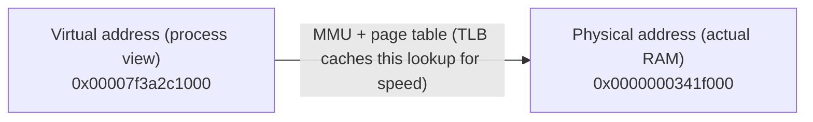
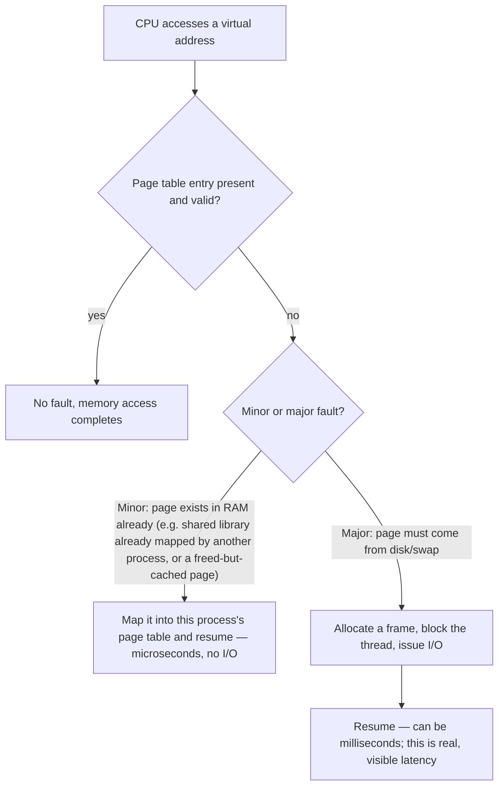
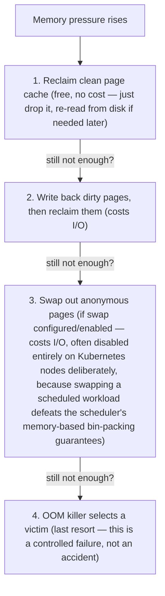
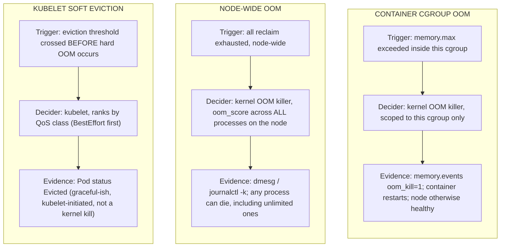

# Chapter 2 — Virtual memory, page cache, swap and OOM
*(original text preserved in full; ➕ marks additions)*

**Learning outcome:** Trace allocation from virtual address space through pages, reclaim and cgroup limits; distinguish node OOM from container OOM.

## 2.1 Virtual memory
Each process sees a virtual address space. The kernel maps virtual pages to physical memory and may map files into memory. This abstraction enables isolation, shared libraries, memory-mapped files and efficient paging. RSS approximates resident physical pages for a process, but system memory accounting also includes page cache, kernel memory and shared pages.
```bash
cat /proc/<PID>/status | egrep 'VmRSS|VmSize|RssAnon|RssFile'
cat /proc/<PID>/smaps_rollup
pmap -x <PID> | tail -20
```

➕ **Address translation, the mechanism behind every number above:**

`VmSize` = total virtual space reserved (can be huge — 64-bit processes routinely reserve terabytes they never touch; this number alone means almost nothing). `VmRSS` = actually resident pages. `RssAnon` = anonymous memory (heap/stack — this is "your" memory). `RssFile` = mapped file pages (often page cache — shared, reclaimable, not really "yours" to worry about).

➕ **Sample output and the read:**
```bash
$ cat /proc/8842/status | egrep 'VmRSS|VmSize|RssAnon|RssFile'
VmSize: 8421604 kB ← 8GB reserved — means little alone
VmRSS: 412300 kB ← 412MB actually resident
RssAnon: 380120 kB ← ~380MB is real heap/stack usage
RssFile: 32180 kB ← ~32MB is mapped files (often shared, reclaimable)
```
If asked "why is `VmSize` 20x `VmRSS`" in an interview, the answer is: lazy allocation. `malloc`/`mmap` reserve address space; physical pages are only committed on first touch (demand paging) — that gap is normal, not a leak.

➕ **`smaps_rollup` and `pmap -x`, annotated — the same numbers, broken down by mapping instead of summarized:**
```text
$ cat /proc/8842/smaps_rollup
Rss:              412300 kB
Pss:              398120 kB
Shared_Clean:      12800 kB
Private_Dirty:    380120 kB

$ pmap -x 8842 | tail -3
Address           Kbytes     RSS   Dirty Mode  Mapping
00007f2c40000000 8388608  412300  380120 rw---   [ anon ]
total kB          8421604  412300  380120
```
`Pss` (proportional set size) is the number to trust when a mapping is *shared* between processes — it divides shared pages by however many processes are mapping them, so summing `Pss` across processes gives an honest total instead of double-counting shared library pages that `RSS` alone would count once per process. `pmap -x` shows the same total broken out by individual mapping, which matters when a process has many mappings and you need to know *which one* is holding the memory, not just the aggregate.

➕ **Diagram: what happens on first touch (the page-fault decision path)**

`pidstat -r` reports both `minflt/s` and `majflt/s` separately — a process with rising `majflt/s` is generating real disk/swap I/O on every fault, not just doing cheap bookkeeping, which is the distinction that turns "memory looks fine" into "memory is the bottleneck."

## 2.2 Page cache and "free memory"
Linux uses unused RAM as filesystem cache because cached data can avoid slower storage I/O. Cached pages are often reclaimable. This is why MemAvailable is usually more useful than the raw free column when asking whether the system has room for new allocations.


Figure 2. Reclaim and swap can occur before the OOM path is forced to select a victim.

```bash
free -h
grep -E 'MemAvailable|Cached|Buffers|Swap|Dirty|Writeback' /proc/meminfo
vmstat 1 # si/so reveal swap-in/out activity
```

➕ **Sample `free -h` and the exact trap it sets:**
```
$ free -h
              total    used    free    shared  buff/cache   available
Mem:           64Gi    18Gi   2.1Gi     1.2Gi        44Gi        45Gi
Swap:         8.0Gi      0B    8.0Gi
```
A dashboard alerting on `used`+`buff/cache` (i.e. "free" column, 2.1Gi) will page you at 3am for a box that's genuinely fine — `available` (45Gi) is the number that accounts for reclaimability and is what the kernel itself would report as usable. **This single misconfigured alert is one of the most common false-positive memory pages in production, and naming it unprompted is a strong interview signal.**

➕ **`/proc/meminfo` and `vmstat`'s `si`/`so`, annotated:**
```text
$ grep -E 'MemAvailable|Cached|Buffers|Swap|Dirty|Writeback' /proc/meminfo
MemAvailable:   47185920 kB
Cached:         44021312 kB
Buffers:          892160 kB
SwapTotal:       8388604 kB
SwapFree:        8388604 kB
Dirty:              4120 kB
Writeback:              0 kB

$ vmstat 1 3
procs -----------memory---------- ---swap-- -----io----
 r  b   swpd   free   buff  cache   si   so    bi    bo
 2  0      0 2201312  892160 44021312   0    0    12   140
```
`SwapFree` equal to `SwapTotal` confirms swap is configured but genuinely unused right now. `si`/`so` (swap in/out) both at `0` is the number to actually watch over time — any sustained nonzero value here means the kernel is actively moving pages to/from disk under memory pressure, which is a much more direct signal than watching `free` climb or fall. `Dirty` (queued to be written) staying small and `Writeback` (currently being written) near zero means the writeback path isn't backed up.

➕ **Reclaim order, precisely (this is what Figure 2 above is illustrating — worth stating in words too):**

**Interview-ready line:** "Kubernetes nodes typically run with swap disabled specifically because swap would let a Pod exceed its accounted memory while still functioning — degrading unpredictably rather than being evicted predictably. That's a deliberate architecture tradeoff, not an oversight."

## 2.3 OOM at different boundaries
Node-wide OOM means the kernel cannot satisfy allocations after reclaim strategies. A memory-cgroup OOM means a workload crossed its cgroup boundary even if the node still has memory. Kubernetes can also evict Pods under node memory pressure. These are related but distinct failure paths with different remediation.
```bash
dmesg -T | grep -i -E 'oom|killed process'
journalctl -k --since '-30 min' | grep -i oom
cat /sys/fs/cgroup/memory.current
cat /sys/fs/cgroup/memory.max
cat /sys/fs/cgroup/memory.events
```

➕ **`dmesg`, `journalctl -k`, and the raw `memory.current`/`memory.max`, annotated:**
```text
$ dmesg -T | grep -i -E 'oom|killed process'
[Wed Jul 30 02:14:11 2026] Out of memory: Killed process 9001 (java) total-vm:12GB, anon-rss:7GB

$ journalctl -k --since '-30 min' | grep -i oom
Jul 30 02:14:11 host kernel: oom-kill:constraint=CONSTRAINT_NONE,nodemask=(null)

$ cat /sys/fs/cgroup/mycontainer/memory.current
2136745984
$ cat /sys/fs/cgroup/mycontainer/memory.max
2147483648
```
`dmesg -T` (`-T` converts the kernel's raw uptime-relative timestamps into human-readable dates) and `journalctl -k` are checking the same kernel ring buffer through two different tools — useful when one has already rotated the entries the other still has. A node-wide OOM entry naming a specific victim process (`Killed process 9001 (java)`) is definitive proof of a *node-wide* kill, distinct from the cgroup-scoped `oom_kill` counter below. `memory.current` (2136745984 bytes ≈ 2.0GiB) sitting just under `memory.max` (2147483648 bytes = exactly 2GiB) is a container about to hit its limit, before it actually does — worth checking proactively, not just after the fact.

➕ **Three distinct memory-death paths — table worth memorizing verbatim for interview speed:**
| Failure | Trigger | Where you see it | Who decides the victim |
|---|---|---|---|
| Container cgroup OOM | container exceeds its `memory.max` | `OOMKilled` status, container restarts, node otherwise healthy | kernel OOM killer, scoped to that cgroup only |
| Node-wide OOM | node genuinely exhausted after all reclaim | `dmesg`/kernel log, can kill *any* process including ones with no limits | kernel OOM killer, `oom_score_adj` across the whole node |
| Kubelet soft eviction | node crosses eviction thresholds (`memory.available<...`) *before* hard OOM | Pod `Evicted` status, graceful-ish, kubelet-initiated | kubelet, using QoS class ranking (BestEffort evicted first) |

➕ **Sample `memory.events` and the field that actually proves cgroup OOM occurred:**
```bash
$ cat /sys/fs/cgroup/kubepods/.../memory.events
low 0
high 0
max 14 ← hit memory.max 14 times — throttled/reclaimed under pressure, didn't die yet
oom 1 ← this is the smoking gun: cgroup OOM killer fired once
oom_kill 1 ← and it actually killed a process (not just invoked, but a kill happened)
```
`max` counting up without `oom_kill` incrementing means the workload is being pressured (reclaimed hard) but hasn't died — a leading indicator worth alerting on *before* the actual kill, if you want early warning instead of a postmortem.

➕ **`oom_score_adj` — why *this* process dies and not that one, precisely:**
```bash
cat /proc/<pid>/oom_score_adj    # -1000 (never kill) to +1000 (kill first)
cat /proc/<pid>/oom_score         # computed score combining adj + memory usage
```
```text
$ cat /proc/8842/oom_score_adj
-997
$ cat /proc/8842/oom_score
1
```
`-997` is close to the protected end of the scale — this is what a Kubernetes `Guaranteed`-QoS pod's process typically gets. A `BestEffort` pod's process would show something close to `+1000` instead, and its computed `oom_score` would run far higher under the same memory pressure, which is why it dies first even if it isn't using the most memory in absolute terms.

Kubernetes sets `oom_score_adj` per QoS class: Guaranteed pods get the most negative (protected) adjustment, BestEffort the least — so under node pressure, BestEffort pods die first by design, regardless of which one happens to be using the most memory at that instant. Knowing this cold answers "why did pod X die and not pod Y" without needing to look at anything else first.

➕ **Diagram: the three memory-death boundaries, side by side**

Same underlying word ("OOM") wearing three different, non-interchangeable mechanisms — the first question in any OOM incident is always "which column is this."

## Worked scenario
**Situation:** A Pod shows OOMKilled, but the node dashboard reports 40% memory available.

1. Read Pod/container limits and events; do not assume node exhaustion.
2. Check the container cgroup memory.max/current/events or runtime/Kubernetes evidence for a cgroup OOM.
3. Inspect process working set and growth. Determine whether the application legitimately needs a larger limit or has a leak/burst.
4. Check whether sidecars share the Pod/node memory picture and whether page cache or tmpfs behavior contributes.
5. Change limits only after understanding expected peak working set and node packing implications.

**Conclusion:** The exhausted boundary is the container cgroup, not necessarily the node.

➕ **Second worked scenario — GPU/AI-tied, the one this JD actually cares about:**
> **Situation:** A training job's pod is `Running`, not `OOMKilled`, not restarting. `nvidia-smi` on the node shows the GPU process crashed with `CUDA error: out of memory`. Host RAM is at 30% used; the pod's memory cgroup shows no `oom_kill` events at all.
> 1. First move: confirm this is *not* the Chapter 2 story at all — `memory.events` shows zero OOM kills, cgroup memory is fine. This immediately rules out everything in this chapter.
> 2. GPU memory (HBM) is a **completely separate resource**, not tracked by Linux cgroups, `free`, or `/proc/meminfo` at all — accounted only via `nvidia-smi`/NVML/DCGM.
> 3. Root cause is almost always: multiple processes sharing one GPU without MIG/time-slicing isolation, a batch size too large for available HBM, or memory fragmentation from repeated allocate/free cycles (framework-level, e.g. PyTorch's caching allocator holding fragmented blocks).
> 4. This is a genuinely important thing to say explicitly to an interviewer: **"host memory tooling (cgroups, free, OOM killer) has zero visibility into GPU memory — you need `nvidia-smi`/DCGM as a completely separate observability plane, and conflating the two is a common early-career mistake."** This single sentence directly answers the JD's "AI infrastructure depth" bar in a way most Linux-only candidates won't think to say.

## Practice
1. Compare VmSize and VmRSS for a process and explain why they differ.
2. Trigger a bounded memory allocation in a container lab and inspect cgroup memory.events.
3. Explain why dropping page cache is not a normal production "memory fix."

➕ 4. Write a one-line script that alerts when `memory.events`' `max` counter is climbing but `oom_kill` is still zero — this is the "leading indicator before the postmortem" signal from above:
```bash
watch -n5 'cat /sys/fs/cgroup/kubepods*/*/memory.events 2>/dev/null | grep -E "max|oom" '
```
➕ 5. On a node with an idle GPU, run two unrelated CUDA processes that together exceed GPU HBM and observe that the *host* OOM tooling (`dmesg`, `memory.events`) shows nothing at all while `nvidia-smi` shows the failure — do this once so the "two separate memory planes" point in the second worked scenario is muscle memory, not just something you read.
