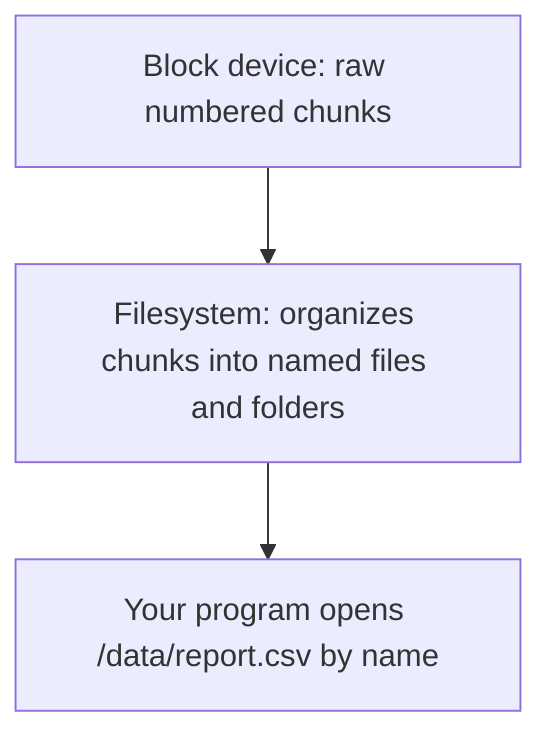
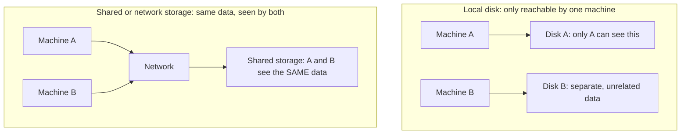
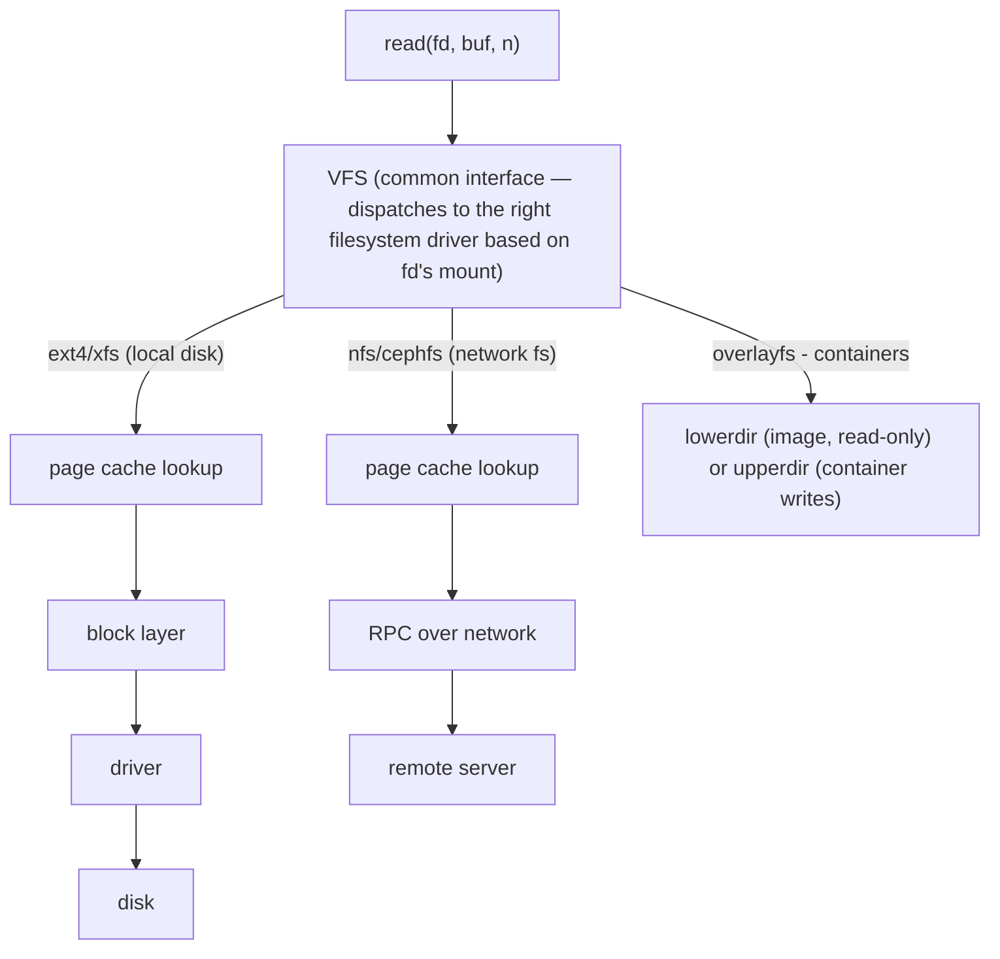
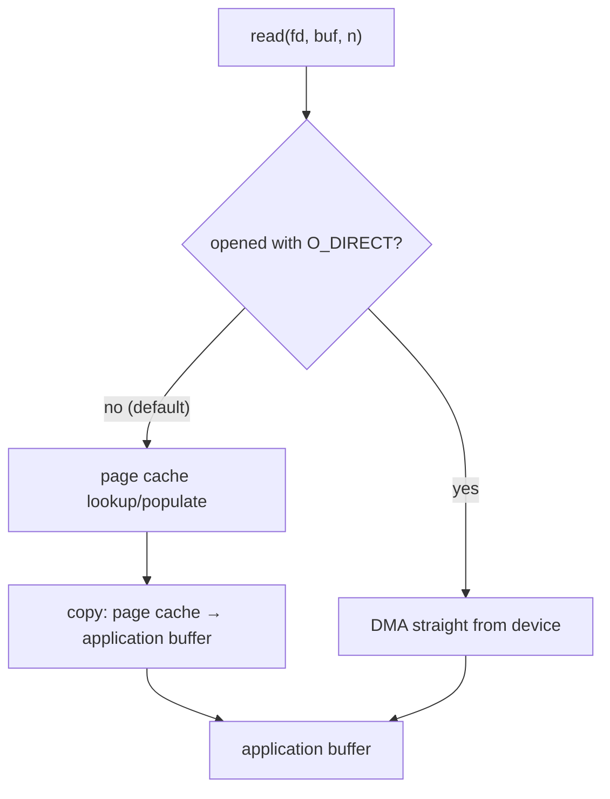
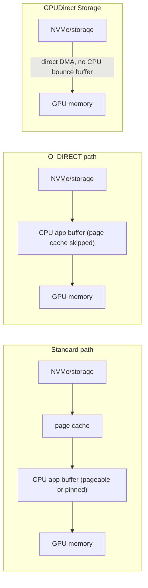
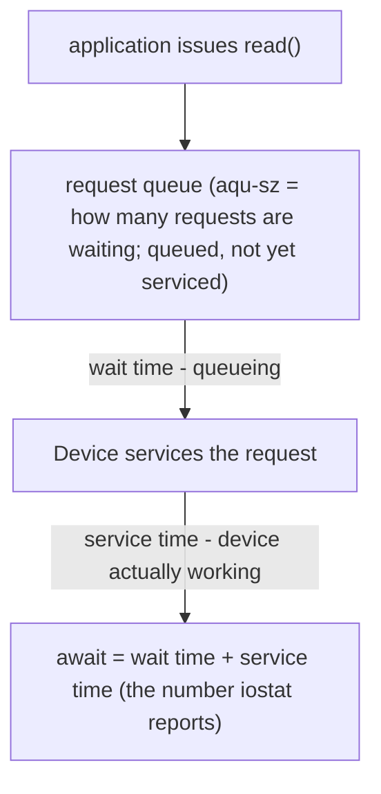
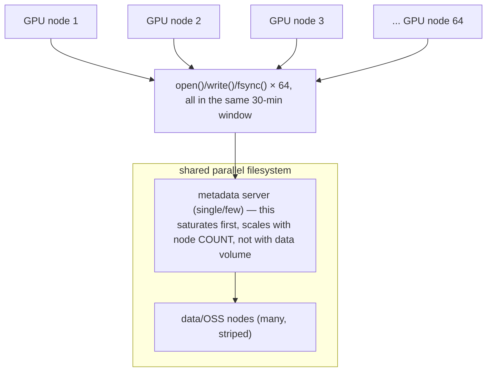

## Foundations: start here if this is new to you

This section will not make you a storage engineer, and it will not teach you how to tune a parallel filesystem — the rest of this chapter and Volume 6's storage-for-AI chapter do that, assuming you already know what a filesystem, a mount, and a block device are. This section's only job is to make sure "the disk is full" and "the mount is missing" stop sounding like the same problem, and that when Volume 6 says a training job stalled because "shared storage couldn't keep up," you already know what "shared" is being contrasted against. If you finish this section able to explain why a path on disk might secretly depend on a remote server, you're ready to go deeper into the rest of this chapter and into Volume 6.

### The problem storage exists to solve

A running program keeps its working data in memory (RAM), but memory is erased the moment the machine loses power or the program exits. Anything that needs to survive past that moment — a saved file, a database, a multi-hour training checkpoint — has to live somewhere that persists. That "somewhere" is storage: physical media (a disk, an SSD, a network-attached system) plus the software that organizes data on it so programs can find it again by name instead of by raw physical location.

### What a block device actually is

A **block device** (a storage device that reads and writes data in fixed-size chunks called blocks, rather than one byte at a time) is the raw layer underneath almost everything else in this chapter. Think of it as a giant numbered set of storage bins — block 0, block 1, block 2, and so on — with no concept yet of "files" or "folders." A physical disk or SSD is a block device. So, importantly, is a virtual disk handed to a cloud VM, and so is a remote volume attached over a network — the program using it can't necessarily tell the difference from the block-device interface alone.

**Check your understanding**
- Q: Does a block device know what a "file" is? A: No — a block device is just addressable, fixed-size storage chunks. The concept of files and folders is added by a layer above it (the filesystem), not by the block device itself.

### What a filesystem actually is

A **filesystem** (the software layer that organizes raw blocks into named files and folders, and tracks which blocks belong to which file) is what turns a block device's anonymous numbered bins into something you can navigate with names — `/home/user/report.csv`, `/var/log/syslog`, and so on. Different filesystems (ext4, XFS, and many others) make different trade-offs about how they track this, but the job is the same: keep a map from "this file's name and path" to "these specific blocks on the device," and keep that map correct even after crashes, power loss, and years of files being created and deleted.



**Check your understanding**
- Q: If a filesystem's internal map from names to blocks got corrupted, but the underlying block device itself was perfectly healthy, what would you expect to see? A: Files that seem to be missing, unreadable, or scrambled — even though the physical storage hardware has nothing wrong with it. This is exactly why "the disk is fine" (hardware) and "the filesystem is fine" (the organization on top of it) are two different claims.

### What a mount actually is

A **mount** (the act of attaching a filesystem to a specific point in your directory tree, so that navigating into that directory actually reaches that filesystem's data) is the answer to a question you may not have realized was a question: why does `/` show you one set of files, but `/mnt/backup` might actually be a completely different disk, and `/data/shared` might not be on this machine's disk at all? Every one of those directories could be its own separately mounted filesystem, invisibly stitched into one directory tree. Walking into a directory doesn't tell you, by itself, whether you just stayed on the local disk or silently crossed onto different physical storage — possibly storage on a completely different machine, reached over the network.

**Evidence, not proof, applied here:** running `cd /data/shared` and successfully listing files there does NOT prove that path is on local, fast storage. It only proves the mount is currently working and reachable. It does not tell you whether that path is a local SSD, a remote filesystem shared by many machines, or something in between — and those have very different performance and failure characteristics. You'd need to check what's actually mounted there (a command like `findmnt` or `mount` shows you) before you could make any claim about its speed or reliability.

**Check your understanding**
- Q: You successfully save a file to `/data/shared/output.txt`. Does that prove the file is safe if this machine catches fire? A: No — it only proves the write succeeded from this machine's point of view. Whether the data survives this machine's destruction depends entirely on whether `/data/shared` is actually local disk (in which case: no) or a remote/shared filesystem living on separate hardware (in which case: possibly yes) — a detail the successful write itself doesn't reveal.

### Local disk versus shared/network storage: the distinction that matters most

This is one of the most important ideas in this chapter, and it's the one Volume 6 spends real time on for AI workloads specifically.

**Local storage** (a disk physically attached to one machine) is fast to reach — no network hop — but it belongs to exactly that machine. If that machine is destroyed, reassigned, or simply restarted as a fresh instance, whatever was only on its local disk can be gone. It's also only reachable by programs running on that one machine.

**Shared or network storage** (storage reachable over a network from more than one machine, appearing at a mount point as if it were local) survives the loss of any one machine that uses it, and lets multiple machines see the same data — which matters enormously the moment you have more than one machine that needs to read the same dataset or write to the same location. The trade-off is that every read and write now depends on the network being up and fast enough, and on a remote server (or a cluster of them) being healthy.



Why this matters for AI/HPC specifically, previewed here so Volume 6 doesn't feel like new vocabulary: a training job spread across many machines usually needs every machine to read the same dataset and, especially, needs checkpoints (periodic saves of a model's progress) to land somewhere that survives any single machine failing — which is exactly the shared-storage case, with exactly the network-dependency trade-off just described.

**Check your understanding**
- Q: A training job saves its checkpoint to local disk on the machine doing the training. What's the risk, in plain terms? A: If that specific machine is lost, reassigned, or restarted from scratch, the checkpoint can be lost with it — nothing else in the cluster had access to that local disk in the first place.
- Q: Why does shared storage's dependence on the network matter more as you add more machines? A: Because every one of those machines is now issuing reads/writes over the same network path to the same remote storage; more simultaneous demand on a shared, network-reachable resource means it can become a bottleneck in a way one machine's private local disk never could.

### "The disk is full" can mean several different things

This is a deliberately practical section, because the phrase hides real ambiguity that trips people up in exactly the evidence-vs-proof way this primer keeps warning about. When a program fails with something like "no space left on device," that single symptom can mean:

- The filesystem's actual data blocks are full (the everyday meaning).
- The filesystem's **inodes** are exhausted — an inode is a small metadata record a filesystem creates for every single file or folder to track its ownership, permissions, and block locations; it's possible to run out of these while plenty of raw byte-capacity remains, if a workload creates an enormous number of tiny files.
- The specific mount point you're writing to is actually read-only (perhaps deliberately, perhaps because of an earlier failure), which produces a similar-sounding write error.
- A quota (an administratively imposed limit smaller than the physical capacity) has been hit, even though the underlying device has room.
- The path you think you're writing to isn't actually mounted where you expect — you're writing to a small local directory instead of the large shared mount you intended, because the mount silently isn't there.

**What a single "disk full" error proves:** a write failed. **What it does not prove:** which of the five causes above is responsible — that requires separate, specific checks (capacity, inode count, mount read/write mode, quota, and confirming what's actually mounted where) before you can claim to know the real cause.

**Check your understanding**
- Q: Why might a directory with only a few megabytes of total file content still trigger a "no space left on device" error? A: If the workload created an enormous number of very small files, it can exhaust the filesystem's inode count (the metadata slots for tracking files) well before it exhausts raw byte capacity — the error looks identical to a true capacity problem but has a completely different cause and fix.

### Glossary

- **Block device** — a storage device that reads/writes in fixed-size chunks, with no built-in concept of files or folders.
- **Filesystem** — the software layer that organizes a block device's chunks into named files and folders.
- **Mount** — attaching a filesystem to a specific point in the directory tree, so navigating there reaches that filesystem's data.
- **Local storage** — a disk physically attached to, and only reachable by, one machine.
- **Shared/network storage** — storage reachable over a network from more than one machine, appearing as if local at its mount point.
- **Inode** — a filesystem's metadata record for one file or folder (ownership, permissions, block locations); a separate, exhaustible resource from raw byte capacity.
- **Quota** — an administratively imposed storage limit smaller than the device's physical capacity.
- **`O_DIRECT`** — an `open()` flag that bypasses the page cache, DMA'ing data straight to/from the application's own (block-size-aligned) buffer.
- **GPUDirect Storage (GDS)** — NVIDIA's extension of the same bypass concept from storage straight to GPU memory, skipping the CPU bounce buffer entirely.

### Before you go deeper, make sure you can...

- Explain the difference between a block device and a filesystem, in your own words.
- Explain why successfully reading or writing a path does not, by itself, prove where that data actually lives.
- Explain the local-versus-shared storage trade-off, and why AI training jobs across multiple machines usually need the shared side of it despite the network dependency it creates.
- List at least three genuinely different causes of a "disk full" style error, and say what you'd check to tell them apart.

With that model in place, here's the full mechanism.

# Chapter 3 — Files, file descriptors, filesystems and block I/O
*(original text preserved in full; ➕ marks additions)*

**Learning outcome:** Understand how applications reach storage and distinguish capacity, metadata, throughput, IOPS and latency failures.

## 3.1 File descriptors and VFS
A process accesses files, sockets, pipes and many kernel objects through integer file descriptors. The VFS gives applications a common filesystem interface while specific filesystems implement semantics underneath. "Too many open files" is therefore a resource-limit/fd-leak problem, not a disk-capacity problem.
```bash
ls -l /proc/<PID>/fd | head
lsof -p <PID> | head
cat /proc/<PID>/limits | grep -i 'open files'
ss -s
```

➕ **The read path, precisely (VFS as a dispatch layer, not a filesystem itself):**

This is why the exact same `read()` syscall can be fast (local NVMe, cache hit) or catastrophically slow (NFS server under load) with identical application code — the bottleneck is never visible from the syscall itself, only from what's underneath the VFS dispatch.

➕ **Sample `lsof`/fd output and what actually leaks in production:**
```bash
$ ls -l /proc/8842/fd | head -6
lrwx------ 1 app app 64 Jul 30 10:00 3 -> /dev/nvidia0
lrwx------ 1 app app 64 Jul 30 10:00 4 -> socket:[884213]
l-wx------ 1 app app 64 Jul 30 10:00 5 -> /var/log/app.log (deleted) ← classic leak signature
lrwx------ 1 app app 64 Jul 30 10:00 6 -> /data/model-shard-0042.bin
```
The `(deleted)` marker is the single most common real-world fd leak: a log rotation tool `unlink()`s the file, but the process still holds the fd open — disk usage doesn't drop (`du` won't show it, the inode is still allocated) even though `ls` shows the file gone. **`df` and `du` disagreeing after a log rotation is this exact bug, every time — check `lsof +L1` before anything else.**

➕ **`lsof -p`, `/proc/&lt;PID&gt;/limits`, and `ss -s`, annotated:**
```text
$ lsof -p 8842 | head -4
COMMAND  PID USER   FD   TYPE DEVICE SIZE/OFF   NODE NAME
python3 8842 app  cwd    DIR  259,1     4096 131074 /data
python3 8842 app    3r   REG  259,1 87654321 200481 /data/dataset.tar

$ cat /proc/8842/limits | grep -i 'open files'
Max open files            1024                 4096                 files

$ ss -s
Total: 812 (kernel 0)
TCP:   634 (estab 210, closed 380, orphaned 0, timewait 372)
```
`lsof -p` lists every open file/socket for one process — the per-process view that complements `ls -l /proc/&lt;PID&gt;/fd`, but with more detail per entry (size, offset, device). `/proc/&lt;PID&gt;/limits`' "Max open files" shows two numbers: the soft limit (1024, what actually blocks a new `open()` call right now) and the hard limit (4096, the ceiling the process could raise itself up to) — a process failing with "too many open files" at 1000 open fds is hitting the *soft* limit, not genuinely out of room. `ss -s` gives the system-wide socket count in one line — useful to confirm whether an fd exhaustion is one runaway process or a system-wide condition before chasing a single PID.

➕ **`O_DIRECT`: bypassing the page cache, and why GPU data pipelines care**

Every read/write path in the diagram above — local ext4/xfs, network nfs/cephfs, even overlayfs — routes through **page cache lookup** first. That's the right default: the kernel keeps recently-used file data in RAM so a second read of the same block is a memory copy, not a device round-trip. But it has a cost the diagram doesn't show: on a normal `read()`, the kernel first DMAs the data from the device into a page-cache page it owns, then **copies** that page into your application's buffer — two copies, one extra buffer, and a page cache that keeps growing with data you may never re-read (a multi-terabyte training shard streamed once, then never again, still evicts other useful pages on its way through).

`O_DIRECT` (an `open()` flag) tells the kernel to skip the page cache entirely: the device DMAs data straight into (or out of) the application's own buffer. No kernel-owned intermediate copy, no cache pollution from a one-pass streaming read, no double-buffering.



Why this matters for GPU data pipelines specifically: a data-loader process streaming multi-GB training shards, or a checkpoint writer flushing a multi-GB model state, typically reads/writes each byte range **exactly once**. Routing that through the page cache buys you a cache that will never be hit again, at the cost of an extra copy and memory pressure that can evict pages other processes actually need. `O_DIRECT` removes both costs for this specific, common AI-infra access pattern — it is not a general-purpose speedup, it is the correct tool for "I am not going to re-read this."

➕ **The alignment requirement — and the exact failure mode**

`O_DIRECT` isn't free of rules: because the DMA engine writes straight into your buffer with no kernel copy to paper over mismatches, the buffer address, the file offset, and the transfer length must all be aligned to the device's logical block size (usually 512 bytes, often 4096 on modern NVMe). Miss any one of the three and the kernel refuses the I/O.

```c
#include <fcntl.h>
#include <stdlib.h>
#include <unistd.h>

int fd = open("/data/checkpoints/shard-0042.bin", O_RDONLY | O_DIRECT);

char *buf = malloc(4096);        /* ordinary heap allocation — NOT block-aligned */
ssize_t n = read(fd, buf, 4096); /* fails: EINVAL — buf isn't aligned to the block size */

void *aligned;
posix_memalign(&aligned, 4096, 4096);   /* 4096-byte-aligned address, required for O_DIRECT */
n = read(fd, aligned, 4096);            /* offset 0 and length 4096 are also block-aligned: succeeds */
```

```text
$ strace -e trace=open,read ./direct_read_bad
openat(AT_FDCWD, "/data/checkpoints/shard-0042.bin", O_RDONLY|O_DIRECT) = 3
read(3, 0x55d1a2b3c010, 4096)          = -1 EINVAL (Invalid argument)
```
`EINVAL` here is the single most common `O_DIRECT` bug in the field: a plain `malloc()`'d buffer, a file offset that isn't a block-size multiple (e.g. seeking to an odd byte count before an `O_DIRECT` read), or a transfer length that isn't a block-size multiple, all produce the identical `EINVAL` with no further detail — the kernel doesn't tell you which of the three constraints you violated. `posix_memalign()` (or `aligned_alloc()`) is the fix for the buffer; the offset and length constraints are on the caller to enforce explicitly, which is why most production code doesn't call `O_DIRECT` by hand and instead goes through a library (or, for GPU transfers specifically, GDS — next) that already gets the alignment right.

➕ **GPUDirect Storage (GDS): the same bypass, extended past the CPU entirely**

`O_DIRECT` removes the page-cache copy but the data still lands in a CPU-side application buffer — from there, a normal `cudaMemcpy` still has to copy it again from host memory into GPU memory (and if that host buffer is pageable rather than pinned, Volume 1's Deep Dive 2 covers the *additional* staging copy that adds). **GPUDirect Storage** is NVIDIA's extension of the identical bypass concept one hop further: instead of `storage → page cache → app buffer → GPU memory`, GDS sets up a direct DMA path `storage → GPU memory`, skipping the CPU bounce buffer altogether.



Same underlying idea across all three rows — every kernel-owned or CPU-owned intermediate copy is a tax paid on data that's only going to be read (or written) once — GDS is just the version of that idea that runs all the way to the GPU. This is why NVIDIA's own storage-for-AI stack (cuFile API, and the filesystems/backends that support it — a subset of local NVMe and specific network filesystems, not universal) exists as a distinct thing from "just use `O_DIRECT`": `O_DIRECT` alone still leaves a CPU-memory hop in the path that GDS is specifically designed to remove for GPU-bound data.

**Check your understanding**
- Q: A one-pass streaming read of a 50GB training shard, versus a config file re-read on every request — which one is the better `O_DIRECT` candidate, and why? A: The 50GB shard — it's read exactly once, so caching it buys nothing and only costs memory pressure and an extra copy; the config file is re-read repeatedly, so the page cache is doing exactly its job (serving repeat reads from RAM) and `O_DIRECT` would make it slower by forcing a device round-trip every time.
- Q: An `O_DIRECT` read fails with `EINVAL` and the buffer was allocated with `posix_memalign` at the correct alignment. What else should you check? A: The file offset and the transfer length — both must independently be multiples of the device's block size; a correctly-aligned buffer with a misaligned offset or length still fails with the same `EINVAL`.

## 3.2 Capacity versus latency
| Question | Evidence |
|---|---|
| Is filesystem capacity full? | `df -hT` |
| Are inodes exhausted? | `df -ih` |
| Which directory owns space? | `du -xhd1` |
| Is device latency/queue high? | `iostat -xz 1` |
| Which process is issuing I/O? | `pidstat -d 1` / `iotop` |
| Are mounts/network filesystems involved? | `findmnt` / `mount` / storage metrics |

Throughput is data per unit time; IOPS is operations per second; latency is time per operation. A workload can have low throughput but still suffer high latency if it performs small synchronous I/O. Benchmark and diagnose against the application access pattern.

➕ **The rest of the evidence table, annotated:**
```text
$ df -hT /data
Filesystem      Type  Size  Used Avail Use% Mounted on
/dev/nvme0n1p1  ext4  3.5T  2.1T  1.3T  63% /data

$ df -ih /data
Filesystem      Inodes IUsed IFree IUse% Mounted on
/dev/nvme0n1p1    224M   41M  183M   19% /data

$ du -xhd1 /data
1.8T    /data/checkpoints
280G    /data/datasets
21G     /data/logs

$ pidstat -d 1 1
UID       PID   kB_rd/s   kB_wr/s  kB_ccwr/s  Command
1000     8842    120.00  81234.00       0.00  python3

$ findmnt /data
TARGET SOURCE          FSTYPE OPTIONS
/data  /dev/nvme0n1p1  ext4   rw,relatime
```
`df -hT` adds the filesystem type to the usual capacity view — worth checking when a mount's behavior seems off (an `nfs`/`cephfs` type where you expected `ext4` explains a lot by itself). `du -xhd1` (`-x` stays on one filesystem, `-d1` limits depth to one level) is how you find which *subdirectory* owns the space `df` reports as used, without a full recursive walk. `pidstat -d` is the per-process I/O throughput view — pairs with `iostat -xz`'s device-level view below to answer "which process" versus "how busy is the device."

➕ **Sample `iostat -xz 1` output, read the way an interviewer wants:**
```
Device   r/s   w/s   rkB/s   wkB/s  await  aqu-sz  %util
nvme0n1  42.0  980.0 5376.0  62720  8.20   4.10    97.5
```
`%util=97.5` alone doesn't tell you if this is a problem — pair it with `await` (8.2ms is high for NVMe, which should be sub-millisecond) and `aqu-sz` (4.1 = queue is backed up, not draining as fast as requests arrive). **The one-sentence version:** high `%util` with low `await` = genuinely busy doing useful work (probably fine); high `await` with moderate `%util` = queueing/contention problem (investigate noisy neighbors or backend latency), which is the pattern in the worked scenario below.

➕ **Diagram: where a request actually spends its time (service time vs queue time)**

Two very different problems produce the same rising `await`: a slow device (service time dominates — check `%util`, this is a real capacity limit) versus a backed-up queue on a fast device (wait time dominates — check `aqu-sz`, this is contention from other tenants/processes, not a device limit). `iostat -x` alone conflates both into one number; `aqu-sz` is what separates them.

➕ **IOPS/throughput/latency — three different failure signatures, one table:**
| Symptom | Likely pattern | Fix direction |
|---|---|---|
| High IOPS, low MB/s per op | tiny random I/O (checkpoint shard writes, many small files) | batch writes, larger blocks, fewer/larger objects |
| High MB/s, IOPS unremarkable | sequential large reads (streaming shards) | usually fine — watch NIC saturation instead of disk |
| Latency spikes, averages look normal | queueing/tail latency (`await` climbing, `%util` not pegged) | noisy-neighbor on shared parallel FS, or NFS/CSI backend queueing |

➕ **Inode exhaustion — the specific AI-infra trap:**
```bash
df -h /data      # bytes: might show 60% free
df -i /data      # inodes: might show 100% used — completely separate resource, same ENOSPC error
```
```text
$ df -h /data
Filesystem      Size  Used Avail Use% Mounted on
/dev/nvme0n1p1  3.5T  1.4T  2.1T  40% /data

$ df -i /data
Filesystem       Inodes   IUsed   IFree IUse% Mounted on
/dev/nvme0n1p1  22937600 22937598      2  100% /data
```
`Use%` at 40% says this filesystem has plenty of room. `IUse%` at 100% on the exact same filesystem says the opposite — every one of its 22,937,600 inodes (fixed at `mkfs` time on ext4) is spoken for, and the next `open()` call for a *new* file fails with `ENOSPC`, the identical error a genuinely full disk produces. A checkpoint job writing millions of tiny shard files can exhaust inodes on ext4 (fixed count set at `mkfs` time) while bytes are nowhere near full. xfs allocates inodes dynamically — this becomes a real filesystem-choice architecture decision for checkpoint-heavy training workloads, worth naming unprompted in an SA interview.

## Worked scenario
**Situation:** A database Pod is slow after moving to a new storage class. CPU and memory look normal.

1. Measure application operation latency and correlate with storage timing.
2. Check filesystem capacity/inodes first to eliminate obvious failures.
3. Check device or CSI/backend latency, queue depth and errors rather than only throughput.
4. Compare mount options, volume topology, storage class parameters and zone/path changes.
5. Run a controlled storage benchmark with a pattern similar to the application before concluding the class is inherently slow.

**Conclusion:** Storage diagnosis is workload-pattern + path + latency evidence, not a single MB/s number.

➕ **Second worked scenario — checkpoint storm, the GPU/AI-specific version:**
> **Situation:** 64 GPU nodes all write training checkpoints to the same shared parallel filesystem every 30 minutes. Checkpoint write time has grown from 45s to 8 minutes over the last month as the cluster scaled from 16 to 64 nodes. Per-node disk (`iostat` on each node's local view) looks idle.
> 1. This is a **shared-resource contention** problem, not a per-node storage problem — `iostat` on any single node won't show it because the bottleneck is the shared filesystem's aggregate throughput/metadata server, not local block I/O.
> 2. Check the parallel filesystem's own metrics (metadata server IOPS, aggregate throughput) — 64 nodes hitting `open()`/`close()`/`fsync()` simultaneously multiplies metadata operations far faster than data volume grows linearly.
> 3. Fix directions with explicit tradeoffs: stagger checkpoint writes across nodes (adds complexity, reduces peak contention); write to node-local NVMe first then async-upload to shared storage (adds a failure mode — local disk loss between checkpoint and upload — but removes the synchronous bottleneck); reduce checkpoint frequency or use incremental/sharded checkpoint formats (changes recovery-time tradeoff).
> **This is a real, common NVIDIA-SA-relevant scenario** — "why did checkpointing get slower as we scaled" is a scaling-non-linearity question, and the correct answer starts with "metadata operations, not bytes" almost every time.

➕ **Diagram: checkpoint storm — why per-node metrics stay quiet while the cluster slows down**

Per-node `iostat` stays idle (each node's own I/O is small and fast) while cluster checkpoint time grows from 45s to 8min (the metadata server serializes the fan-in).
The bottleneck is invisible from any single node's vantage point because no single node is doing much I/O — it is the simultaneous *count* of metadata operations converging on one shared service that scales worse than linearly as the cluster grows.

## Practice
1. Explain why df and du can disagree.
2. Find open deleted files in a lab using lsof +L1.
3. Compare sequential throughput and small random I/O using a safe benchmark tool in a test VM.

➕ 4. Run `iostat -xz 1` against both a local NVMe write and an NFS-mounted write of the same size, and compare `await` — do this once so the "same syscall, different backend, wildly different latency" point from the VFS diagram is muscle memory.
➕ 5. Simulate the checkpoint-storm scenario at small scale: have 8 parallel `dd` processes write to the same NFS/shared mount simultaneously and watch `await`/`aqu-sz` climb non-linearly relative to 1 process doing the same total write volume alone.
