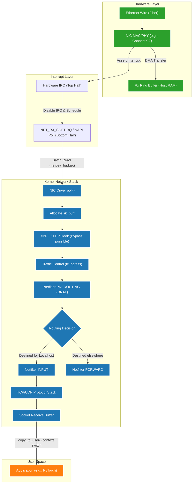
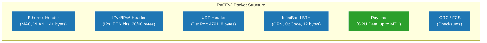
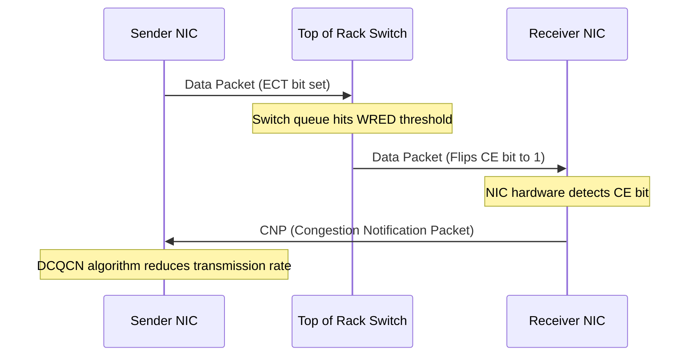

# Linux Networking Masterclass: TCP/IP, RoCEv2, and Fabric Tuning

## Introduction

In the era of Generative AI and massive Deep Learning training runs, the network is no longer a transparent pipe; it is the computer. When training a trillion-parameter model across thousands of GPUs, network latency and bandwidth directly gate the overall cluster utilization and time-to-solution. A stalled network link can idle millions of dollars of compute instantly. 

This masterclass transitions from foundational Linux networking concepts—like sockets, TCP/IP, and basic routing—into the specialized, high-performance networking architectures required for NVIDIA AI Factories. We will explore RoCEv2 (RDMA over Converged Ethernet), MTU 9000 (Jumbo Frames), deep TCP tuning, Netfilter/Conntrack limitations at scale, and advanced troubleshooting techniques used by Senior Site Reliability Engineers (SREs) and Solutions Architects.

This document is designed as a deep, authoritative reference. It covers the precise mechanics of packet flow, the mathematical realities of high-speed tuning, and the specific failure modes seen when pushing Linux to its absolute limits on 400Gbps+ fabrics.

### Prerequisites, Difficulty, and Reading Time
- **Prerequisites:** Strong understanding of the OSI model, deep familiarity with Linux command line (`ip`, `ss`, `tcpdump`, `sysctl`), and general distributed systems architecture.
- **Difficulty:** Advanced (Level 400).
- **Reading Time:** ~120 minutes.

### Measurable Learning Objectives
By the end of this masterclass, you will be able to:
1. Trace the exact, instruction-level path of a packet from the NIC wire, through the Linux kernel ring buffers, NAPI polling, and Netfilter, to user-space memory.
2. Configure, troubleshoot, and optimize advanced IP routing, policy-based routing (PBR), and VRF-isolated networking.
3. Architect and tune TCP settings for massive throughput and microsecond latency, including deeply analyzing congestion control algorithms like BBR, CUBIC, and DCTCP.
4. Explain the exact bit-level mechanics and necessity of RoCEv2, PFC (Priority Flow Control), ECN (Explicit Congestion Notification), and DCQCN in AI fabrics.
5. Diagnose and resolve insidious, scale-induced production issues like Conntrack table exhaustion, SNAT port collisions, asymmetric routing blackholes, and DNS microbursts.
6. Utilize advanced observability tools including `perf`, `bpftrace`, `ethtool` ring statistics, and RDMA `perftest` utilities to pinpoint bottlenecks.
7. Understand and configure Traffic Control (tc), Linux Bridging, VXLAN, and bonding for complex host networking topologies.
8. Validate and troubleshoot InfiniBand and RoCE fabrics using native IB utilities.

---

## 1. The Network Stack Foundation: From Wire to Application

Before discussing AI fabrics and kernel bypass, we must establish how standard Ethernet packets traverse a Linux system. In high-performance environments, the CPU overhead of processing packets via the standard kernel stack becomes a bottleneck. However, the management plane, storage traffic (if not using NVMe-oF/RDMA), and Kubernetes overlay networks still rely entirely on the Linux kernel network stack.

Understanding this flow is not theoretical; it is exactly where packets are dropped when systems fail.

### 1.1 The Packet Journey: Ingress (Rx) Deep Dive

When an Ethernet frame arrives at the physical port of the Network Interface Card (NIC):

1. **Hardware Reception & Validation:** The NIC's PHY receives the analog signal and converts it to digital bits. The MAC controller validates the Frame Check Sequence (FCS) and destination MAC address. Malformed frames are dropped immediately at the hardware level.
2. **DMA to Ring Buffer:** The NIC uses Direct Memory Access (DMA) to copy the packet directly into a pre-allocated region in host RAM called the **Rx Ring Buffer**. The NIC consumes a descriptor from the ring.
3. **Hardware Interrupt (Hard IRQ):** The NIC raises a hardware interrupt to the CPU, signaling that a packet (or batch of packets) has arrived.
4. **NAPI (New API) and Interrupt Coalescing:** Handling a hard interrupt for every single packet on a 100GbE link would instantly livelock the CPU. Linux uses NAPI to transition from interrupt-driven to polling mode under load. 
   - The hard IRQ handler disables further NIC interrupts for that queue.
   - It schedules a software interrupt (`NET_RX_SOFTIRQ`).
5. **SoftIRQ Polling:** The softirq runs (visible as `ksoftirqd` processes or high `si` time in `top`). It polls the Rx Ring via the driver's NAPI `poll()` function, retrieving packets in batches (up to `netdev_budget`, default 300).
6. **SKB Allocation:** For each packet, the kernel allocates an `sk_buff` (Socket Buffer) structure. This is the fundamental data structure for packets in the Linux kernel.
7. **Traffic Control and XDP:** eBPF XDP (eXpress Data Path) programs run here, before the main stack. XDP can drop or redirect packets with minimal overhead. If passed, the packet enters the core stack (`netif_receive_skb`).
8. **Routing and Netfilter (PREROUTING):** The kernel determines if the packet is destined for a local socket or needs forwarding. It traverses the Netfilter `PREROUTING` chain (where DNAT occurs).
9. **Local Delivery (INPUT):** If destined locally, it traverses the `INPUT` chain.
10. **Transport Layer (TCP/UDP):** The packet reaches the TCP or UDP stack. TCP validates sequence numbers, handles acknowledgments, and places the payload into the specific socket's receive buffer.
11. **User-Space Wakeup:** The application, polling via `epoll()` or blocked on `recv()`, is woken up. It executes a system call, causing a context switch, and the CPU copies the payload from the kernel socket buffer into user-space memory.



:::warning NAPI Polling and SoftIRQs
When you see a CPU core completely pegged at 100% `si` (software interrupt) in `top`, it means `ksoftirqd` is overwhelmed trying to pull packets out of the `RxRing`. This is the exact point where the ring buffer overflows and the NIC hardware begins incrementing `rx_missed_errors` and dropping packets *before* they ever reach `tcpdump`.
:::

### 1.2 Receive-Side Scaling (RSS) and Interrupt Affinity

A single CPU core cannot process 100Gbps of traffic. **Receive-Side Scaling (RSS)** is a NIC hardware feature that distributes incoming packets across multiple Rx queues.

The NIC applies a hash function (usually Toeplitz) to the packet's 4-tuple (Source IP, Destination IP, Source Port, Destination Port). Packets belonging to the same flow hash to the same queue, ensuring in-order delivery and cache locality.

Each queue has its own interrupt. For RSS to work, these interrupts must be handled by different CPU cores. This is managed by **IRQ Affinity**.

```bash
# View interrupts for a Mellanox NIC (mlx5)
cat /proc/interrupts | grep mlx5_comp

# View which CPU is currently handling an interrupt (e.g., IRQ 123)
cat /proc/irq/123/smp_affinity_list
```

The `irqbalance` daemon dynamically moves interrupts to balance load, but in strict real-time or ultra-low-latency environments, engineers disable `irqbalance` and manually pin interrupts to specific NUMA-aligned cores using `set_irq_affinity.sh` scripts.

### 1.3 Tuning the Rx Path: Ring Buffers and Coalescing

When `ksoftirqd` cannot process packets fast enough, the Rx Ring Buffer fills up. Once full, the NIC has nowhere to DMA the next packet, resulting in hardware drops (`rx_missed_errors`).

```bash
# Check current ring buffer sizes
ethtool -g eth0

# Output excerpt:
# Ring parameters for eth0:
# Pre-set maximums:
# RX:             8192
# TX:             8192
# Current hardware settings:
# RX:             1024
# TX:             1024
```

To absorb microbursts (sudden spikes in traffic that exceed line rate for microseconds), increase the ring size:

```bash
ethtool -G eth0 rx 4096 tx 4096
```

**Interrupt Coalescing:** To further reduce CPU load, you can tell the NIC to wait either a specific time or for a specific number of packets before firing an interrupt.

```bash
# View coalescing settings
ethtool -c eth0

# Tell the NIC to wait for 50 microseconds or 20 frames before firing an IRQ
ethtool -C eth0 rx-usecs 50 rx-frames 20
```
*Trade-off:* Coalescing reduces CPU usage and increases throughput but adds latency. In AI fabrics, we often tune for throughput on storage/data networks, but absolute lowest latency on MPI/NCCL networks (often disabling coalescing entirely if not using RoCE).

### 1.4 Egress (Tx) Path and Offloads

The Tx path is roughly the reverse of Rx, but leverages massive hardware offloads.

1. **User Space to Kernel:** App calls `send()`. Data is copied from user space to kernel socket buffer.
2. **TCP Segmentation:** The kernel must chunk the data into packets that fit the MTU.
3. **Hardware Offloads (TSO):** Instead of the CPU chunking data, **TCP Segmentation Offload (TSO)** allows the CPU to send a massive 64KB chunk to the NIC. The NIC hardware does the segmentation, adds the headers, and computes the checksums. This saves enormous CPU cycles.
4. **Qdisc (Traffic Control):** The packet enters the queuing discipline. This is where pacing (like BBR's `fq`) or shaping happens.
5. **NIC Tx Ring:** The driver places the packet descriptor in the Tx Ring Buffer.
6. **DMA to Wire:** The NIC DMAs the payload from RAM and puts it on the wire.

```bash
# Check hardware offloads
ethtool -k eth0 | grep tcp-segmentation-offload

# Enable TSO
ethtool -K eth0 tso on
```

---

## 2. IP Routing and Forwarding Deep Dive

Routing in Linux goes far beyond simple destination IP lookups. With policy-based routing, VRFs, and software overlays, a Linux node acts as a sophisticated software router.

### 2.1 The Forwarding Information Base (FIB)

The kernel maintains the routing table in an optimized structure called the FIB. 

```bash
ip -4 route show table main

# Output:
# default via 10.0.0.1 dev eth0 proto dhcp metric 100 
# 10.0.0.0/24 dev eth0 proto kernel scope link src 10.0.0.50 
# 192.168.100.0/24 via 10.0.0.2 dev eth0
```

- **Prefix / Mask:** The destination subnet (e.g., `192.168.100.0/24`). Linux uses Longest Prefix Match (LPM). A `/32` route always wins over a `/0`.
- **Next Hop (via):** The gateway IP address. The kernel will use ARP/NDP to find the MAC address of this gateway.
- **Device (dev):** The exit interface.
- **Scope:** 
  - `global`: Multi-hop (gateway required).
  - `link`: Directly connected broadcast domain.
  - `host`: Local loopback.
- **Metric:** Lower metric wins when prefixes match exactly.

### 2.2 Policy-Based Routing (PBR)

Standard routing is destination-based. Policy-Based Routing (PBR) allows routing based on Source IP, Source Port, incoming interface, or fwmarks (firewall marks).

Linux implements this via `ip rule`, which dictates which routing table to look up.

```bash
# View rules
ip rule show
# 0:      from all lookup local
# 32766:  from all lookup main
# 32767:  from all lookup default
```

**Scenario: Asymmetric Routing Fix for Multi-Homed Hosts**
If a server has two interfaces (`eth0`: 10.0.0.5, `eth1`: 192.168.1.5), and a packet arrives on `eth1` from a remote subnet, the server's reply will default to looking at the destination, matching the default route out `eth0`. The router receives a packet originating from 192.168.1.5 on the 10.0.0.x VLAN and drops it as a spoofed packet (urpf failure).

Fix using PBR:
```bash
# Define a new table
echo "200 storage_net" >> /etc/iproute2/rt_tables

# Add default route for the new table
ip route add default via 192.168.1.1 dev eth1 table storage_net

# Force traffic sourced from eth1's IP to use the new table
ip rule add from 192.168.1.5 lookup storage_net priority 1000
```

### 2.3 Virtual Routing and Forwarding (VRF)

VRFs provide complete isolation of routing tables at Layer 3, similar to namespaces but lighter weight. They are crucial for EVPN/BGP setups on Linux leaf switches (like Cumulus Linux) or advanced multi-tenant virtualization nodes.

```bash
# Create a VRF interface
ip link add dev vrf-blue type vrf table 10

# Move a physical interface into the VRF
ip link set dev eth2 master vrf-blue

# Bring them up
ip link set dev vrf-blue up
ip link set dev eth2 up

# View routes specifically in the VRF
ip -vrf vrf-blue route show
```
Traffic on `eth2` is now completely isolated from `eth0` and `eth1`. To run a command inside a VRF, you can use `ip vrf exec vrf-blue ping 8.8.8.8`.

### 2.4 VXLAN and Overlays

In modern data centers, Layer 2 boundaries are often eliminated in favor of a pure Layer 3 leaf-spine underlay. To provide Layer 2 adjacency for virtual machines or Kubernetes pods across the data center, Linux uses **VXLAN (Virtual eXtensible Local Area Network)**.

VXLAN encapsulates Layer 2 Ethernet frames inside Layer 3 UDP packets (default port 4789).

```bash
# Create a VXLAN interface (VNI 100)
ip link add vxlan100 type vxlan id 100 dstport 4789 local 10.0.0.5 nolearning

# Attach it to a bridge
ip link set vxlan100 master br0
```
When a VM on `br0` sends an ARP request, the Linux kernel encapsulates it in UDP, sends it across the IP fabric to the destination host, which decapsulates it and delivers the original L2 frame. This allows seamless IP mobility across racks.

---

## 3. Sockets, TCP Internals, and Tuning at Scale

TCP tuning is mandatory for maximizing bandwidth over High Bandwidth-Delay Product (BDP) networks. The default Linux TCP settings are optimized for 1Gbps WAN connections, not 400Gbps NVMe-oF data center fabrics.

### 3.1 Advanced TCP State Machine Analytics

While basic states (`ESTABLISHED`, `LISTEN`) are well known, debugging network anomalies requires deep knowledge of intermediate states.

- **TIME_WAIT:** After sending the final `ACK` to close a connection, the socket stays in `TIME_WAIT` for 2*MSL (usually 60 seconds). This prevents delayed packets from the old connection from interfering with a new connection reusing the same port.
  - *SRE Issue:* Highly concurrent proxies run out of ephemeral ports because thousands of sockets are stuck in `TIME_WAIT`.
  - *Fix:* Increase local port range: `sysctl -w net.ipv4.ip_local_port_range="1024 65535"`. Use connection pooling.
- **SYN_RECV:** Indicates the host received a `SYN` and sent a `SYN-ACK` but never received the final `ACK`. 
  - *SRE Issue:* If `SYN_RECV` count is massive, the server is under a SYN flood attack, or there is asymmetric packet loss dropping the return `ACK`.
  - *Fix:* Enable SYN cookies: `sysctl -w net.ipv4.tcp_syncookies=1`.
- **CLOSE_WAIT:** The remote end has closed the connection, but the local application has not called `close()`.
  - *SRE Issue:* This is almost always an application bug (resource leak). The socket will sit in `CLOSE_WAIT` forever, exhausting file descriptors.

### 3.2 Congestion Control: BBR vs CUBIC

Congestion control determines how aggressively TCP scales up its transmission rate and how it reacts to congestion.

**CUBIC (Legacy Default):**
- **Loss-based.** It increases the sending window until a packet is dropped.
- When a packet drops, it assumes the network is congested and drastically cuts the window size.
- *Problem:* In modern networks with deep buffers, it causes "bufferbloat" (filling buffers and adding massive latency before dropping). In shallow-buffer AI switches, a single microburst drop causes CUBIC to unnecessarily throttle bandwidth, taking a long time to recover to 100Gbps.

**BBR (Bottleneck Bandwidth and RTT):**
- **Model-based.** Developed by Google. It constantly measures the maximum delivery rate and minimum round-trip time.
- It paces packets to exactly match the bottleneck bandwidth, aiming to keep switch buffers completely empty.
- *Result:* Maximum throughput and minimum latency, even in the presence of minor packet loss. Highly recommended for AI node tuning.

```bash
# Enable BBR (requires fq qdisc)
sysctl -w net.core.default_qdisc=fq
sysctl -w net.ipv4.tcp_congestion_control=bbr
```

### 3.3 Deep Buffer Tuning and BDP Calculations

To saturate a high-speed link, the TCP window must be large enough to keep data "in flight" while waiting for ACKs.

**Bandwidth-Delay Product (BDP):** `Bandwidth (bytes/sec) * RTT (seconds)`

For a 400 Gbps link (50 GB/s) with a 1ms RTT to remote NVMe storage:
`50,000,000,000 bytes/sec * 0.001 sec = 50 MB required buffer`.

The Linux defaults are often a few megabytes. You must increase these drastically.

```bash
# Format: "min default max" in bytes
sysctl -w net.ipv4.tcp_rmem="4096 87380 134217728" # 128MB Max Rx
sysctl -w net.ipv4.tcp_wmem="4096 65536 134217728" # 128MB Max Tx

# Global limits
sysctl -w net.core.rmem_max=134217728
sysctl -w net.core.wmem_max=134217728

# TCP Window Scaling (RFC 1323) must be on (it is by default)
sysctl -w net.ipv4.tcp_window_scaling=1
```

### 3.4 TCP Timestamps and SACK

- **TCP SACK (Selective Acknowledgments):** If packet 1, 2, and 4 arrive, but 3 is dropped, SACK allows the receiver to acknowledge 1, 2, and 4. The sender only retransmits 3, rather than retransmitting 3 and 4. Crucial for high BDP networks. (`net.ipv4.tcp_sack=1`).
- **TCP Timestamps:** Used for accurate RTT measurement and Protection Against Wrapped Sequence Numbers (PAWS) on fast links. (`net.ipv4.tcp_timestamps=1`).

---

## 4. AI Factory Fabric: Ethernet, MTU 9000, and RoCEv2

While optimized TCP is great for storage and management, GPU-to-GPU communication (MPI, NCCL) requires kernel bypass to achieve microsecond latency and zero CPU overhead. Training a massive language model requires synchronous `All-Reduce` operations; if one node's network path takes 100ms instead of 10µs, the entire 1000-GPU cluster stalls waiting for it.

### 4.1 The TCP/IP CPU Bottleneck

At 400Gbps, a CPU core is entirely consumed just processing headers, calculating checksums, and handling interrupts. Furthermore, data must be copied from user-space (GPU RAM) to kernel-space, then to the NIC. This introduces latency jitter and limits maximum throughput.

### 4.2 Remote Direct Memory Access (RDMA)

RDMA allows a NIC to read/write memory directly on a remote host, completely bypassing the remote CPU and OS.

- **Zero-Copy:** Data moves from GPU Memory -> PCIe -> NIC -> Network -> NIC -> PCIe -> GPU Memory. (Often referred to as GPUDirect RDMA).
- **Kernel Bypass:** Applications use `libibverbs` to talk directly to the NIC hardware queues (Queue Pairs).
- **No TCP/IP Stack:** The OS stack is bypassed. `tcpdump` on standard interfaces will *not* capture RDMA payload traffic.

### 4.3 RoCEv2 (RDMA over Converged Ethernet)

InfiniBand is the native L2 fabric for RDMA. RoCEv2 brings RDMA to standard Ethernet fabrics.

RoCEv2 encapsulates InfiniBand transport headers inside standard UDP/IP packets.



:::info UDP Source Port Entropy
Notice the UDP Header in RoCEv2. The Destination Port is fixed at 4791, but the Source Port is dynamically generated based on a hash of the internal InfiniBand Queue Pair Number (QPN). This entropy is critical: it allows the data center's ECMP switches to hash different RoCEv2 flows across multiple physical spines, achieving true load balancing.
:::

Because it uses IP and UDP, RoCEv2 is fully routable across standard spine-leaf topologies using ECMP (Equal-Cost Multi-Path) routing, heavily utilizing UDP source port entropy for load balancing.

### 4.4 MTU 9000 (Jumbo Frames)

MTU is the Maximum Transmission Unit. The standard is 1500 bytes.
At 400Gbps, using 1500-byte frames requires processing ~33 million packets per second.

**Jumbo Frames (MTU 9000)** allow 9000 bytes per packet.
- Reduces packet rate by 6x.
- Crucial for RoCEv2 efficiency, as RDMA NICs chunk data based on the MTU.

```bash
# Set MTU using iproute2
ip link set dev enp1s0f0 mtu 9000
```
*Architecture Warning:* MTU must be identical end-to-end. If a host sends an MTU 9000 packet and a switch port is set to MTU 1500, the switch silently drops the packet.

### 4.5 Lossless Ethernet: PFC and ECN

RDMA relies on a lossless fabric. If Ethernet drops a packet, RoCEv2 relies on Go-Back-N retransmissions (retransmitting the dropped packet and everything after it), which severely degrades performance.

**1. Priority Flow Control (PFC - IEEE 802.1Qbb):**
- Link-level flow control.
- When a switch's receive buffer fills, it sends a PFC "PAUSE" frame to the sender for a specific traffic class (DSCP value, usually DSCP 26 for RoCE).
- The sender stops transmitting for a specified time.
- *Risk:* Can cause "Head-of-Line Blocking" and cascading "PFC Storms" that lock up the entire fabric.

**2. Explicit Congestion Notification (ECN) & DCQCN:**
- End-to-end congestion signaling.



:::tip Tuning ECN vs PFC
Soft throttling without hard pauses is the goal. Modern NVIDIA AI factories tune ECN thresholds on their Spectrum switches to trigger *before* PFC is ever needed. If your `ethtool` counters show millions of `rx_pause_ctrl_frames`, your ECN thresholds are misconfigured or too high, forcing the fabric to rely on brutal L2 pauses.
:::

### 4.6 Validating RDMA and RoCEv2

SREs use `rdma-core` utilities to validate fabrics.

```bash
# Show RDMA devices and their status
ibv_devinfo

# hca_id: mlx5_0
#         port:   1
#                 state:                  PORT_ACTIVE (4)
#                 link_layer:             Ethernet

# Check for RDMA traffic counters
ethtool -S enp1s0f0 | grep -i roce
```

To run a true hardware-to-hardware throughput test, bypassing the kernel:
**On Server A:**
```bash
# Start a Write Bandwidth test server
ib_write_bw -d mlx5_0
```
**On Server B:**
```bash
# Connect to Server A
ib_write_bw -d mlx5_0 <IP_of_Server_A>
```

---

## 5. Netfilter, Conntrack, and NAT at Scale

The Linux Netfilter framework (`iptables`, `nftables`) provides stateful firewalling and NAT. While powerful, it is a frequent bottleneck in high-density environments like Kubernetes nodes.

### 5.1 Connection Tracking (nf_conntrack) Mechanics

Conntrack monitors all network flows, keeping a state machine in kernel memory. It is required for NAT (to map return traffic to the right container) and stateful rules (allowing `ESTABLISHED` return traffic).

It operates using a hash table in memory.
- When a `NEW` packet arrives, it calculates a hash based on the 5-tuple.
- It inserts an entry. When the connection closes (or times out), the entry is removed.

### 5.2 Conntrack Exhaustion (The Silent Killer)

If the conntrack table fills up, the kernel silently drops new connection attempts. This is the #1 cause of intermittent network timeouts in heavy production clusters.

```bash
# Check current count
cat /proc/sys/net/netfilter/nf_conntrack_count
# Check max allowed
cat /proc/sys/net/netfilter/nf_conntrack_max
```

**Symptoms in `dmesg`:**
`nf_conntrack: table full, dropping packet`

**SRE Tuning Solution:**
Increase the max table size, but you *must* also increase the hash size to prevent hash collisions (which cause high CPU load during lookups).

```bash
# Set hash size (usually max / 4 or max / 8)
echo 262144 > /sys/module/nf_conntrack/parameters/hashsize

# Set max connections
sysctl -w net.netfilter.nf_conntrack_max=1048576

# Reduce timeouts so closed connections are cleared from the table faster
sysctl -w net.netfilter.nf_conntrack_tcp_timeout_established=600
sysctl -w net.netfilter.nf_conntrack_tcp_timeout_time_wait=30
```

### 5.3 Bypassing Netfilter: eBPF/Cilium and NOTRACK

For extreme throughput nodes that do not require NAT, you can bypass conntrack entirely using the `raw` table, saving significant CPU cycles.

```bash
# Mark packets on port 80 to bypass conntrack
iptables -t raw -A PREROUTING -p tcp --dport 80 -j NOTRACK
iptables -t raw -A OUTPUT -p tcp --sport 80 -j NOTRACK
```

In modern Kubernetes environments, CNIs like **Cilium** use eBPF to bypass Netfilter entirely. They attach directly to the XDP or TC hooks, performing routing and policy enforcement at the very beginning of the packet journey, yielding massive performance gains.

---

## 6. DNS and Application Layer Protocols

DNS issues masquerade as network issues. When applications report "network timeouts," it is often DNS resolution failing or taking too long.

### 6.1 The Resolution Path

1. App calls `getaddrinfo()`.
2. libc checks `/etc/nsswitch.conf` (usually `files dns`).
3. libc checks `/etc/hosts`.
4. libc reads `/etc/resolv.conf` to find nameservers.
5. In modern OSes, this often points to `127.0.0.53` (`systemd-resolved`), which caches queries before forwarding upstream.

### 6.2 The Kubernetes ndots:5 Problem

In Kubernetes, Pods often have `/etc/resolv.conf` configured like this:
```text
search default.svc.cluster.local svc.cluster.local cluster.local
nameserver 10.96.0.10
options ndots:5
```

If an application queries `api.github.com` (which has 2 dots), the resolver sees it has fewer than `ndots` (5). It will append the search domains *first*.

The DNS traffic looks like:
1. `api.github.com.default.svc.cluster.local.` -> NXDOMAIN
2. `api.github.com.svc.cluster.local.` -> NXDOMAIN
3. `api.github.com.cluster.local.` -> NXDOMAIN
4. `api.github.com.` -> SUCCESS

This generates 4x the DNS traffic, overwhelming CoreDNS. 
*Solution:* Applications should use trailing dots for external names (`api.github.com.`) to force absolute resolution, or adjust the `dnsConfig` in the Pod spec to lower `ndots` to 2.

### 6.3 DNS UDP Drops and 5-Second Timeouts

DNS primarily uses UDP. UDP has no built-in retransmission. If a DNS query is dropped (due to conntrack race conditions or full UDP socket buffers on CoreDNS), the default Linux `libc` timeout is exactly 5 seconds. If a developer says "sometimes our API takes exactly 5 seconds to respond," it is almost always a dropped DNS UDP packet.

---

## 7. Security: TLS Offload, kTLS, and Encryption

Encrypting 100Gbps+ of data via TLS or IPsec consumes immense CPU resources. A single core can typically only handle a few Gbps of AES-GCM encryption, even with AES-NI hardware instructions.

### 7.1 Kernel TLS (kTLS)

User-space TLS (like OpenSSL) requires data to be copied from the kernel to user-space, encrypted in user-space, and copied back to the kernel for transmission via sockets.
Kernel TLS (kTLS) allows the user-space application to perform the handshake, but then passes the symmetric keys to the kernel via `setsockopt()`. The kernel encrypts the data exactly as it sends it out the socket, saving multiple memory copies.

### 7.2 Hardware TLS Offload (DPUs/SmartNICs)

Modern NVIDIA BlueField DPUs (Data Processing Units) support hardware kTLS offload. The Linux kernel passes the keys down to the NIC hardware. The data travels unencrypted across the PCIe bus, and the NIC encrypts it at line rate just before putting it on the wire. This provides encryption with zero host CPU overhead, allowing full 400Gbps line-rate IPsec or TLS.

---

## 8. Observability and Deep Troubleshooting Tools

Senior engineers rely on specific, non-destructive tools to diagnose live issues on production fabrics.

### 8.1 Advanced tcpdump and tshark

Capturing packets is standard; understanding advanced flags is senior.

```bash
# Capture full packet payload on eth0, don't resolve IPs/ports, write to pcap
tcpdump -i eth0 -n -nn -s 0 -w capture.pcap

# Capture only TCP SYN and FIN packets (troubleshoot connection establishment/teardown)
tcpdump -i eth0 'tcp[tcpflags] & (tcp-syn|tcp-fin) != 0'

# Capture packets larger than 1000 bytes
tcpdump -i eth0 greater 1000
```

*Pro Tip:* Copy the `.pcap` to your local machine and use Wireshark. Filter by `tcp.analysis.retransmission` or use the "TCP Stream Graphs" to visualize window scaling issues.

### 8.2 Socket Statistics (ss)

`ss` replaces `netstat`. It communicates directly with the kernel via Netlink and is significantly faster.

```bash
# Show all listening TCP and UDP ports with process names
ss -tulnp

# Show detailed internal TCP information (timers, cwnd, retransmits, RTT)
ss -ti | grep -v LISTEN

# Find sockets stuck in SYN-RECV (potential SYN flood)
ss -t state syn-recv
```

### 8.3 bpftrace for Latency Profiling

When `tcpdump` is too heavy for a 100Gbps link, eBPF allows tracing kernel functions dynamically with negligible overhead.

```bash
# Trace TCP retransmits system-wide using a bpftrace one-liner
bpftrace -e 'kprobe:tcp_retransmit_skb { printf("Retransmit: %s:%d\\n", ntop(arg0), arg1); }'

# Trace DNS query latency
bpftrace -e 'tracepoint:syscalls:sys_enter_connect { @start[tid] = nsecs; } tracepoint:syscalls:sys_exit_connect /@start[tid]/ { @ms = (nsecs - @start[tid]) / 1000000; printf("Connect ms: %d\\n", @ms); delete(@start[tid]); }'
```

### 8.4 ethtool Hardware Counters

When packets are dropped before they reach the OS, `ethtool` is the only way to know.

```bash
# Watch for hardware drops, CRC errors, or PFC pause frames
watch -d 'ethtool -S enp1s0f0 | grep -E "rx_missed|crc|pause|roce"'
```

---

## 9. Senior Solutions Architect Scenarios

### Scenario 1: The SNAT Port Exhaustion
**Symptom:** Microservices in a private subnet frequently fail to connect to an external managed database, returning standard network timeout errors.
**Investigation:** 
- The DB is fine. Internal metrics show low CPU.
- `dmesg` on the NAT Gateway instances shows no conntrack drops.
- You realize 5,000 containers are connecting through a single NAT Gateway IP to a single DB IP/Port. 
**Diagnosis:** SNAT port exhaustion. A single source IP can only open ~60,000 ephemeral ports to a single destination IP/Port combination. 
**Resolution:** Provision multiple NAT Gateway IPs or use a connection pooler (like PgBouncer) to multiplex queries over fewer TCP connections.

### Scenario 2: Path MTU Blackholes
**Symptom:** Small database queries succeed instantly. Large queries hang indefinitely.
**Investigation:** 
- `ping` works. `telnet port 5432` works.
- `tcpdump` shows the three-way handshake (`SYN`, `SYN-ACK`, `ACK`) succeeds.
- The server sends a massive packet (length 1514). It never arrives at the client.
**Diagnosis:** The server interface has MTU 9000. Somewhere in the middle, a router has MTU 1500. The router drops the packet and sends an ICMP "Fragmentation Needed" message back. However, an aggressive firewall blocks all ICMP traffic. The server never gets the ICMP message, so it never shrinks the packet size. This is a Path MTU Discovery (PMTUD) Blackhole.
**Resolution:** Fix the MTU mismatch, allow ICMP Type 3 Code 4 through firewalls, or enable TCP MSS Clamping.

### Scenario 3: The Iptables TRACE
**Symptom:** A packet is entering `eth0` but never reaching the application, and it's not a routing issue.
**Investigation:** You need to see exactly which Netfilter rule is dropping it.
```bash
# Enable TRACE for a specific IP
iptables -t raw -A PREROUTING -s 10.0.0.5 -j TRACE
# Tail the kernel log
dmesg -w
```
**Diagnosis:** You see the packet traverse `PREROUTING`, enter `INPUT`, and hit rule #45 in the `filter` table, which is a `DROP` rule that was misconfigured by an automated process.

### Scenario 4: Interview Question - Zero Copy
**Q:** Explain the difference in data flow between standard socket I/O and `sendfile()` (Zero Copy) when a web server serves a static file.
**A:** 
- **Standard:** Kernel reads disk into page cache via DMA. CPU copies page cache to user-space buffer. CPU copies user-space buffer back to kernel socket buffer. NIC DMAs from socket buffer. (4 context switches, 2 CPU copies).
- **sendfile():** Kernel reads disk into page cache via DMA. Kernel instructs NIC to DMA directly from the page cache. No CPU copies, no user-space traversal. Massive performance gain.

### Scenario 5: The ECN/PFC Misconfiguration
**Symptom:** A multi-node NCCL training job runs fine for 5 minutes, then throughput collapses to zero and the job times out.
**Investigation:** 
- `ib_write_bw` passes between nodes when idle.
- `ethtool -S` on the hosts shows `rx_pause_ctrl_frames` increasing by millions per second.
**Diagnosis:** ECN is configured incorrectly on the switches (the threshold is set too high). The switch buffer fills up before ECN CNPs can slow the senders down. The switch then sends hard PFC Pauses to the hosts. The hosts stop sending. A "PFC Storm" propagates across the fabric, halting all traffic.
**Resolution:** Adjust the switch WRED/ECN profiles so that CE bits are marked well before the buffer reaches the PFC pause threshold.

---

## 10. Summary

Mastering Linux networking at the scale of NVIDIA AI Factories requires transcending basic `ping` and `iptables` commands. It demands a mechanical understanding of how hardware interrupts map to CPU cores, how kernel structures like `sk_buff` and the conntrack table consume memory, and how kernel bypass technologies like RoCEv2 rewrite the rules entirely. 

By tuning MTU, BBR, Ring Buffers, and deeply understanding the failure modes of the TCP/IP stack, Infrastructure Engineers ensure that multi-million dollar GPU clusters spend their time computing, not waiting on the network.

### Cross-References
- To understand how container overlay networks map to these host fundamentals, see `Volume 1, Chapter 5: Namespaces and Cgroups`.
- For storage IO performance, which relies heavily on tuned TCP, refer to `Volume 1, Chapter 2: Storage IO Masterclass`.

### Authoritative Further Reading
- [NVIDIA Cumulus Linux Network Architecture Guide](https://docs.nvidia.com/networking-ethernet-software/)
- [Linux Kernel Documentation: Networking](https://www.kernel.org/doc/html/latest/networking/index.html)
- [BBR: Congestion-Based Congestion Control (Google Research)](https://queue.acm.org/detail.cfm?id=3022184)
- [Understanding RoCEv2 and Data Center Quantized Congestion Notification](https://developer.nvidia.com/networking/ethernet)


## 11. Advanced Network Architectures: Bonding and Teaming

In enterprise and AI factory deployments, a single network link is a single point of failure. Link aggregation (bonding or teaming) provides redundancy and, in some configurations, increased throughput.

### 11.1 Linux Bonding (802.3ad / LACP)

The Linux bonding driver (`bonding`) binds multiple physical interfaces into a single logical interface (e.g., `bond0`).

**Common Bonding Modes:**
- **Mode 1 (Active-Backup):** Only one slave is active. If it fails, another takes over. Provides fault tolerance, but maximum bandwidth is limited to one link.
- **Mode 4 (802.3ad / LACP):** Link Aggregation Control Protocol. Requires switch-side configuration. Traffic is hashed across active links.
  - *Crucial Limitation:* A single TCP/UDP flow (same 5-tuple) will *always* hash to the same physical link to prevent out-of-order packet delivery. Therefore, a single 400Gbps RDMA flow cannot be split across two 200Gbps links using standard LACP.

```bash
# Example LACP Bond configuration via iproute2 (though usually handled by systemd-networkd or NetworkManager)
ip link add name bond0 type bond mode 802.3ad miimon 100 lacp_rate fast
ip link set dev eth0 master bond0
ip link set dev eth1 master bond0
ip link set bond0 up
```

### 11.2 Multi-Chassis Link Aggregation (MLAG)

If both `eth0` and `eth1` connect to the same physical switch, the switch itself is a single point of failure. MLAG (or vPC in Cisco terminology, CLAG in Cumulus) allows a server to form an LACP bond across two *different* physical switches. The switches communicate via a peer-link to present a single logical switch MAC to the server.

### 11.3 Multi-Homing in RoCEv2 (Alternative to Bonding)

Because LACP cannot stripe a single flow across multiple links, RoCEv2 architectures often avoid bonding entirely for data traffic. Instead, they use multiple independent IP addresses on different subnets (e.g., `mlx5_0` on 192.168.10.x, `mlx5_1` on 192.168.20.x). MPI and NCCL are intelligent enough to stripe the data across multiple NICs natively at the application layer, achieving true 800Gbps (2x400) throughput.

## 12. Software-Defined Networking (SDN) and Open vSwitch (OVS)

While standard Linux bridges are fine for simple setups, complex multi-tenant environments and advanced Kubernetes CNIs (like OVN-Kubernetes) rely on Open vSwitch.

### 12.1 The OVS Datapath

OVS operates primarily in kernel space for performance.
1. The first packet of a new flow misses the kernel datapath cache.
2. It is sent via Netlink to the user-space `ovs-vswitchd` daemon.
3. `ovs-vswitchd` queries its massive OpenFlow table to determine what to do with the packet (forward, drop, encapsulate in VXLAN, rewrite MAC).
4. `ovs-vswitchd` programs a "megaflow" rule back into the kernel datapath.
5. Subsequent packets for this flow match the kernel datapath directly, bypassing user space entirely.

```bash
# View the user-space OpenFlow rules (The Control Plane)
ovs-ofctl dump-flows br-int

# View the active kernel datapath flows (The Data Plane)
ovs-dpctl dump-flows
```

### 12.2 OVS Hardware Offload (TC Flower)

Modern SmartNICs can offload OVS datapath rules directly into hardware using Linux Traffic Control (TC) Flower classifier.
When `ovs-vswitchd` programs the kernel datapath, the kernel simultaneously programs the NIC's eSwitch hardware. Subsequent packets are switched entirely in hardware, achieving zero CPU utilization for overlay networking.

## 13. Advanced Netfilter: iptables vs. nftables

The legacy `iptables` uses sequential rule evaluation. If you have 10,000 rules, a packet might have to be checked against 9,999 rules before being accepted.

`nftables` is the modern replacement in the Linux kernel. It compiles rules into a pseudo-state machine, allowing constant-time O(1) lookups using sets and maps (dictionaries).

```bash
# nftables syntax for dropping a large set of IPs efficiently
nft add rule ip filter input ip saddr { 10.0.0.1, 10.0.0.2, 192.168.1.5 } drop
```
*Note:* In modern distributions, the `iptables` command is often a wrapper (`iptables-nft`) that translates legacy syntax into `nftables` rules under the hood.

## 14. Network Namespaces (netns) Deep Dive

Network namespaces are the foundation of container networking. They provide a completely isolated network stack (interfaces, routing tables, conntrack tables, iptables rules) for a process.

```bash
# Create a new namespace
ip netns add ns-red

# Execute a command inside the namespace
ip netns exec ns-red ip link show

# Connect a namespace to the host using a veth (Virtual Ethernet) pair
ip link add veth-host type veth peer name veth-red
ip link set veth-red netns ns-red

# Assign IPs and bring them up
ip addr add 10.0.0.1/24 dev veth-host
ip link set veth-host up

ip netns exec ns-red ip addr add 10.0.0.2/24 dev veth-red
ip netns exec ns-red ip link set veth-red up
```
A `veth` pair acts like a virtual patch cable. What goes in one end comes out the other, crossing the namespace boundary.

## 15. More Solutions Architect Scenarios

### Scenario 6: The veth CPU Bottleneck
**Symptom:** A Kubernetes pod doing heavy network I/O is capping out at ~15Gbps, even though the host has a 100GbE NIC. The host CPU shows a single core at 100% `si` (softirq).
**Diagnosis:** Standard `veth` interfaces do not support multi-queue (RSS) natively in the same way physical hardware does. All traffic crossing the `veth` pair is processed by a single kernel thread on a single CPU core.
**Resolution:** Use a CNI that supports SR-IOV (Single Root I/O Virtualization) or IPVLAN. SR-IOV creates virtual hardware functions (VFs) on the physical NIC, which are passed directly into the container namespace, bypassing `veth` and the host kernel entirely.

### Scenario 7: Time Synchronization and PTP
**Symptom:** Distributed database transactions are failing due to clock skew, despite NTP running on all nodes.
**Diagnosis:** NTP (Network Time Protocol) operates at the application layer over UDP and is subject to variable network latency and OS scheduling jitter. It can only guarantee millisecond accuracy. Modern distributed systems (and 5G teleco) require microsecond accuracy.
**Resolution:** Deploy PTP (Precision Time Protocol - IEEE 1588). PTP uses hardware timestamping on the NIC (the NIC records the exact nanosecond the packet hits the wire) and specialized switch configurations (Boundary Clocks) to achieve sub-microsecond synchronization.
```bash
# Verify NIC supports hardware timestamping
ethtool -T eth0
```

### Scenario 8: Multicast Blackholes in Overlays
**Symptom:** A financial trading application using UDP Multicast works on physical hosts but fails completely when moved to Kubernetes overlay networks (like Flannel).
**Diagnosis:** Cloud providers and standard VXLAN overlays often do not route or support L2 Multicast traffic natively (as it requires complex IGMP snooping and PIM routing).
**Resolution:** The overlay must be configured to encapsulate multicast in unicast (often heavily duplicating traffic), or the application must be refactored. In high-performance on-prem environments, Multicast over VXLAN is configured using BGP EVPN to distribute multicast routes.

### Scenario 9: The TCP Zero Window
**Symptom:** A file transfer between two nodes occasionally stalls for 5-10 seconds, then resumes.
**Investigation:** A `tcpdump` reveals the receiver sending a packet with `TCP Window Size: 0`.
**Diagnosis:** The receiver's application is not calling `read()` on the socket fast enough to empty the kernel's receive buffer. Once the buffer is full, the receiver advertises a "Zero Window" to the sender, effectively saying "Stop sending, my buffer is full." The sender halts until the receiver advertises a non-zero window.
**Resolution:** This is an application CPU bottleneck or disk I/O bottleneck on the receiving end. The network is working perfectly.

### Scenario 10: Asymmetric BGP Routing on the Host
**Symptom:** A host running FRR (Free Range Routing) advertises its Loopback IP via BGP to two different ToR (Top of Rack) switches. Return traffic from the spine comes down through both switches randomly, causing out-of-order packets and TCP performance degradation.
**Diagnosis:** Standard ECMP (Equal-Cost Multi-Path) at the spine hashes traffic down to the leaf switches. If the host bonding is misconfigured, or if one path has slightly different latency, packets arrive out of order.
**Resolution:** Configure BGP AS-Path prepending to prefer one path over the other, or ensure the host-side bonding mechanism correctly hashes return traffic. In RoCEv2 environments, out-of-order packets cause massive retransmissions. 


## 16. Advanced Traffic Control (TC) and Queuing Disciplines (Qdiscs)

The Linux Traffic Control (TC) subsystem is the engine behind Quality of Service (QoS), rate limiting, and packet shaping. Every interface has a queuing discipline (qdisc) attached to it.

### 16.1 Classless vs. Classful Qdiscs

- **Classless Qdiscs:** Apply to the entire interface.
  - `pfifo_fast`: The legacy default. A simple 3-band queue based on the IP ToS (Type of Service) byte.
  - `fq_codel` (Fair Queuing Controlled Delay): The modern default for general purpose servers. It automatically creates separate queues for every flow and prioritizes sparse flows (like SSH or ICMP) over bulk flows (like large downloads), drastically reducing bufferbloat.
  - `fq` (Fair Queuing): Strictly required for the BBR TCP congestion control algorithm. It paces packets out of the interface to avoid overwhelming micro-buffers on network switches.

- **Classful Qdiscs:** Allow you to create complex hierarchies of queues with different rules.
  - `HTB` (Hierarchical Token Bucket): Used for strict bandwidth shaping. You can define a parent class with 10Gbps limit, and child classes for web traffic (5Gbps) and storage traffic (5Gbps), allowing them to borrow bandwidth from each other if one is idle.

### 16.2 Configuring HTB Shaping

If you need to strictly limit a container's egress bandwidth to prevent it from starving other tenants:

```bash
# Attach HTB root to eth0
tc qdisc add dev eth0 root handle 1: htb default 10

# Create a class limiting traffic to 1Gbps
tc class add dev eth0 parent 1: classid 1:1 htb rate 1gbit burst 15k

# Send all traffic marked with fwmark 5 to this class
tc filter add dev eth0 protocol ip parent 1:0 prio 1 handle 5 fw flowid 1:1
```

## 17. InfiniBand vs. RoCEv2: The Architectural Divide

While RoCEv2 runs over standard Ethernet, NVIDIA's Quantum InfiniBand remains the gold standard for latency-sensitive AI fabrics. SREs must understand the fundamental differences.

### 17.1 The Subnet Manager (SM)
- **Ethernet (RoCEv2):** Relies on distributed routing protocols like BGP or OSPF. Every switch computes its own routing table. Convergence during a link failure takes milliseconds to seconds.
- **InfiniBand:** Uses a centralized Subnet Manager (SM), typically `opensm` running on a switch or a dedicated management node. The SM has a god-view of the entire fabric. It computes all paths and pushes the forwarding tables to the switches. Convergence is microsecond-fast, but the SM represents a single point of failure (hence, High Availability SM setups are required).

### 17.2 Credit-Based Flow Control
- **Ethernet (RoCEv2):** Uses PFC (Priority Flow Control). A receiver sends a "Pause" frame *after* its buffers hit a certain threshold. It is reactive.
- **InfiniBand:** Uses absolute credit-based flow control. A sender *cannot* transmit a packet unless it knows the receiver has a buffer available. It is proactive and mathematically guarantees zero buffer overruns and zero dropped packets due to congestion.

### 17.3 Adaptive Routing (AR)
- **Ethernet (ECMP):** Traffic is hashed across multiple paths. A single flow is locked to a single path. If that path is congested, the flow suffers, even if another path is completely idle (Elephant Flow problem).
- **InfiniBand Adaptive Routing:** The switch dynamically evaluates congestion on a packet-by-packet basis. It can scatter packets belonging to the same flow across multiple paths and reassemble them at the destination switch (using NVIDIA SHARP or advanced switch silicon). This yields 100% link utilization without Hash Polarization.

## 18. The Evolution: Spectrum-X and NVLink over Ethernet

As AI clusters grow to 100,000+ GPUs, the limitations of standard Ethernet ECMP become critical. NVIDIA's Spectrum-X platform introduces InfiniBand-like features to RoCEv2 Ethernet fabrics.

### 18.1 RoCE Adaptive Routing
Standard Ethernet cannot do per-packet Adaptive Routing because out-of-order packet delivery breaks RoCEv2 (causing massive Go-Back-N retransmissions).
Spectrum-X solves this: the switches perform per-packet Adaptive Routing, scattering the RoCE packets. The BlueField-3 DPU at the receiving end has a dedicated hardware reordering engine that puts the packets back in sequence before delivering them to the host GPU.

### 18.2 Direct Data Placement (DDP) and NVLink
NVLink is NVIDIA's proprietary, ultra-high bandwidth, ultra-low latency intra-node GPU interconnect (often 900 GB/s per GPU). 
Historically, scaling beyond a single chassis required crossing into the network domain (InfiniBand/RoCE). Newer architectures are exploring extending NVLink semantics directly over copper/optical Ethernet (NVLink Switch fabric), creating multi-rack domains that appear as a single massive memory space to the application.

## 19. Advanced Packet Drop Debugging

When packets go missing, `tcpdump` is useless if the drop happens *before* the packet reaches the `AF_PACKET` socket `tcpdump` listens on.

### 19.1 dropwatch
`dropwatch` monitors the kernel's `kfree_skb` tracepoint, which is called whenever the kernel drops a packet.

```bash
# Start dropwatch
dropwatch -l kas

# Output example:
# 1 drops at tcp_v4_rcv+0x8c (Software drop in TCP stack)
# 5 drops at nf_hook_slow+0x12a (Dropped by Netfilter/iptables)
```

### 19.2 Perf Scripting for Drop Analysis
For granular detail on *why* a packet was dropped (e.g., failed checksum vs. routing failure), you can use `perf`:

```bash
# Record packet drops with call graphs
perf record -g -a -e skb:kfree_skb sleep 10

# View the report
perf report
```
This will show the exact C function in the Linux kernel source code that decided to drop the packet, allowing SREs to map it back to a specific kernel setting or bug.

## 20. Deep Dive: ECN and PFC Packet Structures

To troubleshoot fabric congestion, you must recognize the signaling bits on the wire.

### 20.1 The ECN Bits in the IP Header
The Type of Service (ToS) / Differentiated Services (DiffServ) byte in the IPv4 header contains two bits for ECN.

- `00`: Non-ECT (Not ECN-Capable Transport). The switch will simply drop the packet if congested.
- `10` or `01`: ECT (ECN-Capable Transport). The sender indicates it understands ECN.
- `11`: CE (Congestion Experienced). The switch flips the bits to `11` when its queue hits the WRED threshold.

When `tcpdump`ing RoCE traffic, verify that the ECT bits are actually being set by the NIC hardware, otherwise the switch will never mark them and will fall back to hard PFC pauses.

### 20.2 The PFC Pause Frame
A PFC Pause Frame is an L2 Ethernet MAC Control frame (EtherType 0x8808).
It contains an 8-bit vector indicating which Priority Classes (0-7) should be paused, and a 16-bit timer value indicating how long to pause (in "quanta" of the port speed).

If you see these in Wireshark, the fabric is under severe stress and ECN tuning has failed.


## 21. Hardware Offloads: SR-IOV and DPDK

For workloads that cannot use RDMA but still demand kernel bypass (such as 5G UPF, virtual routers, or high-frequency trading applications), alternative bypass mechanisms are used.

### 21.1 Single Root I/O Virtualization (SR-IOV)

SR-IOV is a PCIe specification that allows a single physical PCIe device (like a NIC) to present itself as multiple separate virtual devices.
- **Physical Function (PF):** The main device, controlled by the hypervisor or host OS.
- **Virtual Function (VF):** A lightweight virtual PCIe device created from the PF.

In a Kubernetes or KVM environment, a VF can be passed directly into a container or VM using PCIe Passthrough (IOMMU). 
- *Advantage:* The container's application talks directly to the NIC hardware. It bypasses the host's Linux bridge, OVS, and `veth` pairs entirely.
- *Disadvantage:* Live migration of VMs is extremely difficult, and network policies (like Cilium or Calico) cannot easily be applied by the host, as the host kernel never sees the traffic.

```bash
# Example: Creating 4 VFs on a Mellanox NIC
echo 4 > /sys/class/net/enp1s0f0/device/sriov_numvfs
```

### 21.2 Data Plane Development Kit (DPDK)

DPDK is a set of user-space libraries designed for fast packet processing.
Instead of relying on the kernel's NAPI to process interrupts, a DPDK application takes complete control of the NIC. It uses Poll Mode Drivers (PMDs) that run in a tight `while(true)` loop on a dedicated, pinned CPU core.
- *Advantage:* Capable of processing 100+ million packets per second on a single core.
- *Disadvantage:* The CPU core is pinned at 100% utilization permanently, even if no traffic is flowing. The application must implement its own TCP/IP stack (or use a user-space stack like F-Stack) because the Linux kernel stack is completely bypassed.

## 22. eBPF and XDP (eXpress Data Path)

eBPF (Extended Berkeley Packet Filter) has revolutionized Linux networking. It allows engineers to load custom, sandboxed code directly into the kernel without writing kernel modules.

### 22.1 XDP Hooks

XDP provides an eBPF hook at the absolute lowest point in the software stack: directly inside the NIC driver, *before* the kernel even allocates an `sk_buff`.

An XDP program can inspect a packet and return one of several codes:
- `XDP_PASS`: Pass the packet to the standard kernel stack.
- `XDP_DROP`: Drop the packet immediately (capable of dropping DDoS attacks at line rate, millions of pps).
- `XDP_TX`: Bounce the packet back out the same interface (used for high-speed load balancers).
- `XDP_REDIRECT`: Send the packet out a different interface.

### 22.2 Cilium and eBPF Networking

Cilium is a modern Kubernetes CNI that replaces kube-proxy and iptables entirely with eBPF.
When Pod A talks to Pod B on the same node, `iptables` routes it through the virtual bridge, evaluating rules. 
Cilium attaches eBPF programs to the `tc` (Traffic Control) ingress hooks of both Pods' `veth` interfaces. It recognizes the traffic is local and shortcuts the packet directly from Pod A's socket to Pod B's socket, completely bypassing the routing table, Netfilter, and bridging layers.

## 23. Long Fat Networks (LFN) and TCP Tuning Deep Dive

A Long Fat Network (LFN, pronounced "elephan(t)") is a network with a very high Bandwidth-Delay Product. For example, syncing a 50TB dataset from an AI factory in Virginia to a backup site in Oregon (80ms RTT over a 100Gbps link).

### 23.1 TCP Window Scaling (RFC 1323)

The original TCP header only allocated 16 bits for the Window Size, allowing a maximum buffer of 65,535 bytes.
On an LFN, 65KB is filled in microseconds. The sender must then stop and wait 80ms for an ACK, yielding a maximum throughput of a few Mbps regardless of the link speed.

TCP Window Scaling adds a TCP Option during the `SYN` handshake. It specifies a "shift count". A shift count of 14 multiplies the window size by 2^14 (16,384), allowing for a window of up to 1 Gigabyte.

*SRE Check:* If an application traversing a firewall suddenly has terrible throughput, verify with `tcpdump` that the firewall is not stripping TCP Options from the `SYN` packets, which disables Window Scaling.

### 23.2 Selective Acknowledgements (SACK) Penalty

While SACK is generally good, on an extremely high BDP network, processing massive SACK blocks when packet loss occurs can actually cause a CPU bottleneck in the kernel's TCP stack (often referred to as the SACK processing nightmare). The kernel locks the socket to process the retransmission list, blocking the application.
Advanced tuning in these rare scenarios sometimes involves tuning `tcp_sack` or migrating completely to UDP-based bulk transfer protocols like Aspera (FASP) or UDT.

## 24. Security at Scale: MACsec

As AI factories expand beyond single data centers, interconnects over dark fiber require encryption. 
IPsec (Layer 3 encryption) and TLS (Layer 4/7) introduce massive overhead.

**MACsec (IEEE 802.1AE)** operates at Layer 2. It encrypts the entire Ethernet frame payload hop-by-hop.
- Because it operates at L2, it can easily be implemented directly in the NIC hardware (PHY layer).
- NVIDIA ConnectX and BlueField adapters support MACsec hardware offload, allowing 400Gbps line-rate encryption with ~0µs additional latency and zero CPU impact.
- *Limitation:* It is strictly point-to-point (or point-to-multipoint on an L2 domain). It cannot route encrypted packets across an L3 Internet path like IPsec can.

## 25. The Final Solutions Architect Scenarios

### Scenario 11: The Phantom ARP Drops
**Symptom:** Two hosts in the same subnet cannot communicate. `ping` returns "Destination Host Unreachable". 
**Investigation:** `ip neigh` shows the MAC address for the destination is `INCOMPLETE`. `tcpdump` shows ARP Requests going out, and ARP Replies coming back, but the host ignores them.
**Diagnosis:** The host has multiple interfaces on the same subnet (or overlapping subnets). Linux has a feature called `rp_filter` (Reverse Path Filtering). When the ARP reply arrives on `eth1`, but the routing table dictates the route to that IP goes out `eth0`, the kernel drops the packet as an anti-spoofing measure.
**Resolution:** `sysctl -w net.ipv4.conf.all.rp_filter=2` (Loose mode) or `0` (Disabled).

### Scenario 12: UDP Buffer Overflows in Syslog/StatsD
**Symptom:** Monitoring graphs show sudden drops in metrics during peak load, but the servers are not crashing.
**Investigation:** The metric agent uses StatsD (UDP).
**Diagnosis:** UDP has no flow control. When the metric server is overwhelmed, the kernel's UDP receive buffer (`net.core.rmem_default`) fills up. The kernel silently drops subsequent UDP packets.
**Resolution:** Use `netstat -su` or `ss -ump` to monitor UDP drop counters. Increase the socket receive buffer sizes, or batch metrics in the application layer.

### Scenario 13: BGP Route Flapping and Dampening
**Symptom:** The AI cluster's management network experiences sporadic total outages lasting exactly 5 minutes, then recovers, repeating randomly.
**Diagnosis:** A faulty optical transceiver is causing a link to drop and reconnect every few seconds. The local FRR BGP agent rapidly advertises and withdraws the route to the spine. The spine switch, detecting a "flapping" route, applies BGP Route Dampening—suppressing the route entirely for a penalty period (e.g., 5 minutes) to protect the fabric's control plane stability.
**Resolution:** Isolate the failing optic. Do not disable route dampening on the spine, as that protects the fabric from CPU exhaustion.

### Scenario 14: TCP Checksum Offload Failures
**Symptom:** A host can `ping` an endpoint, but SSH hangs after the initial version string is exchanged. `tcpdump` on the receiver shows packets arriving but the application never sees them.
**Diagnosis:** The `tcpdump` output on the receiver shows `cksum 0x1a2b (incorrect)`. The sender's NIC is supposed to calculate the checksum via hardware offload (`tx-checksumming`), but due to a driver bug, it is calculating it incorrectly. The receiver's hardware drops the packet as corrupt, but `tcpdump` (which hooks in before the drop) sees it.
**Resolution:** Disable hardware checksum offload on the sender temporarily: `ethtool -K eth0 tx off`.

### Scenario 15: The RoCEv2 Multicast Storm
**Symptom:** Enabling RoCEv2 on a new cluster instantly causes 100% CPU utilization on all switch control planes in the pod.
**Diagnosis:** Some MPI implementations or RDMA discovery mechanisms default to using L2 Multicast or Broadcast to find peers. If IGMP Snooping is not configured correctly on the Ethernet switches, they flood these high-rate discovery packets out of every single port, melting the switch CPUs.
**Resolution:** Configure IGMP Snooping and an IGMP Querier on the fabric, or explicitly configure the MPI frameworks to use strict unicast IP lists for peer discovery.

---

## 26. Ultimate Conclusion

The network is the nervous system of the AI Factory. A deep, empirical understanding of how electrons on a fiber optic cable translate into `sk_buff` structures in Linux memory is the defining characteristic of a senior infrastructure engineer.

By mastering the kernel datapath, embracing hardware offloads, and understanding the precise failure modes of protocols at scale, you elevate the network from a potential bottleneck to a strategic advantage in distributed computing.


## 27. Appendix A: Comprehensive `sysctl` Tuning Cheat Sheet

For a high-performance NVIDIA AI Node (like a DGX system) acting as both a compute node and storage client, the following `sysctl.conf` block represents a battle-tested baseline. *Always test these in your specific environment.*

```ini
# /etc/sysctl.d/99-ai-factory-network.conf

# --- IP Routing and Forwarding ---
net.ipv4.ip_forward = 1
net.ipv4.conf.all.rp_filter = 0
net.ipv4.conf.default.rp_filter = 0

# --- TCP Congestion Control and Queuing ---
net.core.default_qdisc = fq
net.ipv4.tcp_congestion_control = bbr

# --- Global Memory Limits (128MB Max) ---
net.core.rmem_max = 134217728
net.core.wmem_max = 134217728
net.core.rmem_default = 31457280
net.core.wmem_default = 31457280
net.core.optmem_max = 2048000

# --- TCP Socket Buffers (Min, Default, Max) ---
net.ipv4.tcp_rmem = 4096 87380 134217728
net.ipv4.tcp_wmem = 4096 65536 134217728

# --- Connection Tracking (Conntrack) ---
net.netfilter.nf_conntrack_max = 2097152
net.netfilter.nf_conntrack_tcp_timeout_established = 600
net.netfilter.nf_conntrack_tcp_timeout_time_wait = 30

# --- Ephemeral Ports and TIME_WAIT ---
net.ipv4.ip_local_port_range = 1024 65535
net.ipv4.tcp_tw_reuse = 1

# --- Security and SYN Flood Protection ---
net.ipv4.tcp_syncookies = 1
net.ipv4.tcp_max_syn_backlog = 8192
net.core.somaxconn = 65535

# --- TCP Advanced Features ---
net.ipv4.tcp_window_scaling = 1
net.ipv4.tcp_timestamps = 1
net.ipv4.tcp_sack = 1
net.ipv4.tcp_mtu_probing = 1
```

## 28. Appendix B: Glossary of AI Networking Acronyms

- **BDP (Bandwidth-Delay Product):** The amount of data in transit across a network link.
- **BTH (Base Transport Header):** The InfiniBand header encapsulated inside RoCEv2 packets.
- **CNP (Congestion Notification Packet):** A hardware-generated packet in RoCEv2 telling the sender to slow down due to ECN marks.
- **DCQCN (Data Center Quantized Congestion Notification):** The algorithmic engine running on RDMA NICs that reacts to CNPs and adjusts sending rates.
- **DMA (Direct Memory Access):** Hardware bypassing the CPU to read/write system RAM directly.
- **DPU (Data Processing Unit):** A SmartNIC with embedded ARM cores capable of offloading infrastructure tasks (OVS, IPsec, kTLS) from the host CPU.
- **ECN (Explicit Congestion Notification):** IP-header bits used by switches to signal impending congestion before dropping packets.
- **FIB (Forwarding Information Base):** The kernel's optimized routing table.
- **GSO/GRO (Generic Segmentation/Receive Offload):** Software-based packet aggregation to reduce CPU load.
- **LACP (Link Aggregation Control Protocol):** Standard protocol for bundling multiple physical links.
- **MLAG/CLAG (Multi-Chassis Link Aggregation):** Bonding a host to two physically separate switches for redundancy.
- **NAPI (New API):** The Linux kernel subsystem that mitigates interrupt storms by polling the NIC during high load.
- **NCCL (NVIDIA Collective Communications Library):** The software library used by multi-GPU training jobs to execute All-Reduce operations over PCIe, NVLink, and RoCEv2.
- **PBR (Policy-Based Routing):** Routing decisions based on source IP, port, or fwmark, rather than just destination IP.
- **PFC (Priority Flow Control):** L2 mechanism to pause traffic of a specific priority class to prevent buffer drops.
- **Qdisc (Queuing Discipline):** The Linux Traffic Control component that dictates how packets are queued and dequeued for transmission.
- **RDMA (Remote Direct Memory Access):** Technology allowing direct memory access between hosts bypassing OS kernels.
- **RoCEv2 (RDMA over Converged Ethernet):** RDMA encapsulated in UDP/IP.
- **RSS (Receive-Side Scaling):** NIC hardware hashing incoming flows across multiple CPU cores via distinct interrupts.
- **TSO (TCP Segmentation Offload):** NIC hardware chunking large data buffers into MTU-sized TCP segments.
- **VNI (VXLAN Network Identifier):** The 24-bit ID identifying a specific VXLAN segment, functioning like a VLAN ID but supporting 16 million networks.
- **VRF (Virtual Routing and Forwarding):** L3 namespace isolation for routing tables.
- **XDP (eXpress Data Path):** An eBPF hook inside the NIC driver for ultra-high-speed packet processing.