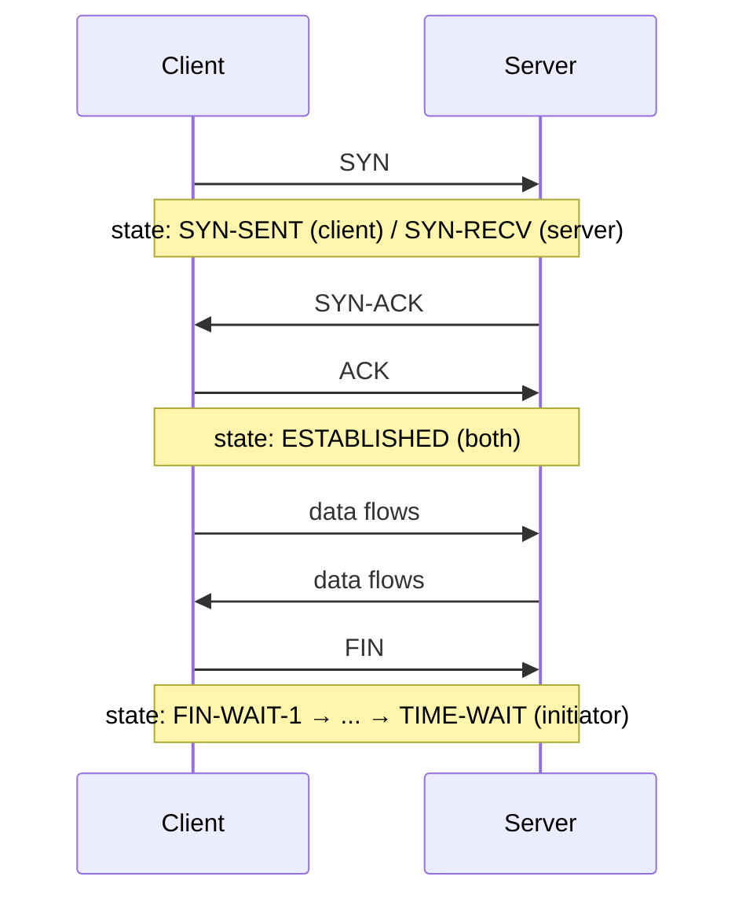
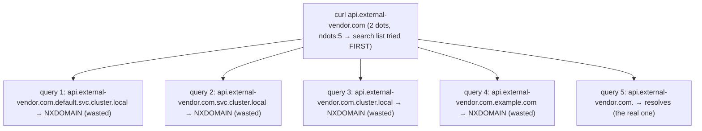
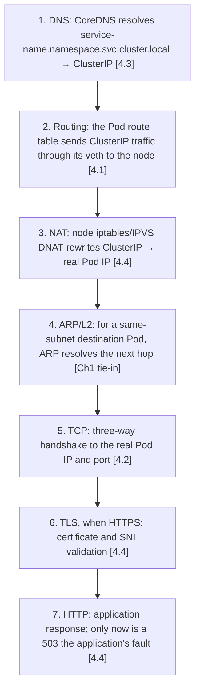

## Foundations: start here if this is new to you

This section will not make you a networking expert. Its only job is to give you the vocabulary the rest of this chapter and Volume 6's HPC/fabric material assume you already have, so that content reads as depth on a known shape rather than a pile of new terms. As before, skim anything that's already obvious to you.

### What an IP address actually is

**The problem.** If many machines share the same physical network, something needs to identify *which* machine a piece of data is meant for — the network itself doesn't know "send this to the database server" unless there's a precise, unambiguous way to name that machine.

**The concept.** An **IP address** is a numeric address assigned to a machine (or more precisely, to a network interface on a machine) so that data can be directed to it specifically. It's directly analogous to a street address: just as a street address lets mail find one specific building among many on the same street, an IP address lets network data find one specific machine among many on the same network.

**The shape of it.** You'll most often see IP addresses written as four numbers separated by dots (like `192.168.1.10`) — this section doesn't need you to parse the internal structure of that, only to recognize it as "a specific machine's numeric address on a network."

**A first real example.** When your laptop connects to a website, your laptop has its own IP address, and the server hosting that website has a different one; every piece of data exchanged is labeled with both, so responses can find their way back to you specifically and not to every other machine on the network.

#### Check your understanding

**Q1: Why can't a network just deliver data based on a machine's name (like "web-server-3") without any numeric address underneath?**
A: Because something still has to translate that name into a precise, structured address the network hardware and software can actually route data to — which is exactly the job DNS does, covered later in this section. The name and the address are separate concerns.

**Q2: If two machines are on the same network, what does an IP address let you do that would be impossible without it?**
A: Direct data to one specific machine rather than having every machine on the network try to process everything — the same way a street address lets mail reach one building instead of being dropped for the whole street to sort through.

### What a port is

**The problem.** A single machine with one IP address usually runs many independent network services at once — a web server, a database, an SSH login service. If data just arrived "at the machine" with no further detail, the machine would have no way to know which service it was meant for.

**The concept.** A **port** is a number that identifies a specific service running on a machine, so that many services can share the same IP address without their traffic colliding. This is directly analogous to apartment numbers at a single street address: the street address (IP address) gets mail to the right building, and the apartment number (port) gets it to the right unit inside that building.

**The shape of it.** Ports are numbers from 0 up to 65535. Certain numbers are conventional for certain services (for example, web servers conventionally listen on port 80 for plain HTTP or 443 for encrypted HTTPS), but the number itself is just an agreed-upon convention, not a technical requirement.

#### Check your understanding

**Q1: If a database and a web server both run on the same machine, how does incoming data reach the right one?**
A: Each service listens on a different port; incoming data is labeled with the IP address (which machine) and the port (which service on that machine), so the machine's networking stack can route it to the correct service.

**Q2: Is port 443 magically tied to HTTPS by the network itself, or is that just a convention?**
A: It's a convention — nothing technically forces HTTPS to use port 443, but nearly everyone follows that convention so things interoperate predictably without every setup needing custom configuration.

### TCP vs. UDP, in plain language

**The problem.** Once data can be addressed to a specific machine and port, you still need to decide *how* it's delivered — and different situations want different trade-offs between reliability and speed.

**The concept.** **TCP** and **UDP** are two different ways of sending data over a network, with a fundamental trade-off between them. TCP is like a phone call: before either side says anything meaningful, a connection is established, and every piece of data sent is tracked, acknowledged, and re-sent if it goes missing, so both sides can be confident the full, ordered conversation arrived intact. UDP is like shouting into a crowd: you send your message immediately, with no setup and no confirmation that anyone heard it, or heard it in order — it's fast and low-overhead precisely because it skips all the guarantees TCP provides.

**Why this trade-off exists at all.** Guaranteeing delivery and order (TCP) costs time and overhead — tracking what's been received, waiting for confirmations, resending lost pieces. Some traffic (loading a webpage, transferring a file) needs that reliability badly enough to be worth the cost. Other traffic (live video/audio streaming, some real-time gaming or sensor data) would rather drop an occasional piece of data than wait for it to be resent, because by the time a resend arrives it's already useless — for that traffic, UDP's speed is worth the lack of guarantees.

#### Check your understanding

**Q1: You're designing a system that streams live sensor readings where a single missed reading doesn't matter, but a late one does. TCP or UDP, and why?**
A: UDP — because a resend of a dropped reading arrives too late to be useful anyway, TCP's reliability overhead buys you nothing here, and you'd rather have low-latency, best-effort delivery.

**Q2: Why does TCP need a "connection" established first, but UDP doesn't?**
A: Because TCP has to set up shared bookkeeping (what's been sent, what's been acknowledged) before it can track and guarantee delivery — that's the "phone call" setup. UDP makes no such guarantees, so there's nothing to set up first; it just sends.

### What DNS actually does

**The problem.** Numeric IP addresses are precise but not remotely memorable or stable for humans to use directly — you don't want to memorize a string of numbers for every website, and a service's underlying address can change over time anyway.

**The concept.** **DNS** (Domain Name System) translates a human-readable name (like a website's domain name) into the numeric IP address that actually identifies the machine, similar to how a phone book translates a person's name into their phone number. It's worth noting explicitly that DNS is a *separate system* from the actual data delivery: DNS's only job is the name-to-address translation step; once your machine has the address, the actual network conversation (via TCP or UDP) happens independently of DNS.

**The shape of it.** Before your machine can talk to a website by name, it asks a DNS system to resolve that name into an IP address, then uses that address for the actual connection.

#### Check your understanding

**Q1: If DNS is temporarily broken but the IP address of a server hasn't changed, could you still reach that server?**
A: Yes, if you already know or supply its IP address directly — DNS is only the name-to-address lookup step; the underlying network path to that address is unaffected by DNS being down.

**Q2: Why is it useful that DNS is a separate system from the actual data transfer, rather than baked into TCP/UDP themselves?**
A: Because it lets the address behind a name change over time (say, a service moves to new infrastructure) without anyone needing to change how the actual data-transfer protocols work — only the lookup table (DNS) needs updating.

### What a firewall conceptually does

**The problem.** Not all incoming or outgoing network traffic should be allowed — a machine or network needs a way to decide, deliberately, what's permitted and what's blocked, rather than accepting everything by default.

**The concept.** A **firewall** is a rule-based gate that inspects network traffic and decides what's allowed to pass and what's blocked, based on criteria like the addresses, ports, or protocols involved. Think of it as an access-control list for network traffic, the same conceptual tool as file permissions, just applied to network connections instead of files.

**The shape of it.** A firewall's rules typically say something like "allow traffic to port 443 from anywhere, but block everything else" — an explicit allow/deny decision made per rule, evaluated for every piece of traffic that tries to pass through.

**Why it matters for Volume 10.** Volume 10's security material builds directly on this idea — reasoning about attack surface, least-privilege network access, and segmentation all assume "a firewall is a rule-based allow/deny gate" is already solid ground.

#### Check your understanding

**Q1: A firewall rule allows port 443 and blocks everything else. What happens to traffic aimed at port 80 on that machine?**
A: It's blocked — the rule set only explicitly allows port 443, and the described policy blocks everything else by default.

**Q2: How is a firewall conceptually similar to the file permission model from the Linux chapter?**
A: Both are rule-based access control: file permissions decide who (owner/group/other) can do what (read/write/execute) to a file; a firewall decides what traffic (by address/port/protocol) is allowed to pass. Same underlying idea — explicit rules deciding allowed access — applied to a different resource.

### What a route is

**The problem.** Knowing a destination's IP address isn't enough to actually send data there — a machine can be directly reachable on the same local network, or it might only be reachable by first handing the data to some other machine that knows how to get it closer to its destination. Something has to decide, for every packet, which direction "closer" even is.

**The concept.** A **route** is a rule the kernel consults that says, for a given destination address (or range of addresses), which local network interface to send the packet out on and, if needed, which neighboring machine (the **gateway**, or next hop) to hand it to next. It's directly analogous to a road-trip direction: you don't need to know the destination's exact street the moment you leave your driveway — you just need to know which highway on-ramp gets you closer, and you re-consult directions at each turn. A route is that "which on-ramp" decision, made fresh for every packet.

**The shape of it.** A machine keeps a routing table — a list of these destination-to-next-hop rules. When more than one rule could match the same destination, the kernel prefers the most specific one (this is covered in depth, with worked numbers, later in this chapter). Most machines also have a catch-all **default route** for "anything not otherwise matched," the way a road trip might default to "just keep heading toward the highway" absent more specific directions.

**Evidence, not proof, applied here:** a routing table entry that says "reach this destination via this gateway" does not prove that gateway, or anything further along the path, is actually up and forwarding correctly right now. It only proves what this machine *intends* to do with a packet aimed at that destination — the rest of the path is a separate claim requiring separate evidence.

#### Check your understanding

**Q1: Why can't a machine just send every packet directly to its final destination, the way it sends a packet to a machine on the same local network?**
A: Because most destinations aren't on the same local network — the packet has to be handed toward a neighboring machine (gateway) that's closer to the destination, one hop at a time, the same way a road trip is a sequence of "closer" decisions rather than one direct jump.

**Q2: Does a routing table entry for a destination prove that destination is currently reachable?**
A: No — it only proves what this machine intends to do with matching traffic (which interface/gateway it would use). Whether that gateway and every hop beyond it are actually up is a separate question requiring separate evidence.

### NAT, in plain language

**The problem.** IP addresses are a limited, structured resource, and many real networks (a home network, a Kubernetes cluster) use private addressing internally that outside networks don't know how to route to directly. Something has to translate between "the address this internal machine thinks it's using" and "the address the outside world can actually reach."

**The concept.** **NAT** (Network Address Translation) rewrites the address (and often the port) information in a packet as it crosses a boundary, so that traffic from many internally-addressed machines can share one externally-visible address, or so that traffic aimed at one externally-visible address can be silently redirected to the right internal destination. It is a rewriting/forwarding function, not a routing decision — NAT doesn't decide *whether* a packet should go somewhere, only *what address it wears* while it does.

**The shape of it.** A common shape is many internal machines sharing one public address for outbound traffic (the internal machines are invisible to the outside world unless something is deliberately exposed); another common shape — which this chapter's deeper material shows concretely for Kubernetes — is a fixed, stable address on one side (like a `Service` IP) getting quietly rewritten to whichever specific backend actually handles a given request. In both shapes, there is no process actually "listening on" the externally visible address the way a socket normally does — the address is real to the network, but it exists only as a rewrite rule.

#### Check your understanding

**Q1: Is NAT deciding where a packet should be routed, or something else?**
A: Something else — NAT rewrites address/port information as a packet crosses a boundary; routing (a separate mechanism) still decides which interface/gateway the packet actually travels through.

**Q2: If an address is implemented purely as a NAT rewrite rule with no process listening on it, what would you expect a tool that checks "who is listening on this address" to show?**
A: Nothing — there's no listening socket to find, because the address was never bound by a process. The only evidence of its existence is the rewrite rule itself, not a listener.

### TLS, in plain language

**The problem.** A plain TCP connection moves bytes reliably, but it does nothing to stop a third party from reading those bytes in transit, or to prove that the machine on the other end is actually who it claims to be.

**The concept.** **TLS** (Transport Layer Security) runs on top of an established TCP connection and does two separable jobs: it lets one or both sides cryptographically prove their identity (using a certificate), and it encrypts the data that flows afterward so a third party observing the traffic can't read it. This is analogous to a sealed, signed envelope handed over only after you've checked the courier's ID: the ID check is the identity/certificate part, and the sealed envelope is the encryption part — and importantly, both happen only *after* the courier (TCP) has already successfully reached your door.

**The shape of it.** TLS negotiation is its own distinct phase, happening after TCP connects and before any application data (like an HTTP request) is exchanged. That ordering matters for diagnosis: a connection can complete TCP successfully and still fail during TLS negotiation — because of an untrusted or expired certificate, a hostname mismatch, or incompatible protocol versions — which is a completely different failure from "TCP never connected" or "the application returned an error."

#### Check your understanding

**Q1: A connection completes its TCP handshake but then fails during certificate verification. Does that mean the network path is broken?**
A: No — the network path is proven fine (TCP is a later, harder-to-reach phase than routing/connectivity). The failure is in the TLS identity-verification step, a separate boundary from whether packets can reach the destination at all.

**Q2: Why can TLS's two jobs (identity verification and encryption) fail independently of each other in principle, even though they happen in the same handshake?**
A: Because they answer different questions — "is this really who it claims to be?" versus "can a third party read this traffic?" — so it's meaningful to reason about a certificate being technically untrusted while the encryption itself is mechanically sound, or vice versa; they're bundled into one handshake but conceptually separate guarantees.

### A brief, honest preview: why HPC/AI networking is a different world

Everything above describes typical web-service networking — the kind of networking most backend and DevOps work deals with day to day. Volume 6 covers a genuinely different world: high-performance computing (HPC) and AI training networking, using technologies like **RDMA** and **InfiniBand**.

This section will not teach you RDMA or InfiniBand — that's Volume 6's job, done properly with the depth it deserves. The only thing worth planting here is the one core idea, so the term doesn't feel completely alien when Volume 6 introduces it: normal networking (what you just learned above) always goes through the operating system and the CPU on both ends — data gets copied into the kernel, then into the application, with CPU involvement at each step. **RDMA** (Remote Direct Memory Access) exists to skip that: it lets one machine (or GPU) write directly into another machine's (or GPU's) memory, bypassing the CPU and operating system on the data path entirely, which matters enormously when you're moving huge amounts of data between GPUs extremely fast and extremely often, as in large-scale AI training. InfiniBand is a specific high-speed networking technology commonly used to carry that kind of traffic.

That's genuinely all you need here: normal networking involves the CPU/OS at every step; RDMA is specifically about not doing that, for speed, in short, GPU-to-GPU-style transfers. Volume 6 will build the real mental model on top of that one sentence.

#### Check your understanding

**Q1: What's the one core difference between typical web networking and RDMA, in plain terms?**
A: Typical networking routes data through the CPU and operating system on both ends; RDMA bypasses the CPU/OS and writes directly into the other side's memory, trading that overhead away for speed.

**Q2: Why would this matter specifically for AI training rather than, say, loading a webpage?**
A: AI training on multiple GPUs needs to move very large amounts of data between GPUs, very frequently, where the CPU/OS overhead of normal networking would become a serious bottleneck at that scale and frequency — a tradeoff that isn't relevant when loading one webpage occasionally.

### Glossary

- **IP address** — a numeric address identifying a specific machine (or network interface) on a network.
- **Port** — a number identifying a specific service on a machine, allowing many services to share one IP address.
- **TCP** — a connection-based network protocol that guarantees ordered, acknowledged delivery, at the cost of setup and overhead.
- **UDP** — a connectionless network protocol that sends data immediately with no delivery or order guarantees, favoring speed.
- **DNS** — the system that translates human-readable names into IP addresses, separate from the actual data-transfer protocols.
- **Route** — a rule deciding which interface/gateway a packet should be sent through to reach a given destination.
- **Gateway / next hop** — the neighboring machine a route hands a packet to, to move it closer to its destination.
- **NAT (Network Address Translation)** — rewriting address/port information as a packet crosses a boundary; a rewrite function, not a routing decision.
- **TLS (Transport Layer Security)** — a layer on top of an established TCP connection that verifies identity via certificates and encrypts subsequent data.
- **Firewall** — a rule-based gate that decides what network traffic is allowed to pass, based on criteria like address, port, or protocol.
- **RDMA (Remote Direct Memory Access)** — a technique that lets one machine/GPU write directly into another's memory, bypassing the CPU and OS on the data path, for speed.
- **InfiniBand** — a high-speed networking technology commonly used to carry RDMA-style traffic in HPC/AI environments.

### Before you go deeper, make sure you can...

- Explain what an IP address identifies and why a port is needed in addition to it.
- Explain the TCP-vs-UDP trade-off in your own words, using the phone call / shouting-into-a-crowd analogy or an equivalent of your own.
- Explain why DNS is a separate system from the actual data transfer.
- Explain what a route decides, and why a routing table entry does not prove the rest of the path is reachable.
- Explain why NAT is a rewrite function, not a routing decision, and why a NAT-only address has no listening socket to find.
- Explain why TLS is a separate phase after TCP connects, and why it can fail (certificate, hostname, protocol) independently of the network path.
- Describe a firewall as a rule-based allow/deny gate, and connect it to the file-permission access-control idea from the Linux chapter.
- State the one-sentence core idea behind RDMA (bypassing CPU/OS for direct memory-to-memory transfer) without needing to explain its implementation.

With that model in place, here's the full mechanism.

# Chapter 4 — Networking: IP, routes, sockets, TCP, DNS, NAT and TLS
*(original text preserved in full; ➕ marks additions)*

**Learning outcome:** Trace a connection from name lookup through application response and identify what each diagnostic proves.

## 4.1 Addressing and routing
IP addressing identifies interfaces/endpoints; a subnet prefix describes which addresses are on-link; the routing table decides the next hop. Linux performs a longest-prefix match. Before debugging an application protocol, prove that the host selected the expected source interface and route.
```bash
ip addr
ip route
ip route get 10.20.30.40
ip neigh
```

➕ **Longest-prefix match, worked with real numbers (this is the mechanism, not just the term):**
```text
Routing table
10.20.0.0/16 via eth0 (matches 10.20.30.40 — 16 bits match)
10.20.30.0/24 via eth1 (matches 10.20.30.40 — 24 bits match, MORE specific)
0.0.0.0/0 via eth0 (default — matches everything, LEAST specific)
Destination 10.20.30.40
kernel picks the /24 route (eth1), not the /16 or default,
because 24 matching bits beats 16, which beats 0.
```
`ip route get 10.20.30.40` doesn't just show a route — it shows which one actually wins, including the source IP the kernel would use — this is the single fastest way to prove "the packet would even leave via the interface you think it would" before touching `tcpdump`.

➕ **CIDR-collision — the real customer-facing failure this feeds into:** if your K8s pod CIDR (`10.244.0.0/16`) overlaps a customer's existing on-prem range, longest-prefix-match means some destinations silently route wrong the moment the cluster peers with their network — this is exactly why discovering existing CIDR usage is a day-1 question in any SA network design conversation, not an afterthought.

## 4.2 Sockets and TCP state
A socket binds application I/O to a transport endpoint. For TCP, connection state reveals which phase failed. SYN-SENT often means the client sent a SYN but did not complete the handshake. ESTABLISHED means transport is up; an application can still be broken above it. TIME-WAIT is normal connection lifecycle behavior, though extreme churn can matter operationally.
```bash
ss -lntp
ss -tn state syn-sent
ss -tn state established
tcpdump -ni any host 10.20.30.40 and port 443
```

➕ **TCP handshake diagram, mapped to `ss` states you'll actually see:**

Stuck in `SYN-SENT` forever = SYN left the box but nothing came back — either firewall dropping it silently, or nothing listening at the destination (a silent drop and "nothing listening" look identical from `ss` alone; `tcpdump` on both ends is what disambiguates them).

➕ **TIME_WAIT pileup — the socket-exhaustion failure mode worth naming unprompted:**
```bash
ss -tan | grep TIME-WAIT | wc -l    # climbing fast under load = ephemeral port exhaustion risk
```
A service opening a fresh outbound connection per request instead of pooling/keep-alive burns through the ephemeral port range under load. **Fix is connection reuse, not raising `net.ipv4.ip_local_port_range`** — the same "mitigation vs root cause" distinction from Chapter 1's fd-leak scenario, same pattern, different resource.

## 4.3 DNS is a dependency, not magic
Name resolution may involve /etc/hosts, NSS configuration, a local stub/cache and upstream resolvers. Distinguish "name does not resolve" from "name resolves to an unexpected address" and from "connection to the resolved address fails."
```bash
getent hosts api.example.com
resolvectl query api.example.com # systemd-resolved environments
dig +short api.example.com
cat /etc/resolv.conf
```

➕ **The K8s-specific DNS trap — `ndots:5` amplification:**
```bash
kubectl exec -it pod -- cat /etc/resolv.conf
# search default.svc.cluster.local svc.cluster.local cluster.local example.com
# options ndots:5
```
`ndots:5` means any name with fewer than 5 dots gets tried against *every* search-domain suffix first, before the literal name. A pod doing `curl api.external-vendor.com` (2 dots) will generate up to **4 extra DNS queries** (trying `.svc.cluster.local`, `.cluster.local`, etc. first, all of which fail) before the real external lookup succeeds — multiplying CoreDNS load and adding real latency, invisible unless you're looking at DNS query volume specifically. This is a very common, very fixable ("append a trailing dot to fully-qualify external names, or reduce ndots") production cost/latency finding.

➕ **Diagram: one `curl` to an external name, five DNS queries deep**

Every one of the first four queries round-trips to CoreDNS (and, if CoreDNS doesn't own the suffix, upstream) before failing — a fully-qualified name (trailing dot) or a lower `ndots` skips straight to query 5.

## 4.4 NAT, firewall, TLS and HTTP


Figure 3. Prove each layer. A passing lower layer does not prove the higher layer.

A TCP connect timeout, connection refused, TLS certificate failure and HTTP 503 are four different diagnoses. curl -v is valuable because it exposes DNS, connect, TLS and HTTP phases in one trace. tcpdump proves whether packets actually leave/return. Firewall/NAT rules explain packet transformation or filtering, while the application log explains a valid HTTP response such as 500/503.
```bash
curl -vk --connect-timeout 2 https://api.example.com/health
nft list ruleset
# older systems may use iptables-save
tcpdump -ni any 'host 203.0.113.10 and port 443'
```

➕ **Annotated `curl -v` output — this is the single highest-value diagnostic trace to have memorized, phase by phase:**
```text
* Trying 203.0.113.10:443... ← DNS resolved, attempting TCP connect
* Connected to api.example.com (203.0.113.10) port 443 ← TCP handshake succeeded (Ch4.2 done)
* TLS handshake, Client hello (1): ← now entering TLS phase
* TLS handshake, Server hello (2)
* TLS handshake, Certificate (11)
* SSL certificate verify ok. ← TLS trust chain validated
* using HTTP/2
> GET /health HTTP/2 ← request sent
< HTTP/2 503 ← ← THIS is the actual failure — everything below TCP/TLS worked
< retry-after: 30
```
**Interview-ready framing:** every line above is a proof point for one layer. A `curl -v` that dies after "Trying..." = routing/firewall (Ch4.1). Dies after "Connected" but before TLS completes = TLS/cert issue, not network. Completes TLS but returns 503 = the network stack is entirely exonerated — it's an application-layer problem now, stop looking at `tcpdump`.

➕ **NAT — a Kubernetes Service, precisely, not hand-waved:**
```bash
iptables -t nat -L KUBE-SERVICES -n | head     # the actual NAT rules kube-proxy wrote
```
A `ClusterIP` is not a listening process — it's a set of DNAT rules (or ipvs virtual server entries) redirecting to real pod IPs, written by kube-proxy. **There's nothing to `netstat`/`ss` for on the node for the ClusterIP itself — only the rule.** This is the sentence that separates "I know kubectl commands" from "I understand the mechanism," and it directly extends this chapter's NAT section into the Kubernetes networking chapter (Vol 3).

## Worked scenario
**Situation:** A Pod can resolve api.example.com, but HTTPS calls time out.

1. Record the resolved IP and ensure it is the expected endpoint.
2. From the same network namespace, inspect route to the IP and source interface.
3. Attempt TCP/443 and capture packets. SYN with no SYN-ACK points below TLS/HTTP.
4. Inspect Kubernetes NetworkPolicy/CNI policy, node firewall/NAT and cloud firewall/load-balancer path as applicable.
5. If TCP connects, move upward to TLS certificate/SNI and HTTP response evidence.

**Conclusion:** "DNS works" only removes one branch of the hypothesis tree.

➕ **Full hop-by-hop trace of `curl service-name:80` inside a pod — the synthesis exercise tying this whole chapter together:**

This exact 7-step trace, said out loud without hesitation, is close to a complete answer to "explain how a Service routes traffic" for a Senior SA interview.

## Practitioner lens
**Vishakha Sadhwani: Kubernetes networking is Linux networking plus abstractions**
A recent public post traces north-south and east-west traffic through load balancers, Gateway/Ingress, Services, kernel rules/eBPF, CNI and pod IPs. This chapter deliberately teaches the underlying socket/route/filter path first so those Kubernetes components become inspectable control points.
[Public source](https://www.linkedin.com/in/vsadhwani)

## Practice
1. Trace an HTTPS connection in a lab with getent, ip route get, curl -v and tcpdump. Write what each command proves.
2. Explain timeout versus connection-refused versus TLS failure.
3. Draw the return path as well as the forward path; identify where asymmetric routing could appear.

➕ 4. Deliberately set `ndots` mismatched behavior by curling an external domain from inside a pod while running `tcpdump -ni any port 53` in another terminal — count how many DNS queries actually fire for one `curl`.
➕ 5. Write the 7-step hop trace above from memory, then verify each step against a real `curl -v` + `tcpdump` capture on a lab cluster — this is the single best rehearsal for the "explain how a Service works" interview question.
