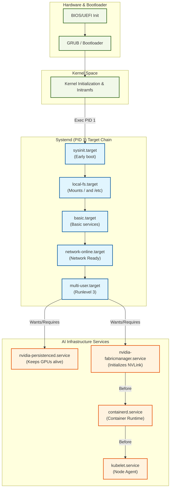
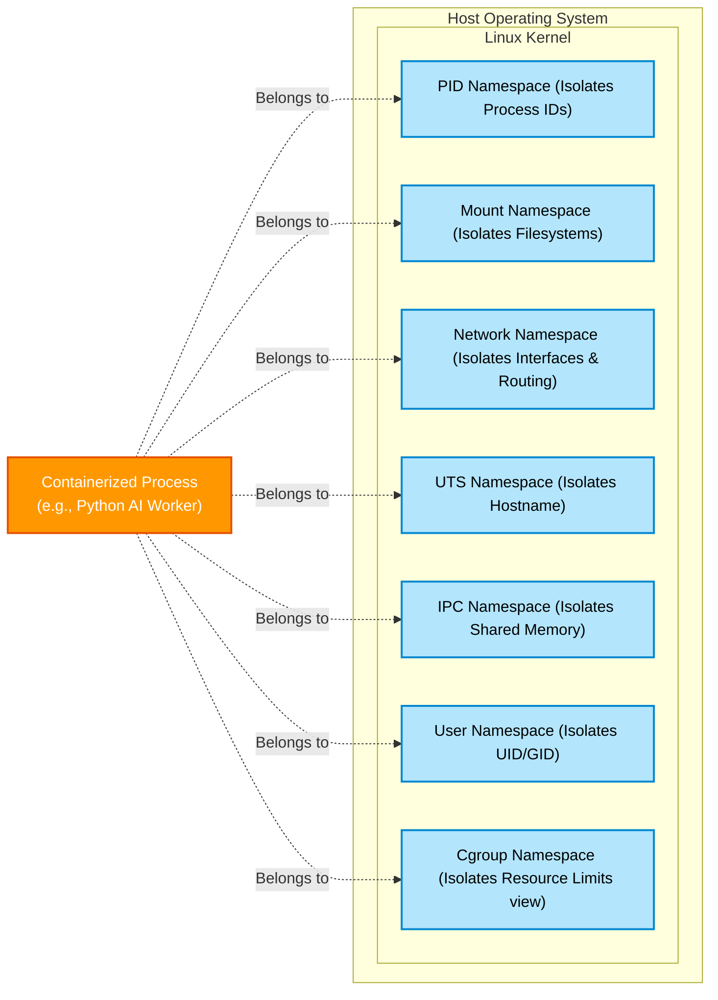

# Linux, Systemd, and Containers Masterclass

## 1. Introduction and The Problem Space

Modern AI infrastructure is not just a collection of hardware; it is a meticulously orchestrated software environment where every resource must be accounted for, isolated, and precisely delivered to the workload. When operating NVIDIA GPU clusters for deep learning, the boundaries between the host operating system, the hardware, and the application are managed by a triad of fundamental Linux technologies: **Systemd**, **Namespaces**, and **Control Groups (cgroups)**.

This masterclass explores how these technologies interact to create the foundation of modern containerized AI workloads. We will dismantle the abstraction of a "container" to understand the primitives underneath, tune systemd for extreme performance, and prepare a bare-metal server to host distributed GPU jobs safely.

### 1.1 Prerequisites
*   **Difficulty:** Advanced (Level 300-400)
*   **Reading Time:** ~90 minutes
*   **Assumed Knowledge:** Proficiency with Linux command line, understanding of basic operating system concepts (processes, memory, I/O), and familiarity with the concept of containers (e.g., Docker, Kubernetes).

### 1.2 The Production Story: The Silent Hang

It was a quiet Friday afternoon when the alerts began firing: `Node NotReady` across a quarter of the GPU cluster. The workloads running on these nodes were massive, multi-node Large Language Model (LLM) training jobs using PyTorch and NCCL.

The SRE team immediately checked Kubernetes. The pods were marked as `Terminating` but were completely stuck. Attempting to SSH into the nodes was impossible; the connections timed out. Out-of-band management (IPMI) revealed that the servers were technically powered on, but the operating system was unresponsive.

A hard reset of one node brought it back online. Inspection of the previous boot's logs (`journalctl -b -1`) showed a chilling sequence:
1.  The training job consumed all allocated memory in its cgroup.
2.  The kernel OOM (Out Of Memory) killer was invoked.
3.  The OOM killer attempted to terminate the PyTorch processes.
4.  Because the host's systemd was not properly configured to isolate the container runtime slice from the system slice (`system.slice`), the I/O storm and memory pressure caused `systemd-journald` and `sshd` to stall.
5.  A secondary process, left orphaned and holding onto the `/dev/nvidiactl` file descriptor, prevented the NVIDIA driver from resetting the GPU state.

This cascading failure was not a hardware issue, nor was it a bug in PyTorch. It was a failure of **host readiness and resource isolation**. By the end of this masterclass, you will understand exactly how to architect a system that prevents this exact scenario.

## 2. Systemd and the Boot Chain

`systemd` is the init system and service manager for most modern Linux distributions. It is process ID (PID) 1. For AI infrastructure, systemd is critical because it manages the lifecycle of essential daemons: the NVIDIA Fabric Manager, DCGM (Data Center GPU Manager), container runtimes (containerd/CRI-O), and the kubelet.

### 2.1 The Boot Sequence

Understanding how a node goes from BIOS to ready-for-GPUs is crucial. `systemd` uses **targets** (groupings of units) to manage states.



:::warning Service Ordering for AI Nodes
If `kubelet` or `containerd` starts before `nvidia-fabricmanager` has successfully discovered and initialized the NVLink switches on an HGX node, the container orchestrator might allocate GPUs that cannot communicate with each other over the high-speed fabric. This causes distributed training jobs to silently fall back to PCIe or simply hang.
:::

### 2.2 Systemd Unit Files and Dependencies

When writing or modifying services for GPU nodes, you must manage dependencies strictly. If `kubelet` starts before `nvidia-fabricmanager` is fully ready on an HGX system (NVLink switch topology), the GPUs will not communicate correctly, leading to massive performance degradation or immediate job failure.

Let's examine a robust `nvidia-fabricmanager.service` unit file:

```ini
# /usr/lib/systemd/system/nvidia-fabricmanager.service
[Unit]
Description=NVIDIA Fabric Manager Service
# Ensure we only run after network and syslog are available
After=network-online.target syslog.target
Wants=network-online.target
# Crucial: Ensure the NVIDIA device nodes are created before this starts
Requires=nvidia-device-plugin.service
Before=containerd.service kubelet.service

[Service]
Type=forking
ExecStart=/usr/bin/nv-fabricmanager -c /usr/share/nvidia/nvswitch/fabricmanager.cfg
ExecStop=/usr/bin/systemctl kill -s SIGTERM nvidia-fabricmanager.service
# Restart logic for high availability
Restart=always
RestartSec=15
LimitCORE=infinity
# Secure the service
PrivateTmp=true
ProtectSystem=full

[Install]
WantedBy=multi-user.target
```

**Key Directives:**
*   **`Requires=`**: A hard dependency. If `nvidia-device-plugin.service` fails, this service will not start.
*   **`Wants=`**: A soft dependency. It will try to start `network-online.target`, but if it fails, it proceeds anyway.
*   **`Before=` / `After=`**: Ordering dependencies. `Requires` does *not* imply ordering. You must specify `Before=kubelet.service` to guarantee Fabric Manager is initialized before Kubernetes schedules pods.
*   **`Type=forking`**: The process will fork, and the parent will exit. `systemd` tracks the child process.
*   **`Restart=always`**: Critical daemons must auto-recover.

### 2.3 Investigating Boot Times

AI nodes often have massive amounts of RAM (e.g., 2TB+) and PCIe devices, making boot times naturally long. To identify bottlenecks:

```bash
# Analyze the overall boot time
systemd-analyze

# Output example:
# Startup finished in 35.123s (firmware) + 12.456s (loader) + 8.789s (kernel) + 45.123s (userspace) = 1min 41.491s 
# multi-user.target reached after 45.100s in userspace.

# Find the specific services taking the longest
systemd-analyze blame | head -n 10

# Output example:
# 15.234s nvidia-fabricmanager.service
# 10.123s containerd.service
#  8.456s systemd-networkd-wait-online.service
#  5.234s kubelet.service

# Plot a critical path tree
systemd-analyze critical-chain kubelet.service
```

### 2.4 Deep Dive: Systemd and Target States (Part 1)
To truly master systemd, we must understand how it navigates state transitions. Targets in systemd are analogous to runlevels in SysVinit, but far more flexible. 
When we run `systemctl isolate multi-user.target`, systemd dynamically recalculates the dependency graph.

Consider the output of `systemctl list-dependencies multi-user.target`:
```text
multi-user.target
* ├─auditd.service
* ├─containerd.service
* ├─cron.service
* ├─dbus.service
* ├─kubelet.service
* ├─networkd-dispatcher.service
* ├─nvidia-fabricmanager.service
* ├─nvidia-persistenced.service
* ├─rsyslog.service
* ├─ssh.service
* ├─systemd-logind.service
* ├─systemd-resolved.service
* ├─systemd-update-utmp-runlevel.service
* ├─basic.target
* │ ├─-.mount
* │ ├─tmp.mount
* │ ├─paths.target
* │ ├─slices.target
* │ │ ├─-.slice
* │ │ └─system.slice
...
```
This hierarchical view shows that `multi-user.target` requires `basic.target`, which in turn requires local mounts and slices.
Failure in any critical sub-target cascades upward. If `slices.target` fails to materialize due to a cgroup kernel bug, `basic.target` fails, and the system hangs indefinitely.

### 2.5 Deep Dive: Systemd and Target States (Part 2)
The configuration of systemd dependencies directly affects the blast radius of failures. When deploying custom drivers or storage daemons (like MOFED for InfiniBand or custom NVMe-oF initiators), these services must hook into the right targets. 
If a storage service uses `Before=local-fs.target`, it will delay the entire filesystem mounting process, preventing `basic.target` from being reached.
Instead, network-dependent storage should use `After=network-online.target` and `Before=kubelet.service`.

### 2.6 Deep Dive: Systemd and Target States (Part 3)
Another critical aspect of systemd targets is the use of `Conflicts=`. 
If you have a diagnostic daemon that conflicts with a production daemon, you can set `Conflicts=production.service`. When the diagnostic daemon is started, systemd will automatically stop `production.service`. This is a powerful tool for automated remediation scripts that need exclusive access to hardware (e.g., running `dcgmi diag` while ensuring Kubernetes is not trying to schedule pods on the GPU).

## 3. Systemd Slices and Resource Management

While cgroups are a kernel feature, `systemd` is the primary interface for managing them on modern Linux systems. It organizes processes into a hierarchy of **slices**, **scopes**, and **services**.

*   **Slice (`.slice`)**: A group of hierarchically organized units. Slices do not contain processes themselves; they contain scopes and services.
*   **Scope (`.scope`)**: Groups worker processes created externally (e.g., by a container runtime or user login).
*   **Service (`.service`)**: A process or group of processes started and managed by systemd.

### 3.1 The Default Hierarchy

By default, systemd defines three main slices:
1.  `system.slice`: System daemons (sshd, networkd, kubelet).
2.  `user.slice`: User login sessions.
3.  `machine.slice`: Virtual machines and containers (though Kubernetes often uses its own `kubepods.slice`).

You can view the current hierarchy using `systemd-cgls`:

```bash
systemd-cgls
# Output snippet:
# Control group /:
# -.slice
# ├─user.slice
# │ └─user-1000.slice
# │   └─session-1.scope
# │     ├─ 1432 sshd: user@pts/0
# │     ├─ 1433 -bash
# │     └─ 2045 systemd-cgls
# ├─system.slice
# │ ├─kubelet.service
# │ │ └─ 945 /usr/bin/kubelet ...
# │ ├─containerd.service
# │ │ └─ 876 /usr/bin/containerd
# └─kubepods.slice
#   ├─kubepods-burstable.slice
#   └─kubepods-besteffort.slice
```

### 3.2 Protecting the Host from AI Workloads

In an AI cluster, a deep learning container can easily consume 100% of CPU, saturating the bus and starving critical daemons like `sshd` or `kubelet` (causing `Node NotReady` flaps). 

To prevent this, we must configure `systemd` to reserve resources for the `system.slice`.

Create a drop-in configuration for `system.slice`:

```bash
mkdir -p /etc/systemd/system/system.slice.d/
cat <<EOF > /etc/systemd/system/system.slice.d/50-resource-limits.conf
[Slice]
# Guarantee at least 10% of CPU time to system services during contention
CPUWeight=100
# Ensure memory protection for system daemons
MemoryLow=2G
MemoryHigh=16G
MemoryMax=32G
EOF

systemctl daemon-reload
systemctl restart system.slice
```

**Understanding the Directives (Cgroups v2):**
*   **`CPUWeight`**: Replaces `CPUShares`. It's a relative weight (default 100). 
*   **`MemoryLow`**: Best-effort memory protection. The kernel will try not to reclaim memory below this threshold.
*   **`MemoryHigh`**: Throttling limit. Processes are aggressively slowed down and their memory reclaimed when they hit this limit, *before* OOM killing.
*   **`MemoryMax`**: Hard limit. Replaces `MemoryLimit`. Hitting this triggers the OOM killer.

### 3.3 NUMA Pinning via Systemd

For extreme performance, daemons dealing with network/storage (like storage operators or custom agents) should be pinned to specific NUMA nodes to ensure fast PCIe access. 

```ini
[Service]
# Pin the service to CPU cores 0-7
CPUAffinity=0-7
# Confine memory allocations to NUMA node 0
NUMAPolicy=bind
NUMAMask=0
```

## 4. Process Mechanics and Signals

In containerized environments, signal propagation is a frequent source of bugs. Deep learning frameworks like PyTorch use multiple processes (often via `multiprocessing` or MPI). 

### 4.1 Process Trees and PID 1

Every container requires a PID 1 process. In a standard OS, systemd is PID 1, and its primary job (besides starting services) is **reaping zombie processes**.

When a child process exits, it becomes a "zombie" (state `Z` in `top` or `ps`). It consumes almost no resources, but its PID entry remains in the process table until the parent process calls `wait()` to read its exit status. 

If the parent process crashes or is killed *without* waiting for the child, the child becomes an "orphan". The kernel automatically reparents orphans to PID 1. If the container's PID 1 is the application (e.g., `python train.py`) and that application is not designed to reap adopted children, the process table will fill up with zombies.

**Troubleshooting Zombies:**

```bash
# Find all zombie processes
ps aux | awk '$8=="Z" {print $0}'

# Find the parent of a zombie (PPID is the 3rd column)
ps -o ppid= -p <zombie_pid>
```
To fix this, container runtimes often inject a lightweight init system (like `tini` or `dumb-init`) as PID 1, which runs the application as a child and correctly reaps adopted processes.

### 4.2 Signal Handling in GPU Workloads

When Kubernetes deletes a pod, it sends `SIGTERM` (15) to PID 1 in the container. The application has a grace period (default 30s) to shut down gracefully. If it doesn't, Kubernetes sends `SIGKILL` (9), which cannot be caught or ignored, instantly terminating the process.

**Why this matters for GPUs:**
If a PyTorch process holding GPU memory is forcefully killed (`SIGKILL`) while actively performing a DMA transfer, it can leave the NVIDIA driver in a corrupted state, requiring a node reboot.

**Proper Handling in Python:**

```python
import signal
import sys
import time

def handle_sigterm(signum, frame):
    print("Received SIGTERM. Saving checkpoint and exiting gracefully...")
    # Add logic here to save model state
    # dist.destroy_process_group() # Cleanup NCCL
    sys.exit(0)

# Register the signal handler
signal.signal(signal.SIGTERM, handle_sigterm)

print("Training loop started. Waiting for signals.")
try:
    while True:
        # Simulate work
        time.sleep(1)
except KeyboardInterrupt:
    print("Interrupted by user.")
```

### 4.3 Deep Dive: Process Mechanics and Signals (Part 1)
In containerized environments, signal propagation is a frequent source of bugs. When we talk about signal handling, we have to understand the kernel's role in delivering it across namespaces.

If PID 1 in a container is a bash script, bash by default does not forward signals to its children. 
Consider this script:
```bash
#!/bin/bash
python3 train.py &
wait
```
If Kubernetes sends `SIGTERM` to this bash script, bash receives it, but `train.py` never sees it. Bash exits, the container runtime sees PID 1 exit, and immediately sends `SIGKILL` to all remaining processes in the cgroup. `train.py` is violently terminated, potentially corrupting GPU state.

To fix this, we use `exec`:
```bash
#!/bin/bash
exec python3 train.py
```
This replaces the bash process with the python process. Python becomes PID 1 and can catch `SIGTERM`.

### 4.4 Deep Dive: Process Mechanics and Signals (Part 2)
The problem with `exec` is that it assumes the python application is well-behaved. If the python application spawns its own children (using `subprocess` or `multiprocessing`) and then crashes, those children become orphans. Since Python is PID 1, it is now responsible for reaping them. But Python is dead. The orphans are reparented to the container runtime or host init system, depending on namespace configuration. This leads to the zombie apocalypse scenario.
This is exactly why Kubernetes uses pausing containers (the `pause` image) in the Pod namespace: the pause container is simply a tiny assembly loop that sleeps and calls `wait()` to reap any orphaned zombies within the pod's PID namespace.

### 4.5 Deep Dive: Process Mechanics and Signals (Part 3)
Another nuanced signal is `SIGUSR1` and `SIGUSR2`. These are user-defined signals. Many high-performance network libraries (like MPI implementations used in deep learning) use these signals for out-of-band communication or profiling triggers. If your application handles `SIGUSR1`, ensure that your container runtime configuration isn't intercepting or blocking these signals at the seccomp or AppArmor layer.

### 4.6 Deep Dive: Process Mechanics and Signals (Part 4)
Finally, let's discuss `SIGSTOP` and `SIGCONT`. `SIGSTOP` tells the kernel to freeze the process completely. The process cannot catch or ignore this. This is extremely dangerous in GPU environments because if a process is frozen while holding a global lock in the NVIDIA driver or a NCCL synchronization primitive, the entire cluster of GPUs waiting on that rank will hang indefinitely. Never use `SIGSTOP` on production AI workloads unless you are intentionally debugging a deadlock.

## 5. Logging with Journald

`systemd-journald` collects standard output, standard error, syslog, and kernel messages. For AI nodes generating terabytes of logs (from GPU errors to kubelet verbosity), tuning journald is mandatory.

### 5.1 Journalctl Mastery

Senior operators do not use `grep` on flat log files. They query the structured journal.

```bash
# Follow logs for a specific systemd unit
journalctl -u kubelet.service -f

# Filter by time
journalctl --since "2024-10-24 10:00:00" --until "1 hour ago"

# Show kernel messages (dmesg equivalent)
journalctl -k

# Show logs from previous boot (critical for investigating crashes)
journalctl -b -1

# Filter by priority (err and higher)
journalctl -p err -x

# Find logs specifically related to a container ID
journalctl CONTAINER_ID_FULL=a1b2c3d4e5f6...

# Tail the end, without paging (no 'less')
journalctl -n 100 --no-pager
```

### 5.2 Tuning Journald Storage

By default, journald stores logs in memory (`/run/log/journal`). Upon reboot, they are lost. For persistent, reliable logging, edit `/etc/systemd/journald.conf`:

```ini
# /etc/systemd/journald.conf
[Journal]
# Make logs persistent across reboots (writes to /var/log/journal)
Storage=persistent
# Compress logs to save space
Compress=yes
# Keep a maximum of 10GB of logs
SystemMaxUse=10G
# Keep a minimum of 2GB free on the disk
SystemKeepFree=2G
# Rotate logs when they hit 500MB
SystemMaxFileSize=500M
# Limit log burst to prevent DoS by noisy applications
RateLimitIntervalSec=30s
RateLimitBurst=10000
```
Restart after changes: `systemctl restart systemd-journald`

## 6. Container Isolation Mechanics (Namespaces)

Containers are not virtual machines. They do not have their own kernel. A container is simply a standard Linux process that has been isolated using **Namespaces** and restricted using **Cgroups**.

Namespaces limit what a process can *see*. Cgroups limit what a process can *use*.

### 6.1 The 6 Core Namespaces



:::info Namespaces vs Virtual Machines
A container is not a Virtual Machine; it has no guest kernel. It is a completely standard Linux process that has been assigned to a different set of namespaces. Because the host kernel manages it directly, interacting with GPU hardware drivers (which exist in kernel space) is native and incurs zero virtualization overhead.
:::

1.  **PID (Process ID):** Isolates the process ID number space. PID 1 in the container maps to PID 45982 on the host.
2.  **Mount (mnt):** Isolates the filesystem mount points. A container can mount `/tmp` without affecting the host's `/tmp`.
3.  **Network (net):** Isolates network interfaces, routing tables, and iptables rules. The container gets its own `eth0`.
4.  **UTS (UNIX Time-sharing System):** Isolates hostname and domain name.
5.  **IPC (Inter-Process Communication):** Isolates POSIX message queues and System V IPC objects. Crucial for MPI jobs running on the same node to avoid colliding memory segments.
6.  **User:** Isolates user and group IDs. User ID 0 (root) inside the container can be mapped to a non-privileged user (ID 1000) on the host. This is a massive security boundary.

### 6.2 Building a Container by Hand with `unshare`

To truly understand containers, we build one manually using the `unshare` command, which drops the current process into new namespaces.

**Step 1: Create a Root Filesystem**
We need a basic root filesystem. Let's extract an Alpine Linux tarball.
```bash
mkdir -p /tmp/mycontainer
cd /tmp/mycontainer
wget https://dl-cdn.alpinelinux.org/alpine/v3.18/releases/x86_64/alpine-minirootfs-3.18.4-x86_64.tar.gz
tar -xzf alpine-minirootfs-3.18.4-x86_64.tar.gz
```

**Step 2: Isolate the Environment**
We will unshare the PID, Mount, and UTS namespaces. We also need to map the user, and fork a new process.

```bash
sudo unshare --pid --mount --uts --fork --root /tmp/mycontainer /bin/sh
```

**Step 3: Inside the "Container"**
Notice your prompt has changed. Let's verify the isolation.
```bash
# Check the hostname
hostname
# Let's change it! It won't affect the host because of the UTS namespace.
hostname my-isolated-box

# Check processes
ps aux
# Error! /proc is not mounted. The PID namespace is isolated, 
# but the tools read from /proc, which is still inherited or missing.

# Mount the proc filesystem for this specific PID namespace
mount -t proc proc /proc
ps aux
# Output:
# PID   USER     TIME  COMMAND
#   1   root      0:00 /bin/sh
#   5   root      0:00 ps aux

# We are PID 1!
```
Exit the shell to destroy the namespaces.

### 6.3 Checking Namespaces

Every process on the host has a directory in `/proc/[PID]/ns/`.

```bash
ls -l /proc/$$/ns/
# Output shows symbolic links to namespace inodes:
# cgroup -> cgroup:[4026531835]
# ipc -> ipc:[4026531839]
# mnt -> mnt:[4026531840]
# net -> net:[4026531992]
# pid -> pid:[4026531836]
# user -> user:[4026531837]
# uts -> uts:[4026531838]
```
If two processes have the exact same inode number for `net`, they share the same network namespace. This is exactly how Kubernetes "Pods" work: multiple containers (processes) share the same Network, IPC, and UTS namespaces, but have different Mount namespaces.

### 6.4 Deep Dive: `unshare` and Namespace Introspection (Part 1)
To truly understand containers, we build one manually using the `unshare` command, which drops the current process into new namespaces.
We need to repeatedly verify the boundaries of our isolation.
When you run `ls -l /proc/$$/ns/`, you see the inodes. 
If we execute `unshare --net /bin/bash`, the network inode changes.

```bash
# Check original net namespace
readlink /proc/$$/ns/net
# net:[4026531992]

# Create new net namespace
sudo unshare --net /bin/bash

# Inside new namespace
readlink /proc/$$/ns/net
# net:[4026532115]

# Check interfaces
ip link
# 1: lo: <LOOPBACK> mtu 65536 qdisc noop state DOWN mode DEFAULT group default qlen 1000
#     link/loopback 00:00:00:00:00:00 brd 00:00:00:00:00:00
```
Notice the host's `eth0` or `enp129s0f0` is gone. We only have a down loopback interface. 
This is why CNI plugins exist in Kubernetes: they create a `veth` pair, shove one end into the container's network namespace, leave the other on the host attached to a bridge, and configure routing.

### 6.5 Deep Dive: `unshare` and Namespace Introspection (Part 2)
The Mount Namespace is the most frequently misunderstood. When you unshare a mount namespace, the new namespace receives a *copy* of the mount tree from its parent. Changes made in the new namespace do not affect the parent. However, this is controlled by mount propagation settings (`shared`, `private`, `slave`, `unbindable`).
If the host's `/` is mounted as `shared`, mounts created inside the container might actually propagate back to the host! Container runtimes ensure that the root filesystem is marked as `private` or `slave` to prevent these "mount leaks" from breaking the host system.

### 6.6 Deep Dive: `unshare` and Namespace Introspection (Part 3)
The IPC namespace governs POSIX message queues and System V shared memory. This is critical for HPC and AI. If two processes need to communicate via extremely fast shared memory (like NCCL using SHM), they MUST share the same IPC namespace. In Kubernetes, this is enabled by default for all containers within the same Pod. If you attempt to use MPI across two different Pods on the same node, it will fall back to slower network communication (TCP) because the IPC isolation prevents them from seeing each other's memory segments.

### 6.7 Deep Dive: `unshare` and Namespace Introspection (Part 4)
The User namespace is the holy grail of container security, yet the least adopted due to complexity. It allows mapping user ID 0 (root) inside the container to a high-numbered unprivileged user ID (e.g., 100000) on the host. If a process escapes the container, it emerges on the host as a completely powerless user. Unfortunately, mapping file ownership across distributed filesystems (like NFS or Lustre) with User Namespaces is notoriously difficult, which is why many AI clusters run containers as privileged or rely on alternative security profiles like AppArmor and SELinux.

## 7. Resource Control (Cgroups v2)

While namespaces limit *visibility*, control groups (cgroups) limit *usage*. They meter, throttle, and enforce limits on CPU, memory, block I/O, and devices.

Modern distributions use **cgroups v2** (unified hierarchy). Cgroups v1 used separate hierarchies for memory, cpu, etc., making complex resource management error-prone.

### 7.1 Navigating the Cgroup Hierarchy

The cgroup pseudo-filesystem is mounted at `/sys/fs/cgroup`.

```bash
ls -l /sys/fs/cgroup/
# Shows cgroup.controllers, cgroup.procs, system.slice, user.slice, etc.

# See what controllers are available in the root
cat /sys/fs/cgroup/cgroup.controllers
# cpuset cpu io memory hugetlb pids rdma misc
```

### 7.2 Manual Cgroup Manipulation

Let's manually constrain a process's memory.

**Step 1: Create a new cgroup**
```bash
sudo mkdir /sys/fs/cgroup/my_ai_workload
```

**Step 2: Configure memory limits**
We set a hard limit of 100 Megabytes.
```bash
echo "100M" | sudo tee /sys/fs/cgroup/my_ai_workload/memory.max
```

**Step 3: Move a process into the cgroup**
Let's start a shell and add its PID to the cgroup.
```bash
# In terminal A:
echo $$ # Print PID, e.g., 5566
# In terminal B (as root):
echo 5566 > /sys/fs/cgroup/my_ai_workload/cgroup.procs
```

**Step 4: Exhaust the memory**
Back in terminal A, run a command that allocates memory rapidly, like `stress` or python:
```python
# In terminal A:
python3 -c "x = 'a' * (150 * 1024 * 1024)"
# Output: Killed
```
The kernel OOM killer immediately terminates the process because it exceeded the `memory.max` of the `my_ai_workload` cgroup, *without* affecting the rest of the host system.

### 7.3 Pressure Stall Information (PSI)

A massive advancement in Linux for resource monitoring is PSI. Instead of just showing resource *usage*, PSI shows resource *contention*—how long processes spent waiting for a resource.

Check PSI for memory in our cgroup:
```bash
cat /sys/fs/cgroup/my_ai_workload/memory.pressure
# some avg10=0.00 avg60=0.00 avg300=0.00 total=0
# full avg10=0.00 avg60=0.00 avg300=0.00 total=0
```
*   **some**: The percentage of time in the last 10, 60, or 300 seconds that *at least one* task was delayed waiting for memory.
*   **full**: The percentage of time that *all* non-idle tasks were delayed (the system was completely stalled).

If `full` values are high for memory or I/O on a GPU node, your storage/memory subsystem is starving the GPUs, causing idle time and massive cost inefficiencies.

## 8. OverlayFS and Storage Mechanics

A container image is not a single file; it is a stack of immutable layers. When a container runs, it needs to be able to read those immutable layers and write temporary data, without modifying the underlying image. Linux handles this brilliantly via **OverlayFS**.

### 8.1 The Overlay Architecture

OverlayFS merges multiple directories into a single unified view.

1.  **Lower Directory (`lowerdir`):** Read-only layers. These are the container image layers pulled from a registry. There can be multiple lowerdirs stacked.
2.  **Upper Directory (`upperdir`):** Read-write layer. This is empty when the container starts. Any files created or modified by the container are written here.
3.  **Work Directory (`workdir`):** A hidden directory used by OverlayFS to prepare files before moving them to the upperdir (atomic operations).
4.  **Merged Directory (`merged`):** The unified view presented to the container. 

```mermaid
flowchart TD
    subgraph ContainerView["Merged View (What the container sees)"]
        Merged["/ (Root Filesystem)"]
    end
    
    subgraph HostMounts["Host OverlayFS Layers"]
        Upper["UpperDir (Read/Write, Container-specific changes)"]
        WorkDir["WorkDir (Internal temp space for OverlayFS)"]
        
        Lower3["LowerDir 3 (Base Image Layer, Read-Only)"]
        Lower2["LowerDir 2 (Layer, Read-Only)"]
        Lower1["LowerDir 1 (Layer, Read-Only)"]
    end
    
    Merged === "Composite of" ===> Upper
    Merged -. "Fallback to" .-> Lower3
    Merged -. "Fallback to" .-> Lower2
    Merged -. "Fallback to" .-> Lower1
    
    Upper -. "Uses" .-> WorkDir
    
    classDef merged fill:#c8e6c9,stroke:#388e3c,stroke-width:2px,color:#000;
    classDef upper fill:#ffccbc,stroke:#d84315,stroke-width:2px,color:#000;
    classDef lower fill:#cfd8dc,stroke:#546e7a,stroke-width:2px,color:#000;
    
    class Merged merged;
    class Upper,WorkDir upper;
    class Lower1,Lower2,Lower3 lower;
```

:::warning The Copy-Up Penalty
When a container attempts to modify a file that exists in a read-only `LowerDir`, OverlayFS must first copy the entire file into the `UpperDir` before allowing the write. This is called the "copy-up" operation. If an AI training job modifies a multi-gigabyte dataset file that is baked into the container image, it will trigger a massive copy-up, spiking disk I/O, filling the host's `/var/lib/docker` partition, and potentially triggering a NodeNotReady state. Always mount large, mutable datasets as external volumes!
:::

### 8.2 Deep Dive: Mounting OverlayFS and Copy-Up Mechanics (Part 1)
Let's replicate what Docker/containerd does under the hood with even more complexity.

```bash
mkdir -p lower1 lower2 upper work merged
echo "Layer 1 content" > lower1/file.txt
echo "Layer 2 overriding layer 1" > lower2/file.txt
echo "Independent file" > lower2/independent.txt

# Mount the overlay filesystem with stacked lowerdirs
sudo mount -t overlay overlay -o lowerdir=lower2:lower1,upperdir=upper,workdir=work merged/

# View the merged content
cat merged/file.txt
# Layer 2 overriding layer 1

# Modify a file
echo "Modified in upper!" > merged/file.txt

# Look at the upper directory (where changes are saved)
cat upper/file.txt
# Modified in upper!

# Look at the lower directory (remains untouched)
cat lower2/file.txt
# Layer 2 overriding layer 1
```
When a file is modified, OverlayFS performs a **copy-up** operation: it copies the file from `lowerdir` to `upperdir`, and all subsequent writes hit the `upperdir`. Copy-up of a massive file (e.g., a 10GB dataset file inside the container rootfs) is incredibly slow. **Never write large models or datasets to the container root filesystem; always use volume mounts (`bind` mounts).**

### 8.3 Deep Dive: Mounting OverlayFS and Copy-Up Mechanics (Part 2)
What happens if you delete a file in OverlayFS? The file cannot be deleted from the read-only `lowerdir`. Instead, OverlayFS creates a special type of file called a **whiteout** in the `upperdir`.
A whiteout is a character device with device number 0/0. When the OverlayFS driver encounters this device in the upperdir, it hides the corresponding file in the lowerdir from the merged view.

```bash
# Delete the file in the merged view
rm merged/file.txt

# Inspect the upper directory
ls -l upper/file.txt
# c--------- 1 root root 0, 0 Oct 24 10:00 upper/file.txt
```
This is a whiteout! The container thinks the file is gone, but it is merely masked.

### 8.4 Deep Dive: Mounting OverlayFS and Copy-Up Mechanics (Part 3)
Because overlay filesystems manage files at the filesystem driver level, I/O performance can suffer compared to raw block devices, especially for metadata-heavy operations like `stat` or `readdir`. This is why high-performance databases or localized checkpoint storage (like NVMe SSDs in a GPU node) should always be exposed to the container via `hostPath` or local PersistentVolumes, entirely bypassing OverlayFS.

## 9. The NVIDIA Container Toolkit

Standard Linux containers (cgroups + namespaces) have no concept of GPUs. GPUs are complex PCIe devices accessed via character files in `/dev` (e.g., `/dev/nvidia0`, `/dev/nvidiactl`, `/dev/nvidia-uvm`), accompanied by user-space libraries (`libcuda.so`, `libnccl.so`).

To give a container access to a GPU, we must:
1.  Map the correct device nodes from host to container.
2.  Mount the correct user-space driver libraries into the container.
3.  Ensure the container's glibc version is compatible with the libraries.

The **NVIDIA Container Toolkit** automates this via an OCI-compliant prestart hook.

### 9.1 How it Works

When you run `docker run --gpus all ...` or deploy a GPU pod in Kubernetes:
1.  The container runtime (containerd) sets up the namespaces and cgroups.
2.  Before the container's PID 1 is started, containerd invokes the `nvidia-container-runtime-hook`.
3.  The hook calls `libnvidia-container`, which uses the `nvidia-container-cli` utility.
4.  `nvidia-container-cli` parses the request (e.g., "give me GPU 0 and 1").
5.  It injects the device nodes (`/dev/nvidia0`, `/dev/nvidia1`, `/dev/nvidiactl`, `/dev/nvidia-uvm`) into the container's cgroup device permissions.
6.  It bind-mounts the necessary driver libraries, binaries (`nvidia-smi`), and IPC sockets into the container's mount namespace.

### 9.2 CDI (Container Device Interface)

Historically, passing GPUs required complex runtime wrappers (like `nvidia-docker`). 
The modern approach is **CDI (Container Device Interface)**. CDI provides a standard JSON configuration that defines exactly what devices, mounts, and environment variables are required to inject a hardware accelerator.

```json
// Example CDI Specification snippet at /var/run/cdi/nvidia.json
{
  "cdiVersion": "0.5.0",
  "kind": "nvidia.com/gpu",
  "devices": [
    {
      "name": "0",
      "containerEdits": {
        "deviceNodes": [
          {"path": "/dev/nvidia0"},
          {"path": "/dev/nvidiactl"},
          {"path": "/dev/nvidia-uvm"}
        ],
        "mounts": [
          {"hostPath": "/usr/lib/x86_64-linux-gnu/libcuda.so.1", "containerPath": "/usr/lib/x86_64-linux-gnu/libcuda.so.1", "options": ["ro", "nosuid", "nodev", "bind"]}
        ]
      }
    }
  ]
}
```
Containerd natively reads CDI files. You simply request the device `nvidia.com/gpu=0`, and containerd applies the JSON payload, making GPU injection native, standard, and runtime-agnostic.

## 10. Host Readiness for NVIDIA GPU Nodes

A bare-metal node must be perfectly tuned before accepting GPU workloads. 

### 10.1 Kernel Parameters (GRUB)

Edit `/etc/default/grub` and append to `GRUB_CMDLINE_LINUX`:
*   `iommu=pt`: Sets IOMMU to passthrough mode, critical for avoiding translation overhead in DMA paths.
*   `pcie_aspm=off`: Disables PCIe Active State Power Management. PCIe links should never go to sleep on an AI node; waking them causes micro-stalls.
*   `numa_balancing=disable`: Prevents the kernel from automatically moving memory pages between NUMA nodes. In AI workloads, memory pinning is explicitly managed by the application/MPI; the kernel's attempts to "help" usually destroy performance.

```bash
# Apply GRUB changes (Ubuntu/Debian)
sudo update-grub
```

### 10.2 Kernel Modules

The NVIDIA stack relies on several kernel modules. Verify they are loaded:

```bash
lsmod | grep nvidia
# Expected output:
# nvidia_uvm           1234567  0  (Unified Virtual Memory for CUDA)
# nvidia_modeset        123456  0  (Display/Modesetting, often idle on servers)
# nvidia_peermem        123456  0  (Critical for GPUDirect RDMA over InfiniBand)
# nvidia              12345678  123 nvidia_uvm,nvidia_modeset,nvidia_peermem
```

If `nvidia_peermem` is missing, InfiniBand NICs cannot read/write directly to GPU memory, forcing data to bounce through system RAM, devastating NCCL all-reduce performance.

### 10.3 Udev Rules and Device Nodes

Device nodes in `/dev/` are created dynamically by `udev`. 
If a node reboots, the `/dev/nvidia*` nodes might not exist until the driver is initialized. `nvidia-persistenced` usually handles this, but robust configurations ensure nodes exist instantly:

```bash
# /lib/udev/rules.d/71-nvidia.rules
# Create the device nodes with open permissions for container runtimes
ACTION=="add", DEVPATH=="/module/nvidia", RUN+="/usr/bin/nvidia-smi"
ACTION=="add", SUBSYSTEM=="nvidia", CHAR=="195:*", TEST=="[0-9]*", RUN+="/bin/sh -c 'chmod 666 /dev/nvidia*'"
```


### 10.4 Deep Dive: GPUDirect Storage (GDS) and Host Configuration

When training massive models, loading the dataset from NVMe storage into the GPU memory is a significant bottleneck. Traditionally, data flows like this:
NVMe Disk -> PCIe Bus -> Host RAM (CPU Buffer) -> PCIe Bus -> GPU RAM.
This means the data traverses the PCIe bus twice and consumes host CPU cycles and memory bandwidth.

**NVIDIA GPUDirect Storage (GDS)** allows a direct memory access (DMA) path between the NVMe storage and the GPU memory, bypassing the CPU bounce buffer entirely.
NVMe Disk -> PCIe Bus -> GPU RAM.

To configure the host for GDS, you must:
1.  Install the `nvidia-fs` kernel module.
2.  Ensure the NVMe drives are formatted with a GDS-compatible filesystem (e.g., local ext4/xfs, or networked Weka, VAST, DDN).
3.  Configure `cufile.json` to enable GDS.

```bash
# Verify GDS readiness
gdscheck -p
```
If `gdscheck` fails, the most common issue is missing kernel parameters. You must ensure `iommu=pt` (passthrough) is set, because strict IOMMU translation will block the direct DMA transfers between the PCIe storage controller and the PCIe GPU.

### 10.5 Deep Dive: NVMe-oF and Multipathing for AI

In a true AI factory, you don't use local NVMe drives. You use NVMe-over-Fabrics (NVMe-oF) over RoCEv2 (RDMA over Converged Ethernet) or InfiniBand. This provides local-disk performance across the network.

When configuring the host for NVMe-oF, `systemd` and `multipathd` are critical. If an InfiniBand link fails, the host must instantly failover to the secondary link.

```ini
# /etc/multipath.conf configuration for AI Storage
devices {
    device {
        vendor "NVME"
        product ".*"
        path_grouping_policy "group_by_prio"
        path_checker "none"
        hardware_handler "0"
        prio "const"
        failback "immediate"
        rr_weight "uniform"
        no_path_retry "fail"
    }
}
```
You must ensure the `multipathd.service` is enabled and strictly ordered *before* the `kubelet.service` in systemd. If Kubernetes tries to mount a volume before multipath has assembled the redundant paths, a single link failure will crash the AI workload.

## 11. Senior Troubleshooting & Interview Scenarios

### 11.1 Scenario 1: The Slow GPU Job with Healthy Kubernetes

**Situation:** A customer reports their distributed PyTorch job is taking 3x longer than normal. The Kubernetes pod is `Running`. `nvidia-smi` inside the pod shows GPUs are active, but utilization is spiking wildly between 0% and 100%.

**Investigation:**
1.  Check host CPU/RAM. Normal.
2.  Check network/InfiniBand. No errors.
3.  Check Cgroup throttling.
    ```bash
    # Find the pod's cgroup
    cat /sys/fs/cgroup/kubepods.slice/kubepods-burstable.slice/kubepods-burstable-POD_ID.slice/cpu.stat
    
    # Output:
    # nr_periods 5000
    # nr_throttled 4800
    # throttled_time 150000000000 
    ```

**Resolution:**
The pod's CPU `limit` is set too low (e.g., `cpu: 2`). PyTorch data loaders require massive CPU parallelism to feed images/tensors into the GPU. The kernel is brutally throttling the data loader processes. The GPUs sit idle waiting for data.
**Fix:** Remove CPU limits on GPU pods, or set them sufficiently high (e.g., `cpu: 64`).

### 11.2 Scenario 2: Zombie Process Holding GPU Memory

**Situation:** A pod crashed and was restarted. `nvidia-smi` shows GPU 0 is using 40GB of memory, but no processes are listed. The new pod fails to start with CUDA OOM.

**Investigation:**
1.  A process is holding the memory, but `nvidia-smi` can't map it to a PID because the process is partially terminated (zombie/uninterruptible sleep) or isolated in a severed namespace.
2.  Find the PID via `fuser`:
    ```bash
    fuser -v /dev/nvidia0
    # Output: 
    #          USER        PID ACCESS COMMAND
    # /dev/nvidia0: root   15832 F... python
    ```
3.  Check the state of PID 15832:
    ```bash
    ps -o stat= -p 15832
    # Output: D (Uninterruptible Sleep)
    ```

**Resolution:**
The process is stuck in `D` state, likely waiting on hardware I/O (e.g., a hung PCIe bus or frozen NFS mount). You cannot `kill -9` a process in `D` state. 
**Fix:** Check `dmesg -T | grep Xid` for NVIDIA hardware errors. If a PCIe reset fails, the node must be rebooted.

### 11.3 Scenario 3: Container Runtime Failures (File Descriptors)

**Situation:** Containerd fails to start new pods. `journalctl -u containerd` shows `too many open files`.

**Investigation:**
1.  Check the system-wide limit: `cat /proc/sys/fs/file-max` (usually millions, OK).
2.  Check systemd's limit for the containerd service.

**Resolution:**
Systemd imposes a default file descriptor limit (`LimitNOFILE`) of 1024 on services. A busy Kubernetes node easily exceeds this.
**Fix:** Edit the `containerd.service` unit file:
```ini
[Service]
LimitNOFILE=1048576
```
Reload daemon and restart containerd.

### 11.4 Scenario 4: OOM Killer Analysis via Journalctl

**Situation:** A pod disappears. Kubernetes shows `OOMKilled`. Was it the container limit, or the host running out of physical RAM?

**Investigation:**
```bash
journalctl -k | grep -i oom
```
*If output says:*
`Memory cgroup out of memory: Killed process 1234 (python) total-vm:45000000kB, anon-vm:44000000kB...`
**Meaning:** The pod hit its Kubernetes memory limit. The host is fine.

*If output says:*
`Out of memory: Killed process 1234 (python) total-vm...` (Notice the lack of "cgroup")
**Meaning:** The host exhausted all physical RAM and swap. This means Kubernetes overcommitted memory, or host daemons leaked memory. A critical infrastructure failure.


### 7.4 Deep Dive: Cgroups v2 I/O Controller

Memory and CPU are the most commonly constrained resources, but in an AI factory, storage I/O is often the silent killer. When 8 GPUs try to read training data from an NVMe array simultaneously, the I/O bus can become saturated. If the container runtime isn't properly isolated, this I/O storm can freeze the host kernel.

Cgroups v2 provides the `io` controller. You can inspect the I/O usage of a specific workload:

```bash
cat /sys/fs/cgroup/my_ai_workload/io.stat
# Output example:
# 259:0 rbytes=104857600 wbytes=0 rios=25600 wios=0 dbytes=0 dios=0
```
Here, `259:0` is the major/minor number of the block device (e.g., an NVMe drive).
You can enforce strict limits to protect the host:

```bash
# Limit reads to 500 MB/s and writes to 100 MB/s on device 259:0
echo "259:0 rbps=524288000 wbps=104857600" > /sys/fs/cgroup/my_ai_workload/io.max
```
When a deep learning container hits this limit, the kernel puts the reading processes to sleep, artificially throttling them. This ensures that the kubelet and systemd daemons can still access the disk.

### 9.3 Deep Dive: Tracing libnvidia-container

When GPU passthrough fails, the error messages from Kubernetes are often generic (`Failed to create pod sandbox`). The actual failure happens deep inside `libnvidia-container`.
To debug this, you can enable trace logging for the NVIDIA Container CLI.

First, simulate what containerd does using the CLI directly:
```bash
nvidia-container-cli --debug=/var/log/nvidia-container-cli.log info
```
If you are debugging a specific container startup failure, you can trace the entire lifecycle:
```bash
nvidia-container-cli --debug=/var/log/nvidia-container-cli.log                      configure                      --pid=12345                      --device=all                      --compute                      --utility                      /var/run/containerd/io.containerd.runtime.v2.task/k8s.io/MY_CONTAINER_ID/rootfs
```
The log file will contain an exhaustive trace of every mount, every `mknod` for device files, and every `ldconfig` check. Look for errors like `libcuda.so.1: no such file or directory` or `mknod: operation not permitted` (usually a cgroup device controller rejection).

### 11.5 Scenario 5: The "No space left on device" Error with Empty Disk

**Situation:** Users report that `docker pull` or Kubernetes pod creation fails with `No space left on device`. You log into the node, run `df -h`, and see that `/var/lib/containerd` has 500GB of free space.

**Investigation:**
1.  Check the disk space: `df -h` (Plenty of space).
2.  Check the inodes! A filesystem is divided into blocks (for data) and inodes (for metadata/file existence).
    ```bash
    df -i
    # Output:
    # Filesystem       Inodes   IUsed   IFree IUse% Mounted on
    # /dev/nvme0n1p2  6553600 6553600       0  100% /
    ```
3.  Why are all inodes used? Container images, especially ones for deep learning (like PyTorch or TensorFlow), contain hundreds of thousands of small files (python libraries, header files, small weights). If the node pulls many different images, the OverlayFS structure quickly exhausts the partition's inode table before it exhausts the block storage.

**Resolution:**
The immediate fix is to prune unused container images (`crictl rmi --prune`). 
The architectural fix is to format the partition containing `/var/lib/containerd` with a higher ratio of inodes.
```bash
# Example formatting ext4 with 1 inode per 4096 bytes (aggressive)
mkfs.ext4 -i 4096 /dev/nvme1n1
```
Alternatively, use XFS, which allocates inodes dynamically.

### 11.6 Scenario 6: GPU Topology and NUMA Misalignment

**Situation:** A high-frequency trading team runs a GPU-accelerated inference model. They benchmarked latency at 5ms on a dev machine. On the production bare-metal cluster, the latency is 15ms. The GPUs are identical.

**Investigation:**
1.  Check GPU metrics. Clocks are maxed, power is high, but utilization is low.
2.  Check the hardware topology.
    ```bash
    nvidia-smi topo -m
    ```
3.  You discover that the inference process is pinned to CPU cores on NUMA Node 0, but the GPU it has been assigned (GPU 3) is physically attached to the PCIe root complex of NUMA Node 1.
4.  Every time the CPU sends data to the GPU, it must traverse the UPI (Ultra Path Interconnect) link between the two physical CPUs, adding significant latency.

**Resolution:**
In an AI factory, you cannot just assign "a GPU". You must assign the *correct* GPU relative to the CPU.
This is solved by ensuring the Kubernetes Topology Manager is enabled and configured to `single-numa-node` policy.
```yaml
# /var/lib/kubelet/config.yaml
topologyManagerPolicy: single-numa-node
```
When this is enabled, the kubelet consults the NVIDIA Device Plugin to find which NUMA node a GPU is on, and only allocates CPU cores and memory from that same NUMA node, completely eliminating UPI latency.

### 11.7 Scenario 7: Container Network Namespace Stalls

**Situation:** A distributed training job using NCCL over TCP (no InfiniBand) stalls at the initialization phase. The pods can ping each other, but the NCCL connection times out.

**Investigation:**
1.  Run `tcpdump` inside the container network namespace.
    ```bash
    # Get PID of the container
    crictl inspect <container_id> | grep pid
    
    # Enter the net namespace and run tcpdump
    nsenter -t <pid> -n tcpdump -i eth0 port 23456
    ```
2.  You see SYN packets leaving, but the SYN-ACK never arrives, or arrives and is ignored.
3.  Check host firewall and routing. The packets are reaching the host's `veth` interface, but are being dropped by iptables/nftables connection tracking.
4.  Check `dmesg`:
    ```text
    nf_conntrack: table full, dropping packet
    ```

**Resolution:**
Deep learning clusters create massive amounts of connections during the all-reduce ring initialization. The default kernel connection tracking table is too small.
Increase the limit:
```bash
sysctl -w net.netfilter.nf_conntrack_max=1048576
echo "net.netfilter.nf_conntrack_max=1048576" >> /etc/sysctl.d/99-kubernetes-cri.conf
```

### 14. Conclusion and Advanced Architectural Trade-offs

Building NVIDIA GPU infrastructure is a balancing act between isolation and performance.

**The Trade-off of Abstraction:**
Containers (namespaces + cgroups) provide excellent abstraction. A developer can package their environment, and it runs anywhere. But this abstraction has a cost. Every namespace translation, every cgroup throttling check, and every OverlayFS copy-up consumes CPU cycles and adds latency.

In a traditional microservices environment, this cost is negligible. In an AI factory, where every microsecond of latency means expensive GPUs sit idle, abstraction must be carefully managed.

*   **When to use Host IPC (`hostIPC: true`):** Use this for distributed MPI/NCCL jobs that require maximum bandwidth between processes on the same node. Bypassing the IPC namespace removes the isolation boundary but maximizes throughput.
*   **When to use Host Network (`hostNetwork: true`):** Use this when the overhead of the CNI plugin (encapsulation, iptables NAT) becomes a bottleneck. Deep learning nodes often use host networking for the InfiniBand interfaces to achieve line-rate RDMA, while keeping the standard Ethernet interfaces isolated in the container namespace.
*   **When to bypass OverlayFS:** Never store datasets or model checkpoints inside the container image. Always use volume mounts (`hostPath`, `local`, or CSI drivers) to map block devices directly into the container's mount namespace, bypassing the OverlayFS driver entirely.

By mastering Systemd, Namespaces, and Cgroups, you transition from being a consumer of infrastructure to an architect of high-performance AI environments. You are no longer guessing why a pod failed; you are tracing the system call through the kernel and definitively proving the root cause.

## 12. Summary

The stability of an AI factory depends entirely on mastering these Linux primitives:
*   **Systemd** orchestrates the complex boot sequence and daemon lifecycles required for GPU initialization.
*   **Systemd Slices** and **Cgroups v2** protect the host from resource-hungry AI workloads, preventing catastrophic node hangs.
*   **Namespaces** and **OverlayFS** provide the mechanics of container isolation, allowing rapid deployment without OS conflict.
*   **The NVIDIA Container Toolkit (CDI)** surgically pierces these namespaces to deliver bare-metal hardware access into secure environments.

True infrastructure engineers do not just deploy YAML; they understand every kernel call, mount point, and signal transmission from the user-space process down to the PCIe bus.

## 13. Further Reading
*   [systemd.resource-control(5) Manual Page](https://www.freedesktop.org/software/systemd/man/systemd.resource-control.html)
*   [Kernel Documentation: Cgroups v2](https://www.kernel.org/doc/html/latest/admin-guide/cgroup-v2.html)
*   [NVIDIA Container Toolkit Architecture](https://docs.nvidia.com/datacenter/cloud-native/container-toolkit/latest/arch-overview.html)
*   [Container Device Interface (CDI) Specification](https://github.com/cncf-tags/container-device-interface)
