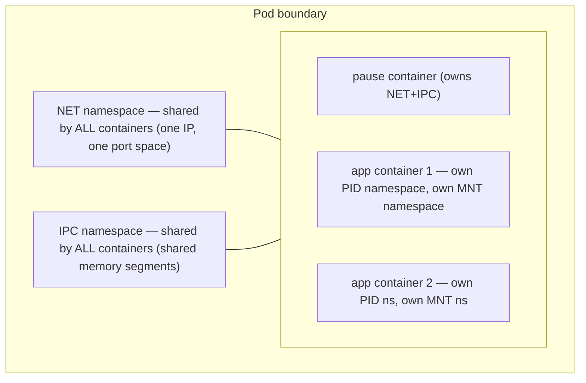
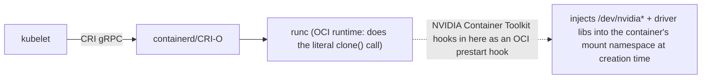
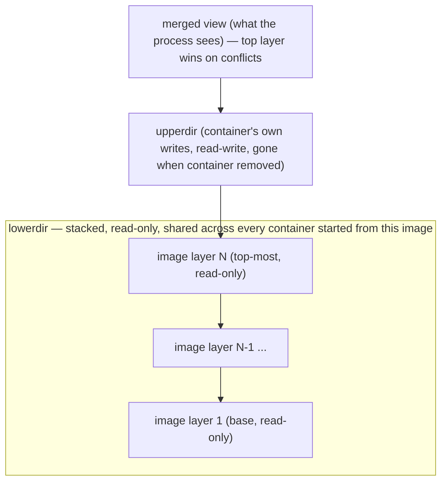

# Chapter 5 — Namespaces, cgroups and container mechanics
**Learning outcome:** Explain what a container actually is at the Linux level and how Kubernetes requests/limits map to resource control.

## 5.1 Namespaces
| Namespace | Isolation view |
|---|---|
| pid | process IDs and process tree |
| net | interfaces, routes, sockets, firewall namespace |
| mnt | mount table/filesystem view |
| uts | hostname/domain |
| ipc | IPC resources |
| user | user/group ID mappings |
```bash
lsns
readlink /proc/<PID>/ns/net
nsenter -t <PID> -n ip addr
nsenter -t <PID> -n ip route
```

**The pause-container mechanism, precisely (why `nsenter` even works this way):**
```mermaid
flowchart TD
    subgraph POD["Pod \"web\" (2 containers)"]
        P["pause container: holds open NET+IPC namespace (created first, never restarts)"]
        A1["app container 1: own PID/MNT, shares NET/IPC"]
        A2["app container 2: own PID/MNT, shares NET/IPC"]
    end
```
`nsenter -t <pause_PID> -n ip addr` and `nsenter -t <app_container_PID> -n ip addr` return the *same* output — proving the shared netns live, not just in theory. Killing the pause container process (rare, but happens on some node-level cleanup bugs) drops pod networking even with app containers still technically alive — a real, if unusual, incident signature worth recognizing.

**Diagram: which namespaces are shared vs. private, per container in a Pod**

This is why `kubectl exec` into one container can `curl localhost:<port>` and reach a server listening in a *different* container of the same Pod (shared NET namespace, so "localhost" is genuinely shared) — but cannot see the other container's processes in `ps` (private PID namespaces).

**`user` namespace — the one most K8s clusters *don't* use by default, and why that matters for the security answer in Chapter 2's capabilities discussion:** without a user namespace, UID 0 inside the container **is** UID 0 on the host kernel (same UID space) — capabilities/seccomp/MAC are what actually constrain it, not the namespace itself. Rootless container runtimes (or K8s user-namespace support, GA more recently) remap container UID 0 to an unprivileged host UID — genuinely stronger isolation, at the cost of complexity (volume ownership, some syscall compatibility). Worth naming as "the isolation upgrade most clusters haven't adopted yet" if asked about container security maturity.

## 5.2 cgroups
cgroups organize processes for resource accounting/control. In cgroup v2, controllers expose files for CPU, memory, I/O and other resources. Container runtimes place container processes into cgroups; Kubernetes requests influence scheduling while limits may become enforcement configuration.
```bash
cat /proc/<PID>/cgroup
cat /sys/fs/cgroup/cpu.stat
cat /sys/fs/cgroup/memory.current
cat /sys/fs/cgroup/memory.events
```

**requests vs limits — the exact mechanism split, worth stating precisely:**
| | Where it's used | Kernel enforcement? |
|---|---|---|
| `requests` | scheduler bin-packing input only | none — purely a placement hint |
| `limits.cpu` | written to `cpu.max` (quota/period) | yes — CFS bandwidth throttling (slows down, doesn't kill) |
| `limits.memory` | written to `memory.max` | yes — kernel OOM killer (kills the process) |

Same "limits" word, two completely different enforcement mechanisms and two completely different failure symptoms — this table is worth having memorized verbatim.

## 5.3 What an image is — and is not
A container image is a filesystem/content package plus metadata. Isolation comes from how the runtime launches the process: namespaces, cgroups, mounts, capabilities, seccomp, LSM policy and device access. This distinction is essential when debugging "container" problems that are actually host-kernel or cgroup problems.

**The runtime chain and where GPU access is actually injected:**

"How does a container see the GPU" has a precise answer: a prestart hook, not magic, not a special container type. Worth being able to say this exact chain without hesitation — it's a very likely interview question given the role.

**OverlayFS — why container writes vanish and where they actually live:**
```
merged (what the process sees) = upperdir (container's own writes) + lowerdir (image layers, read-only)
```
Writes not going to a mounted volume live in `upperdir` and disappear when the container is removed. Heavy write-churn to `upperdir` (an app logging to a local file instead of stdout, or large temp files) causes real overlay-layer I/O overhead that's easy to misattribute to "the disk is slow."

**Diagram: the overlay stack, bottom to top**

Reading a file that exists only in a lower layer costs one lookup; writing to it triggers copy-up (the whole file is copied into `upperdir` before the write applies) — large files modified frequently in lower layers are the specific pattern that turns "trivial write" into real, unexpected I/O.

## Worked scenario
**Situation:** A Pod shows CPU latency but the node dashboard has idle CPU.

1. Inspect the Pod CPU limit and container cgroup cpu.stat for throttling.
2. Compare requested/limited CPU with application thread behavior.
3. Check node run queue and per-CPU utilization to distinguish local quota from host saturation.
4. Only then decide whether to change limits, requests or application concurrency.

**Conclusion:** A container can be locally constrained inside an apparently idle node.
