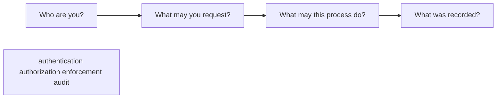
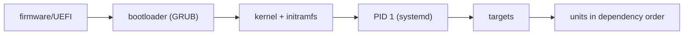
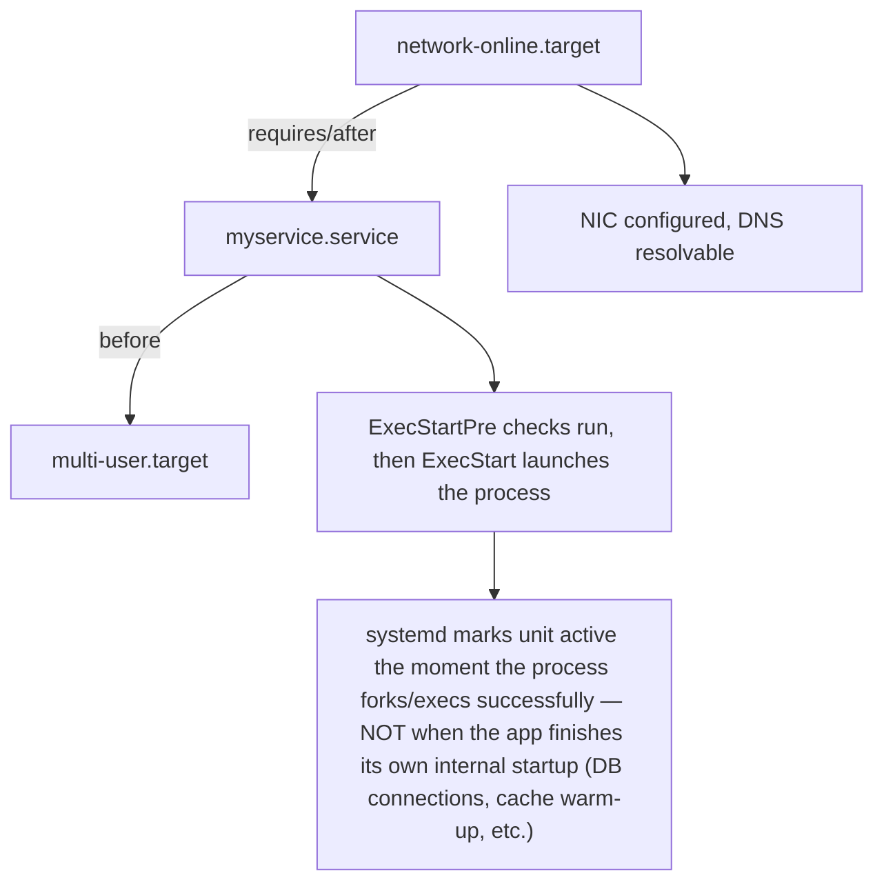
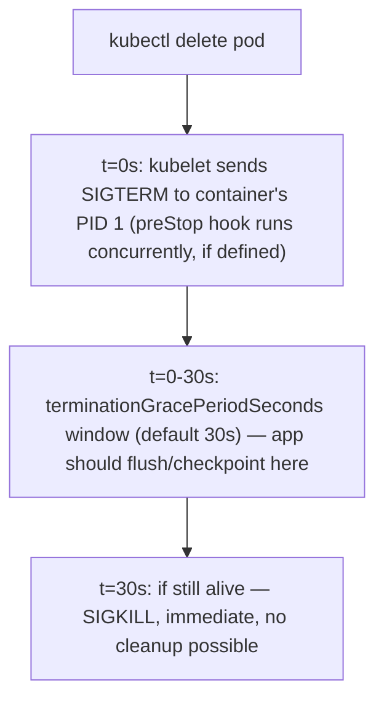

- **Authentication** proves identity: password, SSH key, certificate, token, SSO.
- **Authorization** decides permitted actions: Unix mode bits, ACL, sudo rule, RBAC policy.
- **Least privilege** grants only what is needed, for only as long and as narrowly as practical.
- **SELinux/AppArmor** constrains process behavior beyond ordinary ownership and permissions.
- A **firewall** constrains network communication.
- **Audit/logging** records relevant decisions and changes; it does not itself prevent them.
- A **secret** is sensitive authentication material. Encryption protects data; hashing is one-way and serves different purposes.

### A safe service investigation

Use a disposable machine or lab service:

```bash
systemctl status sshd  # some distributions call it ssh
journalctl -u sshd --since "10 minutes ago"
ss -lntp
ip addr
ip route
```

For each command, write what question it answers. Do not use `sudo` automatically; first determine whether the observation requires it. Do not restart the service until you have preserved status and logs.

## Identity and security controls

Linux uses layered controls:

1. process credentials: user, group and supplementary groups;
2. file ownership, mode bits and optionally ACLs;
3. privilege elevation such as controlled `sudo` rules;
4. Linux capabilities that divide some root privileges;
5. SELinux/AppArmor mandatory policy where enabled;
6. cgroup, namespace and container restrictions;
7. network firewall and service-level authentication/authorization;
8. audit and logs.

```bash
id
namei -l /path/to/file
getfacl /path/to/file
sudo -l
```

Do not solve an access failure with `chmod 777` or disabling SELinux. Prove which check denies the operation, then correct the narrowest policy or ownership error.

## systemd and evidence preservation

For a managed service:

```bash
systemctl status example.service
systemctl show example.service -p ActiveState -p SubState -p Result -p ExecMainStatus
journalctl -u example.service --since "15 minutes ago" --no-pager
```

Status describes current/most recent unit state; the journal provides a timeline. Capture both before restarting. A restart can mitigate impact, but it can also erase process state and change the evidence you were trying to understand.

## Guided lab — diagnose a local HTTP service

In one terminal, start a disposable unprivileged service:

```bash
python3 -m http.server 8080 --bind 127.0.0.1
```

In another terminal:

```bash
ps -ef | grep '[h]ttp.server'
ss -lntp | grep ':8080'
curl -v http://127.0.0.1:8080/
```

Then stop it with `Ctrl-C` and repeat `ss` and `curl`.

Explain the layers:

- Python process existed;
- socket listened only on loopback address and port 8080;
- `curl` completed TCP and HTTP locally;
- after shutdown, the route still existed but no process listened;
- binding to loopback would not make the service remotely reachable even if a host firewall allowed the port.

# Chapter 6 — systemd, boot, services, signals and logs
**Learning outcome:** Diagnose why a Linux service failed to start, restarted, stopped accepting traffic or was killed.

## 6.1 Unit state and dependency model
systemd manages units such as services, sockets, mounts and timers with dependency and ordering relationships. status is a summary; show exposes properties; journalctl gives event history. Always move from unit state to the actual process and external dependencies.
```bash
systemctl status myservice --no-pager
systemctl show myservice -p ActiveState -p SubState -p ExecMainStatus -p NRestarts
journalctl -u myservice --since '-30 min'
systemctl list-dependencies myservice
```

**Boot chain, one line each, for the "explain how Linux boots" baseline:**

GPU-relevant: `nvidia-persistenced` is a systemd-managed unit on bare-metal nodes — it's how the driver state persists across container restarts on the host without reloading. `systemctl status nvidia-persistenced` is a legitimate first check on "GPU not visible after node reboot."

**Diagram: unit dependency/ordering — why "started" doesn't mean "ready"**

`systemctl status` showing `active (running)` proves the process exists and hasn't exited — it proves nothing about whether the application itself has finished initializing. That gap is exactly what `Type=notify` (app explicitly signals readiness back to systemd) exists to close, and it is the same gap a Kubernetes readiness probe closes one layer up.

## 6.2 Signals and shutdown
SIGTERM requests graceful termination; SIGKILL cannot be handled. Kubernetes termination ultimately becomes process signals inside the container. Applications that ignore SIGTERM or take longer than their grace period may be killed before cleanup completes.
```bash
kill -TERM <PID>
kill -KILL <PID> # last resort; no cleanup handler can run
```

**The exact K8s termination sequence, timed:**

```python
import signal, sys
def handle_sigterm(signum, frame):
    save_checkpoint()   # must finish before the grace period expires
    sys.exit(0)
signal.signal(signal.SIGTERM, handle_sigterm)
```
**Direct GPU/AI tie-in:** a long-running training job that doesn't trap SIGTERM gets hard-killed mid-write on any node drain, preemption, or spot-instance reclaim — losing the checkpoint entirely rather than saving a clean one. This is a natural, concrete place to bring up spot/preemptible GPU capacity cost tradeoffs in an SA interview: "cheaper capacity is only actually cheaper if the workload handles SIGTERM correctly."

**PID 1 zombie-reaping tie-in (cross-ref Chapter 1's zombie discussion):** if your container's PID 1 is your application directly (not `tini`/`dumb-init`), it inherits full PID-1 responsibilities — including reaping zombie children — which most application code was never written to do. This is why minimal images increasingly default to an init wrapper as PID 1.

## Worked scenario
**Situation:** A service repeatedly restarts every 30 seconds.

1. Read systemctl show/status and journal history to determine whether systemd is restarting after non-zero exit, watchdog failure or dependency issue.
2. Inspect the process exit code and application logs around each restart.
3. Check listeners, credentials, files, DNS and upstream dependencies the process needs during startup.
4. Confirm resource/OOM/kernel events are not killing it externally.
5. Fix the cause before increasing restart limits.

**Conclusion:** Restart policy is recovery behavior; it is not root cause.

**Second worked scenario — CrashLoopBackOff, the Kubernetes mirror of the exact same pattern:**
> **Situation:** A pod is in `CrashLoopBackOff`, restarting with increasing backoff delay.
> 1. `kubectl describe pod` → check `Last State: Terminated, Reason, Exit Code` first — exit code 137 = SIGKILL (likely OOM, check `Reason: OOMKilled` specifically), exit code 1 or other = application-level failure, check logs.
> 2. `kubectl logs <pod> --previous` — the *previous* container's logs, not the current (already-restarting) one — the actual crash evidence is in the previous instance.
> 3. Same tree as the systemd scenario above: distinguish "crashed because of what it needs" (config, secrets, DNS to a dependency) from "crashed because it was killed" (OOM, node pressure eviction) from "crashed because of its own bug" (unhandled exception, exit code from app logic).
> **Conclusion:** `CrashLoopBackOff` is systemd's restart-policy pattern, one layer up — same diagnostic tree, different tool (`kubectl describe`/`logs --previous` instead of `journalctl`).

## Targeted references
[Udemy - Complete Linux Troubleshooting Course](https://www.udemy.com/course/linux-troubleshooting-course) - Target: Running Out of Memory, System is Running Slow, filesystem, access, logs/processes and networking sections.
[Linux kernel documentation](https://docs.kernel.org/) - Authoritative kernel behavior.
[Coursera - The Bits and Bytes of Computer Networking](https://www.coursera.org/learn/computer-networking) - Target TCP/IP, routing, DNS and troubleshooting modules.

**Cross-chapter drill (do this before the later chapters):** without looking anything up, explain end-to-end: a pod is `CrashLoopBackOff`, exit code 137. Walk from "what does 137 mean" through cgroup OOM (Ch2) vs node OOM (Ch2) vs an external SIGKILL (Ch6), naming the exact commands that disambiguate each, in under 90 seconds.

> FOURTH EDITION — SENIOR ENGINEERING EXPANSION · VOLUME 1

**Linux, networking and host mechanics for GPU and Kubernetes infrastructure**

This expansion keeps the Fourth Edition teaching flow and adds the depth expected from a senior infrastructure engineer and customer-facing Solutions Architect. The emphasis is mechanism first: understand what the system is doing, observe it with concrete tools, then reason about failure, scale, reliability, performance and trade-offs.

The practitioner material used to shape the scope is a signal, not an authority. Technical behavior is anchored in official documentation and first-principles systems reasoning. Your Staff Engineer study guide contributes useful patterns around Kubernetes, observability, distributed systems, platform design and failure isolation; the NVIDIA material adds GPU systems, AI workloads, accelerated networking and customer architecture.


_Figure A. Senior troubleshooting moves from symptom to mechanism instead of jumping between tools._
