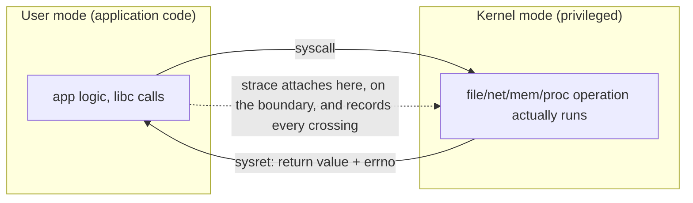
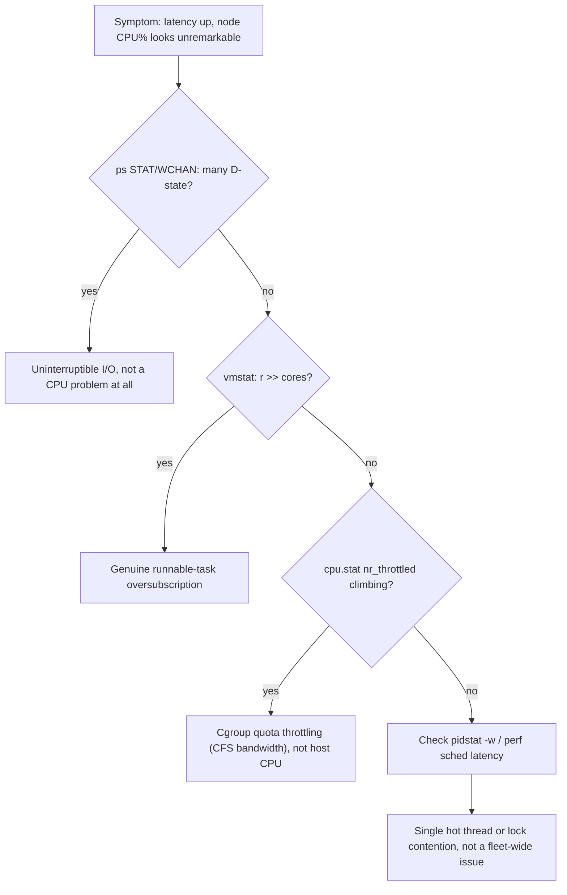

A production process alternates between user mode and kernel mode. Application code executes in user mode; operations such as reading a file, opening a socket, allocating certain memory mappings or changing process state cross into the kernel through system calls. This boundary is extremely useful in troubleshooting: if an application claims to be “stuck”, strace can tell you whether it is repeatedly polling, waiting on futexes, blocked on network reads, sleeping, or failing a syscall.

Linux schedules runnable tasks, not Kubernetes Pods. A Pod may contain several containers, each container may contain several processes, and each process may have many threads. CPU requests and limits ultimately shape cgroup CPU accounting and throttling, while the scheduler decides when runnable tasks receive CPU time. This explains a common production paradox: node CPU can look moderate while a latency-sensitive container is throttled because its own quota is exhausted.

**Host commands: CPU and syscall evidence**

\# Which threads are runnable or blocked?
ps -eLo pid,tid,psr,pcpu,stat,wchan:32,comm --sort=-pcpu | head -30

# Scheduling and context-switch pressure
vmstat 1
pidstat -w -p &lt;PID> 1
cat /proc/&lt;PID>/sched

# What is the process actually waiting on?
strace -tt -T -p &lt;PID>

# cgroup v2 CPU control for a container/task
cat /sys/fs/cgroup/&lt;path>/cpu.stat
cat /sys/fs/cgroup/&lt;path>/cpu.max

<!-- source-table:1 -->

| Observation | Likely mechanism | Validate next |
| --- | --- | --- |
| High load, low CPU | Uninterruptible I/O or blocked runnable work | ps STAT/WCHAN, iostat, pressure stall information |
| High context switches | Lock contention, excessive threads, packet rate | pidstat -w, perf sched, thread count |
| Latency spikes, CPU &lt; 100% | cgroup quota throttling or single-thread saturation | cpu.stat throttled_usec, per-thread CPU |
| High system CPU | syscalls, networking, storage or kernel work | perf top, softirq counters, syscall profile |

➕ **Diagram: user mode / kernel mode, and where strace is actually watching**

This is why `strace` can answer "is it stuck" precisely: a process spinning in user mode never crosses this boundary (strace shows nothing, confirming a CPU-bound loop, not a wait); a process blocked in kernel mode shows the exact syscall it entered and hasn't returned from (e.g. `futex(...)` never returning = lock contention, `read(...)` never returning = the other end isn't sending).

➕ **Diagram: CPU-pressure triage, following the table above as a decision path**

## ➕ Senior addendum

*(the original Deep Dive text above is already strong — real commands, real tables, correctly pitched at senior level. These Deep Dives largely extend Chapters 1-6, which now carry diagrams/outputs/scenarios. Rather than duplicate, this addendum adds only what's genuinely new.)*

➕ **Quick cross-reference (so you use the chapters and the Deep Dives together, not as duplicates):**
| Deep Dive | Extends chapter | What's genuinely new in the Deep Dive vs the chapter |
|---|---|---|
| 1 — syscalls/scheduling | Ch1 | the observation→mechanism→validate table above — memorize this table format, it's a reusable interview answer template |
| 2 — memory/NUMA/OOM | Ch2 | NUMA-and-GPU-locality framing — the one genuinely new concept not in Ch2 |
| 3 — storage I/O to NVMe | Ch3 | checkpoint-specific latency queue behavior |
| 4 — packet-level networking | Ch4 | conntrack specifically — worth a standalone note |
| 5 — containers/overlayfs | Ch5 | runtime boundary framing |
| 6 — GPU node readiness | new ground | driver/toolkit/operator readiness checklist — closest thing to a pre-flight checklist for the actual job |

➕ For Deep Dive 1 specifically: the observation→mechanism→validate table above is the reusable template — an interviewer hearing "high load, low CPU → check STAT/WCHAN and pressure-stall info, not the CPU graph" is hearing the exact evidence-first reasoning style the whole senior-level arc is built around.
