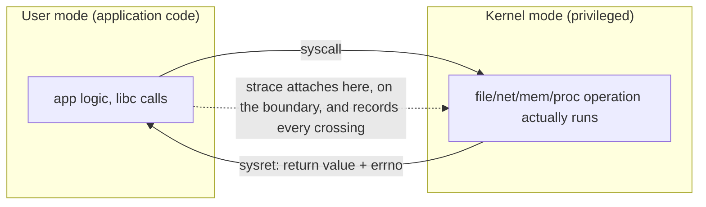
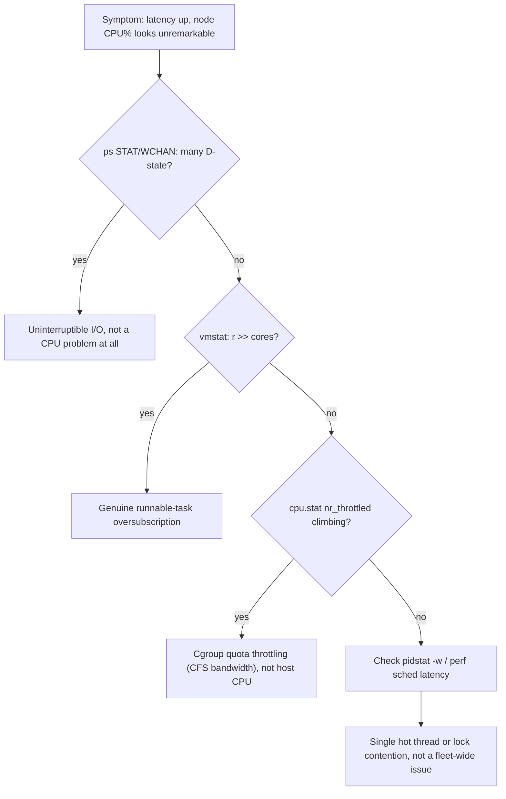

A production process alternates between user mode and kernel mode. Application code executes in user mode; operations such as reading a file, opening a socket, allocating certain memory mappings or changing process state cross into the kernel through system calls. This boundary is extremely useful in troubleshooting: if an application claims to be “stuck”, strace can tell you whether it is repeatedly polling, waiting on futexes, blocked on network reads, sleeping, or failing a syscall.

Linux schedules runnable tasks, not Kubernetes Pods. A Pod may contain several containers, each container may contain several processes, and each process may have many threads. CPU requests and limits ultimately shape cgroup CPU accounting and throttling, while the scheduler decides when runnable tasks receive CPU time. This explains a common production paradox: node CPU can look moderate while a latency-sensitive container is throttled because its own quota is exhausted.

**Host commands: CPU and syscall evidence**

```bash
# Which threads are runnable or blocked?
ps -eLo pid,tid,psr,pcpu,stat,wchan:32,comm --sort=-pcpu | head -30

# Scheduling and context-switch pressure
vmstat 1
pidstat -w -p <PID> 1
cat /proc/<PID>/sched

# What is the process actually waiting on?
strace -tt -T -p <PID>

# cgroup v2 CPU control for a container/task
cat /sys/fs/cgroup/<path>/cpu.stat
cat /sys/fs/cgroup/<path>/cpu.max
```

➕ **`ps -eLo ...`, annotated — the columns that actually answer "runnable or blocked, and doing what":**
```text
$ ps -eLo pid,tid,psr,pcpu,stat,wchan:32,comm --sort=-pcpu | head -4
  PID   TID PSR %CPU STAT WCHAN                            COMMAND
 8842  8842   3 97.2 R    -                                python3
 8842  8855  11  0.4 S    futex_wait_queue_me              python3
 9001  9001   7  0.0 D    io_schedule                      java
```
`-L` is what makes this list threads (TID), not just processes — a process's own PID row can look idle while one specific thread is pegged. `PSR` is which CPU core the thread last ran on, the same topology fact Chapter 1's `nvidia-smi topo`-style reasoning cares about, just for CPU cores instead of GPUs. `WCHAN` is the kernel function a sleeping thread is parked in: `-` (or `running`) means it isn't blocked in anything identifiable right now; `futex_wait_queue_me` names the exact primitive — a lock — it's waiting on; `io_schedule` names disk I/O. This single column is usually faster than `strace` for a first pass, because it needs no attach and no wait — the kernel already recorded where the thread stopped.

➕ **`vmstat 1`, `pidstat -w`, `/proc/<PID>/sched`, annotated — three views of the same oversubscription:**
```text
$ vmstat 1
procs -----------memory---------- ---swap-- -----io---- -system-- ------cpu-----
 r  b   swpd   free   buff  cache   si   so    bi    bo   in   cs us sy id wa st
12  1      0 2201312  44032 46137856    0    0     0    12 8214 19022 61 22 15  2  0
```
`r` is the run-queue length — threads that are runnable *right now* and waiting for a free core. `r=12` on an 8-core box means 4 threads are queued no matter what, before you've looked at `us`/`sy` at all. `b` is threads blocked in uninterruptible sleep (disk/network I/O) — nonzero `b` means some of your "CPU problem" symptom might not be a CPU problem. `cs` (context switches/sec) climbing alongside `r` is the first hint of scheduler churn, which `pidstat -w` breaks down per-process:
```text
$ pidstat -w -p 8842 1
UID       PID   cswch/s nvcswch/s  Command
1000     8842     12.00    340.00  python3
```
`cswch/s` = voluntary switches (the thread itself chose to block — I/O, a lock, a sleep). `nvcswch/s` = involuntary switches (the scheduler preempted it — its time slice ran out, or a higher-priority task needed the core). `nvcswch/s` at 340/s with `cswch/s` at 12/s means this thread isn't waiting on anything — it's runnable and getting kicked off the CPU repeatedly by contention, which is oversubscription, not I/O. `/proc/<PID>/sched` confirms the same story from the scheduler's own bookkeeping, no sampling required:
```text
$ cat /proc/8842/sched | grep nr_.*switches
nr_switches                                 :           142857
nr_voluntary_switches                       :             9201
nr_involuntary_switches                     :           133656
```
`nr_involuntary_switches` outnumbering `nr_voluntary_switches` roughly 14:1 is the exact-count version of what `pidstat -w`'s ratio already suggested — three tools, same conclusion, increasing confidence rather than three separate facts.

➕ **`strace -tt -T -p <PID>`, annotated — the two flags that turn strace into a timing tool, not just a syscall list:**
```text
$ strace -tt -T -p 8842
14:02:11.884213 read(4, "..."..., 65536) = 65536 <0.000012>
14:02:11.884301 futex(0x7f3a2c001000, FUTEX_WAIT, 2, NULL) = -1 EAGAIN <2.401337>
```
`-tt` prints an absolute wall-clock timestamp (microsecond precision) on every line, instead of nothing. `-T` prints the time the syscall itself took, in the trailing `<seconds>`. The `read()` above cost 12 microseconds — noise. The `futex()` call cost **2.4 real seconds** — that's not a fast lock check, that's a thread genuinely stuck waiting for another thread to release something, and `-T` is the only reason that's visible instead of buried in a wall of syscall names with no sense of which ones actually cost time.

➕ **cgroup v2 CPU control, annotated — continuing Chapter 1's own throttling numbers:**
```text
$ cat /sys/fs/cgroup/mycontainer/cpu.max
50000 100000
$ cat /sys/fs/cgroup/mycontainer/cpu.stat
usage_usec     48213340192
user_usec      40122938201
system_usec     8090401991
nr_periods           128000
nr_throttled          41200
throttled_usec    890000000
```
`cpu.max`'s two numbers are quota and period in microseconds — `50000 100000` is Chapter 1's own example: 50ms of CPU time allowed per 100ms period, i.e. a hard cap of 0.5 CPU cores, enforced by the kernel regardless of how many idle cores the node has. `nr_throttled / nr_periods` (41200/128000 ≈ 32%) is the throttling *rate* Chapter 1 already walked through — this Deep Dive's job is just to show you where those exact numbers come from on a live host, so `nr_periods`/`nr_throttled`/`throttled_usec` stop being abstract field names and become a command you've actually run.

<!-- source-table:1 -->

| Observation | Likely mechanism | Validate next |
| --- | --- | --- |
| High load, low CPU | Uninterruptible I/O or blocked runnable work | ps STAT/WCHAN, iostat, pressure stall information |
| High context switches | Lock contention, excessive threads, packet rate | pidstat -w, perf sched, thread count |
| Latency spikes, CPU &lt; 100% | cgroup quota throttling or single-thread saturation | cpu.stat throttled_usec, per-thread CPU |
| High system CPU | syscalls, networking, storage or kernel work | perf top, softirq counters, syscall profile |

➕ **Diagram: user mode / kernel mode, and where strace is actually watching**

This is why `strace` can answer "is it stuck" precisely: a process spinning in user mode never crosses this boundary (strace shows nothing, confirming a CPU-bound loop, not a wait); a process blocked in kernel mode shows the exact syscall it entered and hasn't returned from (e.g. `futex(...)` never returning = lock contention, `read(...)` never returning = the other end isn't sending).

➕ **Diagram: CPU-pressure triage, following the table above as a decision path**


## ➕ Senior addendum

*(the original Deep Dive text above is already strong — real commands, real tables, correctly pitched at senior level. These Deep Dives largely extend Chapters 1-6, which now carry diagrams/outputs/scenarios. Rather than duplicate, this addendum adds only what's genuinely new.)*

➕ **Quick cross-reference (so you use the chapters and the Deep Dives together, not as duplicates):**
| Deep Dive | Extends chapter | What's genuinely new in the Deep Dive vs the chapter |
|---|---|---|
| 1 — syscalls/scheduling | Ch1 | the observation→mechanism→validate table above — memorize this table format, it's a reusable interview answer template |
| 2 — memory/NUMA/OOM | Ch2 | NUMA-and-GPU-locality framing — the one genuinely new concept not in Ch2 |
| 3 — storage I/O to NVMe | Ch3 | checkpoint-specific latency queue behavior |
| 4 — packet-level networking | Ch4 | conntrack specifically — worth a standalone note |
| 5 — containers/overlayfs | Ch5 | runtime boundary framing |
| 6 — GPU node readiness | new ground | driver/toolkit/operator readiness checklist — closest thing to a pre-flight checklist for the actual job |

➕ For Deep Dive 1 specifically: the observation→mechanism→validate table above is the reusable template — an interviewer hearing "high load, low CPU → check STAT/WCHAN and pressure-stall info, not the CPU graph" is hearing the exact evidence-first reasoning style the whole senior-level arc is built around.
