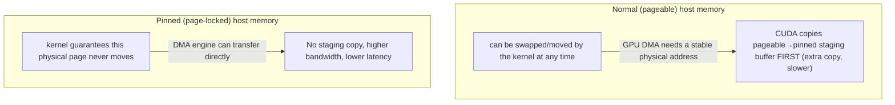

Virtual memory is an address-space abstraction. A process can reserve address ranges without immediately consuming physical RAM. Memory becomes operationally expensive when pages are faulted in, dirtied, pinned, swapped, reclaimed or moved across NUMA domains. Senior troubleshooting therefore distinguishes virtual size, resident set, anonymous memory, file-backed page cache, shared memory and pinned memory instead of treating “memory usage” as one number.

NUMA matters on large CPU/GPU servers because memory access latency and bandwidth depend on locality. A GPU connected beneath one PCIe root complex can be closer to one CPU socket and its memory controllers. If feeder threads, NIC interrupts and memory allocations land on the wrong NUMA node, an apparently healthy GPU may starve. This is one bridge between ordinary Linux knowledge and AI infrastructure: topology affects performance long before Kubernetes notices anything is wrong.

**Host commands: memory and NUMA evidence**

\# Memory pressure and reclaim
free -h
vmstat 1
cat /proc/pressure/memory
cat /proc/meminfo | egrep 'MemAvailable|Anon|Mapped|Dirty|Writeback|Huge|Unevictable'

# Per-process mappings and faults
pmap -x &lt;PID> | tail
pidstat -r -p &lt;PID> 1

# NUMA layout and locality
numactl --hardware
numastat -p &lt;PID>
lscpu -e=CPU,NODE,SOCKET,CORE

OOM reasoning must identify the boundary. A container can be OOM-killed inside its cgroup while the node still has free memory. Conversely, global node pressure can trigger the kernel OOM killer or kubelet eviction logic. The right question is not “did we run out of memory?” but “which allocator or control boundary could not satisfy the request, and what evidence records that decision?”

## ➕ Senior addendum

*(extends Chapter 2, which now covers the virtual-memory/page-cache/OOM mechanism in depth. This Deep Dive's genuinely new concept beyond that chapter is NUMA-and-GPU locality — worth a diagram, since the text above states it but doesn't draw it.)*

➕ **NUMA + GPU, made concrete (this Deep Dive's most important paragraph, with the diagram it's missing):**
```
Node 0: CPU 0-15 -- local RAM -- PCIe root complex A -- GPU0, GPU1, NIC0
Node 1: CPU 16-31 -- local RAM -- PCIe root complex B -- GPU2, GPU3, NIC1
                 \-- cross-node QPI/UPI hop (slower) --/
```
A data-loader thread pinned to Node-0 CPUs feeding GPU2 (Node-1) pays a real, measurable latency tax on every batch — and this is invisible to `nvidia-smi` utilization numbers, which only show the GPU side. `numactl --hardware` + `lscpu -e` (from this Deep Dive's own command list) is how you'd catch this. Kubernetes Topology Manager (`--topology-manager-policy=single-numa-node`) is the cluster-level lever to prevent it at scheduling time — worth naming as the fix, not just the diagnosis.

➕ **Diagram: pinned (page-locked) host memory for GPU transfer, and why it's a different pool than "normal" RAM**

`cudaHostAlloc`/pinned buffers trade host RAM flexibility (pinned pages can't be reclaimed under pressure, and over-pinning can starve the rest of the host) for materially faster host↔GPU transfer — a NUMA-local pinned buffer plus a cross-node one produce identical `nvidia-smi` output but different real throughput, which is the same "topology is invisible from the GPU-only view" point as the diagram above, one layer earlier in the pipeline.
