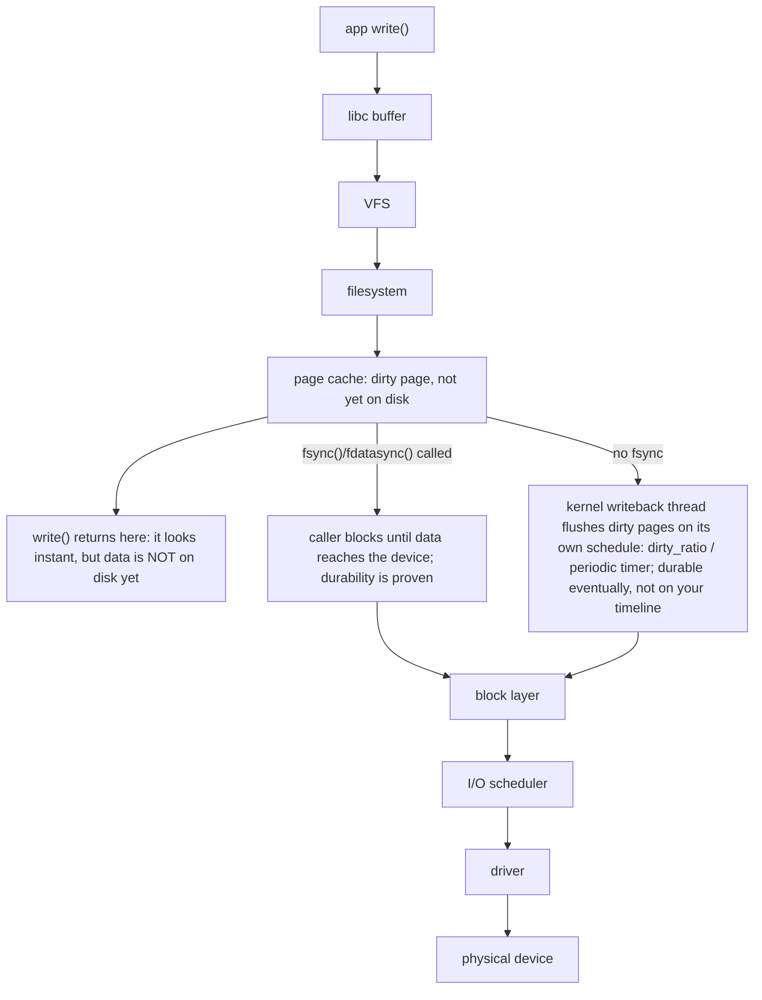

An application write can pass through a language runtime, libc, the VFS, filesystem code, page cache, block layer, I/O scheduler, device driver and physical device. Each layer can buffer work, so throughput and durability are separate questions. fsync changes the contract; buffered writes may look fast until writeback or checkpoint pressure catches up.

AI infrastructure intensifies these issues. Training jobs can read enormous datasets while periodically writing multi-gigabyte checkpoints. Model-serving fleets may stampede object storage during rollout. Local NVMe can absorb bursty reads, but cache warm-up and eviction behavior must be considered. A storage design that advertises high sequential bandwidth may still collapse under metadata-heavy small-file access.

**Host commands: storage evidence**

```bash
# Device and filesystem pressure
iostat -xz 1
cat /proc/pressure/io
lsblk -o NAME,TYPE,SIZE,FSTYPE,MOUNTPOINTS,ROTA
findmnt -T /path/to/data

# Which processes are issuing I/O?
pidstat -d 1
lsof +D /path/to/checkpoint 2>/dev/null | head

# Quick latency test - never run destructive tests on production devices
fio --name=readcheck --filename=/safe/testfile --rw=randread --bs=4k --iodepth=32 --size=1G --runtime=30 --time_based
```

➕ **`iostat -xz 1`, annotated:**
```text
$ iostat -xz 1
Device       r/s     rkB/s  r_await   w/s     wkB/s  w_await  aqu-sz  %util
nvme0n1   1240.00 158720.00     0.42 310.00  79360.00     1.10    2.80   68.30
```
`-x` adds the extended columns (`await`, `aqu-sz`, `%util`) that plain `iostat` doesn't show — without `-x` you only get raw throughput, none of the latency/queue evidence. `-z` omits devices with zero activity, so a busy NVMe isn't buried under a page of idle loop/tmpfs entries. `r_await`/`w_await` are average wait time per operation (queue time *plus* device service time combined); `aqu-sz` is the average number of requests queued at the device — this is what separates "the device itself is slow" (`%util` pegged, `aqu-sz` low) from "something else is backed up behind this device" (`aqu-sz` climbing while `%util` isn't maxed). One caveat worth stating out loud in an interview: on multi-queue NVMe, `%util` can read high before real bandwidth capacity is exhausted, because it measures time-with-outstanding-requests, not saturation — don't treat it as a hard ceiling the way you would on a single-queue spinning disk.

➕ **`/proc/pressure/io`, annotated — same PSI format as Deep Dive 2's memory pressure, different meaning here:**
```text
$ cat /proc/pressure/io
some avg10=12.40 avg60=8.02 avg300=3.11 total=902184773
full avg10=9.85 avg60=6.44 avg300=2.20 total=701234891
```
Compare this to Deep Dive 2's memory PSI example, where `full` was far smaller than `some`. Here `full avg10` (9.85) is close to `some avg10` (12.40) — meaning when I/O pressure hits this host, it very often stalls *every* runnable task at once, not just the process doing the I/O. That's a materially more severe pattern than "some contention in the background," and it's the number that actually correlates with a fleet-wide latency spike rather than one slow process.

➕ **`lsblk` and `findmnt -T`, annotated — confirming what you're actually standing on before you trust any number above:**
```text
$ lsblk -o NAME,TYPE,SIZE,FSTYPE,MOUNTPOINTS,ROTA
NAME        TYPE  SIZE FSTYPE MOUNTPOINTS  ROTA
nvme0n1     disk  3.5T                        0
└─nvme0n1p1 part  3.5T ext4   /data            0
sda         disk  500G                        1
└─sda1      part  500G ext4   /                1
```
`ROTA` (rotational) is the field that ends the guessing: `0` = non-rotational (NVMe/SSD), `1` = spinning disk. Chapter 3 already makes the point that reaching a path successfully proves nothing about what's underneath it — `ROTA` plus `FSTYPE` is exactly the evidence that closes that gap, in one command.
```text
$ findmnt -T /data/checkpoints
TARGET SOURCE          FSTYPE OPTIONS
/data  /dev/nvme0n1p1  ext4   rw,relatime
```
`-T` (target mode) takes any path and tells you exactly which mount it resolves to, even several directories below the actual mount point — this is the direct answer to "is `/data/checkpoints` really on that NVMe drive, or did someone mount something else three levels up."

➕ **`pidstat -d 1` and `lsof +D`, annotated — which process, which file, right now:**
```text
$ pidstat -d 1
UID       PID   kB_rd/s   kB_wr/s  kB_ccwr/s  iodelay  Command
1000     8842    120.00  81234.00       0.00       12  python3
```
`-d` reports I/O throughput per process instead of per device. `iodelay` is measured in clock ticks the task spent blocked on block I/O — this is the accounting-level proof behind Deep Dive 1's D-state discussion: a process can show `0%` CPU and a nonzero `iodelay` at the same instant, and this column is where that time is actually recorded.
```text
$ lsof +D /data/checkpoints 2>/dev/null | head -3
COMMAND   PID USER   FD   TYPE DEVICE     SIZE/OFF   NODE NAME
python3  8842 app    12w  REG  259,1  4294967296 131074 /data/checkpoints/step-4200.pt
```
`+D` recursively lists every open file under a directory, with the owning PID and file descriptor. This is how you answer "is this checkpoint write still active, or is this an orphaned lock from a crashed process" — the `FD` column (`12w` = file descriptor 12, opened for writing) tells you it's a live, currently-open write, not a stale leftover.

➕ **`fio`, annotated — what the flags are actually simulating, and the two numbers that matter:**
```text
$ fio --name=readcheck --filename=/safe/testfile --rw=randread --bs=4k --iodepth=32 --size=1G --runtime=30 --time_based
readcheck: (groupid=0, jobs=1): err= 0: pid=91234
  read: IOPS=142k, BW=556MiB/s (583MB/s)(16.3GiB/30001msec)
    lat (usec): min=8, max=4021, avg=224.91, stdev=112.30
```
`--bs=4k` sets the block size to 4KB — small, matching typical checkpoint-shard or config-file I/O, not a large sequential read. `--iodepth=32` keeps 32 requests outstanding at once, simulating real concurrent load instead of one request waiting for the previous to finish — a device can look excellent at `iodepth=1` and fall over at `iodepth=32`. `--rw=randread` is close to worst-case access pattern for many small files. Of the results, `IOPS` tells you operation throughput; `lat avg`/`stdev` tells you the *tax per operation* and how consistent it is — a device with great `IOPS` and a fat `stdev` still produces a bad p99, which `IOPS` alone would never reveal.

➕ **Diagram: the write path, and where "fast" stops meaning "durable"**

A checkpoint write that skips `fsync()` can report "done" in milliseconds while the actual bytes are still only in page cache — a node crash before writeback completes silently loses that checkpoint despite the application having already logged success. This is precisely why checkpoint code paths call `fsync()` explicitly rather than trusting `write()`'s return.

## ➕ Senior addendum

*(extends Chapter 3, which now covers the VFS-to-disk mechanism, `iostat` reading order and inode exhaustion in depth. This Deep Dive's genuinely new material beyond that chapter is the checkpoint-specific latency/queue behavior called out below.)*

➕ For Deep Dive 3 specifically: the layer list at the top of this Deep Dive (runtime → libc → VFS → filesystem → page cache → block layer → I/O scheduler → driver → device) is the same VFS dispatch mechanism Chapter 3 draws out, applied to the checkpoint-storm failure pattern — many training nodes hitting `fsync()` simultaneously stresses the *metadata* path long before the *data* path saturates, which is why per-node `iostat` looks idle even while the shared filesystem is the actual bottleneck (see Chapter 3's checkpoint-storm worked scenario for the full trace).
