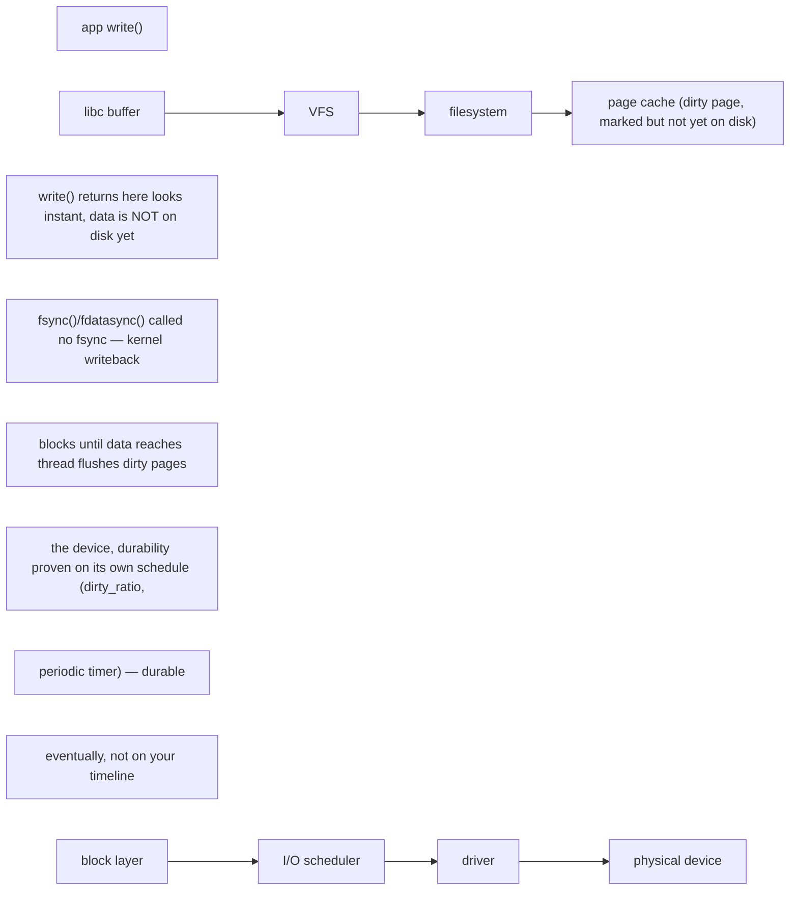

An application write can pass through a language runtime, libc, the VFS, filesystem code, page cache, block layer, I/O scheduler, device driver and physical device. Each layer can buffer work, so throughput and durability are separate questions. fsync changes the contract; buffered writes may look fast until writeback or checkpoint pressure catches up.

AI infrastructure intensifies these issues. Training jobs can read enormous datasets while periodically writing multi-gigabyte checkpoints. Model-serving fleets may stampede object storage during rollout. Local NVMe can absorb bursty reads, but cache warm-up and eviction behavior must be considered. A storage design that advertises high sequential bandwidth may still collapse under metadata-heavy small-file access.

**Host commands: storage evidence**

\# Device and filesystem pressure
iostat -xz 1
cat /proc/pressure/io
lsblk -o NAME,TYPE,SIZE,FSTYPE,MOUNTPOINTS,ROTA
findmnt -T /path/to/data

# Which processes are issuing I/O?
pidstat -d 1
lsof +D /path/to/checkpoint 2>/dev/null | head

# Quick latency test - never run destructive tests on production devices
fio --name=readcheck --filename=/safe/testfile --rw=randread     --bs=4k --iodepth=32 --size=1G --runtime=30 --time\_based

➕ **Diagram: the write path, and where "fast" stops meaning "durable"**

A checkpoint write that skips `fsync()` can report "done" in milliseconds while the actual bytes are still only in page cache — a node crash before writeback completes silently loses that checkpoint despite the application having already logged success. This is precisely why checkpoint code paths call `fsync()` explicitly rather than trusting `write()`'s return.

## ➕ Senior addendum

*(extends Chapter 3, which now covers the VFS-to-disk mechanism, `iostat` reading order and inode exhaustion in depth. This Deep Dive's genuinely new material beyond that chapter is the checkpoint-specific latency/queue behavior called out below.)*

➕ For Deep Dive 3 specifically: the layer list at the top of this Deep Dive (runtime → libc → VFS → filesystem → page cache → block layer → I/O scheduler → driver → device) is the same VFS dispatch mechanism Chapter 3 draws out, applied to the checkpoint-storm failure pattern — many training nodes hitting `fsync()` simultaneously stresses the *metadata* path long before the *data* path saturates, which is why per-node `iostat` looks idle even while the shared filesystem is the actual bottleneck (see Chapter 3's checkpoint-storm worked scenario for the full trace).
